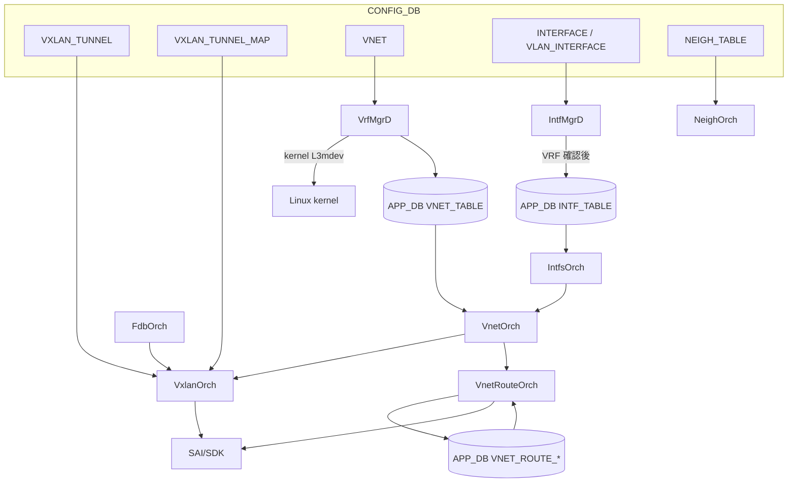
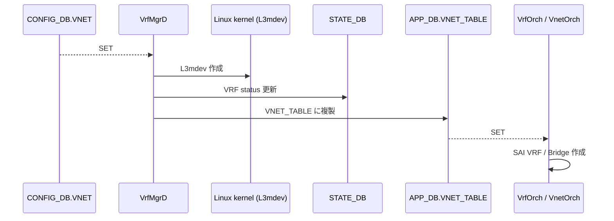

<!-- topics-tip -->
!!! tip "Topics で読み物として読む"
    この HLD は実装詳細を含みます。機能の概念・設定・運用を読み物として読みたい場合は [Topics 03 章: VXLAN / EVPN とオーバーレイ](../topics/03-vxlan-evpn/index.md) を参照。
<!-- /topics-tip -->

!!! success "裏取りステータス: Code-verified"
    現行 master で実装済みを確認。`sonic-swss/orchagent/vxlanorch.h:268,414,462,499,512,541` で `VxlanTunnelOrch` / `VxlanTunnelMapOrch` / `VxlanVrfMapOrch` / `EvpnRemoteVnip2pOrch` / `EvpnRemoteVnip2mpOrch` / `EvpnNvoOrch`、`vnetorch.h:250,362,381,504,618` で `VNetOrch` / `MonitorOrch` / `BfdMonitorOrch` / `VNetRouteOrch` / `VNetCfgRouteOrch`、`sonic-swss-common/common/schema.h:85-87,435` で `APP_VXLAN_TUNNEL_TABLE_NAME` / `APP_VXLAN_TUNNEL_MAP_TABLE_NAME` / `APP_VXLAN_FDB_TABLE_NAME` / `STATE_VXLAN_TUNNEL_TABLE_NAME`、`vxlanorch.cpp:534,903,1160` で EVPN 経由のトンネル生成 (`TNL_CREATION_SRC_EVPN`) を確認（verified at: 2026-05-09）。HLD で言及される実装は `VxlanOrch` ではなく **`VxlanTunnelOrch`**（複数の Orch2 派生クラスに分割）として現行 master に存在する。

# VXLAN / VNet 全体設計（VxlanOrch / VnetOrch / VRF mapper）

!!! info "章分割済み"
    本ページは大型 HLD の **概要ハブ** として保持。詳細は以下の派生ページを参照:

    - [vxlan-sonic-concepts.md](vxlan-sonic-concepts.md) — 概念・用語・Phase 1 / Phase 2 スコープ
    - [vxlan-sonic-operations.md](vxlan-sonic-operations.md) — CONFIG_DB / APP_DB / CLI / 設定例
    - [vxlan-sonic-internals.md](vxlan-sonic-internals.md) — Orch 群と SAI 属性
    - [vxlan-sonic-limitations.md](vxlan-sonic-limitations.md) — 制限事項と既知の課題

## 読み手が知りたいこと

1. SONiC の [VXLAN](../reference/glossary.md#term-vxlan) は **VTEP と VNet の組合せ** とよく言われるが、両者の関係は？
2. **L2 VXLAN と L3 VXLAN** はどう作り分けられる？（mapper / tunnel が別なのか）
3. **どの [orchagent](../reference/glossary.md#term-orchagent) が何を担当** するのか？
4. **[CONFIG_DB](../reference/glossary.md#term-config_db) / APP_DB に何を入れれば** VNet ピアリングが動くのか？
5. **[BGP](../reference/glossary.md#term-bgp) [EVPN](../reference/glossary.md#term-evpn) との関係**は？ Phase 1 と Phase 2 で何が違う？
6. **Warm restart** は使えるのか？
7. トラブル時に最低限見るテーブルは？

## 1. 全体像（VTEP + VNet + Orch 群）

SONiC の VXLAN は **VTEP（VXLAN Tunnel End Point）と VNet（Virtual Network）の組み合わせ** で実装される。[HLD](../reference/glossary.md#term-hld) は次のスコープを定める[^1]:

- **Phase 1**: VTEP として動作。顧客 VM ↔ ベアメタルサーバ間の VNet ピアリング、Symmetric IRB（RIOT）の分散 VXLAN ルーティング
- **Phase 2**: BGP EVPN 統合、L2 VXLAN（タグ・無タグ）、HER（Head End Replication）、CLI 整備

Kernel [VRF](../reference/glossary.md#term-vrf)（L3mdev）の programming は **本 HLD のスコープ外**[^1]。

主要 orchagent:

- `VxlanOrch`（実コード上は `VxlanTunnelOrch` 等に分割）: VXLAN tunnel object、encap/decap mapper、tunnel termination
- `VnetOrch` / `VnetRouteOrch`: VNet 単位の VRF / BRIDGE、ピアリング、VNet 経路
- `VrfMgrD` / `VrfOrch`: kernel L3mdev と [SAI](../reference/glossary.md#term-sai) VRF の同期
- `IntfMgrD` / `IntfsOrch`: VNet 配下の [RIF](../reference/glossary.md#term-rif)
- `FdbOrch`: remote VTEP の MAC 学習



## 2. L2 / L3 VXLAN の作り分け

`VxlanOrch` は `VXLAN_TUNNEL` / `VXLAN_TUNNEL_MAP` から **L2 VXLAN（[VLAN](../reference/glossary.md#term-vlan) ↔ VNI）** と **L3 VXLAN（VRF ↔ VNI）** を **別トンネル** として作る[^1]。それぞれに encap/decap mapper を attach。

SAI 属性の対応:

| VXLAN コンポーネント | SAI 属性 |
|---------------------|----------|
| VXLAN tunnel 種別 | `SAI_TUNNEL_TYPE_VXLAN` |
| Encap mapper | `SAI_TUNNEL_MAP_TYPE_VIRTUAL_ROUTER_ID_TO_VNI` |
| Decap mapper | `SAI_TUNNEL_MAP_TYPE_VNI_TO_VIRTUAL_ROUTER_ID` |
| Nexthop tunnel | `SAI_NEXT_HOP_TYPE_TUNNEL_ENCAP` |
| Tunnel termination | `SAI_TUNNEL_TERM_TABLE_ENTRY_TYPE_P2MP` |
| VXLAN MAC | `SAI_SWITCH_ATTR_VXLAN_DEFAULT_ROUTER_MAC` |
| VXLAN UDP port | `SAI_SWITCH_ATTR_VXLAN_DEFAULT_PORT` |

L3 VXLAN は **`VIRTUAL_ROUTER_ID ↔ VNI` mapper が中核**。VTEP は P2MP の termination として登録する[^1]。

## 3. Orchagent 各論

### VxlanOrch（実装は VxlanTunnelOrch 等に分割）

VXLAN の中核。tunnel オブジェクト + mapper + termination を作る。EVPN remote VTEP の動的生成も `vxlanorch.cpp` 内（`TNL_CREATION_SRC_EVPN`）。

### VrfMgrD / VrfOrch



- `VrfMgrD`: VNet 設定から kernel L3mdev を作成 + [STATE_DB](../reference/glossary.md#term-state_db) に状態出力
- `VrfOrch`: 通常 VRF を APP_DB から SAI に投入（RouteOrch が利用）[^1]

### VnetOrch / VnetRouteOrch

- `VnetOrch`: VNet 単位の ingress/egress **VRF または BRIDGE** を SAI に作成。`peer_list` を保持
- `VnetRouteOrch`: `VNET_ROUTE_TABLE` → subnet/local route、`VNET_ROUTE_TUNNEL_TABLE` → tunnel nexthop 経路 を SAI に投入。`peer_list` がある場合はピア VNet にも経路を複製[^1]

### IntfMgrD / IntfsOrch

- `IntfMgrD`: kernel 側 routing IF を L3mdev に enslave。STATE_DB の VRF 確立を待ってから APP_DB の `INTF_TABLE` に書く
- `IntfsOrch`: `INTF_TABLE` + VRF 情報で SAI RIF を作成。VNet 用は `VnetOrch` API 経由

### FdbOrch

VxlanOrch をメンバに持ち、**remote VTEP で学習した MAC** を `app-fdb-table` 経由で SAI に書く[^1]。

## 4. 設定（CONFIG_DB / APP_DB）

### CONFIG_DB スキーマ

```text
VXLAN_TUNNEL|<tunnel_name>
    src_ip : <ipv4>
    dst_ip : <ipv4>  (OPTIONAL, P2P 用)

VXLAN_TUNNEL_MAP|<tunnel_name>|<map_name>
    vni  : <int>
    vlan : <vlan_id>

VNET|<vnet_name>
    vxlan_tunnel : <tunnel_name>
    vni          : <int>
    scope        : "default"     (OPTIONAL)
    peer_list    : <vnet_name,...> (OPTIONAL)

INTERFACE|<intf>
    vnet_name : <vnet_name>

INTERFACE|<intf>|<prefix>
    {}

VLAN_INTERFACE|<vlan_intf>
    vnet_name : <vnet_name>

VLAN_INTERFACE|<vlan_intf>|<prefix>
    {}

NEIGH_TABLE|<intf>|<ip>
    family : IPv4 | IPv6
```

`VXLAN_TUNNEL` に `src_ip` 必須、`dst_ip` は P2P 用にオプション。`VXLAN_TUNNEL_MAP` で VLAN ↔ VNI を関連付ける[^1]。

### APP_DB スキーマ

```yaml
VNET_ROUTE_TABLE:<vnet>:<prefix>
    nexthop : <ip>      (OPTIONAL)
    ifname  : <intf>

VNET_ROUTE_TUNNEL_TABLE:<vnet>:<prefix>
    endpoint    : <vtep ip>
    mac_address : <mac>     (OPTIONAL: inner DST MAC)
    vni         : <int>     (OPTIONAL)

VXLAN_FDB_TABLE:<tunnel>:<vni>:<mac>
    remote_vtep : <ip>

VNET_TABLE:<vnet>
    vxlan_tunnel : <tunnel>
    vni          : <int>
    scope        : "default"
    peer_list    : <vnet,...>
```

`VNET_ROUTE_TABLE` は **同 VNet 内の直接到達**、`VNET_ROUTE_TUNNEL_TABLE` は **tunnel nexthop 経由のリモート経路**[^1]。

### CLI

| Command | 用途 |
|---------|------|
| `config vxlan <name> vlan <vid> vni <vni>` | VLAN ↔ VNI |
| `config vxlan <name> src_if <intf>` | VTEP の source IF |
| `config vxlan <name> vlan <vid> flood vtep <ip,...>` | HER 用 flood list |
| `show vxlan <name>` | VXLAN tunnel 情報 |
| `show mac vxlan <name> <vni>` | VNI 別 learned MAC |

VNet ピアリングの CLI は無く、CONFIG_DB を直接編集する想定[^1]。

### 設定例（VNet ピアリング）

`Vnet_2000`（VNI 2000、ベアメタル `Ethernet1`）と `Vnet_3000`（VNI 3000、`Vlan2000`、`Vnet_2000` をピア）:

```json
{
  "VXLAN_TUNNEL": { "tunnel1": { "src_ip": "10.10.10.10" } },
  "VNET": {
    "Vnet_2000": { "vxlan_tunnel": "tunnel1", "vni": "2000", "peer_list": "" },
    "Vnet_3000": { "vxlan_tunnel": "tunnel1", "vni": "3000", "peer_list": "Vnet_2000" }
  },
  "INTERFACE": {
    "Ethernet1": { "vnet_name": "Vnet_2000" },
    "Ethernet1|100.100.3.1/24": {}
  },
  "VLAN_INTERFACE": {
    "Vlan2000": { "vnet_name": "Vnet_3000" },
    "Vlan2000|100.100.4.1/24": {}
  }
}
```

APP_DB に `VNET_ROUTE_TABLE` / `VNET_ROUTE_TUNNEL_TABLE` を投入してベアメタル subnet 経路と VM tunnel nexthop 経路を作る[^1]。

## 5. BGP EVPN と Warm restart

- **Phase 1 で BGP EVPN 統合なし**。経路は外部から `VNET_ROUTE_TABLE` / `VNET_ROUTE_TUNNEL_TABLE` に直接投入する前提
- **Phase 2** で BGP EVPN 統合、L2 VXLAN、HER、CLI 整備が入る
- **Warm restart は Phase 1 で非対応**。SAI VR オブジェクトが warm restart 非互換のため Phase 2 で再検討[^1]

## 6. スケール目標（Phase 1）

| 項目 | 想定値 |
|------|-------|
| VNI 数 | 8K |
| Tunnel encap 数 | 128K |
| VM 数 | 512K |
| VRF 数 | 128 |
| ルート数 | 512K |

設計目標であり実 ASIC のスケールに依存する[^1]。

## 7. トラブルシューティング

| 症状 | 最初に見る場所 |
|------|---------------|
| VTEP が上がらない | `VXLAN_TUNNEL.src_ip` が実在 IF（Loopback 等）の IP か |
| L2 VXLAN で MAC が伝搬しない | `VXLAN_FDB_TABLE`（APP_DB）に `remote_vtep` |
| L3 VXLAN で経路が乗らない | `VNET_ROUTE_TUNNEL_TABLE.endpoint` が remote VTEP IP と一致 |
| VRF が SAI に作られない | `VrfMgrD` の STATE_DB 更新が間に合っているか |

### コマンド例

VXLAN トンネルと EVPN ピアの状態を確認する。

```bash
# VXLAN tunnel / VNI / EVPN
show vxlan tunnel
show vxlan remotevni all
show evpn vni
redis-cli -n 4 keys 'VXLAN_TUNNEL|*'
docker exec bgp vtysh -c 'show bgp l2vpn evpn summary'
```

## 制限事項

- Phase 1 では BGP EVPN 統合なし
- Warm restart 未対応[^1]
- L3 VXLAN と L2 VXLAN は別トンネル
- Kernel VRF programming は HLD スコープ外
- **MP2P / MP2MP トンネルターム属性の必須化による orchagent 非対応** ([sonic-swss#2829](https://github.com/sonic-net/sonic-swss/issues/2829)): SAI のトンネルターミネーション属性において、`MP2P` / `MP2MP` タイプのトンネルターム作成時に `DST_IP` および `SRC_IP` が必須属性として要求されるよう変更された（`opencomputeproject/SAI#1255` 関連）。orchagent 側がこれらを必須として渡していない場合、トンネルターム作成が SAI エラーで失敗する。GRE / NVGRE トンネルを MP2MP または MP2P モードで使用している環境では注意が必要。

## 干渉する機能

- **BGP EVPN（Phase 2）**: 経路供給源として `VNET_ROUTE_TUNNEL_TABLE` を埋める
- **VLAN / VLAN_MEMBER**: L2 VXLAN は VLAN ↔ VNI mapping 前提
- **VRF（通常 VRF）**: `VrfOrch` 経由
- **[DASH](../reference/glossary.md#term-dash) / [SmartSwitch](../reference/glossary.md#term-smartswitch)**: 新しい HLD（[ENI Based Forwarding](smartswitch-eni-based-forwarding.md)）は本 HLD の VxLAN tunnel を利用
- **MC-[LAG](../reference/glossary.md#term-lag) / dual-ToR**: 拡張あり

<!-- evidence:
source: sonic-net/SONiC/doc/vxlan/Vxlan_hld.md#L299-L330 (sha: 49bab5b5ff0e924f1ea52b3d9db0dfa4191a7c06)
excerpt: |
  VxlanOrch creates the tunnel and attaches encap and decap mappers. Seperate tunnels are created for L2 Vxlan and L3 Vxlan ...
  VnetOrch creates ingress/Egress (based on context) VRF or BRIDGE in SAI for a VNet and also maintains the peering list.
  VnetRouteOrch fetch the VRF and peering information for replicating the routes
reasoning: VxlanOrch / VnetOrch / VnetRouteOrch の責務分担と peer_list 経路複製の根拠。
-->

<!-- evidence-rendered:start -->
??? note "📋 検証エビデンス: sonic-net/SONiC/doc/vxlan/Vxlan_hld.md#L299-L330 (sha: 49bab5b5ff0e924f1ea52b3d9db0dfa4191a7c06)"

    **出典**:

    `sonic-net/SONiC/doc/vxlan/Vxlan_hld.md#L299-L330 (sha: 49bab5b5ff0e924f1ea52b3d9db0dfa4191a7c06)`

    **抜粋**:

    ```text
    VxlanOrch creates the tunnel and attaches encap and decap mappers. Seperate tunnels are created for L2 Vxlan and L3 Vxlan ...
    VnetOrch creates ingress/Egress (based on context) VRF or BRIDGE in SAI for a VNet and also maintains the peering list.
    VnetRouteOrch fetch the VRF and peering information for replicating the routes
    ```

    **判断根拠**: VxlanOrch / VnetOrch / VnetRouteOrch の責務分担と peer_list 経路複製の根拠。

<!-- evidence-rendered:end -->

## 関連トピック

- [Topics: VXLAN / EVPN](../topics/03-vxlan-evpn/index.md) — VXLAN/EVPN 全体像
- [HLD: EVPN VXLAN](../routing/evpn-vxlan-hld.md)

## 関連ページ
- [CLI: config vxlan](../reference/cli/config-vxlan.md)
- [CONFIG_DB: VXLAN_TUNNEL](../reference/config-db/vxlan-tunnel.md)
- [CONFIG_DB: VXLAN_TUNNEL_MAP](../reference/config-db/vxlan-tunnel-map.md)
- [YANG: sonic-vxlan](../reference/yang/sonic-vxlan.md)

## 既知の問題

### 201911 の vnet コマンド (`show vnet neighbors/routes`) がクラッシュする問題（sonic-buildimage#5795）

201911 の vnet コマンド (`show vnet neighbors/routes`) がクラッシュする問題。vnet テーブルが空の場合に None 参照が発生する

- 参照: [sonic-net/sonic-buildimage#5795](https://github.com/sonic-net/sonic-buildimage/issues/5795)

## 引用元

[^1]: `sonic-net/SONiC` `doc/vxlan/Vxlan_hld.md` @ `49bab5b5ff0e924f1ea52b3d9db0dfa4191a7c06`

<!-- concerns hint:
- HLD 初版が古いため、現行 master の VxlanOrch / VnetOrch 実装と乖離している可能性が高い
- BGP EVPN 統合 (Phase 2) の現状
- Warm restart 対応状況 (Phase 2 で再検討予定だった)
- VXLAN_TUNNEL_MAP の最終スキーマ (VNI ↔ VLAN / VNI ↔ VRF)
- FdbOrch と VxlanOrch の協調実装 (HLD で TBD だった部分)
- HER (head-end replication) の現行実装
- CLI (config vxlan / show vxlan) の sonic-utilities への取り込み形
-->

<!-- topics-back-ref -->
## 関連 Topics

- [Topics: VXLAN / EVPN / VNET オーバーレイ](../topics/03-vxlan-evpn/index.md)

<!-- /topics-back-ref -->

<!-- glossary-links-injected: edc9bd421e86 -->
