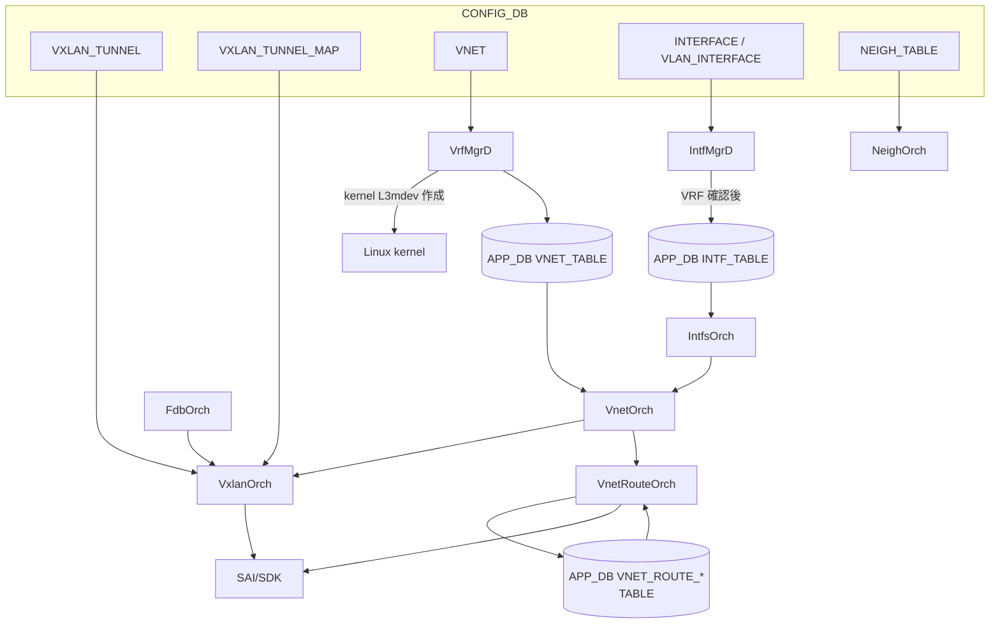
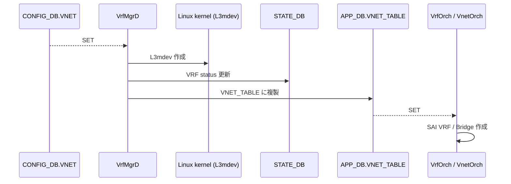

!!! warning "裏取りステータス: HLD-only"
    本ページは公式 HLD（Rev 1.3、初版が比較的古い）のみを根拠に書かれている。SONiC の VXLAN / VNet は本 HLD 以降に EVPN 統合・Active-Active dual-ToR 等の拡張で大きく変わっており、現行 master の実装とは乖離している可能性が高い。

# VXLAN / VNet 全体設計（VxlanOrch / VnetOrch / VRF mapper）

## 概要

SONiC の VXLAN は **VTEP（VXLAN Tunnel End Point）と VNet（Virtual Network）の組み合わせ** で実装される。HLD は次のスコープを定める[^1]:

- **Phase 1**: VTEP として動作。顧客 VM とベアメタルサーバ間の VNet ピアリング、Symmetric IRB（RIOT）の分散 VXLAN ルーティング
- **Phase 2**: BGP EVPN 統合、L2 VXLAN（タグ・無タグ）、HER（Head End Replication）、CLI 整備

Kernel VRF（L3mdev）の programming は **本 HLD のスコープ外**（別資料）[^1]。

主要な orchagent 群:

- `VxlanOrch`: VXLAN tunnel object、encap/decap mapper、tunnel termination
- `VnetOrch` / `VnetRouteOrch`: VNet 単位の VRF / BRIDGE、ピアリング、VNet 経路
- `VrfMgrD` / `VrfOrch`: kernel L3mdev と SAI VRF の同期
- `IntfMgrD` / `IntfsOrch`: VNet 配下の RIF
- `FdbOrch`: remote VTEP の MAC 学習

## 動作仕様

### スケール（Phase 1, VNet ピアリング）

| 項目 | 想定値 |
|------|-------|
| VNI 数 | 8K |
| Tunnel encap 数 | 128K |
| VM 数 | 512K |
| VRF 数 | 128 |
| ルート数 | 512K |

これは設計目標であり、実 ASIC のスケールに依存する[^1]。

### Warm restart

**Phase 1 では Warm Restart 非対応**。SAI VR（Virtual Router）オブジェクトが warm restart 非互換のため、Phase 2 で再検討される[^1]。

### コンポーネントとデータフロー



### CONFIG_DB スキーマ

```
VXLAN_TUNNEL|<tunnel_name>
    src_ip : <ipv4>
    dst_ip : <ipv4>  (OPTIONAL, P2P トンネル用)

VXLAN_TUNNEL_MAP|<tunnel_name>|<map_name>
    vni  : <int>
    vlan : <vlan_id>

VNET|<vnet_name>
    vxlan_tunnel : <tunnel_name>
    vni          : <int>
    scope        : "default"     (OPTIONAL)
    peer_list    : <vnet_name,...> (OPTIONAL)

INTERFACE|<intf>
    vnet_name : <vnet_name>

INTERFACE|<intf>|<prefix>
    {}

VLAN_INTERFACE|<vlan_intf>
    vnet_name : <vnet_name>

VLAN_INTERFACE|<vlan_intf>|<prefix>
    {}

NEIGH_TABLE|<intf>|<ip>
    family : IPv4 | IPv6
```

`VXLAN_TUNNEL` に `src_ip` 必須、`dst_ip` は P2P 用にオプション。`VXLAN_TUNNEL_MAP` で VLAN ↔ VNI を関連付ける[^1]。

### APP_DB スキーマ

```
VNET_ROUTE_TABLE:<vnet>:<prefix>
    nexthop : <ip>      (OPTIONAL)
    ifname  : <intf>

VNET_ROUTE_TUNNEL_TABLE:<vnet>:<prefix>
    endpoint    : <vtep ip>
    mac_address : <mac>     (OPTIONAL: encapsulated パケットの inner DST MAC)
    vni         : <int>     (OPTIONAL)

VXLAN_FDB_TABLE:<tunnel>:<vni>:<mac>
    remote_vtep : <ip>

VNET_TABLE:<vnet>
    vxlan_tunnel : <tunnel>
    vni          : <int>
    scope        : "default"
    peer_list    : <vnet,...>
```

`VNET_ROUTE_TABLE` は **subnet / local route**（同 VNet 内の直接到達）、`VNET_ROUTE_TUNNEL_TABLE` は **tunnel nexthop 経由のリモート経路** に対応する[^1]。

### Orchagent 各論

#### VxlanOrch

VXLAN の中核。`VXLAN_TUNNEL` / `VXLAN_TUNNEL_MAP` から **L2 VXLAN（VLAN ↔ VNI）** と **L3 VXLAN（VRF ↔ VNI）** を **別トンネル** として作る[^1]。それぞれに encap/decap mapper を attach する。

#### VrfMgrD / VrfOrch



- `VrfMgrD`: VNet 設定から kernel L3mdev を作る + STATE_DB に状態を出す
- `VrfOrch`: 通常の（VNet ではない）VRF を APP_DB から SAI に流す。RouteOrch がこれを使う[^1]

#### VnetOrch / VnetRouteOrch

- `VnetOrch`: VNet 単位の **ingress/egress VRF または BRIDGE** を SAI に作成。`peer_list` を保持
- `VnetRouteOrch`: `VNET_ROUTE_TABLE` → subnet/local route、`VNET_ROUTE_TUNNEL_TABLE` → tunnel nexthop 経路 を SAI に投入。`peer_list` がある場合はピア VNet にも経路を複製[^1]

#### IntfMgrD / IntfsOrch

- `IntfMgrD`: kernel 側の routing IF を作って L3mdev に enslave。STATE_DB の VRF 確立を待ってから APP_DB の `INTF_TABLE` に書く
- `IntfsOrch`: `INTF_TABLE` + VRF 情報で SAI Router Interface を作る。VNet 用 IF は `VnetOrch` の API 経由で作成[^1]

#### FdbOrch

VxlanOrch をメンバとして持ち、**remote VTEP で学習した MAC** を `app-fdb-table` 経由で SAI に書く。BridgeIf / Remote VTEP の対応は VxlanOrch から取得する（HLD 当時 TBD）[^1]。

### SAI 属性の対応

| VXLAN コンポーネント | SAI 属性 |
|---------------------|----------|
| VXLAN tunnel 種別 | `SAI_TUNNEL_TYPE_VXLAN` |
| Encap mapper | `SAI_TUNNEL_MAP_TYPE_VIRTUAL_ROUTER_ID_TO_VNI` |
| Decap mapper | `SAI_TUNNEL_MAP_TYPE_VNI_TO_VIRTUAL_ROUTER_ID` |
| Nexthop tunnel | `SAI_NEXT_HOP_TYPE_TUNNEL_ENCAP` |
| Tunnel termination | `SAI_TUNNEL_TERM_TABLE_ENTRY_TYPE_P2MP` |
| VXLAN MAC | `SAI_SWITCH_ATTR_VXLAN_DEFAULT_ROUTER_MAC` |
| VXLAN UDP port | `SAI_SWITCH_ATTR_VXLAN_DEFAULT_PORT` |

L3 VXLAN は `VIRTUAL_ROUTER_ID ↔ VNI` の mapper が中核。VTEP は P2MP の termination として登録する[^1]。

<!-- evidence:
source: sonic-net/SONiC/doc/vxlan/Vxlan_hld.md#L299-L330 (sha: 49bab5b5ff0e924f1ea52b3d9db0dfa4191a7c06)
excerpt: |
  VxlanOrch creates the tunnel and attaches encap and decap mappers. Seperate tunnels are created for L2 Vxlan and L3 Vxlan ...
  VnetOrch creates ingress/Egress (based on context) VRF or BRIDGE in SAI for a VNet and also maintains the peering list.
  VnetRouteOrch fetch the VRF and peering information for replicating the routes
reasoning: VxlanOrch / VnetOrch / VnetRouteOrch の責務分担と peer_list 経路複製の根拠。
-->

## 設定

### 関連する CLI

| Command | 用途 |
|---------|------|
| `config vxlan <name> vlan <vid> vni <vni>` | VLAN ↔ VNI マッピング |
| `config vxlan <name> src_if <intf>` | VTEP の source IF |
| `config vxlan <name> vlan <vid> flood vtep <ip,...>` | HER 用 flood list |
| `show vxlan <name>` | VXLAN tunnel 情報 |
| `show mac vxlan <name> <vni>` | VNI 別の learned MAC |

VNet ピアリングの設定は CLI スコープ外で、CONFIG_DB を直接編集する想定[^1]。

### 関連する CONFIG_DB

`VXLAN_TUNNEL`, `VXLAN_TUNNEL_MAP`, `VNET`, `INTERFACE`, `VLAN_INTERFACE`, `NEIGH_TABLE` の組合せで構成（前述スキーマ）。

### 関連する YANG

該当 YANG モジュールは HLD で言及されていない。

### 設定例（VNet ピアリング）

`Vnet_2000`（VNI 2000、ベアメタル `Ethernet1` 経由）と `Vnet_3000`（VNI 3000、`Vlan2000` 経由、`Vnet_2000` をピア）を作る最小構成:

```json
{
  "VXLAN_TUNNEL": { "tunnel1": { "src_ip": "10.10.10.10" } },
  "VNET": {
    "Vnet_2000": { "vxlan_tunnel": "tunnel1", "vni": "2000", "peer_list": "" },
    "Vnet_3000": { "vxlan_tunnel": "tunnel1", "vni": "3000", "peer_list": "Vnet_2000" }
  },
  "INTERFACE": {
    "Ethernet1": { "vnet_name": "Vnet_2000" },
    "Ethernet1|100.100.3.1/24": {}
  },
  "VLAN_INTERFACE": {
    "Vlan2000": { "vnet_name": "Vnet_3000" },
    "Vlan2000|100.100.4.1/24": {}
  }
}
```

APP_DB 側で `VNET_ROUTE_TABLE` / `VNET_ROUTE_TUNNEL_TABLE` を投入することで、ベアメタル subnet の経路と VM への tunnel nexthop 経路を作る[^1]。

## 制限事項

- **Phase 1 では BGP EVPN 統合なし**。経路は外部から `VNET_ROUTE_TABLE` / `VNET_ROUTE_TUNNEL_TABLE` に書き込まれる前提
- **Warm restart 未対応**[^1]
- L3 VXLAN（symmetric IRB / RIOT）と L2 VXLAN は **別トンネル** として作成される
- Kernel VRF（L3mdev）の programming は HLD スコープ外。VrfMgrD は kernel と APP_DB の橋渡しのみを担う

## 干渉する機能

- **BGP EVPN（Phase 2）**: 経路供給源として `VNET_ROUTE_TUNNEL_TABLE` を埋める
- **VLAN / VLAN_MEMBER**: L2 VXLAN は VLAN ↔ VNI mapping が前提
- **VRF（通常 VRF）**: `VrfOrch` が APP_DB から SAI VRF を作る経路は本 HLD でも共通
- **DASH / SmartSwitch**: より新しい HLD（[ENI Based Forwarding](smartswitch-eni-based-forwarding.md)）は本 HLD の VxLAN tunnel を利用する
- **MC-LAG / dual-ToR**: HLD 後に Active-Active dual-ToR 等の拡張が入っており、本 HLD だけでは説明し切れない

## トラブルシューティング

- VTEP が上がらない場合、`VXLAN_TUNNEL.src_ip` が実在 IF（Loopback 等）の IP かを確認
- L2 VXLAN で MAC が伝搬しない場合、`VXLAN_FDB_TABLE`（APP_DB）に remote_vtep が入っているか確認
- L3 VXLAN で経路が乗らない場合、`VNET_ROUTE_TUNNEL_TABLE` の `endpoint` が remote VTEP IP と一致しているかを確認
- VRF が SAI に作られない場合、`VrfMgrD` の STATE_DB 更新が間に合っているか（IntfMgrD は STATE_DB の VRF 確立を待つ）

## 引用元

[^1]: `sonic-net/SONiC` `doc/vxlan/Vxlan_hld.md` @ `49bab5b5ff0e924f1ea52b3d9db0dfa4191a7c06`

<!-- concerns hint:
- HLD 初版が古いため、現行 master の VxlanOrch / VnetOrch 実装と乖離している可能性が高い
- BGP EVPN 統合 (Phase 2) の現状
- Warm restart 対応状況 (Phase 2 で再検討予定だった)
- VXLAN_TUNNEL_MAP の最終スキーマ (VNI ↔ VLAN / VNI ↔ VRF)
- FdbOrch と VxlanOrch の協調実装 (HLD で TBD だった部分)
- HER (head-end replication) の現行実装
- CLI (config vxlan / show vxlan) の sonic-utilities への取り込み形
-->
