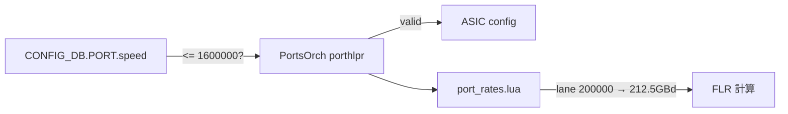

<!-- topics-tip -->
!!! tip "Topics で読み物として読む"
    この HLD は実装詳細を含みます。機能の概念・設定・運用を読み物として読みたい場合は [Topics 14 章: Platform / Port / Optics](../topics/14-platform-port-optics/index.md) を参照。
<!-- /topics-tip -->

!!! success "裏取りステータス: code-verified"
    Verifier 2026-05-09: 主要 4 リポジトリへの取り込みを確認。`sonic-platform-daemons/sonic-xcvrd/xcvrd/xcvrd_utilities/common.py:201` `get_interface_speed` で `'1.6T' in ifname → 1600000` 分岐、`sonic-swss/orchagent/port/porthlpr.cpp:32` `static const std::uint32_t maxPortSpeed = 1600000;`、`sonic-swss/orchagent/port_rates.lua:110` `serdes = 212.5e+9`、`sonic-buildimage/src/sonic-yang-models/yang-models/sonic-port.yang:102,133` で `range 1..1600000`、`sonic-swss/orchagent/port_flr.lua:78` で `['1600000_8'] = 4` まで実装済み。HLD と整合。inner FEC / link training 等の検討点はオープンのまま。

# 1.6T Ethernet 対応（200G SerDes / SFF-8024 / xcvrd / PortsOrch）

## 概要

IEEE P802.3dj が定める **200 / 400 / 800 Gb/s と 1.6 Tb/s** のインターフェース定義を [SONiC](../reference/glossary.md#term-sonic) に取り込むための変更点を列挙した [HLD](../reference/glossary.md#term-hld)[^1]。本質は **lane あたり 200G PAM4（GBd 106.25）** という新しい [SerDes](../reference/glossary.md#term-serdes) レートを足元のコードに通すこと。

主要変更点（4 リポジトリ横断）[^1]:

1. **SFF-8024**: 新しい host electrical / MMF / SMF interface ID の追加
2. **sonic-platform-daemons / xcvrd**: `1.6T` スピード認識
3. **[sonic-utilities](../reference/glossary.md#term-sonic-utilities)**: `show interfaces status` / `config interface speed` の表示・受理
4. **[sonic-swss](../reference/glossary.md#term-sonic-swss) / [orchagent](../reference/glossary.md#term-orchagent)**: PortsOrch の最大スピード上限と FLR 計算（lane speed 200000 → SerDes 212.5e9）

## 動作仕様

### SFF-8024 の新 ID

#### Host Electrical Interface（コネクタ側）[^1]

すべて **PAM4 / 106.25 GBd**:

| ID | 名称 | 速度 | レーン数 |
|----|------|------|---------|
| 30 | 200GBASE-CR1 | 212.5 Gb/s | 1 |
| 31 | 400GBASE-CR2 | 425 Gb/s | 2 |
| 87 | 800GBASE-CR4 | 850 Gb/s | 4 |
| 88 | 1.6TBASE-CR8 | 1700 Gb/s | 8 |
| 128 | 200GAUI-1 | 212.5 Gb/s | 1 |
| 129 | 400GAUI-2 | 425 Gb/s | 2 |
| 130 | 800GAUI-4 | 850 Gb/s | 4 |
| 131 | 1.6TAUI-8 | 1700 Gb/s | 8 |

#### MMF Media Interface[^1]

| ID | 名称 | 速度 | 信号速度 |
|----|------|------|----------|
| 33 | 800G-VR4.2 | 850 Gb/s | 53.125 GBd PAM4 |
| 34 | 800G-SR4.2 | 850 Gb/s | 53.125 GBd PAM4 |

#### SMF Media Interface[^1]

代表例（同一表で 11 種登場）:

| ID | 名称 | 速度 | 信号速度 |
|----|------|------|----------|
| 115 | 200GBASE-DR1 | 212.5 | 106.25 GBd |
| 117 | 400GBASE-DR2 | 425 | 106.25 GBd |
| 119 | 800GBASE-DR4 | 850 | 106.25 GBd |
| 122 | 800GBASE-FR4 | 850 | 113.4375 GBd |
| 123 | 800GBASE-LR4 | 850 | 113.4375 GBd |
| 127 | 1.6TBASE-DR8 | 1700 | 106.25 GBd |
| 128 | 1.6TBASE-DR8-2 | 1700 | 113.4375 GBd |

`106.25` 系（IEEE Clause 180 系）と `113.4375` 系（Clause 181 / 183）の **2 種類のシグナリングレート** が共存する点に注意[^1]。

### sonic-platform-daemons (xcvrd)

`xcvrd.py` の `get_interface_speed` に **`1.6T` 分岐を追加**。HLD の patch 抜粋[^1]:

```python
if '1.6T' in ifname:
    speed = 1600000
elif '800G' in ifname:
    speed = 800000
elif '400G' in ifname:
    speed = 400000
...
```

### sonic-swss (orchagent)

#### PortsOrch の上限引き上げ[^1]

```cpp
// orchagent/port/porthlpr.cpp
static const std::uint32_t minPortSpeed = 1;
- static const std::uint32_t maxPortSpeed = 800000;
+ static const std::uint32_t maxPortSpeed = 1600000;
```

[CONFIG_DB](../reference/glossary.md#term-config_db) の `PORT.speed` 値検証で 1600000 を許容するための変更。

#### FLR 計算 (`port_rates.lua`)

レーン速度 → SerDes クロックのテーブルに **200000 → 212.5e9** を追加[^1]:

```lua
-- orchagent/port_rates.lua
elseif lane_speed == 100000 then
    serdes = 106.25e+9
+ elseif lane_speed == 200000 then
+    serdes = 212.5e+9
else
    logit("Invalid serdes speed")
end
```

これは Frame Loss Ratio 計算で **シンボル時間** を求めるための係数。レーン 200G PAM4 の symbol rate が 106.25 Gsym/s で実効ビットレートが 212.5 Gb/s となるため、Lua 側でも反映する必要がある[^1]。



### sonic-utilities

`show interfaces status` の表示と `config interface speed <ifname> 1600000`（または `1.6T`）受理を更新[^1]。具体的なソースの変更点は HLD には書かれていない（要件のみ）。

<!-- evidence:
source: sonic-net/SONiC/doc/port-1.6t-support/port-1.6t-support.md#L114-L145 (sha: 49bab5b5ff0e924f1ea52b3d9db0dfa4191a7c06)
excerpt: |
  - Orchagent will need to update the FLR calculation to support SerDes rates of 212.50.
  - PortsOrch will need to define 1.6T as the maximum allowed speed for config parsing.
  ...
  - static const std::uint32_t maxPortSpeed = 800000;
  + static const std::uint32_t maxPortSpeed = 1600000;
  ...
  + elseif lane_speed == 200000 then
  +    serdes = 212.5e+9
reasoning: PortsOrch maxPortSpeed 引き上げと port_rates.lua 200G レーン対応の根拠。
-->

<!-- evidence-rendered:start -->
??? note "📋 検証エビデンス: sonic-net/SONiC/doc/port-1.6t-support/port-1.6t-support.md#L114-L145 (sha: 49bab5b5ff0e924f1ea52b3d9db0dfa4191a7c06)"

    **出典**:

    `sonic-net/SONiC/doc/port-1.6t-support/port-1.6t-support.md#L114-L145 (sha: 49bab5b5ff0e924f1ea52b3d9db0dfa4191a7c06)`

    **抜粋**:

    ```text
    - Orchagent will need to update the FLR calculation to support SerDes rates of 212.50.
    - PortsOrch will need to define 1.6T as the maximum allowed speed for config parsing.
    ...
    - static const std::uint32_t maxPortSpeed = 800000;
    + static const std::uint32_t maxPortSpeed = 1600000;
    ...
    + elseif lane_speed == 200000 then
    +    serdes = 212.5e+9
    ```

    **判断根拠**: PortsOrch maxPortSpeed 引き上げと port_rates.lua 200G レーン対応の根拠。

<!-- evidence-rendered:end -->

## 設定

### 関連する CONFIG_DB

| Table | Key | フィールド |
|-------|-----|-----------|
| `PORT` | `<Ethernet>` | `speed`（1600000 を受理させる必要） |

CONFIG_DB **スキーマ自体の変更は無い**（速度値の受理上限が変わるだけ）[^1]。

### 関連する CLI

| Command | 用途 |
|---------|------|
| `config interface speed <ifname> 1600000` | 1.6T 設定（または `1.6T` の文字列受理）[^1] |
| `show interfaces status` | 1.6T が正しく表示されること[^1] |

### 関連する YANG

`sonic-port` の `speed` 制約に 1600000 を許容する更新が必要（HLD では明示無し、PortsOrch 側のみ言及）。

### 設定例

```bash
config interface speed Ethernet0 1600000
show interfaces status | grep Ethernet0
```

## 制限事項

- **HW がまだ存在しない**ことを前提に書かれた spec 先行 HLD。実 HW での挙動は未確認[^1]
- DSP 付きの両端光モジュール接続では **inner FEC 追加** の議論が必要[^1]
- **link training** や **新 FEC タイプ** の取扱いは追加検討事項としてオープン[^1]
- IEEE 802.3dj は HLD 時点では **未確定（taskforce が finalize 作業中）**[^1]
- HLD 全体が **必要変更点の列挙レベル**。詳細設計や API 互換性は実装フェーズで詰める必要あり

## 干渉する機能

- **既存 800G 関連の入り口**: PortsOrch / xcvrd / port_rates.lua の同じパスに追加するため、800G 既存機能の regression に注意
- **CONFIG_DB validation**: `sonic-port` [YANG](../reference/glossary.md#term-yang) / `port_config.ini` などで speed 値の上限が別箇所に出ている場合、それぞれ更新が必要
- **CMIS / xcvrd 上の transceiver 種別判定**: SFF-8024 ID の新規追加は xcvrd の transceiver 情報パーサにも波及
- **link FLR 系の機能（[DPB](../reference/glossary.md#term-dpb) / fec mode 設定）**: lane 200000 のレートが他箇所の lane speed テーブルにも必要

## トラブルシューティング

- `config interface speed` が `Invalid speed` を返す: PortsOrch の `maxPortSpeed` か utilities の検証テーブルが未更新
- `port_rates.lua` で `Invalid serdes speed` ログ: lane 200000 分岐が未追加
- xcvrd が 1.6T インタフェースを `0` 速度で扱う: `get_interface_speed` の分岐未追加

### コマンド例

multi-[ASIC](../reference/glossary.md#term-asic) / VoQ chassis の各 namespace 状態を確認する。

```bash
# multi-ASIC / VoQ chassis
show chassis modules status
show platform summary
sudo ip netns list
for ns in $(sudo ip netns list | awk '{print $1}'); do
  echo "== $ns =="
  sudo ip netns exec "$ns" show interfaces status | head
done
```

## 引用元

[^1]: `sonic-net/SONiC` `doc/port-1.6t-support/port-1.6t-support.md` @ `49bab5b5ff0e924f1ea52b3d9db0dfa4191a7c06`

<!-- concerns hint:
- xcvrd の get_interface_speed に 1.6T 分岐が現行 master に取り込まれているか
- PortsOrch porthlpr の maxPortSpeed = 1600000 への引き上げ取り込み確認
- port_rates.lua の lane_speed=200000 → 212.5e9 取り込み確認
- sonic-utilities の config/show 1.6T 対応確認
- sonic-port YANG の speed 制約 1600000 受理確認
- SFF-8024 新 ID (30/31/87/88/128/129/130/131 等) の sonic-platform-common 取り込み
-->

<!-- topics-back-ref -->
## 関連 Topics

- [Topics: Platform / Port / Optics / PHY](../topics/14-platform-port-optics/index.md)

<!-- /topics-back-ref -->

<!-- glossary-links-injected: ec18b66e3507 -->
