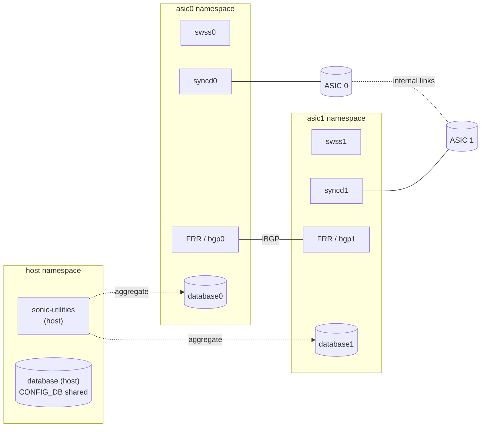

<!-- topics-tip -->
!!! tip "Topics で読み物として読む"
    この HLD は実装詳細を含みます。機能の概念・設定・運用を読み物として読みたい場合は [Topics 12 章: Multi-ASIC / VoQ / Chassis](../topics/12-multi-asic-voq/index.md) を参照。
<!-- /topics-tip -->

!!! info "裏取りステータス: code-verified（大規模 HLD・要点裏取り）"
    HLD は 71KB。本ページは architecturally distinctive な要素（namespace 分離・per-ASIC Redis・internal BGP・sonic-net link）に絞る。裏取り: `sonic-buildimage/src/sonic-yang-models/yang-models/sonic-device_metadata.yang`（`sub_role` / `asic_id` / `switch_id` / `switch_type`）、`sonic-bgp-internal-neighbor.yang`、`sonic-buildimage/files/build_templates/per_namespace/{swss,syncd,bgp}.service.j2`（per-ASIC instanced unit）、`sonic-utilities` の `--namespace`/`-n` オプション（`show/main.py`）。

# SONiC on Multi-ASIC platforms（namespace / per-asic Redis / sonic-net）

## 何が中核アイデアか

1 台の chassis 内に複数 [ASIC](../reference/glossary.md#term-asic) を持つ platform で [SONiC](../reference/glossary.md#term-sonic) を動かすための設計[^1]:

- **ASIC ごとに linux network namespace を分ける**（`asic0` / `asic1` / ...）
- 各 namespace に**独自の [Redis](../reference/glossary.md#term-redis) インスタンス**（`database0`、`database1`...）と独自の SWSS / [syncd](../reference/glossary.md#term-syncd) / [FRR](../reference/glossary.md#term-frr)
- ASIC 間は **internal links（sonic-net / fabric / cross-port）と internal [BGP](../reference/glossary.md#term-bgp)** で結ぶ
- 外部から見える操作（CLI / [SNMP](../reference/glossary.md#term-snmp) / [gNMI](../reference/glossary.md#term-gnmi)）は **host namespace 上の集約レイヤ**が ASIC 横断で扱う

## どんな構造か



主要な仕組み[^1]:

- **`asic.conf` / `platform.json`**: ASIC 数・type・internal port マッピング・role（front-panel / fabric）を宣言
- **per-namespace docker**: `swss@asic0`、`syncd@asic0` のような instanced systemd unit
- **共有 [CONFIG_DB](../reference/glossary.md#term-config_db)（host）+ per-asic DB**: device-wide 設定は host CONFIG_DB に、port / asic 固有は per-asic に分離
- **internal BGP**: front-panel ASIC 同士で iBGP を張り route 情報を共有（`BGP_INTERNAL_NEIGHBOR`）
- **CLI 集約**: `show ... -n asic0` で per-asic、引数なしで全 ASIC 集約

### `sub_role` による役割分担

`DEVICE_METADATA|<asic>.sub_role` が `FrontEnd` / `BackEnd` を区別[^1]:

- **FrontEnd**: 外向き port を持つ。BGP / [ARP](../reference/glossary.md#term-arp) / 通常の SONiC 機能が動く
- **BackEnd**: fabric 役。traffic は通すが control plane は限定

## 設定 / CLI

| Table | 説明 |
|-------|------|
| `DEVICE_METADATA` | `localhost.platform`、`asic_name`、`sub_role`、`asic_id` |
| `PORT` | per-asic（namespace ごとの DB に存在） |
| `BGP_INTERNAL_NEIGHBOR` | ASIC 間 iBGP 用 neighbor |

| Command | 用途 |
|---------|------|
| `show platform summary` | platform 名、ASIC 数 |
| `show interfaces -n asic0` | per-asic interface |
| `show ip bgp summary -n asic0` | per-asic FRR 状態 |
| `sudo ip netns exec asic0 bash` | namespace に入る |

## 制限事項

- **multi-asic 対応の [sonic-utilities](../reference/glossary.md#term-sonic-utilities)** が必要。`-n` 未対応コマンドは ASIC 横断で正しく動かない
- **memory 消費**: ASIC 数 × Redis / swss / syncd / FRR の常駐で CPU / メモリ要件が高い
- **warm reboot 同期**: 全 ASIC を協調的に shutdown / boot する仕組みが必要
- **single-json multi-asic**: `multi-asic-single-json` [HLD](../reference/glossary.md#term-hld) で扱う統合 config 形式とは使い分け

## 干渉する機能

- **multi-asic warm reboot**: per-asic syncd / swss を協調 shutdown する HLD
- **single-json multi-asic config**: 一枚の JSON で per-asic 設定を一元管理する HLD（[multi-asic-single-json-configuration-design](multi-asic-single-json-configuration-design.md)）
- **[CRM](../reference/glossary.md#term-crm)（critical resource monitoring）**: per-asic で監視
- **Internal BGP / chassis BGP**: 内部 iBGP と外部 eBGP の境界

## トラブルシューティング

- `show interfaces` が空 → namespace を `-n` で指定し直す
- iBGP が上がらない → `BGP_INTERNAL_NEIGHBOR`、internal link 物理状態、`sub_role` を確認
- per-asic Redis に接続できない → `redis-cli -s /var/run/redis<asic>/redis.sock` の socket を確認

### コマンド例

multi-ASIC / VoQ chassis の各 namespace 状態を確認する。

```bash
# multi-ASIC / VoQ chassis
show chassis modules status
show platform summary
sudo ip netns list
for ns in $(sudo ip netns list | awk '{print $1}'); do
  echo "== $ns =="
  sudo ip netns exec "$ns" show interfaces status | head
done
```

## 関連 Topics

- [Topics 12 Multi-ASIC / VOQ - architecture](../topics/12-multi-asic-voq/architecture.md)
- [Topics 12 Multi-ASIC / VOQ - internals](../topics/12-multi-asic-voq/internals.md)
- 関連 HLD: [Multi-ASIC single JSON config](multi-asic-single-json-configuration-design.md) / [DB design for multi-ASIC scenarios](db-design-for-multi-asic-scenarios.md) / [VOQ SONiC](voq-sonic.md)

## 引用元

[^1]: `sonic-net/SONiC` `doc/multi_asic/SONiC_multi_asic_hld.md` @ `49bab5b5ff0e924f1ea52b3d9db0dfa4191a7c06`

<!-- topics-back-ref -->
## 関連 Topics

- [Topics: Multi-ASIC / VOQ Chassis](../topics/12-multi-asic-voq/index.md)

<!-- /topics-back-ref -->

<!-- glossary-links-injected: ec18b66e3507 -->
