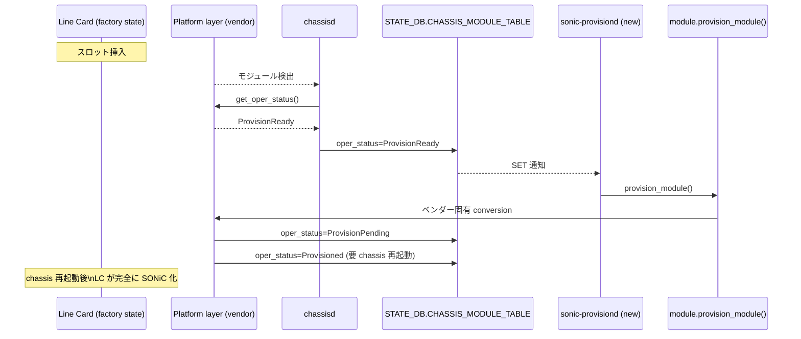
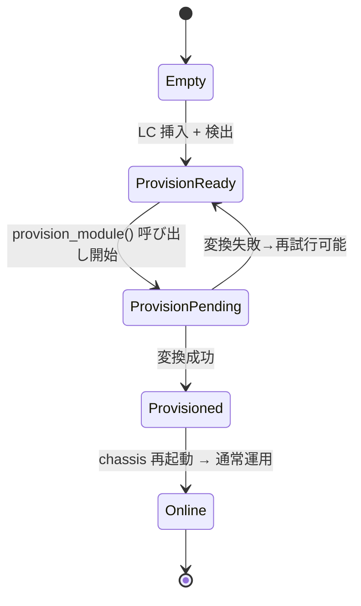
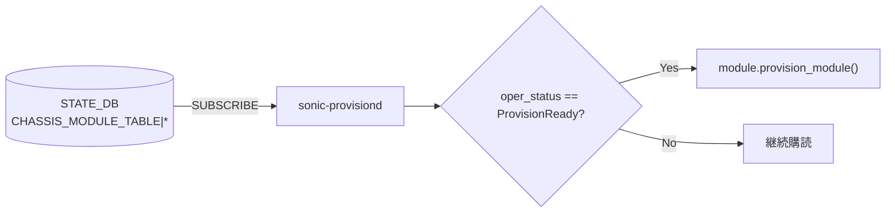

<!-- topics-tip -->
!!! tip "Topics で読み物として読む"
    この HLD は実装詳細を含む。機能の概念・設定・運用を読み物として読みたい場合は [Topics 14 章: Platform / Port / Optics](../topics/14-platform-port-optics/index.md) を参照。
<!-- /topics-tip -->

!!! info "裏取りステータス: code-verified（提案段階・実装未着手であることを再確認）"
    2026-05-09 時点で `sonic-platform-common/sonic_platform_base/module_base.py` を直読し、`MODULE_STATUS_EMPTY` / `_OFFLINE` / `_POWERED_DOWN` / `_PRESENT` / `_FAULT` / `_ONLINE` の 6 定数のみを確認（HLD 提案の `MODULE_STATUS_PROVISION_READY` / `_PENDING` / `MODULE_STATUS_PROVISIONED` は **未追加**）。`sonic-platform-daemons` 直下にも `sonic-provisiond` ディレクトリは存在せず、`sonic-buildimage` で `provision_module` の文字列もヒットしない。HLD は Rev 1.0 (2026-03) と新しく、**設計通り「提案段階」のままコード未反映** であることを実コードで再確認した。本ページは HLD の設計意図を写したもので、現行 SONiC の実機能ではない。

# Chassis Line Card 自動プロビジョニング（`sonic-provisiond` / `provision_module`）

## 概要

[SONiC](../reference/glossary.md#term-sonic) モジュラー chassis では、各 line card（LC）が **独立した SONiC インスタンスとして動作** する。新規 LC を空きスロットに挿す、または既存 LC を交換する場合、その LC が SONiC を実行できる状態になっている保証は無い。ベンダーによっては Supervisor 上でスクリプトを走らせる等、**「工場状態の LC を SONiC が動くようにする手順」** を踏む必要がある[^1]。

本 [HLD](../reference/glossary.md#term-hld) はこのプロセスを SONiC 共通の枠組みとして取り込むため、**新しいプラットフォーム API `provision_module()` と新しい pmon デーモン `sonic-provisiond`** を導入する。Supervisor で LC 検出 → state 監視 → API 呼び出し → ベンダー固有変換 → 再起動して LC を SONiC 化、という流れを統一する。

## 動作仕様

### 全体フロー



### 想定要件

HLD は次を要件として明示する[^1]:

- 新規 LC の検出 **メカニズムはベンダー実装に委ねる**（platform layer の責務）
- 変換中の chassis は **「production traffic が無い安全な状態」を運用ルールで担保**。LC 挿抜時はネットワーク上で隔離する前提
- ホットスワップは望ましいが **必須要件にしない**。「変換完了したが完全動作には chassis 再起動が必要」という中間状態を許す
- minigraph / `config_db.json` の自動投入は **本 HLD のスコープ外**。LC 投入後は chassis 全体に config を再配布する想定
- LC は最低限 console アクセスと midplane ネットワークが上がる状態で起動できるべき

### 新しい oper status

`sonic_platform_base/module_base.py` の `get_oper_status()` 戻り値に 3 つの状態を追加[^1]:

| 値 | 意味 |
|----|------|
| `ProvisionReady` | LC を検出済み、SONiC を動かせるが、まだ SONiC 化されていない（変換待ち） |
| `ProvisionPending` | 変換中。LC は現状到達不可と想定 |
| `Provisioned` | 変換成功。ただし chassis 再起動で初めて完全に組み込まれる |

定数定義（HLD 抜粋）:

```python
MODULE_STATUS_PROVISION_READY = "ProvisionReady"
MODULE_STATUS_PROVISION_PENDING = "ProvisionPending"
MODULE_STATUS_PROVISIONED = "Provisioned"
```

これらは **`provision_module()` を実装したプラットフォームでのみ使う** べきと明記される[^1]。

### 状態遷移



`Online` などの既存状態への接続は HLD の state diagram 図に記載されている[^1]。

### STATE_DB スキーマ

既存 `CHASSIS_MODULE_TABLE|LINE-CARD<x>` の `oper_status` フィールドに新値が乗る。

```yaml
CHASSIS_MODULE_TABLE|LINE-CARD0
    desc        : 7800R3AK-36DM2-LC
    slot        : 3
    oper_status : Online | ProvisionReady | ProvisionPending | Provisioned | ...
    num_asics   : 0
    serial      : <SN>
```

`chassisd` が `get_oper_status()` をポーリングして [STATE_DB](../reference/glossary.md#term-state_db) に同期する責務を持つ。`sonic-provisiond` は STATE_DB を購読するだけ[^1]。

### 新 API: `provision_module()`

```python
def provision_module(self):
    """
    Request to provision the module.
    Returns: bool
    """
    raise NotImplementedError
```

責務[^1]:

- ベンダー固有の変換手順（イメージ流し込み・boot 設定変更・bootloader 操作など）を実行
- **このメソッドはブロックしてよい**
- 非同期実装の場合、変換中の `MODULE_STATUS` を正確に STATE_DB に反映する責務を負う

### 新デーモン: `sonic-provisiond`



責務[^1]:

- `CHASSIS_MODULE_TABLE|*` の `oper_status` を購読
- 値が `ProvisionReady` に切り替わった時、対応する module オブジェクトの `provision_module()` を呼ぶ
- 自動プロビジョニングの **有効/無効はこのサービスの enable/disable で切替**

`chassisd` は引き続き `get_oper_status()` のポーリングと STATE_DB への反映を担当し、`sonic-provisiond` は STATE_DB の変化に reactive に動くだけのシンプルな構造になっている。

<!-- evidence:
source: sonic-net/SONiC/doc/chassis/module-provisioning/chassis-linecard-provisioning-hld.md#L96-L103 (sha: 49bab5b5ff0e924f1ea52b3d9db0dfa4191a7c06)
excerpt: |
  A new pmon daemon will be introduced which will be responsible for triggering provisioning / calling this new API.
  This daemon will simply subscribe to all `CHASSIS_MODULE_TABLE|*` tables, and listen to changes to the `oper_state` field.
  If `oper_state` switches to `'ProvisionReady'`, it will call provision_module() on the corresponding module.
reasoning: sonic-provisiond の責務（STATE_DB 購読のみ・ProvisionReady で provision_module() 呼び出し）の根拠。
-->

<!-- evidence-rendered:start -->
??? note "📋 検証エビデンス: sonic-net/SONiC/doc/chassis/module-provisioning/chassis-linecard-provisioning-hld.md#L96-L103 (sha: 49bab5b5ff0e924f1ea52b3d9db0dfa4191a7c06)"

    **出典**:

    `sonic-net/SONiC/doc/chassis/module-provisioning/chassis-linecard-provisioning-hld.md#L96-L103 (sha: 49bab5b5ff0e924f1ea52b3d9db0dfa4191a7c06)`

    **抜粋**:

    ```text
    A new pmon daemon will be introduced which will be responsible for triggering provisioning / calling this new API.
    This daemon will simply subscribe to all `CHASSIS_MODULE_TABLE|*` tables, and listen to changes to the `oper_state` field.
    If `oper_state` switches to `'ProvisionReady'`, it will call provision_module() on the corresponding module.
    ```

    **判断根拠**: sonic-provisiond の責務（STATE_DB 購読のみ・ProvisionReady で provision_module() 呼び出し）の根拠。

<!-- evidence-rendered:end -->

## 設定

### 関連する CONFIG_DB

HLD では新しい [CONFIG_DB](../reference/glossary.md#term-config_db) スキーマは導入しない。既存の chassis 関連設定（モジュールスロット定義など）に依存。

### 関連する CLI

専用 CLI は HLD で言及されていない。`sonic-provisiond` の有効化は systemd ベースの enable / disable で行う想定[^1]。

### 関連する YANG

該当 [YANG](../reference/glossary.md#term-yang) モジュールは HLD で言及されていない。

## 制限事項

- **本 HLD は LC 挿抜時の chassis 安全性を運用で担保する前提**。production traffic を流したまま挿抜することは想定外[^1]
- ホットスワップは required ではない。`Provisioned` 状態は **chassis 再起動でのみ完全動作** という中間状態を許容
- minigraph / `config_db.json` の自動投入はスコープ外。LC 化後の構成投入は別途必要
- `provision_module()` 未実装のベンダーでは新 status 値を使わない（既存の `Online`/`Offline` で運用）
- `sonic-provisiond` 自体は **失敗時のリトライ戦略を細かく規定していない**（HLD 範囲外）

## 干渉する機能

- **`chassisd`**: `CHASSIS_MODULE_TABLE` の更新者。引き続き `get_oper_status()` をポーリングする。`sonic-provisiond` の追加で責務分離が明確になる
- **`pmon` 系デーモン群**: `sonic-provisiond` は pmon の枠で動く新規デーモン。systemd ユニットの追加と pmon コンテナ Dockerfile への組み込みが必要
- **`sonic-platform-common.module_base`**: 新 enum と新 API の追加。後方互換は `NotImplementedError` で確保
- **chassis HLD 全般**: モジュール挿入検出・slot 番号管理など既存仕組みを再利用

## トラブルシューティング

- `ProvisionReady` のまま遷移しない場合、`sonic-provisiond` が pmon コンテナで動いているか・`CHASSIS_MODULE_TABLE` を購読できているかを確認
- `ProvisionPending` で固まる場合、ベンダー provisioning スクリプトのログを確認
- `Provisioned` から `Online` に戻らない場合、chassis 再起動が必要なケース

### コマンド例

CMIS / トランシーバの状態と provisioning を確認する。

```bash
# Transceiver / CMIS
show interfaces transceiver eeprom Ethernet0
show interfaces transceiver info Ethernet0
redis-cli -n 6 hgetall 'TRANSCEIVER_INFO|Ethernet0'
redis-cli -n 4 hgetall 'PORT|Ethernet0'
```

## 関連 reference

- [Topics: Platform / Port / Optics](../topics/14-platform-port-optics/index.md)
- [HLD: custom-si-settings-for-cmis-modules](custom-si-settings-for-cmis-modules.md)
- [HLD: cmis-and-c-cmis-support-for-zr](cmis-and-c-cmis-support-for-zr.md)

## 引用元

[^1]: `sonic-net/SONiC` `doc/chassis/module-provisioning/chassis-linecard-provisioning-hld.md` @ `49bab5b5ff0e924f1ea52b3d9db0dfa4191a7c06`

<!-- concerns hint:
- module_base.py への 3 つの新 status 定数追加状況
- provision_module() API の sonic-platform-common 取り込み
- sonic-provisiond デーモンのコード（pmon docker への追加）
- chassisd と sonic-provisiond の責務分離が実装上正しく切れているか
- ベンダー側 provision_module() リファレンス実装の有無
- 状態遷移失敗時のリトライ戦略
-->

<!-- topics-back-ref -->
## 関連 Topics

- [Topics: Multi-ASIC / VOQ Chassis](../topics/12-multi-asic-voq/index.md)

<!-- /topics-back-ref -->

## 参考リンク

本ページに関連する参照ドキュメント:

- [`VOQ_INBAND_INTERFACE` CONFIG_DB スキーマ](../reference/config-db/voq-inband-interface.md)
- [platform カテゴリ目次](index.md)
- [用語集 (Glossary)](../reference/glossary.md)

<!-- augmented-links: v1 -->

<!-- glossary-links-injected: 8ba32e5aa69d -->
