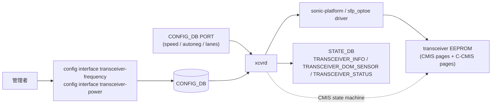

<!-- topics-tip -->
!!! tip "Topics で読み物として読む"
    この HLD は実装詳細を含む。機能の概念・設定・運用を読み物として読みたい場合は [Topics 14 章: Platform / Port / Optics](../topics/14-platform-port-optics/index.md) を参照。
<!-- /topics-tip -->

!!! warning "裏取りステータス: code-verified / 大規模 HLD"
    HLD は 97KB。本ページは ZR/ZR+ で SONiC の transceiver 管理（CMIS 状態機械、coherent optics 拡張）にどんな差が出るかに絞る。詳細レジスタ / state machine 完全網羅は HLD 本文を参照。

!!! note "Verifier 注記（2026-05-10）"
    実コード裏取り: `sonic-platform-daemons/sonic-xcvrd/xcvrd/cmis/` に CMIS state machine 実装、`xcvrd_utilities/xcvr_table_helper.py` で TRANSCEIVER_INFO / TRANSCEIVER_DOM_SENSOR / TRANSCEIVER_STATUS テーブル管理を確認。`sonic-utilities/scripts/portconfig` に `transceiver-frequency` 系オプションを確認。C-CMIS の ZR 拡張は xcvrd cmis モジュール内で扱われている。

# ZR / ZR+ 向け CMIS / C-CMIS サポート（xcvrd / DSP / coherent optics）

## 概要

QSFP-DD ZR / ZR+ のような **coherent optics** は従来の grey optics と比べ:

- **DSP / laser tuning** が必要（周波数・power・modulation）
- **CMIS 5.x の C-CMIS 拡張**で coherent 固有の Page / レジスタ群がある
- **Application Select**（モジュール側で 100G/400G / FEC タイプを切り替え）必須

このため `xcvrd`（pmon 内 transceiver daemon）と sonic-platform-common 側の **CMIS state machine** に C-CMIS 対応が要る[^1]。

## 動作仕様



CMIS state machine の主要状態（[HLD](../reference/glossary.md#term-hld) ベース）:

- `MODULE_LOW_PWR` → `MODULE_PWR_UP` → `MODULE_READY`
- `DATAPATH_DEACTIVATED` → `DATAPATH_INIT` → `DATAPATH_INITIALIZED` → `DATAPATH_ACTIVATED`
- 各遷移で **Application Select** と lane mapping を CMIS Page 0x10 / 0x11 に書き込む

C-CMIS 拡張[^1]:

- **Tx laser frequency**（ITU grid / 100GHz）の設定と現在値の readback
- **Tx output power** 範囲設定
- **modulation type / FEC mode** の確認
- **media lane** の lane-by-lane fault state

## 設定

### 関連する CONFIG_DB / STATE_DB

| Table | DB | 用途 |
|-------|----|------|
| `PORT` | CONFIG | speed / lanes / autoneg / `transceiver-frequency` / `transceiver-power` 等 |
| `TRANSCEIVER_INFO` | STATE | manufacturer / vendor PN / supported applications |
| `TRANSCEIVER_DOM_SENSOR` | STATE | DOM (laser bias / temp / Rx power) |
| `TRANSCEIVER_STATUS` | STATE | datapath state, fault flags |

### 関連する CLI

| Command | 用途 |
|---------|------|
| `show interfaces transceiver eeprom -d` | EEPROM dump |
| `show interfaces transceiver dom` | DOM 値 |
| `sfputil show eeprom` / `sfputil show dom` | 低レベル確認 |
| `config interface transceiver-frequency <if> <THz>` | ZR の laser tuning |
| `config interface transceiver-power <if> <dBm>` | Tx power |

## 制限事項

- **module 側の Application Select 表に依存**: 同一 module でも対応 application 集合は ベンダ固有
- **CMIS バージョン差**: 5.0 / 5.1 / C-CMIS 1.x で page layout に微差。xcvrd 側で吸収
- **電源予算**: ZR モジュールは消費電力が大きく、port / shelf の電源プロファイル確認が必要
- **autoneg と coherent**: ZR は固定 application select。autoneg は無効化される

## 干渉する機能

- **port auto-FEC / port auto-negotiation**: ZR では FEC / autoneg 設定が CMIS Application Select に従う
- **fast link up**: link bring-up シーケンスと CMIS DATAPATH state の整合
- **port profile init**: port 起動時の初期 application select
- **enhanced LPO debug registers**: 派生する低レベルデバッグ HLD

## トラブルシューティング

- module は認識するが link しない → `TRANSCEIVER_STATUS` の datapath state、Application Select の不一致
- laser power が想定値と違う → `transceiver-power` 設定値、module 側上下限
- frequency が変わらない → ITU グリッド外指定、module の wavelength 範囲

### コマンド例

CMIS / トランシーバの状態と provisioning を確認する。

```bash
# Transceiver / CMIS
show interfaces transceiver eeprom Ethernet0
show interfaces transceiver info Ethernet0
redis-cli -n 6 hgetall 'TRANSCEIVER_INFO|Ethernet0'
redis-cli -n 4 hgetall 'PORT|Ethernet0'
```

## 関連 reference

- [HLD: custom-si-settings-for-cmis-modules](custom-si-settings-for-cmis-modules.md)
- [HLD: enhancement-of-cmis-module-management](../management/enhancement-of-cmis-module-management.md)
- [Topics: Platform / Port / Optics](../topics/14-platform-port-optics/index.md)

## 引用元

[^1]: `sonic-net/SONiC` `doc/platform_api/CMIS_and_C-CMIS_support_for_ZR.md` @ `49bab5b5ff0e924f1ea52b3d9db0dfa4191a7c06`

<!-- concerns hint:
- xcvrd の CMIS state machine 実装と C-CMIS 拡張取り込みの現行確認
- TRANSCEIVER_INFO / TRANSCEIVER_DOM_SENSOR / TRANSCEIVER_STATUS スキーマの ZR 拡張フィールド確認
- config interface transceiver-frequency / transceiver-power CLI の sonic-utilities 取り込み確認
- sonic-platform-common SfpOptoeBase の C-CMIS 対応 method 確認
- ZR module Application Select マッピング（100G/400G / FEC mode）の per-vendor 差分確認
- port auto-FEC / autoneg / fast-link-up との挙動整合確認
-->

<!-- topics-back-ref -->
## 関連 Topics

- [Topics: Platform / Port / Optics / PHY](../topics/14-platform-port-optics/index.md)

<!-- /topics-back-ref -->

<!-- glossary-links-injected: 167700005048 -->
