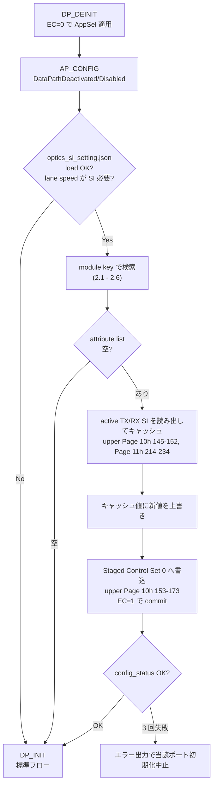

<!-- topics-tip -->
!!! tip "Topics で読み物として読む"
    この HLD は実装詳細を含みます。機能の概念・設定・運用を読み物として読みたい場合は [Topics 14 章: Platform / Port / Optics](../topics/14-platform-port-optics/index.md) を参照。
<!-- /topics-tip -->

!!! success "裏取りステータス: code-verified"
    sonic-platform-daemons `sonic-xcvrd/xcvrd/xcvrd_utilities/optics_si_parser.py` L139 `get_optics_si_settings_value` / L179 `fetch_optics_si_setting` / L195 `load_optics_si_settings`、L199-205 で HWSKU フォルダ → platform フォルダの順で `optics_si_settings.json` を探すロジックを確認。`xcvrd/cmis/cmis_manager_task.py` L1131-1146 で AP_CONFIGURED フェーズで `optics_si_parser.optics_si_present()` 確認 → `fetch_optics_si_setting` 取得 → `api.stage_custom_si_settings(host_lanes_mask, optics_si_dict)` の経路、L1161-1162 で続く `CMIS_STATE_DP_INIT` 遷移を確認。`xcvrd_utilities/common.py` L27 `CMIS_STATE_AP_CONF` / L29 `CMIS_STATE_DP_INIT` の状態定義を確認（verified at: 2026-05-09）。

# CMIS Custom SI 設定（optics_si_setting.json と CMIS FSM の EC=1 適用）

## 概要

QSFP-DD / OSFP / QSFP の高速モジュールでは、**プラットフォーム × モジュール組み合わせ毎に Signal Integrity (SI) 値を再調整** しないと link が立たない／タップが歪むことがある[^1]。CMIS 5.0 はモジュール側に **Explicit Control (EC) ビット** を持っており、EC=1 のときホスト側で TX/RX EQ 値を上書きできる。

本機能は **プラットフォームベンダが配布する `optics_si_setting.json`** を xcvrd の CMIS state machine が読み、モジュール挿入時に **EEPROM に EQ 値を書き込む** 仕組みを足す[^1]:

- ファイル無しなら何もしない（既定挙動と互換）
- CMIS 非対応モジュールは対象外
- [CONFIG_DB](../reference/glossary.md#term-config_db) / CLI / [YANG](../reference/glossary.md#term-yang) / [SAI](../reference/glossary.md#term-sai) API いずれにも変更なし[^1]
- warm/fast boot にも影響なし[^1]

対象パラメータ[^1]:

- `FixedInputEqTargetTx` (TX EQ; AdaptiveInputEqEnableTx を **disable** にしてから書く)
- `OutputEqPreCursorTargetRx` / `OutputEqPostCursorTargetRx` / `OutputAmplitudeTargetRx` (RX OutputControl)

## 動作仕様

### CMIS state machine への割り込み



### モジュール key と検索順

検索キーは **DP lane speed + module vendor + vendor PN**[^1]。最初に GLOBAL_MEDIA_SETTINGS、次に PORT_MEDIA_SETTINGS、最終的に default block。

検索ステップ[^1]:

1. GLOBAL: `<port range>/<lane speed>/<vendor-PN>` 完全一致
2. GLOBAL: `<port range>/<lane speed>/Default`
3. GLOBAL: `<port range>/<lane speed>` 単独
4. PORT_MEDIA_SETTINGS の `<port>` ブロック内で同じ流れ
5. default block
6. どれにも当たらなければ **空 list**（custom SI を適用しない）

### `optics_si_setting.json` 構造

GLOBAL は **port range / list / 単独** の混在可（`port_config.ini` の index）[^1]:

```json
{
  "GLOBAL_MEDIA_SETTINGS": {
    "0-17,19-24": {
      "100G_SPEED": {
        "CREDO-CAC82X321MXYXYHW": {
          "OutputEqPreCursorTargetRx": {
            "OutputEqPreCursorTargetRx1": 5,
            "OutputEqPreCursorTargetRx2": 5,
            "...": "..."
          }
        },
        "CISCO-INNOLIGHT-T-DXXNT-NCI": {
          "OutputEqPostCursorTargetRx": { "OutputEqPostCursorTargetRx1": 8 }
        }
      }
    },
    "25,28,30": {
      "100G_SPEED": {
        "Default": {
          "OutputAmplitudeTargetRx": { "OutputAmplitudeTargetRx1": 7 }
        }
      }
    }
  },
  "PORT_MEDIA_SETTINGS": {
    "18": {
      "100G_SPEED": {
        "Default": {
          "OutputEqPostCursorTargetRx": { "OutputEqPostCursorTargetRx1": 5 }
        }
      }
    }
  }
}
```

### CMIS レジスタ書込位置

書き込み対象（CMIS 5.0 仕様）[^1]:

| Register | 用途 |
|----------|------|
| Page 01h Byte 161 (Bit 2/3) | `TxInputEqFixedManualControlSupported` / `TxInputAdaptiveEqSupported` 能力照会 |
| Page 01h Byte 162 (Bit 2/3-4) | `RxOutputAmplitudeControlSupported` / `RxOutputEqControlSupported` 能力照会 |
| Page 10h Byte 153 | `AdaptiveInputEqEnableTx1..8` を **disable** に書く |
| Page 10h Byte 154-155 | `AdaptiveInputEqRecallTx1..8` |
| Page 10h Byte 156-159 | `FixedInputEqTargetTx1..8` |
| Page 10h Byte 162-165 | `OutputEqPreCursorTargetRx1..8` |
| Page 10h Byte 166-169 | `OutputEqPostCursorTargetRx1..8` |
| Page 10h Byte 170-173 | `OutputAmplitudeTargetRx1..8` |
| Page 10h Byte 143 | `ApplyDPInit` で staged → active set へ commit |
| Page 11h Byte 202-205 | config_status（成功確認） |

### キャッシュと差分上書きの理由

xcvrd は **EC=0 で動いている既存の active SI 値をまずキャッシュ** し、新値（一部分のみ）を被せる。staged set に「新値だけ」書くと **未指定値が 0 で上書き** されてしまうため、必ず差分マージが必要[^1]。

### Lane speed と TxInputAdaptiveEq 無効化

TX EQ は **AdaptiveInputEqEnableTx を全 lane disable** にしてから FixedInputEqTargetTx を書く必要がある（CMIS 仕様）[^1]。[HLD](../reference/glossary.md#term-hld) は「`TxInputEqFixedManualControlSupported` がモジュール側で立っている時のみ TX SI を投入」と明記。

<!-- evidence:
source: sonic-net/SONiC/doc/sfp-cmis/CMIS-custom-SI-settings.md#L218-L246 (sha: 49bab5b5ff0e924f1ea52b3d9db0dfa4191a7c06)
excerpt: |
  4. After applying the application code to the configuration with Explicit Control (EC) = 0, and committed to the activate state, now read and cache the default or active TX/RX SI settings... If we only apply the new values in Staged Control Set, the other values will be set to 0 in the Active Control Set.
  ...
  7. Validate the config_status code, if the status is not config success, then force CMIS to reinit and retry. If the configuration fails after 3 retry attempts, print an error message and exit from initializing this port.
reasoning: 「キャッシュ→差分マージ→staged→commit」「3 回までリトライ」のフロー根拠。
-->

<!-- evidence-rendered:start -->
??? note "📋 検証エビデンス: sonic-net/SONiC/doc/sfp-cmis/CMIS-custom-SI-settings.md#L218-L246 (sha: 49bab5b5ff0e924f1ea52b3d9db0dfa4191a7c06)"

    **出典**:

    `sonic-net/SONiC/doc/sfp-cmis/CMIS-custom-SI-settings.md#L218-L246 (sha: 49bab5b5ff0e924f1ea52b3d9db0dfa4191a7c06)`

    **抜粋**:

    ```text
    4. After applying the application code to the configuration with Explicit Control (EC) = 0, and committed to the activate state, now read and cache the default or active TX/RX SI settings... If we only apply the new values in Staged Control Set, the other values will be set to 0 in the Active Control Set.
    ...
    7. Validate the config_status code, if the status is not config success, then force CMIS to reinit and retry. If the configuration fails after 3 retry attempts, print an error message and exit from initializing this port.
    ```

    **判断根拠**: 「キャッシュ→差分マージ→staged→commit」「3 回までリトライ」のフロー根拠。

<!-- evidence-rendered:end -->

## 設定

### 関連する CONFIG_DB

なし[^1]。設定はすべて platform 配置の **JSON ファイル** で完結する。

### 関連する CLI

該当する CLI は無い[^1]。動作確認は xcvrd / CMIS のログ確認のみ。

### 関連する YANG

該当 YANG モジュールは無い[^1]。

### 設定例（プラットフォーム配置）

`/usr/share/sonic/device/<platform>/optics_si_setting.json` のような platform ディレクトリに JSON を配置する想定（HLD 上の正確なパスは未明記）。SKU は同 platform 内で **共有**[^1]。

## 制限事項

- **CMIS 非対応モジュール（CMIS state machine 外）は対象外**[^1]
- transceiver 未挿入のポートには何もしない[^1]
- TX SI は `TxInputEqFixedManualControlSupported` がセットされたモジュールのみ。RX SI は `RxOutputEqControlSupported` / `RxOutputAmplitudeControlSupported` がセットされたモジュールのみ[^1]
- **Fixed TX EQ の使用は SI/HW チームから明示推奨があった場合のみ**[^1]。デフォルトは Adaptive。
- ケーブル長による設定分岐はサポートしない（speed と vendor のみで決まる）[^1]
- 3 回リトライしても config_status が成功しなければ当該ポートの初期化を中止[^1]

## 干渉する機能

- **既存 CMIS state machine**: AP_CONFIG → DP_INIT の間に挟まる形。失敗時は **CMIS reinit を強制** する経路あり
- **Adaptive TX EQ**: TX SI を投入する場合は ON/OFF を切り替える。リンク立ち上げ時間に影響
- **fec / port speed 変更時の [DPB](../reference/glossary.md#term-dpb)**: 同じ CMIS state machine 経路。lane speed が変わると検索キーが変わるため再評価が必要
- **transceiver hot insertion**: モジュール変更ごとに評価し直し

## トラブルシューティング

- xcvrd ログに「optics SI settings が apply された」表示が出ない: JSON 不在 / parse エラー / lane speed 該当なし
- リンク不安定: 投入された SI 値（EQ pre/post cursor / amplitude）が HW 推奨外。HW チームに正値確認
- `config_status` が `Config Success` 以外で 3 回リトライ → スキップ: モジュール側 advertisement と書込値の組合せが不正
- 既存 SI 値が 0 にリセットされた: キャッシュ→マージステップを飛ばしている可能性

### コマンド例

CMIS / トランシーバの状態と provisioning を確認する。

```bash
# Transceiver / CMIS
show interfaces transceiver eeprom Ethernet0
show interfaces transceiver info Ethernet0
redis-cli -n 6 hgetall 'TRANSCEIVER_INFO|Ethernet0'
redis-cli -n 4 hgetall 'PORT|Ethernet0'
```

## 参考リンク

- [Topics: Platform / Port / Optics](../topics/14-platform-port-optics/index.md)
- [HLD: CMIS and C-CMIS support for ZR](cmis-and-c-cmis-support-for-zr.md)
- [CLI: show interfaces](../reference/cli/show-interfaces.md)

## 引用元

[^1]: `sonic-net/SONiC` `doc/sfp-cmis/CMIS-custom-SI-settings.md` @ `49bab5b5ff0e924f1ea52b3d9db0dfa4191a7c06`

<!-- concerns hint:
- xcvrd / sonic-platform-daemons の optics_si_setting.json パーサ実装存在確認
- CMIS state machine の AP_CONFIG → DP_INIT 間 SI 適用フックの現行実装確認
- GLOBAL_MEDIA_SETTINGS → PORT_MEDIA_SETTINGS → Default の検索順実装確認
- TxInputEqFixedManualControl サポートチェック / AdaptiveInputEqEnableTx 無効化処理確認
- 既存 active SI のキャッシュ + 差分マージ実装確認
- 3 回リトライ後に当該ポート初期化を中止する実装確認
-->

<!-- topics-back-ref -->
## 関連 Topics

- [Topics: Platform / Port / Optics / PHY](../topics/14-platform-port-optics/index.md)

<!-- /topics-back-ref -->

## 関連リファレンス

本ページに関連する参照ドキュメント:

- [`PORT` CONFIG_DB スキーマ](../reference/config-db/port.md)
- [`sonic-port` YANG モジュール](../reference/yang/sonic-port.md)

<!-- augmented-links: v1 -->

<!-- glossary-links-injected: 0b3617cc2a1d -->
