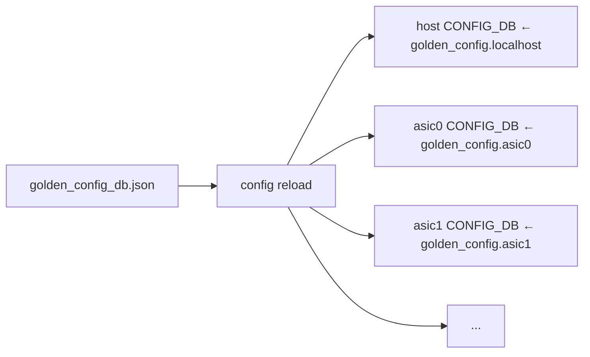
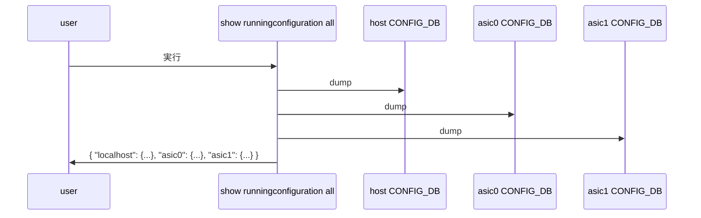

<!-- topics-tip -->
!!! tip "Topics で読み物として読む"
    この HLD は実装詳細を含みます。機能の概念・設定・運用を読み物として読みたい場合は [Topics 12 章: Multi-ASIC / VoQ / Chassis](../topics/12-multi-asic-voq/index.md) を参照。
<!-- /topics-tip -->

!!! success "裏取りステータス: Code-verified"
    sonic-utilities `config/main.py` L99 で `DEFAULT_GOLDEN_CONFIG_DB_FILE = '/etc/sonic/golden_config_db.json'` 定義、L2520 で `config reload` 内から `config override-config-table <golden>` を呼ぶ経路、L2580-2620 の `override_config_table` 実装で `multi_asic.is_multi_asic()` のとき `HOST_NAMESPACE` (= "localhost") キーを host CONFIG_DB に、各 namespace キーを ASIC CONFIG_DB に振り分ける処理を確認。L1548-1549 で `localhost` / `asicN` 階層への serialize、L1630-1631 で逆向きに `asic_name = HOST_NAMESPACE if ns == DEFAULT_NAMESPACE else ns` で各 ASIC config を取り出す経路を確認。L1917-1965 の `apply_patch` で `--parallel` で各 ASIC に並列適用、`_gcu_apply_patch_from_file` ベースの実装を確認。L2341-2352 で `load_minigraph --override_config -p <golden_config_path>` 経路、L2520 で reload 経由の override も確認（verified at: 2026-05-09）。

# multi-ASIC 用 Golden Config 単一 JSON フォーマット（`localhost` / `asic0` / `asic1` ...）

## 概要

[SONiC](../reference/glossary.md#term-sonic) は従来 minigraph を設定の真実の相としており、multi-[ASIC](../reference/glossary.md#term-asic) 機でも **1 ファイルの minigraph** を解釈してホスト + 各 ASIC の `CONFIG_DB` を生成していた。将来的に minigraph は廃止され、Network Device Management (NDM) チームが生成する **Golden Config** が新しい真実の相となる予定[^1]。

問題: 単一 ASIC 機の Golden Config 流通 workflow は確立しているが、multi-ASIC 用の **「1 ファイルでホスト + 全 ASIC を表現するフォーマット」** が未定義であった。本 [HLD](../reference/glossary.md#term-hld) は **既存 minigraph と同じ「1 ファイル投入」運用を Golden Config でも踏襲** するため、JSON スキーマと関連 CLI の挙動を定義する[^1]。

## 動作仕様

### スキーマ

最上位に **`localhost`（ホスト）と `asic0`, `asic1`, ...（各 ASIC）** を key として置き、その下にこれまでの `CONFIG_DB` 表現を入れる[^1]:

```json
{
  "localhost": {
    "FEATURE":   { ... },
    "ACL_TABLE": { ... }
  },
  "asic0": {
    "FEATURE":   { ... },
    "ACL_TABLE": { ... }
  },
  "asic1": { ... }
}
```

### 要件 (関連 CLI)

| CLI | 期待される multi-ASIC Golden Config 対応 |
|-----|--------------------|
| `config reload <file>` | Golden Config 1 ファイルを host + 全 ASIC の各 `CONFIG_DB` に分配ロード |
| `config override-config-table` | 同形式での override |
| `show runningconfiguration all` | host / 各 ASIC を 1 つの JSON として上記フォーマットで表示 |
| `config apply-patch` | JSON Patch (RFC6902) を `/<asic>/<table>/...` パスで指定可能に |
| `config save` | 全設定を 1 ファイル Golden Config 形式で保存 |

### `config reload <file>`

新たに **単一 Golden Config ファイル** での reload を追加[^1]:

| 機能 | 単一 ASIC | multi-ASIC（既存） | multi-ASIC（追加） |
|------|----------|------------------|------------------|
| `config reload` | `/etc/sonic/config_db.json` を reload | `config_db.json + config_db{N}.json` を reload | - |
| `config reload tmp_config_db.json` | 指定単一ファイル | カンマ区切り N 個 | **`config reload golden_config_db.json` で 1 ファイルを host + 全 ASIC に展開** |



### `config override`

`config override-config-table` の multi-ASIC 対応[^1]（PR: [sonic-utilities](../reference/glossary.md#term-sonic-utilities)#2738）。例: `MACSEC_PROFILE` を `localhost` で空 `{}`、`asic0` / `asic1` で値ありとした Golden Config:

```json
{
  "localhost": { "MACSEC_PROFILE": {} },
  "asic0":     { "MACSEC_PROFILE": { "entry": {"k":"v"} } },
  "asic1":     { "MACSEC_PROFILE": { "entry": {"k":"v"} } }
}
```

override 後の各 [CONFIG_DB](../reference/glossary.md#term-config_db)[^1]:

| ノード | `MACSEC_PROFILE` の状態 |
|--------|------------------------|
| host | **テーブル削除**（空 JSON はテーブル除去を意味する） |
| asic0 | golden config の値で **完全置換** |
| asic1 | golden config の値で **完全置換** |

### `config apply-patch`

JSON Patch (RFC6902) のパスに **`/<asic>/<table>/...`** を含められるようにする[^1]:

```json
[
  { "op": "replace", "path": "/asic1/MACSEC_PROFILE/entry/k", "value": "value" },
  { "op": "replace", "path": "/asic0/MACSEC_PROFILE/entry/k", "value": "value" }
]
```

各 op を host / ASIC ループで対応 CONFIG_DB に適用する。

### `show runningconfiguration all`

すべての CONFIG_DB を集約して上記スキーマで表示する。



### `config save`

既存挙動（N 個のファイルに分散保存）も維持しつつ、**`config save all_config_db.json`** で 1 ファイル Golden Config として保存可能[^1]:

| 形式 | 動作 |
|------|------|
| `config save` (multi-ASIC) | `config_db.json` + `config_db0.json` ... |
| `config save tmp_*.json,tmp_*0.json,...` | カンマ区切り指定 |
| `config save all_config_db.json` | **1 ファイル Golden Config** で保存 |

## 設定

### 関連する CONFIG_DB

スキーマ自体には変更なし。各 ASIC / host の **既存 CONFIG_DB を 1 階層上で集約** するのは **ファイル形式上の表現** であり、[Redis](../reference/glossary.md#term-redis) インスタンス自体は別物（host 側の DB と各 ASIC namespace 側の DB）として残る[^1]。

### 関連する CLI

| Command | 用途 |
|---------|------|
| `config reload <golden_config.json>` | 1 ファイル Golden Config を全 CONFIG_DB に展開 |
| `config override-config-table <file>` | Golden Config で table 単位 override |
| `config apply-patch <patch.json>` | JSON Patch で `/<asic>/<table>/...` を指定して動的更新 |
| `config save <out.json>` | 1 ファイル Golden Config として保存 |
| `show runningconfiguration all` | host + 全 ASIC を Golden Config 形式で表示 |

### 設定例

```bash
# Golden Config を一発でロード
config reload /etc/sonic/golden_config_db.json

# 動的 patch
cat > /tmp/patch.json <<'EOF'
[
 {"op":"replace","path":"/asic0/MACSEC_PROFILE/entry/k","value":"value"},
 {"op":"replace","path":"/asic1/MACSEC_PROFILE/entry/k","value":"value"}
]
EOF
config apply-patch /tmp/patch.json

# 全 ASIC を統合した出力で保存
config save /tmp/all_config.json
```

## 制限事項

- 旧来の **N 個のファイル運用と Golden Config 1 ファイル運用の併存** は CLI 側で受理形式を判別して処理する設計（境界条件のテストが必要）
- **[YANG](../reference/glossary.md#term-yang) モデルには変更を加えない**[^1]。1 階層上の `localhost` / `asicN` はファイル表現のみ、YANG 検証は各 ASIC / host 単位で行う
- `config override` で **空 JSON `{}` は table 削除** を意味する仕様[^1]。誤って空にすると意図せぬ削除が起きる
- minigraph 廃止が前提だが、過渡期は両立する。minigraph と Golden Config が混在した場合の優先順位は別途設計
- 各 ASIC の CONFIG_DB は **namespace 内 redis インスタンス**。Golden Config からの分配は CLI 側で各 namespace に対応する Redis を切り替える必要

## 干渉する機能

- **`sonic-utilities` の `config` / `show` 各サブコマンド**: 上記すべてが multi-ASIC 用に拡張対象
- **`hostcfgd` / `bgpcfgd` 等の per-namespace daemon**: ASIC namespace ごとの設定反映を担う
- **`HwProxy` / NDM の Golden Config 配信パイプライン**: 入力供給側
- **既存 minigraph parser**: 並列に存在し、minigraph → Golden Config 移行までは両者が動く
- **`SONiC YANG models`**: 変更不要[^1]

## トラブルシューティング

- `config reload golden_config_db.json` で一部 ASIC の設定が空 → JSON の `asicN` キーが正しい index で並んでいるか確認
- `config override` で table が消える → 空 JSON `{}` を入れていないか確認
- `config apply-patch` のパスが効かない → `/<asic>/...` のパスフォーマットを使っているか確認
- `show runningconfiguration all` が host のみ → multi-ASIC 拡張版 sonic-utilities が入っているか確認

### コマンド例

multi-ASIC / VoQ chassis の各 namespace 状態を確認する。

```bash
# multi-ASIC / VoQ chassis
show chassis modules status
show platform summary
sudo ip netns list
for ns in $(sudo ip netns list | awk '{print $1}'); do
  echo "== $ns =="
  sudo ip netns exec "$ns" show interfaces status | head
done
```

## 参考リンク

- [Topics: Multi-ASIC / VOQ](../topics/12-multi-asic-voq/index.md)
- [Runbook: Multi-ASIC namespace](../reference/runbooks/multi-asic-namespace.md)
- [Topics: SWSS / SAI / Redis](../topics/20-swss-sai-redis/index.md)

## 引用元

[^1]: `sonic-net/SONiC` `doc/multi_asic/DB_Design_for_multi_asic.md` @ `49bab5b5ff0e924f1ea52b3d9db0dfa4191a7c06`

<!-- concerns hint:
- config reload が単一 Golden Config ファイル (localhost + asicN 階層) を host / 各 ASIC namespace の CONFIG_DB に分配する実装の取り込み確認
- config override-config-table の multi-ASIC 対応 (PR sonic-utilities#2738) 取り込み確認
- config apply-patch のパスに /<asic>/... を許容する変更の取り込み確認
- show runningconfiguration all の集約出力 (Golden Config フォーマット) 実装確認
- config save <single_file> での 1 ファイル保存実装確認
- minigraph と Golden Config の過渡期の優先順位や両立シナリオの最終決定状況確認
-->

<!-- topics-back-ref -->
## 関連 Topics

- [Topics: Multi-ASIC / VOQ Chassis](../topics/12-multi-asic-voq/index.md)

<!-- /topics-back-ref -->


## 参考リンク

本ページに関連する参照ドキュメント:

- [`MACSEC_PROFILE` CONFIG_DB スキーマ](../reference/config-db/macsec-profile.md)
- [`VOQ_INBAND_INTERFACE` CONFIG_DB スキーマ](../reference/config-db/voq-inband-interface.md)
- [`DEVICE_METADATA` CONFIG_DB スキーマ](../reference/config-db/device-metadata.md)
- [`sonic-port` YANG モジュール](../reference/yang/sonic-port.md)

<!-- augmented-links: v1 -->

<!-- glossary-links-injected: ec18b66e3507 -->
