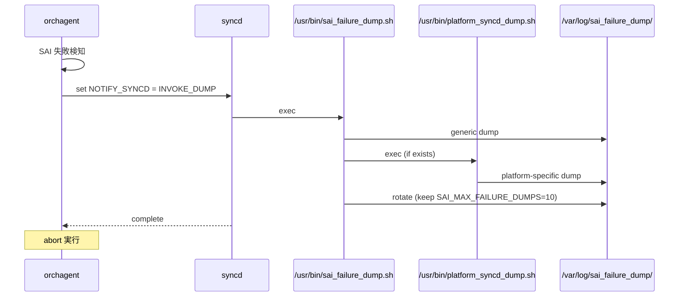
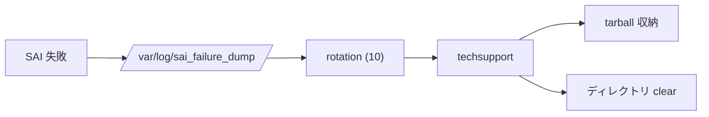

<!-- topics-tip -->
!!! tip "Topics で読み物として読む"
    この HLD は実装詳細を含みます。機能の概念・設定・運用を読み物として読みたい場合は [Topics 14 章: Platform / Port / Optics](../topics/14-platform-port-optics/index.md) を参照。
<!-- /topics-tip -->

!!! danger "裏取りステータス: discrepancy-found（汎用スクリプト名がリネーム）"
    `SAI_REDIS_NOTIFY_SYNCD_INVOKE_DUMP` 列挙値、`/var/log/sai_failure_dump/`、`SAI_MAX_FAILURE_DUMPS=10`、`platform_syncd_dump.sh` の存在は実装と一致（`sonic-sairedis/syncd/Syncd.cpp:4493`、`syncd/scripts/sai_failure_dump.sh:8/10/12`）。**ただし HLD の `/usr/bin/syncd_dump.sh` は実装では `/usr/bin/sai_failure_dump.sh` にリネーム**（`Syncd.cpp:45` / `tests.cpp:46` の `SAI_FAILURE_DUMP_SCRIPT`）。HLD 名は当時のもの、現行コードは別名（verified at: 2026-05-09）。

# SAI 失敗時の dump 取得（syncd_dump.sh / SAI_REDIS_NOTIFY_SYNCD_INVOKE_DUMP）

## なぜ必要か

[SAI](../reference/glossary.md#term-sai) 呼び出しが失敗すると `orchagent` は **abort** し、[syncd](../reference/glossary.md#term-syncd) を含む各 service が再起動される。この再起動で **失敗時点の SAI / SDK / 下位レイヤ状態が失われ**、原因解析ができなくなる[^1]。

本機能は SAI 失敗を検知した瞬間に、`orchagent` が **abort 前に syncd へ dump を依頼** し、結果をホストから見える `/var/log/sai_failure_dump/` に保存する。後で `techsupport` を取ると自動回収される[^1]。

## 全体シーケンス



### 起動の手順

実装の中核は **新規列挙値 `SAI_REDIS_NOTIFY_SYNCD_INVOKE_DUMP`**[^1]:

1. `orchagent` が SAI 失敗を検知
2. abort 直前に `SAI_REDIS_SWITCH_ATTR_NOTIFY_SYNCD = SAI_REDIS_NOTIFY_SYNCD_INVOKE_DUMP` を set
3. `syncd` が受け、汎用スクリプト（[HLD](../reference/glossary.md#term-hld) は `syncd_dump.sh` / **実装は `sai_failure_dump.sh`**）を実行[^1]
4. 汎用は `platform_syncd_dump.sh` の有無を確認、あれば呼ぶ[^1]
5. `/var/log/sai_failure_dump/` をローテーション、abort 続行

| スクリプト | 役割 |
|------------|------|
| 汎用（`/usr/bin/sai_failure_dump.sh`）| 起点。platform スクリプトの有無を確認 → 呼出し → rotation |
| `/usr/bin/platform_syncd_dump.sh` | ベンダ提供（optional）。SDK / register dump |

### 出力と rotation

- **`/var/log/sai_failure_dump/`** に書き出し（syncd docker から host bind mount）
- **1 dump = 1 ファイル** で rotation を単純化[^1]
- 上限 `SAI_MAX_FAILURE_DUMPS` 既定 **10**。platform スクリプトで上書き可能[^1]

### techsupport との連携

`techsupport` 起動時に本ディレクトリの dump を **アーカイブに収納 → クリア**[^1]:



dump はあくまで **失敗時点の証拠保全**。[orchagent](../reference/glossary.md#term-orchagent) の abort 自体は防がない[^1]。

## 設定 / CLI / YANG

新規 config / show / [YANG](../reference/glossary.md#term-yang) / DB Migrator の追加は **無し**[^1]。warm/fast boot にも影響なし。SAI 失敗時にだけ動く “見えない安全網”。

```bash
ls -l /var/log/sai_failure_dump/         # 直近 dump 確認
ls -la /usr/bin/sai_failure_dump.sh /usr/bin/platform_syncd_dump.sh
grep SAI_FAILURE_DUMP /var/log/syslog    # 発火履歴
sudo show techsupport                    # dump も自動取り込み
```

## 制限事項

- abort 自体は止められない[^1]
- dump は **同期実行**。`platform_syncd_dump.sh` が長いと復旧時間に影響
- ベンダが platform スクリプトを提供しない場合は **汎用 dump のみ**[^1]
- rotation 上限 10 → 頻発時は古いものから消える[^1]
- orchagent 以外で起きる SAI 失敗（例: counter polling 失敗）の扱いは HLD で未明示

## 干渉する機能

- **orchagent の SAI 失敗ハンドリング**: abort 前に 1 ステップ追加
- **syncd の `NOTIFY_SYNCD` ハンドラ**: 既存 warm restart 等と同じ仕組みに `INVOKE_DUMP` 分岐追加
- **techsupport**: 本 dump を **収集対象に含める** 必要
- **syncd docker の volume mount**: ホストから見えるかは `-v` 指定に依存

## トラブルシューティング

- 失敗が起きたのに dump が無い → orchagent が `INVOKE_DUMP` パスを通らずに abort した可能性
- ベンダ情報が取れない → `platform_syncd_dump.sh` が docker に同梱されていない
- 古い dump が消える → `SAI_MAX_FAILURE_DUMPS` を platform スクリプトで上書き
- techsupport に同梱されない → techsupport 側収集ロジックが本ディレクトリを対象にしているか確認
- abort が遅い → `platform_syncd_dump.sh` の処理時間を計測

<!-- diff-admonition -->
!!! diff "HLD と実装の差分"
    | 項目 | HLD 表記 | 実装 |
    |---|---|---|
    | 汎用スクリプト | `/usr/bin/syncd_dump.sh` | **`/usr/bin/sai_failure_dump.sh`**（`Syncd.cpp:45` の `SAI_FAILURE_DUMP_SCRIPT`）|
    | 出力先 | `/var/log/sai_failure_dump/` | 一致 |
    | rotation 上限 | `SAI_MAX_FAILURE_DUMPS=10` | 一致 |
    | platform スクリプト | `/usr/bin/platform_syncd_dump.sh` | 一致 |
    | ディスパッチ | `SAI_REDIS_NOTIFY_SYNCD_INVOKE_DUMP` 経由 | 一致（`Syncd.cpp:4493`）|

    **読者への影響**:

    - 古いランブックで「`/usr/bin/syncd_dump.sh` の有無」を見るスクリプトは **常に存在しない判定** になる
    - 監視で「汎用 dump スクリプトの最終更新時刻」を見るケースは参照パス更新が必要
    - HLD 由来手順書は `syncd_dump.sh` を `sai_failure_dump.sh` に置換することを推奨

    > 分類: `monitor: evolved_beyond_hld` — HLD 概念は取り込み済みだが、フィールド/パス名が実装で進化。実装側を正として読み替える必要。

    ### 関連 GitHub Issue / PR

    - スクリプト改名は dump-on-sai-failure 取り込み PR で同時実施。HLD 文書側は古い名前のまま。HLD と直接紐づくトラッキング Issue / PR は未確認。
<!-- /diff-admonition -->

<!-- next-action -->

### コマンド例

SAI / SDK のエラーログと dump を確認する。

```bash
# SAI failure / SDK health
docker logs syncd 2>&1 | grep -iE 'sai_status|fail|error' | tail
ls -lt /var/dump/ | head
show techsupport --silent --since '1 hour ago'
redis-cli -n 6 keys 'ASIC_SDK_HEALTH_EVENT*'
```

## このページを読んだ後の次アクション

!!! tip "読み手向け"
    - **本機能を実運用で使う場合**: 実装は存在するが本 HLD の記述と乖離。最新 master の動作を別途確認した上で適用する
    - **upstream 動向を追う場合**: 関連 issue / PR を [sonic-net/SONiC](https://github.com/sonic-net/SONiC) で検索（HLD タイトル / CONFIG_DB テーブル名 / Orch クラス名で grep するのが速い）
    - **代替手段 / 関連 reference**: 本ページの frontmatter `related` が空のため、[Reference 索引](../reference/index.md) から関連テーブル / CLI / YANG を辿る

!!! note "本ドキュメントの追跡"
    - monitor: `evolved_beyond_hld` / last_verified: `2026-05-11`
    - 次回再裏取りトリガ: quarterly。一覧は [discrepancy-index](../reference/verification/discrepancy-index.md) を参照（運用詳細は repo の `meta/discrepancy-operations.md`）

<!-- /next-action -->

## 関連 Topics

- [20-swss-sai-redis](../topics/20-swss-sai-redis/index.md): SAI / sairedis / syncd 全般
- [11-reboot](../topics/11-reboot/index.md): abort 後の再起動経路

## 確認コマンド

```bash
# SAI failure dump 機能の有効状態
sonic-db-cli CONFIG_DB HGETALL 'DEVICE_METADATA|localhost' | grep -i sai_fail
sonic-db-cli CONFIG_DB KEYS 'SUPPRESS_ASIC_SDK_HEALTH_EVENT|*'

# dump 出力先
ls -lt /var/dump/ | head
ls -lt /var/log/ | grep -i sai

# dump 生成トリガとなった SAI status code
docker exec syncd grep -i 'dump' /var/log/syslog | tail
```

## トラブルシュート

- dump 機能が無効になっている platform では HLD どおり動作しない。`/etc/sonic/sonic_version.yml` のベンダー platform 名を確認のうえ SAI ベンダーに有効化を依頼。
- dump が大量生成されてディスクを圧迫する場合は `logrotate` 設定 (`/etc/logrotate.d/`) で世代管理する。
- dump 採取後は [CONFIG_DB](../reference/glossary.md#term-config_db) / [APPL_DB](../reference/glossary.md#term-appl_db) / [ASIC_DB](../reference/glossary.md#term-asic_db) の同タイムスタンプ snapshot (`show techsupport`) と一緒に保管するとベンダー解析が早い。

## 引用元

[^1]: `sonic-net/SONiC` `doc/SAI_failure_handling/dump_on_sai_failure.md` @ `49bab5b5ff0e924f1ea52b3d9db0dfa4191a7c06`

<!-- glossary-links-injected: f18034062bd1 -->
