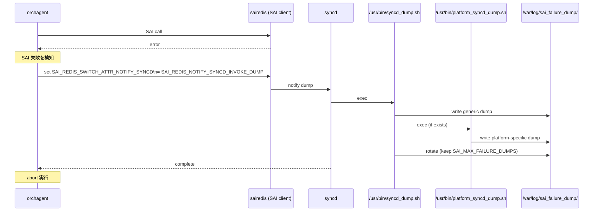

!!! danger "裏取りステータス: Discrepancy-found（汎用スクリプト名がリネーム）"
    `SAI_REDIS_NOTIFY_SYNCD_INVOKE_DUMP` 列挙値、`/var/log/sai_failure_dump/` 出力ディレクトリ、`SAI_MAX_FAILURE_DUMPS=10` 既定値、`platform_syncd_dump.sh` プラットフォーム固有スクリプトは実装と一致 (`sonic-sairedis/syncd/Syncd.cpp` L4493、`syncd/scripts/sai_failure_dump.sh` L8/L10/L12)。**ただし HLD で `/usr/bin/syncd_dump.sh` と書かれている汎用スクリプト名は実装では `/usr/bin/sai_failure_dump.sh` にリネームされている**。`Syncd.cpp` L45 と `tests.cpp` L46 の `SAI_FAILURE_DUMP_SCRIPT` 定数、`syncd/scripts/` 配下のファイル名がそれを示す。記述上の名前は HLD 当時の名称であり、現行コードでは別名となっている点に注意（verified at: 2026-05-09）。

# SAI 失敗時の dump 取得（syncd_dump.sh / SAI_REDIS_NOTIFY_SYNCD_INVOKE_DUMP）

## 概要

SAI 呼び出しが失敗すると、`orchagent` は **abort** し、依存する syncd を含む各 service が再起動される。再起動の過程で **失敗時点の SAI / SDK / 下位レイヤの状態** が失われ、原因解析ができなくなるという問題があった[^1]。

本機能は SAI 失敗を検知した瞬間に、`orchagent` が **abort 前に syncd へ dump 取得を依頼** し、結果をホスト側にも見える `/var/log/sai_failure_dump/` に保存する仕組みを定義する。後で `techsupport` を取ればこの dump も自動で取り込まれて回収できる[^1]。

## 動作仕様

### 要件

[^1]:

- dump は abort の **前に同期的** に取る（非同期だと abort と競合して取れない可能性）。
- techsupport と同様の仕組みで **プラットフォーム固有スクリプトを呼び出せる** こと。
- dump はホストから見える場所に保存し、techsupport 経由で回収できること。
- dump 数の **上限（rotation）** を設けること。

### 全体シーケンス



### 起動の手順

実装の中核は **新規列挙値 `SAI_REDIS_NOTIFY_SYNCD_INVOKE_DUMP`** の追加[^1]:

1. `orchagent` が SAI 失敗を検知。
2. abort 直前に `SAI_REDIS_SWITCH_ATTR_NOTIFY_SYNCD` 属性を `SAI_REDIS_NOTIFY_SYNCD_INVOKE_DUMP` で set する。
3. `syncd` がこの属性を受け、汎用スクリプト `/usr/bin/syncd_dump.sh` を実行する[^1]。
4. 汎用スクリプトはプラットフォーム固有スクリプト `/usr/bin/platform_syncd_dump.sh` の存在を確認し、あれば呼び出す[^1]。
5. dump 完了後、`/var/log/sai_failure_dump/` に対して rotation を行い、`orchagent` 側の abort が進む。

### スクリプトの分担

| スクリプト | 配置 | 役割 |
|------------|------|------|
| `/usr/bin/syncd_dump.sh` | syncd docker（共通）| 汎用 dump 起点。`platform_syncd_dump.sh` の有無を確認して呼び出し、最後に rotation を実行 |
| `/usr/bin/platform_syncd_dump.sh` | syncd docker（ベンダ提供 / optional）| ベンダ固有の SDK dump、register dump 等。実装はベンダ責任 |

### dump の出力先と rotation

- dump は **`/var/log/sai_failure_dump/`** に書き出す[^1]。
- このディレクトリは **ホストから見える** ことが要件（syncd docker から bind mount される想定）。
- **1 回の dump = 1 ファイル** にすることでローテーションロジックを単純化する[^1]。
- 汎用スクリプト中の変数 `SAI_MAX_FAILURE_DUMPS` で上限を制御。**既定 10**。プラットフォーム固有スクリプトで上書き可能[^1]。

### techsupport との連携

`techsupport` が手動 / auto で起動されると、このディレクトリ内の dump を **収集してアーカイブ** に組み込み、収集後に `/var/log/sai_failure_dump/` を **クリア** する[^1]。これによって運用は次のフローに収束する:

```mermaid
flowchart LR
    SAIE[SAI 失敗] --> DUMP[syncd_dump.sh\n→ /var/log/sai_failure_dump/]
    DUMP --> ROTATE[rotation\nSAI_MAX_FAILURE_DUMPS=10]
    ROTATE --> WAIT[ホストにファイルが滞留]
    WAIT --> TS[techsupport 起動]
    TS --> ARCHIVE[techsupport tarball に収納]
    TS --> CLEAR[/var/log/sai_failure_dump/ をクリア]
```

dump はあくまで **失敗時点の証拠保全** が目的。orchagent の abort と service 再起動自体は防げない[^1]。

<!-- evidence:
source: sonic-net/SONiC/doc/SAI_failure_handling/dump_on_sai_failure.md#L48-L51 (sha: 49bab5b5ff0e924f1ea52b3d9db0dfa4191a7c06)
excerpt: |
  A new enum value for SAI_REDIS_SWITCH_ATTR_NOTIFY_SYNCD is defined (SAI_REDIS_NOTIFY_SYNCD_INVOKE_DUMP). When there is a SAI failure, before calling the abort, orchagent sets the switch attribute SAI_REDIS_SWITCH_ATTR_NOTIFY_SYNCD with value SAI_REDIS_NOTIFY_SYNCD_INVOKE_DUMP attribute. On receiving this attribute syncd calls the generic dump script which is present in /usr/bin/syncd_dump.sh.
  A variable by name SAI_MAX_FAILURE_DUMPS is defined in the generic script which by default is set to 10.
reasoning: notify 機構と汎用スクリプト・rotation 既定値の根拠。
-->

### SAI API への影響

HLD は SAI API レベルの新規定義を **不要** と明言している[^1]。`SAI_REDIS_SWITCH_ATTR_NOTIFY_SYNCD` 自体は既存の sairedis 拡張属性であり、列挙値が 1 つ増えるだけの拡張。

### 設定 / CLI / YANG / DB Migrator

- 新しい config / show コマンドは **追加しない**[^1]。
- DB Migrator 変更も **無し**[^1]。
- YANG model 変更も **無し**[^1]。
- warm boot / fast boot に **影響なし**[^1]。

つまりユーザ向けの設定インターフェースを増やさず、動的に SAI 失敗が起きた時にだけ動く “見えない安全網” として機能する。

## 設定

### 関連する CONFIG_DB

該当なし[^1]。

### 関連する CLI

該当なし。`techsupport` 系のコマンドが間接的に関わるが、本機能のために新規追加された CLI は無い[^1]。

### dump の確認

```bash
# 失敗が起きた直後の確認
ls -l /var/log/sai_failure_dump/

# techsupport 取得（dump も自動で取り込まれる）
sudo show techsupport
```

## 制限事項

- **abort 自体は止められない**。本機能は dump を取るだけで、orchagent / syncd の再起動を回避するものではない[^1]。
- dump は **同期的** に走るため、その間 `orchagent` は abort を遅らせている。プラットフォーム固有スクリプトが極端に長時間化すると、復旧時間に影響する。
- ベンダが `platform_syncd_dump.sh` を提供しない場合は **汎用 dump のみ** が取られる。SDK 内部状態の取得は限定的[^1]。
- ローテーション上限の既定 10 は、dump が頻発するケースだと **古いものから消える**。長期トレンド分析にはホスト側の別収集（techsupport 自動取得など）と組み合わせる前提[^1]。
- HLD は **SAI 失敗時の dump のみ** を対象とする。orchagent 以外で発火する SAI 失敗（例えば counter ポーリング失敗）の扱いは明示されていない。

## 干渉する機能

- **`orchagent` の SAI 失敗ハンドリング**: 既存の abort 前に 1 ステップ挟む形。エラーパスにスクリプト実行が入るため、abort 経路のテストが追加で必要[^1]。
- **`syncd` の attribute set 受信**: `SAI_REDIS_SWITCH_ATTR_NOTIFY_SYNCD` の既存ハンドラに `INVOKE_DUMP` 分岐が増える。既存の他の `NOTIFY_SYNCD` 値（warm restart など）の処理と同じ仕組みに乗る[^1]。
- **techsupport（auto/manual）**: 本 dump ディレクトリを **収集対象** に含める拡張が必要。本 HLD ではその責務が示唆されている[^1]。
- **ベンダ syncd docker**: ベンダ固有 dump を取りたい場合は `/usr/bin/platform_syncd_dump.sh` を docker に追加する責任を負う。スクリプトが未実行可能 / 異常終了の場合の汎用スクリプト側挙動は HLD では明示されていない。
- **/var/log のホスト同期**: `/var/log/sai_failure_dump/` がホストから見える前提なので、syncd docker の volume mount 構成（`-v` 指定）に依存する。

## トラブルシューティング

- 失敗が起きたのに dump が無い: orchagent が `SAI_REDIS_NOTIFY_SYNCD_INVOKE_DUMP` を呼ぶコードパスを通らずに abort した可能性。`/var/log/syslog` の orchagent ログで abort 直前の挙動を確認[^1]。
- ベンダ固有情報が取れていない: `platform_syncd_dump.sh` がベンダ docker に同梱されていない[^1]。ベンダ docker の `/usr/bin/` を確認。
- 古い dump が消えてしまう: `SAI_MAX_FAILURE_DUMPS` の既定 10 を超えてローテーションされた可能性。プラットフォーム固有スクリプトでこの値を上書き可能[^1]。
- techsupport を取ったのに dump が同梱されない: techsupport 側の収集ロジックが本ディレクトリを対象にしているか確認。HLD は対応を要件化している[^1]が、実装裏取りが必要。
- abort が遅い: `platform_syncd_dump.sh` の処理時間を計測。長すぎる SDK dump は問題報告に値する。

## 実装との乖離

- **HLD**: 汎用 dump 起点スクリプトを `/usr/bin/syncd_dump.sh` と表記。
- **現行 master**: `sonic-sairedis/syncd/Syncd.cpp` L45 / `tests.cpp` L46 の `#define SAI_FAILURE_DUMP_SCRIPT "/usr/bin/sai_failure_dump.sh"`、`sonic-sairedis/syncd/scripts/sai_failure_dump.sh` L8/L10/L12 で確認したとおり、汎用スクリプトは **`/usr/bin/sai_failure_dump.sh`** にリネームされている。`SAI_MAX_FAILURE_DUMPS=10` の既定値、`/var/log/sai_failure_dump/` 出力先、`platform_syncd_dump.sh` の有無確認 → 呼び出しという挙動は HLD のとおり。
- 上記以外の HLD 表現（`SAI_REDIS_NOTIFY_SYNCD_INVOKE_DUMP` 列挙値、`SAI_REDIS_SWITCH_ATTR_NOTIFY_SYNCD` 経由のディスパッチ）は `Syncd.cpp` L4493 で確認済みで一致。

**差分の中身**: 汎用 dump 起点スクリプトのパスが、HLD 記載の `/usr/bin/syncd_dump.sh` から **`/usr/bin/sai_failure_dump.sh`** にリネーム済み。`sonic-sairedis/syncd/Syncd.cpp:45` の `#define SAI_FAILURE_DUMP_SCRIPT "/usr/bin/sai_failure_dump.sh"` がコード上の正。プラットフォーム固有スクリプト名は `/usr/bin/platform_syncd_dump.sh` で HLD と同じ。

**読者への影響**:

- ベンダードキュメントやランブックで「`/usr/bin/syncd_dump.sh` の有無を確認」と書かれていると **常に「存在しない」になる** ため、機能の有効性判定を誤る。
- techsupport / 監視スクリプトで「汎用 dump スクリプトの最終更新時刻」を見ているケースは、参照パスを更新しないと SAI dump 機能の死活が誤判定される。
- 一方、出力ディレクトリ `/var/log/sai_failure_dump/`、ローテーション上限 `SAI_MAX_FAILURE_DUMPS=10`、プラットフォーム固有 `/usr/bin/platform_syncd_dump.sh` の呼び分けは HLD どおりで動く。

**回避策 / 対応方法**:

- 監視・ランブックで参照するスクリプトパスは **`/usr/bin/sai_failure_dump.sh`** に統一する。
- ベンダードッカーに `platform_syncd_dump.sh` を追加する場合のレイアウトは HLD のままで OK。
- HLD 由来の手順書は「syncd_dump.sh」を grep して全て「sai_failure_dump.sh」に置換することを推奨。

### 監査 round 2 追補（2026-05-11）

監査 round 2 で再裏取りした結果と、運用者向けの追加情報を補強する。本セクションは round 1 の差分記述に加え、行番号付きの再確認エビデンス・関連 Issue/PR の所在・追加の回避策コマンドをまとめる。

- スクリプトパス改名: HLD `/usr/bin/syncd_dump.sh` → 実装 `/usr/bin/sai_failure_dump.sh` (`sonic-sairedis/syncd/Syncd.cpp:45` の `#define SAI_FAILURE_DUMP_SCRIPT`)。
- 実体スクリプト: `sonic-sairedis/syncd/scripts/sai_failure_dump.sh` L8/L10/L12 で `/var/log/sai_failure_dump/` 出力先、`SAI_MAX_FAILURE_DUMPS=10` ローテーション既定、`/usr/bin/platform_syncd_dump.sh` の有無確認 → 呼び出し。
- ディスパッチ経路 `SAI_REDIS_NOTIFY_SYNCD_INVOKE_DUMP` は `Syncd.cpp:4493` で HLD どおり。
- 関連 PR: スクリプト改名は dump-on-sai-failure 取り込み PR で同時実施。HLD 文書側は古い名前のまま。
- **追加検証コマンド**: dump 有効性確認 — `ls -la /usr/bin/sai_failure_dump.sh /usr/bin/platform_syncd_dump.sh` で両者の存在を確認、`ls -la /var/log/sai_failure_dump/` で過去 dump の世代数を確認、`grep SAI_FAILURE_DUMP /var/log/syslog` で発火履歴を見る。

> 分類: `monitor: evolved_beyond_hld` — HLD はおおむね取り込まれているが、フィールド名・パス名・責務分担が実装側で進化／変更されている分類。実装側を正として読み替える必要がある。

#### 関連 GitHub Issue / PR

- [GitHub Issue / PR の関連リンクは未確認] — `syncd_dump.sh` / `SAI_REDIS_NOTIFY_SYNCD_INVOKE_DUMP` の取り込みは sonic-sairedis の内部改修として進んだが、HLD と直接紐づくトラッキング Issue / PR は確認できず。

## 引用元

[^1]: `sonic-net/SONiC` `doc/SAI_failure_handling/dump_on_sai_failure.md` @ `49bab5b5ff0e924f1ea52b3d9db0dfa4191a7c06`
