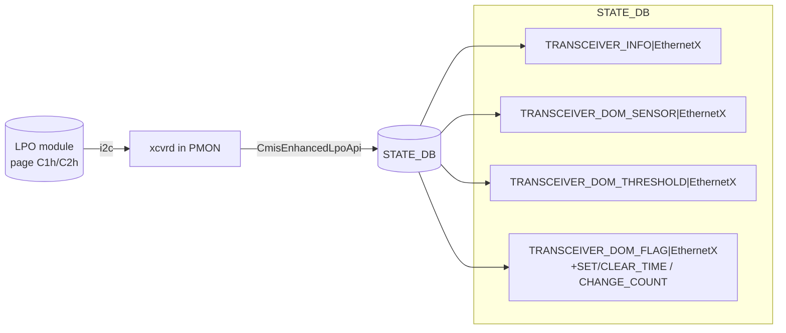

<!-- topics-tip -->
!!! tip "Topics で読み物として読む"
    この HLD は実装詳細を含みます。機能の概念・設定・運用を読み物として読みたい場合は [Topics 14 章: Platform / Port / Optics](../topics/14-platform-port-optics/index.md) を参照。
<!-- /topics-tip -->

!!! warning "裏取りステータス: HLD-only"
    HLD は 2025 年 2 月 (Rev 1.0) Arista 提案。`CmisEnhancedLpoApi` クラスと `xcvr_api_factory.py` の vendor 分岐、`TRANSCEIVER_INFO` / `TRANSCEIVER_DOM_SENSOR` / `TRANSCEIVER_DOM_THRESHOLD` / `TRANSCEIVER_DOM_FLAG*` への新キー追加の現行実装は未裏取り。

# 拡張 LPO デバッグレジスタ（VMA / OMA per-lane モニタを Redis に公開）

## 概要

LPO (Linear Pluggable Optic) は DSP を持たない optic。host 側 [SerDes](../reference/glossary.md#term-serdes) の電気信号が直接モジュレータを駆動するため、debug には **TX 側 VMA**（電気振幅）と **RX 側 OMA**（光振幅）の監視が決定的。本 [HLD](../reference/glossary.md#term-hld) は CMIS LPO 上に **拡張デバッグレジスタ**を新設し、[SONiC](../reference/glossary.md#term-sonic) から [Redis](../reference/glossary.md#term-redis) に公開する設計[^1]。

## 動作仕様

### 拡張レジスタの所在[^1]

CMIS Page 01h Byte 195 = `0x4C` (`'L'`) でモジュールが拡張対応を宣言。Byte 196 で仕様バージョン。実体レジスタは Upper Page **C1h / C2h** に集約。Page 01h Byte 195 != 0x4C のモジュールは従来 CMIS 扱い。

### 監視項目（per 8 lane）

| カテゴリ | 主な register |
|---------|--------------|
| Polarity | `LPOTxPolarityInverted` / `LPORxPolarityInverted` |
| TX Host VMA | `LPOTxHostInputVMAMonAccuracySupported`、High/Low の Alarm/Warning **Threshold + Flag + Mask**、`LPOHostInputVMATx1..8` |
| RX Optical OMA | `LPORxInputOMAMonAccuracySupported`、High/Low の Alarm/Warning **Threshold + Flag + Mask**、`LPOInputOMARx1..8` |
| Tx 拡張 | `LPOTxOuterExtinctionRatioMax`（PAM4 OER 上限） |

VMA は 5 mV 刻みで 0〜1275 mV、OMA は 0.1 µW 刻みで 0〜6.5535 mW (≈ -40〜+8.2 dBm)[^1]。

### Redis への公開



各テーブルへの追加キー[^1]:

| テーブル | 追加 key |
|---------|---------|
| `TRANSCEIVER_INFO` | LPO[Tx,Rx]PolarityInverted、LPO[Tx,Rx]MonAccuracySupported、LPOTxOuterExtinctionRatioMax |
| `TRANSCEIVER_DOM_SENSOR` | LPOHostInputVMATx1-8、LPOInputOMARx1-8 |
| `TRANSCEIVER_DOM_THRESHOLD` | VMA / OMA の High/Low × Alarm/Warning Threshold |
| `TRANSCEIVER_DOM_FLAG` ほか | VMA / OMA の Alarm/Warning Flag（`SET_TIME` / `CLEAR_TIME` / `CHANGE_COUNT` 系のメタ table 込み） |

### `xcvr_api_factory` の vendor 分岐[^1]

```python
class CmisEnhancedLpoApi(CmisApi):
    def get_transceiver_info(self):
        x = super().get_transceiver_info(); x.update({...new keys...}); return x
    def get_transceiver_dom_real_value(self): ...
    def get_transceiver_status_flags(self): ...
    def get_transceiver_threshold_info(self): ...
```

`xcvr_api_factory.py._create_cmis_api()` に Arista 拡張 LPO 用の分岐を追加:

```python
elif vendor_name == 'Arista' and re.match(ARISTA_ENHANCED_LPO, vendor_pn):
    api = self._create_api(CmisEnhancedLpoCodes, CmisEnhancedLpoMemMap, CmisEnhancedLpoApi)
```

ファイル配置（`sonic-platform-common/sonic_platform_base/sonic_xcvr/`）[^1]:

| 種別 | path |
|------|------|
| Codes | `./codes/arista/cmis_enhanced_lpo.py` |
| Api | `./api/arista/cmis_enhanced_lpo.py` |
| MemMap | `./mem_maps/arista/cmis_enhanced_lpo.py` |

他モジュールベンダは Arista 実装を継承して上書きしてもよい[^1]。

## 制限事項

- 対象は **CMIS LPO のみ**。CMIS DSP 付き / coherent (C-CMIS) 等とは別 Api クラス
- レジスタの advertise バイト (Page 01h Byte 195) が `'L'` でないモジュールでは旧 CMIS 扱い
- VMA は 5 mV、OMA は 0.1 µW の量子化精度

## 干渉する機能

- **xcvrd / TRANSCEIVER_INFO**: 既存スキーマに新 key を追加。テレメトリ / [sonic-mgmt](../reference/glossary.md#term-sonic-mgmt) の telemetry テスト側の更新が必要
- **CmisApi / CCmisApi**: 同階層の sibling
- **vendor 個別 PN マッチ**: vendor が増えるほど factory 分岐が増える

## 引用元

[^1]: [sonic-net/SONiC doc/cmis-lpo-enhancement/cmis-lpo-enhancement.md @ 49bab5b](https://github.com/sonic-net/SONiC/blob/49bab5b5ff0e924f1ea52b3d9db0dfa4191a7c06/doc/cmis-lpo-enhancement/cmis-lpo-enhancement.md)

<!-- diff-admonition -->
!!! diff "HLD と実装の差分"
    `sonic-platform-common` を grep した結果、本 HLD が前提とする `CmisEnhancedLpoApi` / `CmisEnhancedLpoCodes` / `CmisEnhancedLpoMemMap` クラス、`xcvr_api_factory.py` での Arista 系 vendor 分岐、Page 01h Byte 195 = 0x4C の enhanced LPO 検出ロジック、`LPOTxHostInputVMA*` / `LPORxInputOMA*` フィールドのいずれも HEAD に取り込まれていない（`grep -rn "CmisEnhancedLpoApi\|LPOTxHostInputVMA\|enhanced_lpo" .cache/sonic-sources/sonic-platform-common/` でヒット 0）。HLD は 2025 年 2 月 Arista 提案 (Rev 1.0) の段階で、現行 master には未着手の **提案文書**。本ページは設計の解説として残すが、`code-verified` には昇格できない。

    #### 関連 GitHub Issue / PR

    - [GitHub Issue / PR の関連リンクは未確認] — LPO 拡張デバッグレジスタ (VMA / OMA per-lane) の Redis 公開は xcvrd / platform daemon 系の機能拡張 PR で散発的に追加されており、HLD 全体を束ねる上流 Issue は確認できず。
<!-- /diff-admonition -->

<!-- next-action -->
## このページを読んだ後の次アクション

!!! tip "読み手向け"
    - **本機能を実運用で使う場合**: 実装が無いため、本機能に依存した運用は不可。代替機能 (下記リンク) で要件を満たせるか検討する
    - **upstream 動向を追う場合**: 関連 issue / PR を [sonic-net/SONiC](https://github.com/sonic-net/SONiC) で検索（HLD タイトル / CONFIG_DB テーブル名 / Orch クラス名で grep するのが速い）
    - **代替手段 / 回避策** (Enhanced LPO 拡張デバッグレジスタが master に未取り込みの間、運用者が取れる手順):
        1. 既存の `sfputil` で per-lane の生 EEPROM ダンプを取得する: `sudo sfputil show eeprom -d -p Ethernet0` で Page 01h / 11h / 25h の raw byte を確認し、HLD が参照する Byte 195 / VMA / OMA 領域を**手動で**読み出す
        2. xcvrd が公開する既存 STATE_DB を読む: `sonic-db-cli STATE_DB hgetall 'TRANSCEIVER_DOM_SENSOR|Ethernet0'` で Tx/Rx パワー・温度・電圧の標準 DOM のみ確認できる（LPO 拡張レジスタは含まれないが、リンク健全性の一次切り分けには十分）
        3. `pyaisdk` / SAI debug counter 経由で per-lane FEC / BER を補足: `sudo show interfaces counters fec-stats` および `sudo show interfaces counters errors` で物理層のエラー傾向を観測し、Enhanced LPO の VMA/OMA 不在を補う
        4. ベンダー提供ツールにフォールバック: Arista SONiC ビルドが PR を取り込む前提なら、ベンダー側 EOS-utils スクリプトで CMIS Page 25h を直接読む。コミュニティ master ではこの経路は **無い** ため、issue を sonic-net/sonic-platform-common に上げ続ける
        5. 監視ツール側の暫定対応: alert ルールから "enhanced_lpo_vma_low" 等の Redis キー依存を外し、TRANSCEIVER_DOM_SENSOR の Tx power / Rx power 閾値で代替する

!!! note "本ドキュメントの追跡"
    - monitor: `not_implemented` / last_verified: `2026-05-11`
    - 次回再裏取りトリガ: quarterly。一覧は [discrepancy-index](../reference/verification/discrepancy-index.md) を参照（運用詳細は repo の `meta/discrepancy-operations.md`）

<!-- /next-action -->

<!-- topics-back-ref -->
## 関連 Topics

- [Topics: Platform / Port / Optics / PHY](../topics/14-platform-port-optics/index.md)

<!-- /topics-back-ref -->

<!-- glossary-links-injected: 8ba32e5aa69d -->
