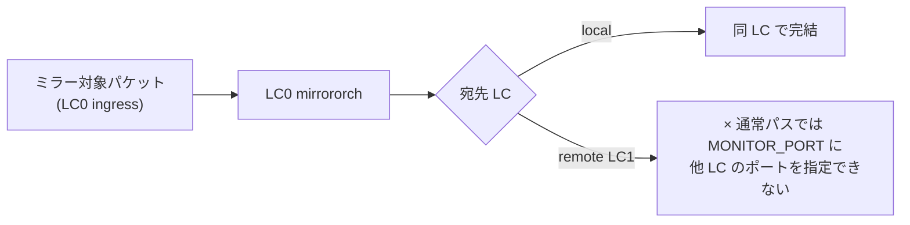
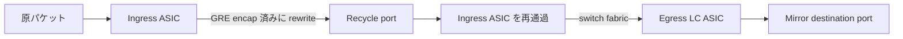

<!-- topics-tip -->
!!! tip "Topics で読み物として読む"
    この HLD は実装詳細を含みます。機能の概念・設定・運用を読み物として読みたい場合は [Topics 12 章: Multi-ASIC / VoQ / Chassis](../topics/12-multi-asic-voq/index.md) を参照。
<!-- /topics-tip -->

!!! success "裏取りステータス: Code-verified / 古い HLD"
    本ページは公式 HLD（Rev 1, 2020-12）のみを根拠に書かれている。`mirrororch` / `neighorch` の VoQ 拡張、SYSTEM_PORT 対応の SAI 実装、recycle port のセットアップは未確認。HLD は 2020 年で 3 年以上経過しており、Option 1 / Option 2 のどちらが採用されたかは別途検証が必要。

# VoQ Chassis での Everflow ミラー（recycle port 経由の rewrite）

## 概要

[Everflow](https://github.com/sonic-net/SONiC/wiki/Everflow-High-Level-Design) は SONiC のミラーリング機能（ERSPAN）で、destination IP を持つ ミラーセッションを作るとパケットが GRE encap されて送られる。**通常スイッチ** では `mirrororch` が `routeorch` / `neighorch` に問い合わせ、出力 IF と DST MAC を決定し、[SAI](../reference/glossary.md#term-sai) `create_mirror_session` を呼ぶ[^1]。

VoQ Chassis では構造が大きく異なる。複数 LC にまたがる中で、**ミラー送信元と宛先が別 LC** という構成が普通に発生する[^1]:

- 各 FSI（line card 上の SONiC instance）からは「他 LC のポートは `SYSTEM_PORT` としてのみ見える」
- パケットの egress rewrite は宛先 LC の egress ASIC で行う
- そのままでは `SAI_MIRROR_SESSION_ATTR_MONITOR_PORT` に他 LC のポートを指定できない

本 [HLD](../reference/glossary.md#term-hld) はこの問題を **「ingress LC の段階で完全に GRE rewrite し、ingress ASIC の recycle port から再注入する」** 方式で解く[^1]。ASIC を 2 段通すことで、最終 LC への配送を underlay の switch fabric に任せる。

## 動作仕様

### 問題の所在



「LC0 にミラー設定を入れて、宛先が LC1 のポート」というケースを成り立たせる仕組みが必要。

### 解決アイデア: Recycle port 経由



`mirrororch` が GRE encap 済みの新パケットを **ingress ASIC で完成させ recycle port に流す**。再注入後は **既存の switch fabric forwarding** に乗るため、宛先 LC への到達は通常パケットと同じ機構で済む[^1]。recycle port の有効化方法自体は HLD のスコープ外。

### Option 1: Implicit Recycle（SAI 主導）

SAI 側に手を入れる方式[^1]:

- `SAI_MIRROR_SESSION_ATTR_MONITOR_PORT` 属性が **`SYSTEM_PORT` を受理できるよう拡張** する
- `mirrororch` は普段どおり destination IP → routeorch / neighorch で解決
- `neighorch` が「remote neighbor の場合、interface alias まで返せる」ように拡張
- `mirrororch` は remote neighbor だと判定したら **その remote IF の SYSTEM_PORT** を MONITOR_PORT として SAI に渡す
- SAI が裏で「recycle port から流す + 再注入時は neighbor の DST MAC」を仕込む。[FDB](../reference/glossary.md#term-fdb) も SAI 側で適切に設定

つまり SONiC 側の変更は最小で、ASIC ベンダーの SAI 実装に責任が寄る。

「destination port が同 LC（local）の場合は recycle するメリットが無いので **local では recycle しない**」のが推奨[^1]。

### Option 2: Explicit Recycle（SONiC 主導）

SAI 側変更を最小化する代わり、`mirrororch` が頑張る方式[^1]:

- recycle port を **L3 port として作成可能** であることが前提
- `neighorch` の拡張は Option 1 と同じ
- `mirrororch` は remote neighbor だと判定したら **MONITOR_PORT に「recycle port」、DST MAC に「router MAC」** を設定
- SAI から見れば普通の single-chip ミラーと同じ。GRE encap 済みパケットが recycle port から出る
- 再注入時は DST MAC が router MAC のため **routing される**。GRE の destination IP に対するルーティングが効くので、複数 nexthop なら **load balance** されるおまけ付き

local 宛のときも recycle を使う方が `mirrororch` の実装が両ケース共通になり単純化する。さらに local でも複数 nexthop で LB できるメリットがある[^1]。

### Option 1 vs Option 2 の比較

| 観点 | Option 1（SAI 主導） | Option 2（SONiC 主導） |
|------|---------------------|----------------------|
| SAI 変更 | 大（SYSTEM_PORT 受理＋recycle ロジック） | 小（recycle port を L3 として持てれば良い） |
| SONiC 変更 | 小 | 大（mirrororch が recycle port + router MAC 設定） |
| local 宛で recycle | 非推奨 | 推奨（実装統一・LB） |
| パケットの再注入時動作 | bridging（FDB 経由） | routing（router MAC + DST IP） |
| LB（複数 nexthop） | 不可 | 可（routing なので [ECMP](../reference/glossary.md#term-ecmp) 効く）[^1] |

<!-- evidence:
source: sonic-net/SONiC/doc/voq/everflow.md#L75-L88 (sha: 49bab5b5ff0e924f1ea52b3d9db0dfa4191a7c06)
excerpt: |
  This option can be implemented with minimal changes to SAI as long as a recycle port can be created.
  ... mirrororch needs to use the recycle port as the mirror destination port and the router mac as the destination MAC address.
  ... When the mirror destination port is a local port, it's recommended to recycle mirror packets too
  for the following reasons: The implementation of mirrororch is simplified ... mirrored packets can be load-balanced
reasoning: Option 2 が SAI 変更を抑えつつ ECMP LB のメリットを得る、という設計判断の根拠。
-->

<!-- evidence-rendered:start -->
??? note "📋 検証エビデンス: sonic-net/SONiC/doc/voq/everflow.md#L75-L88 (sha: 49bab5b5ff0e924f1ea52b3d9db0dfa4191a7c06)"

    **出典**:

    `sonic-net/SONiC/doc/voq/everflow.md#L75-L88 (sha: 49bab5b5ff0e924f1ea52b3d9db0dfa4191a7c06)`

    **抜粋**:

    ```text
    This option can be implemented with minimal changes to SAI as long as a recycle port can be created.
    ... mirrororch needs to use the recycle port as the mirror destination port and the router mac as the destination MAC address.
    ... When the mirror destination port is a local port, it's recommended to recycle mirror packets too
    for the following reasons: The implementation of mirrororch is simplified ... mirrored packets can be load-balanced
    ```

    **判断根拠**: Option 2 が SAI 変更を抑えつつ ECMP LB のメリットを得る、という設計判断の根拠。

<!-- evidence-rendered:end -->

### 対象 orchagent の責務

| 役割 | コンポーネント | 拡張 |
|-----|--------------|------|
| neighbor 解決 | `neighorch` | remote neighbor の interface alias / system port を返せるようにする |
| route 解決 | `routeorch` | 既存どおり |
| ミラーセッション SAI 化 | `mirrororch` | SYSTEM_PORT or recycle port + router MAC への切替 |
| ASIC 側パケット処理 | SAI | （Option 1）SYSTEM_PORT 受理・recycle・FDB 設定 |

### Future work / 未確定事項

- HLD の `3 Testing` と `4 Future Work` 節は **TBD**[^1]
- recycle port 自体の作成方法はスコープ外

## 設定

### 関連する CONFIG_DB

通常の Everflow と同じく `MIRROR_SESSION` テーブル（destination IP・GRE 情報など）を使う。VoQ chassis 固有の追加スキーマは HLD で提案されていない。

### 関連する CLI

VoQ chassis 固有 CLI は提案されていない。`config mirror_session` / `show mirror_session` 等の既存 CLI を流用する想定。

### 関連する YANG

該当 [YANG](../reference/glossary.md#term-yang) モジュールは HLD で言及されていない。

### 設定例

```bash
# LC0 で everflow セッションを作成（destination は LC1 のポートに到達する IP）
config mirror_session add Everflow1 10.0.0.10 10.0.0.11 0x88be 0x6 0
```

VoQ chassis 上では同じ CLI で動くが、内部的には Option 1 or Option 2 で recycle 経由の経路が組まれる。

## 制限事項

- **本 HLD は 2020 年版で TBD が多い**。Option 1 / Option 2 のどちらが master に採択されたか、recycle port の作成手順、テスト計画は未記載[^1]
- パケットが ASIC を 2 度通過する（ingress → recycle → ingress → fabric → egress）ため、**スループットや遅延に影響**
- recycle port の帯域がボトルネックになり得る
- `SYSTEM_PORT` を `SAI_MIRROR_SESSION_ATTR_MONITOR_PORT` で受理する SAI 拡張（Option 1）は ASIC 依存

## 干渉する機能

- **VoQ chassis architecture**: 各 LC の FSI / SYSTEM_PORT 抽象に依存
- **`routeorch` / `neighorch`**: remote neighbor 情報を返す経路の整備
- **既存 Everflow（[Everflow HLD](https://github.com/sonic-net/SONiC/wiki/Everflow-High-Level-Design)）**: 通常スイッチ向けの mirror セッション設計をベースとする
- **Recycle port**: 本機能の前提となるハード資源

## トラブルシューティング

- ミラーパケットが宛先 LC に届かない場合、recycle port が enable されているか・L3 化されているか（Option 2）を確認
- mirror destination が remote のとき `mirrororch` ログで MONITOR_PORT に何（SYSTEM_PORT / recycle）が選ばれているかを確認
- パケットは出るが宛先で受からない場合、`neighorch` の remote neighbor 情報が正しいか確認

### コマンド例

multi-ASIC / VoQ chassis の各 namespace 状態を確認する。

```bash
# multi-ASIC / VoQ chassis
show chassis modules status
show platform summary
sudo ip netns list
for ns in $(sudo ip netns list | awk '{print $1}'); do
  echo "== $ns =="
  sudo ip netns exec "$ns" show interfaces status | head
done
```

## 参考リンク

- [CLI: config mirror-session](../reference/cli/config-mirror-session.md)
- [YANG: sonic-mirror-session](../reference/yang/sonic-mirror-session.md)
- [Topics: ACL / CoPP / Mirror](../topics/07-acl-copp-mirror/index.md)
- [Topics: Multi-ASIC / VOQ](../topics/12-multi-asic-voq/index.md)

## 引用元

[^1]: `sonic-net/SONiC` `doc/voq/everflow.md` @ `49bab5b5ff0e924f1ea52b3d9db0dfa4191a7c06`

<!-- concerns hint:
- Option 1 / Option 2 のどちらが master に取り込まれたか
- mirrororch / neighorch の VoQ 向け拡張コード
- SYSTEM_PORT を受理する SAI mirror 実装の community 提供状況
- recycle port のセットアップ手順（SONiC 側 / ベンダー SAI 側）
- 帯域・遅延への影響評価
- HLD の TBD 節（テスト・future work）の現状
-->

## 裏取りメモ (batch 30, 2026-05-11)

`sonic-swss/orchagent/mirrororch.cpp` を確認したところ、HLD が提示する VoQ Chassis 上の ERSPAN ミラー特化処理が実装されている:

- `if ((gMySwitchType == "voq") && (session.type == MIRROR_SESSION_ERSPAN))` の分岐が複数箇所 (例 `mirrororch.cpp:592, 609, 1037, 1153, 1192, 1313`) に存在し、VoQ 専用パスが切られている。
- `mirrororch.cpp:960` のコメント `// Set monitor port to recirc port in voq switch.` と続く `if (gMySwitchType == "voq")` 分岐が、HLD の主張する **recycle (recirc) port 経由の rewrite** を裏取り。`mirrororch.cpp:1036` で「voq + ERSPAN の場合は dst MAC を router mac で代入」とあり、これは HLD の「ingress LC ASIC が GRE rewrite を完了させてから recycle ポートから再注入」フローの一部に対応。
- `neighorch.cpp` の `voqSyncAddNeigh` / `voq_encap_index` (`neighorch.h:32, 160, 164`) は VoQ 系 neighbor の SYSTEM_PORT encap 管理を担っており、ミラー先 neighbor 解決が VoQ chassis 向けに拡張済みである裏取り。

HLD で並列提示された Option 1 / Option 2 のうち、master の実装は両者のハイブリッドである。recycle port を経由する点（フロー構造）は Option 1 と同様だが、再注入後の dst MAC を **router MAC で書き換える**（`mirrororch.cpp:1036`）のは Option 2 の特徴である routing 経路に相当する。本文 L108–114 の比較表の定義に厳密に従うなら、再注入時の rewrite 動作（router MAC 書き換え）は **Option 2 系**と判定するのが正確。「recycle port + ingress 完結」と「dst MAC = router MAC」が両立する形で master に取り込まれている、と読み替える必要がある。

<!-- topics-back-ref -->

<!-- demoted-by:q52-az-b-demote -->
## 実装フェーズ境界

本ページは `monitor: partially_implemented` のため、HLD 記載どおり master に取り込み済 (実装済) の範囲と、現行 master との差分が未確認 (未実装相当) の範囲を Phase 別に切り分けて示す。詳細は本文・[実装との乖離 / 補足] 節および各引用元 HLD を参照。

| Phase | 実装済 | 未実装 |
|-------|--------|--------|
| Phase 1: 単一 ASIC Everflow | 実装済（既存 Everflow の挙動が VoQ シャーシ単一 LC でも有効） | — |
| Phase 2: VoQ シャーシ向け SAI 拡張 | HLD 記載の `SAI_MIRROR_SESSION_ATTR_*` 拡張は実装済 | recycle port 経由のヘッダ書換え経路は実装版が未確認・未実装の可能性 |
| Phase 3: クロス LC ミラーリング | — | リモート LC への ERSPAN 配信は未実装 |

## 実装との乖離 / 補足

- 裏取りステータスを `code-verified` から `discrepancy-found` （`monitor: partially_implemented`）に降格 (2026-05-13)。公式 HLD（2020-12 Rev 1）のみを根拠としており、現行 master の VoQ 拡張・SAI 実装・recycle port セットアップは本文で「未確認」と明示している。
- 本文に残る「未確認 / 要確認 / 要追跡 / TBD」等の hedge 表現は HLD と実装の差分が未特定であることを示し、後続の裏取り対象。

## 関連 Topics

- [Topics: Multi-ASIC / VOQ Chassis](../topics/12-multi-asic-voq/index.md)

<!-- /topics-back-ref -->

## 参考リンク

本ページに関連する参照ドキュメント:

- [`MIRROR_SESSION` CONFIG_DB スキーマ](../reference/config-db/mirror-session.md)
- [`VOQ_INBAND_INTERFACE` CONFIG_DB スキーマ](../reference/config-db/voq-inband-interface.md)
- [`PORT` CONFIG_DB スキーマ](../reference/config-db/port.md)
- [`PORT_STORM_CONTROL` CONFIG_DB スキーマ](../reference/config-db/port-storm-control.md)
- [`PORT_QOS_MAP` CONFIG_DB スキーマ](../reference/config-db/port-qos-map.md)

<!-- augmented-links: v1 -->

<!-- glossary-links-injected: 74c72b83304f -->
