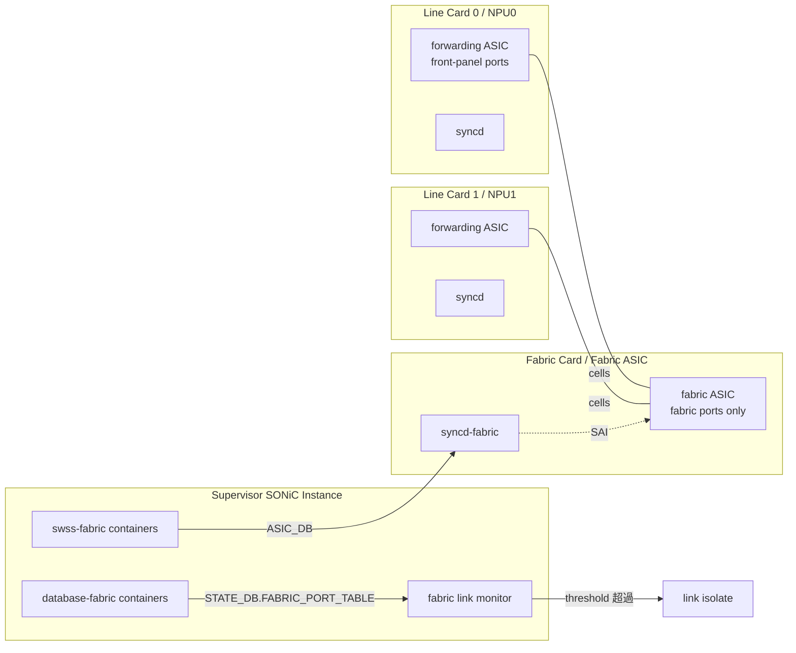

!!! info "裏取りステータス: HLD-only"
    HLD は Rev 3.6 (2025-10) と継続的に改訂されている重要 HLD。`switch_type=fabric` の DEVICE_METADATA、`fabricmgrd` 系の link monitoring（CRC / misaligned threshold）、`STATE_DB FABRIC_PORT_TABLE` 反映と `show fabric port status` の sonic-utilities 取込状況は未確認。

# VOQ シャーシの Fabric ポート（fabric ASIC 管理 / link monitoring）

## 概要

VOQ シャーシ（Virtual Output Queue を持つマルチカード分散シャーシ）は **forwarding ASIC**（front panel port を持つ NPU）を **fabric ASIC**（cell ベースの内部 fabric）で相互接続する構成を取る。本 HLD は SONiC が **fabric ASIC を forwarding ASIC と同等の syncd / sairedis 構成で管理** する方法と、fabric link 監視・統計収集の枠組みを定める[^1]。

> 詳細は HLD `doc/voq/fabric.md` および `doc/voq/architecture.md` を参照。本ページはアーキテクチャ要点に絞る。

## 動作仕様

### Fabric ASIC のホスト容器構成

forwarding ASIC と同じく、fabric ASIC ごとに次の container を立てる[^1]:

- `database`
- `swss`
- `syncd`

ただし fabric ASIC に front panel port は無いため、**`lldp` / `teamd` / `bgp` 等のコンテナは disable**[^1]。SSI（Supervisor SONiC Instance）から chassis 内の fabric ASIC を一括管理する。

### `DEVICE_METADATA` の `switch_type`

fabric ASIC を識別するために CONFIG_DB に[^1]:

```
DEVICE_METADATA|localhost
  switch_type = "fabric"
  switch_id   = <一意の番号>
```

> SAI VOQ 仕様の **推奨**: fabric ASIC の `switch_id` は forwarding ASIC のものと **重複させない**[^1]。

### Fabric ポート / リンクの状態 - STATE_DB

fabric port は **chip 上の fabric port 番号** で識別される。状態は周期 poll で `STATE_DB FABRIC_PORT_TABLE` に保存[^1]:

```
STATE_DB:FABRIC_PORT_TABLE:<fabric_port_name>
  lane    = <number>
  status  = "up" | "down"
  # up なら remote peer の switch_id / fabric port も保持
  # down なら reason (CRC / misaligned 等)
```

### Counter

forwarding 用の port counter とは別に、fabric port 専用の SAI counter を収集する[^1]:

```
SAI_PORT_STAT_IF_IN_OCTETS
SAI_PORT_STAT_IF_IN_ERRORS
SAI_PORT_STAT_IF_IN_FABRIC_DATA_UNITS
SAI_PORT_STAT_IF_IN_FEC_CORRECTABLE_FRAMES
SAI_PORT_STAT_IF_IN_FEC_NOT_CORRECTABLE_FRAMES
SAI_PORT_STAT_IF_IN_FEC_SYMBOL_ERRORS
SAI_PORT_STAT_IF_OUT_OCTETS
SAI_PORT_STAT_IF_OUT_FABRIC_DATA_UNITS
```

「**cell**」（fabric data unit）という単位が物理 packet と異なる粒度で計測されるのが特徴。

### Fabric link 監視（Rev 3 系で大幅に進化）

Rev 3 以降、fabric link 単位で **エラー率しきい値による自動 isolation** が追加された[^1]:

- 通常運用中、`SAI_PORT_STAT_IF_IN_FEC_NOT_CORRECTABLE_FRAMES` 等を周期チェック
- 一定しきい値超過 → リンクを論理的に isolate（fabric から外す）
- リンクダウン時は更にダウン理由（CRC / misaligned）を STATE_DB に表記
- Rev 3.6 で **persistent link flap** 検出が追加: short up/down を繰り返すリンクも自動 isolate

### 全体構造



<!-- evidence:
source: sonic-net/SONiC/doc/voq/fabric.md#L33-L40 (sha: 49bab5b5ff0e924f1ea52b3d9db0dfa4191a7c06)
excerpt: |
  | 3.5 | Aug-12 2024 | Update fabric link monitoring behavior on link down |
  | 3.6 | Oct-09 2025 | Update fabric link monitoring behavior on persistent link flap |
reasoning: 継続的に改訂されている fabric link 監視機能の設計実績の根拠。
-->

### Hotswap 対応

Rev 1.1 で hotswap handling が明記[^1]: fabric card の活線挿抜 / line card の入れ替えに伴って fabric ASIC の container が動的に start/stop される。

## 設定

### 関連する CONFIG_DB

| Table | Key | フィールド |
|-------|-----|------------|
| `DEVICE_METADATA` | `localhost` | `switch_type=fabric`, `switch_id=<n>` |

`STATE_DB FABRIC_PORT_TABLE` はランタイム生成。

### 関連する CLI

HLD で改訂されている系統[^1]:

| Command | 用途 |
|---------|------|
| `show fabric counters [port \| queue \| reachability]` | fabric port 統計 |
| `show fabric port status` | fabric port 状態（up/down/peer 情報）|
| `clear fabric counters` | fabric counter のクリア |

### 設定例

```bash
# fabric ASIC を持つカードでの DEVICE_METADATA
config-fabric-asic --switch-id 100 --type fabric

# 状態確認
show fabric port status
show fabric counters port
```

## 制限事項

- 本 HLD は **VOQ chassis 構成専用**。pizza-box の単一 ASIC スイッチには無関係
- fabric ASIC は front-panel を持たないため LLDP / BGP 等のプロトコル系コンテナは disable 強制
- Fabric link 監視のしきい値設計（具体的な閾値・判定窓）は HLD 文書中で完全には固定されておらず、実装側のチューニング余地あり
- HLD は大きい（25KB+ で改訂多数）。詳細フローや edge case は HLD `doc/voq/fabric.md` を参照

## 干渉する機能

- **VOQ chassis architecture**（`doc/voq/architecture.md`）: 本 HLD の前提
- **multi-ASIC HLD**: container グルーピング機構を共有
- **SSI（Supervisor SONiC Instance）**: 制御平面はここに集約される。fabric ASIC の swss/syncd は SSI 上に立つ
- **port counter / show interfaces counters 系**: forwarding ASIC 側の port counter とは独立。混同しないよう CLI が分離されている
- **warm-boot / fast-boot**: fabric link が一時的に down する間の cell loss / VOQ 制御は HLD でカバーされている範囲

## トラブルシューティング

```bash
# fabric port の状態
show fabric port status

# 物理的にどの link が down か / 理由
redis-cli -n 6 KEYS "FABRIC_PORT_TABLE:*" | head
redis-cli -n 6 HGETALL "FABRIC_PORT_TABLE:Fabric0"

# counter の急増 (FEC_NOT_CORRECTABLE_FRAMES が増えていないか)
show fabric counters port

# 自動 isolate されたか
docker logs swss-fabric0 2>&1 | grep -i isolate
```

## 引用元

[^1]: `sonic-net/SONiC` `doc/voq/fabric.md` @ `49bab5b5ff0e924f1ea52b3d9db0dfa4191a7c06`
