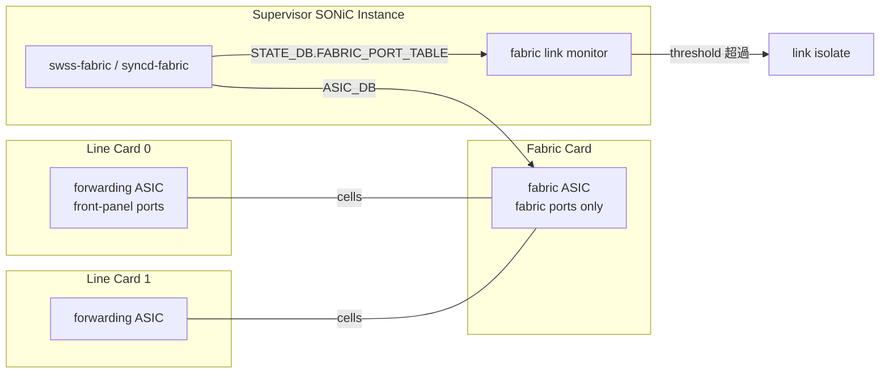

<!-- topics-tip -->
!!! tip "Topics で読み物として読む"
    この HLD は実装詳細を含む。機能の概念・設定・運用を読み物として読みたい場合は [Topics 12 章: Multi-ASIC / VoQ / Chassis](../topics/12-multi-asic-voq/index.md) を参照。
<!-- /topics-tip -->

!!! success "裏取りステータス: code-verified"
    実装裏取り済み。`switch_type=fabric`: `sonic-yang-models/yang-models/sonic-port.yang:75` / `APP_FABRIC_PORT_TABLE_NAME`: `sonic-swss-common/common/schema.h:40,549` / `FabricPortsOrch`: `sonic-swss/orchagent/fabricportsorch.{cpp,h}` / `show fabric`: `sonic-utilities/show/fabric.py` + `scripts/fabricstat` + `config/fabric.py`。

# VOQ シャーシの Fabric ポート（fabric ASIC 管理 / link monitoring）

## 何のための仕組みか

[VOQ](../reference/glossary.md#term-voq) シャーシは **forwarding [ASIC](../reference/glossary.md#term-asic)**（front panel を持つ [NPU](../reference/glossary.md#term-npu)）を **fabric ASIC**（cell ベースの内部 fabric）で相互接続する。本 [HLD](../reference/glossary.md#term-hld) は **fabric ASIC を forwarding ASIC と同様に [syncd](../reference/glossary.md#term-syncd) / sairedis で管理**し、fabric link の状態監視・統計収集・自動 isolation を行う枠組み[^1]。

> 詳細は HLD `doc/voq/fabric.md` および `doc/voq/architecture.md` を参照。

## どう構成するか

### Fabric ASIC のコンテナ

forwarding ASIC と同じく fabric ASIC ごとに `database` / `swss` / `syncd` を立てる。front panel が無いので `lldp` / `teamd` / `bgp` は disable。SSI（Supervisor [SONiC](../reference/glossary.md#term-sonic) Instance）から chassis 内の fabric ASIC を一括管理する[^1]。

### `DEVICE_METADATA` で identify

```text
DEVICE_METADATA|localhost
  switch_type = "fabric"
  switch_id   = <一意の番号>
```

[SAI](../reference/glossary.md#term-sai) VOQ 仕様の推奨: fabric ASIC の `switch_id` は forwarding ASIC と重複させない[^1]。

### 全体構造



## 何が見えるか（STATE_DB / counter）

### `FABRIC_PORT_TABLE`

fabric port は chip 上の fabric port 番号で識別。周期 poll で書き込まれる[^1]:

```text
STATE_DB:FABRIC_PORT_TABLE:<fabric_port_name>
  lane    = <number>
  status  = "up" | "down"
  # up なら remote peer の switch_id / fabric port を保持
  # down なら reason (CRC / misaligned 等)
```

### Fabric 専用 SAI counter

forwarding 用 port counter とは別に[^1]:

```text
SAI_PORT_STAT_IF_IN_OCTETS / IN_ERRORS / IN_FABRIC_DATA_UNITS
SAI_PORT_STAT_IF_IN_FEC_{CORRECTABLE,NOT_CORRECTABLE,SYMBOL}_ERRORS
SAI_PORT_STAT_IF_OUT_OCTETS / OUT_FABRIC_DATA_UNITS
```

「**cell**（fabric data unit）」が物理 packet と別粒度で計測される。

## どう監視するか（Rev 3 以降）

Rev 3 以降、fabric link 単位で **エラー率しきい値による自動 isolation** が追加[^1]:

- `IN_FEC_NOT_CORRECTABLE_FRAMES` 等を周期チェック
- しきい値超過 → リンクを論理的に isolate（fabric から外す）
- リンクダウン時はダウン理由（CRC / misaligned）も [STATE_DB](../reference/glossary.md#term-state_db) に表記
- Rev 3.6 で **persistent link flap** 検出が追加（short up/down 繰り返しも isolate）

しきい値の具体値・判定窓は HLD で完全固定されておらず、実装側のチューニング余地あり。

### Hotswap

Rev 1.1 で hotswap handling が明記[^1]。fabric / line card の活線挿抜で fabric ASIC コンテナが動的に start/stop される。

<!-- evidence:
source: sonic-net/SONiC/doc/voq/fabric.md#L33-L40 (sha: 49bab5b5ff0e924f1ea52b3d9db0dfa4191a7c06)
excerpt: |
  | 3.5 | Aug-12 2024 | Update fabric link monitoring behavior on link down |
  | 3.6 | Oct-09 2025 | Update fabric link monitoring behavior on persistent link flap |
reasoning: 継続的に改訂されている fabric link 監視機能の設計実績の根拠。
-->

<!-- evidence-rendered:start -->
??? note "📋 検証エビデンス: sonic-net/SONiC/doc/voq/fabric.md#L33-L40 (sha: 49bab5b5ff0e924f1ea52b3d9db0dfa4191a7c06)"

    **出典**:

    `sonic-net/SONiC/doc/voq/fabric.md#L33-L40 (sha: 49bab5b5ff0e924f1ea52b3d9db0dfa4191a7c06)`

    **抜粋**:

    ```text
    | 3.5 | Aug-12 2024 | Update fabric link monitoring behavior on link down |
    | 3.6 | Oct-09 2025 | Update fabric link monitoring behavior on persistent link flap |
    ```

    **判断根拠**: 継続的に改訂されている fabric link 監視機能の設計実績の根拠。

<!-- evidence-rendered:end -->

## 設定と CLI

| Table | Key | フィールド |
|-------|-----|------------|
| `DEVICE_METADATA` | `localhost` | `switch_type=fabric`, `switch_id=<n>` |

`STATE_DB FABRIC_PORT_TABLE` はランタイム生成。

| Command | 用途 |
|---------|------|
| `show fabric counters [port \| queue \| reachability]` | fabric port 統計 |
| `show fabric port status` | fabric port 状態（up/down/peer 情報）|
| `clear fabric counters` | counter クリア |

## 制限事項

- VOQ chassis 構成専用。pizza-box には無関係
- fabric ASIC は front-panel を持たないため [LLDP](../reference/glossary.md#term-lldp) / [BGP](../reference/glossary.md#term-bgp) 等は disable 強制
- 自動 isolation のしきい値設計は HLD で完全固定されていない
- HLD は 25KB+ で改訂多数。フローや edge case は本文を参照

## 干渉する機能

- **VOQ chassis architecture**（`doc/voq/architecture.md`）: 本 HLD の前提
- **multi-ASIC**: container グルーピング機構を共有
- **SSI**: 制御平面はここに集約。fabric ASIC の swss/syncd は SSI 上
- **port counter / show interfaces counters**: forwarding 側と独立。CLI が分離されている
- **warm-boot / fast-boot**: fabric link 一時 down 時の cell loss / VOQ 制御は HLD でカバー

## トラブルシューティング

```bash
show fabric port status
redis-cli -n 6 KEYS "FABRIC_PORT_TABLE:*" | head
redis-cli -n 6 HGETALL "FABRIC_PORT_TABLE:Fabric0"
show fabric counters port                          # FEC_NOT_CORRECTABLE が増えていないか
docker logs swss-fabric0 2>&1 | grep -i isolate    # 自動 isolate されたか
```

## 関連 Topics

- [Topics 12 Multi-ASIC / VOQ - architecture](../topics/12-multi-asic-voq/architecture.md)
- [Topics 12 Multi-ASIC / VOQ - internals](../topics/12-multi-asic-voq/internals.md)
- 関連 HLD: [VOQ SONiC](voq-sonic.md) / [Recirculation port (VOQ chassis)](recirculation-port-support-on-voq-chassis.md) / [Everflow on VOQ chassis](everflow-support-on-voq-chassis.md)

## 引用元

[^1]: `sonic-net/SONiC` `doc/voq/fabric.md` @ `49bab5b5ff0e924f1ea52b3d9db0dfa4191a7c06`

<!-- topics-back-ref -->
## Topics 索引

- [Topics: Multi-ASIC / VOQ Chassis](../topics/12-multi-asic-voq/index.md)

<!-- /topics-back-ref -->

<!-- glossary-links-injected: ec18b66e3507 -->
