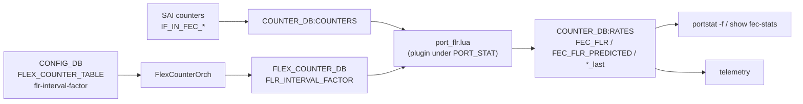
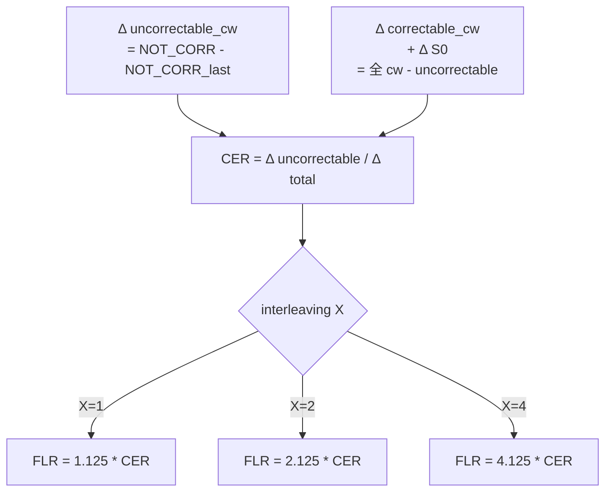

# FEC FLR 内部実装

このページは [FEC FLR Support in SONiC（概要ハブ）](fec-flr-support-in-sonic.md) の派生で、**`port_flr.lua` プラグインと FlexCounterOrch の内部** に絞る。概念・公式は [fec-flr-support-in-sonic-concepts.md](fec-flr-support-in-sonic-concepts.md)、CLI / 設定は [fec-flr-support-in-sonic-operations.md](fec-flr-support-in-sonic-operations.md)、制限事項は [fec-flr-support-in-sonic-limitations.md](fec-flr-support-in-sonic-limitations.md) を参照。

## 1. コンポーネント関係



## 2. 利用する SAI counter

すべて既存の [SAI](../reference/glossary.md#term-sai) port counter[^1]:

- `SAI_PORT_STAT_IF_IN_FEC_NOT_CORRECTABLE_FRAMES`
- `SAI_PORT_STAT_IF_IN_FEC_CORRECTABLE_FRAMES`
- `SAI_PORT_STAT_IF_IN_FEC_CODEWORD_ERRORS_S0..S16`（RS-544 では S0〜S16 の 17 bin）

未サポートの interface では個別 counter が **`not support`** を返し、`portstat -f` 上では `N/A` を表示[^1]。

## 3. Observed FEC FLR の計算



1. interval ごとに各 codeword counter の差分 (`Δ`) を取る。
2. `CER = Δ uncorrectable / Δ total`。
3. interleaving factor X を port speed × lanes から決め、`FEC_FLR = (1 + X * MFC) / MFC * CER` で `FEC_FLR` を算出。
4. 結果を `COUNTER_DB:RATES:FEC_FLR` に保存、`*_last` を更新。

## 4. Predicted FEC FLR の計算

低 BER 領域で observed が 0 に張り付くのを補うために外挿で先読みする[^1]:

1. `x = [1, 2, ..., 15]`、`codeword_errors[i] = ΔSi`
2. `y[i] = log10( codeword_errors[i] / total_cw )`
3. 線形回帰で `slope`, `intercept` を求める（`y = slope*x + intercept`）
4. 16–20 symbol errors の窓で外挿: `predicted_cer = Σ_{j=16..20} 10^(j*slope + intercept)`
5. `FEC_FLR_PREDICTED = (1.125 / 2.125 / 4.125) * predicted_cer`（X 別）
6. `COUNTER_DB:RATES` に `FEC_FLR_PREDICTED` / `FEC_FLR_R_SQUARED` / `*_last` を保存

20 を超える symbol error は寄与が無視できる量なので 16–20 に窓を切る。非ゼロ bin が **2 個未満** だと回帰できないので、その場合 `FLR(P)` は `0` を表示する（`N/A` ではなく `0` にして CLI 表示の readability を優先）[^1]。

## 5. プラグイン登録と poll 周期

`port_flr.lua` は **既存 `PORT_STAT_COUNTER_FLEX_COUNTER_GROUP`** にプラグインとして登録する[^1]。`port_rates.lua` と並ぶ位置づけ。

実行間隔[^1]:

```text
interval = port_stat POLL_INTERVAL * FLR_INTERVAL_FACTOR
```

`FLR_INTERVAL_FACTOR` は **`FLEX_COUNTER_DB`** から読む。`FlexCounterOrch` が [CONFIG_DB](../reference/glossary.md#term-config_db) の `counterpoll port flr-interval-factor` を伝搬する。デフォルト `120`[^1]。

つまり port_stat poll が `1000ms` であれば FLR 計算は `120` 秒に 1 回。

## 6. 関連 swss ファイル（現行 master 確認結果）

| ファイル | 関連 |
|---------|------|
| `sonic-swss/orchagent/port_flr.lua` | observed/predicted の lua 実装本体。`FEC_FLR_POLL_INTERVAL = 120` ハードコード |
| `sonic-swss/orchagent/portsorch.cpp` | プラグイン登録ポイント |
| `sonic-swss/orchagent/flexcounterorch.cpp` | `FLR_INTERVAL_FACTOR` 伝搬経路（[HLD](../reference/glossary.md#term-hld) 提案）|
| `sonic-swss/crates/countersyncd/src/sai/saiport.rs` | `IF_IN_FEC_CODEWORD_ERRORS_S0..S16` を列挙 |
| `sonic-utilities/utilities_common/portstat.py` | `fec_flr` / `fec_flr_predicted` / `fec_flr_r_squared` 列追加 |
| `sonic-utilities/utilities_common/netstat.py` | `format_fec_flr` / `format_fec_flr_predicted` フォーマッタ |

実装と HLD の差分の詳細は [fec-flr-support-in-sonic-limitations.md](fec-flr-support-in-sonic-limitations.md) を参照。

## 関連ページ

- [FEC FLR Support in SONiC（概要ハブ）](fec-flr-support-in-sonic.md)
- [fec-flr-support-in-sonic-concepts.md](fec-flr-support-in-sonic-concepts.md)
- [fec-flr-support-in-sonic-operations.md](fec-flr-support-in-sonic-operations.md)
- [fec-flr-support-in-sonic-limitations.md](fec-flr-support-in-sonic-limitations.md)

## 制限事項

実装内部の観点から運用に効く制限点 (HLD と実装の乖離を含む詳細は [limitations](fec-flr-support-in-sonic-limitations.md))。

- **`port_flr.lua` は [Redis](../reference/glossary.md#term-redis)-side script として swss に同梱**: 書き換えるには docker イメージ内のファイル編集 + `docker restart swss` で再ロードが必要。host から CONFIG_DB / CLI で差し替える機構は無い。
- **`FLR_INTERVAL_FACTOR` は lua ハードコード**: HLD で示唆される `counterpoll port flr-interval-factor` CLI は `sonic-utilities` master に未取り込み。実効 poll 周期は `port_stat POLL_INTERVAL × FLR_INTERVAL_FACTOR` で決まる。
- **`FlexCounterOrch` の伝搬経路は提案止まり**: HLD の `FlexCounterOrch` から factor を受け渡す経路は実装上は静的定数になっており、`flexcounterorch.cpp` に対応コードは見当たらない。
- **`crates/countersyncd` (Rust) 経由の SAI counter 列挙**: 旧来の C++ flex counter とは別経路で `IF_IN_FEC_CODEWORD_ERRORS_S0..S16` を集める。一部プラットフォーム SAI が `S16` 全部を返さないと FLR 計算が中断する。
- **`portstat.py` フォーマッタが columns 追加済み**: `fec_flr` / `fec_flr_predicted` / `fec_flr_r_squared` のカラム順は master 取り込み版で固定。プラットフォーム独自パッチで列を増減すると `show interfaces counters fec-stats` の整形が崩れる。

## 確認コマンド

```bash
# 実装ファイルの存在確認
ls -l .cache/sonic-sources/sonic-swss/orchagent/port_flr.lua
ls -l .cache/sonic-sources/sonic-swss/crates/countersyncd/src/sai/saiport.rs

# Rust 側で IF_IN_FEC_CODEWORD_ERRORS_S0..S16 が列挙されているか
grep -n 'IF_IN_FEC_CODEWORD_ERRORS_S' .cache/sonic-sources/sonic-swss/crates/countersyncd/src/sai/saiport.rs

# utilities 側で fec_flr / fec_flr_predicted カラムが定義されているか
grep -nE 'fec_flr(_predicted|_r_squared)?' .cache/sonic-sources/sonic-utilities/utilities_common/portstat.py

# orchagent 実行時に port_flr.lua がロードされているか
docker exec swss redis-cli script exists $(docker exec swss redis-cli script load "$(cat /usr/share/swss/port_flr.lua)")

# COUNTERS_DB の RATES エントリで FLR キーが書き込まれているか
sonic-db-cli COUNTERS_DB keys 'RATES:oid:*' | head -3
sonic-db-cli COUNTERS_DB hgetall "$(sonic-db-cli COUNTERS_DB keys 'RATES:oid:*' | head -1)" | grep -i flr

# poll 周期の実値を逆算
sonic-db-cli CONFIG_DB hget 'FLEX_COUNTER_TABLE|PORT' POLL_INTERVAL
```

## 実装との乖離

`monitor: evolved_beyond_hld` — `monitor: evolved_beyond_hld` の HLD と実装の差分。 本ページは split-child のため、差分の主要根拠 / 影響 / 回避策は親ページ [FEC FLR 内部実装 親ページ](fec-flr-support-in-sonic.md) の同セクション（`## 実装との乖離` または `!!! diff` ブロック）を参照のこと。

## 引用元

[^1]: `sonic-net/SONiC` `doc/port_fec_flr/port_fec_flr.md` @ `49bab5b5ff0e924f1ea52b3d9db0dfa4191a7c06`

<!-- next-action -->
## このページを読んだ後の次アクション

!!! tip "読み手向け"
    - **本機能を実運用で使う場合**: 実装は存在するが本 HLD の記述と乖離。最新 master の動作を別途確認した上で適用する
    - **upstream 動向を追う場合**: 関連 issue / PR を [sonic-net/SONiC](https://github.com/sonic-net/SONiC) で検索（HLD タイトル / CONFIG_DB テーブル名 / Orch クラス名で grep するのが速い）
    - **代替手段 / 関連 reference**:
        - [CONFIG_DB: FLEX_COUNTER_TABLE](../reference/config-db/flex-counter-table.md)

!!! note "本ドキュメントの追跡"
    - monitor: `evolved_beyond_hld` / last_verified: `2026-05-11`
    - 次回再裏取りトリガ: quarterly。一覧は [discrepancy-index](../reference/verification/discrepancy-index.md) を参照（運用詳細は repo の `meta/discrepancy-operations.md`）

<!-- /next-action -->

<!-- glossary-links-injected: 0f594312e2b7 -->
