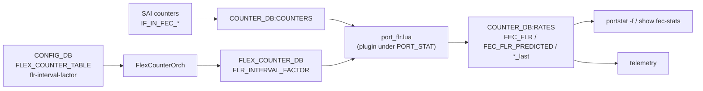
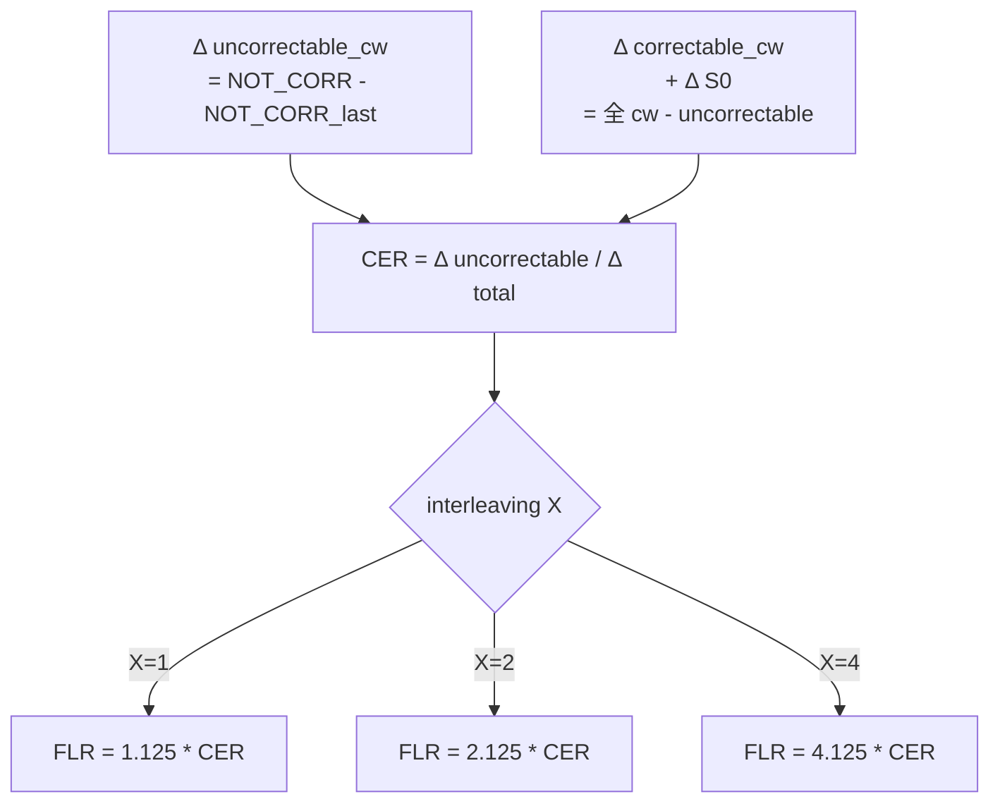

<!-- topics-tip -->
!!! tip "Topics で読み物として読む"
    この HLD は実装詳細を含みます。機能の概念・設定・運用を読み物として読みたい場合は [Topics 14 章: Platform / Port / Optics](../topics/14-platform-port-optics/index.md) を参照。
<!-- /topics-tip -->

!!! danger "裏取りステータス: Discrepancy-found（CLI 取り込み未済）"
    `sonic-swss/orchagent/port_flr.lua` L31 `FEC_FLR_POLL_INTERVAL = 120` / L443-452 で `FEC_FLR` / `FEC_FLR_PREDICTED` / `FEC_FLR_R_SQUARED` を RATES テーブルへ書き込む実装を確認。`sonic-utilities/utilities_common/portstat.py` L48-50 で `FEC_FLR` / `FEC_FLR_PREDICTED` / `FEC_FLR_R_SQUARED` / `FEC_MAX_T` カラム取り込み、`utilities_common/netstat.py` L144/L156 で `format_fec_flr` / `format_fec_flr_predicted` フォーマッタを確認。SAI `SAI_PORT_STAT_IF_IN_FEC_CODEWORD_ERRORS_S0..S15` は `sonic-sairedis/unittest/saidump/dump.json` のサンプル出力に出現を確認（verified at: 2026-05-09）。**HLD と現行 master の差異**: HLD §New CLI で `counterpoll port flr-interval-factor FLR_INTERVAL_FACTOR` のサブコマンド追加が記載されているが、`sonic-utilities/counterpoll/main.py` および `config/` 配下に `flr-interval-factor` / `FLR_INTERVAL_FACTOR` の grep ヒットなし。CLI による polling factor 動的設定は現行 master では未取り込み（lua 側ハードコード `FEC_FLR_POLL_INTERVAL = 120` のみ）。

# FEC FLR（Frame Loss Ratio）算出と予測（port_flr.lua / counterpoll port flr-interval-factor）

!!! info "章分割済み"
    本ページは大型 HLD の **概要ハブ** として保持。詳細は以下の派生ページを参照:

    - [fec-flr-support-in-sonic-concepts.md](fec-flr-support-in-sonic-concepts.md) — FLR / CER / interleaving / observed vs predicted の概念
    - [fec-flr-support-in-sonic-operations.md](fec-flr-support-in-sonic-operations.md) — CLI / CONFIG_DB / `show interfaces counters fec-stats` の使い方
    - [fec-flr-support-in-sonic-internals.md](fec-flr-support-in-sonic-internals.md) — `port_flr.lua` プラグインと FlexCounterOrch
    - [fec-flr-support-in-sonic-limitations.md](fec-flr-support-in-sonic-limitations.md) — 制限事項と HLD 提案 CLI 未取り込み等の乖離

## 概要

`Frame Loss Ratio (FLR)` は **送信フレームに対する欠落フレームの割合** で、リンク品質の代表指標[^1]:

```text
FLR = (Total TX Frames - Total RX Frames) / Total TX Frames
```

物理層側では Codeword Error Ratio（CER）が分かれば、interleaving 係数を掛けて FLR を見積もれる。[SONiC](../reference/glossary.md#term-sonic) はこれを **counter poll プラグイン (`port_flr.lua`)** として [ASIC](../reference/glossary.md#term-asic) の FEC counter から計算し、COUNTER_DB に保管 → telemetry 配信する設計を導入する[^1]。

機能[^1]:

1. **Observed FEC FLR** の周期算出（直近 interval の CER × interleaving）
2. **Predicted FEC FLR** の予測（codeword error 分布の対数線形回帰で 16–20 symbol errors の領域を外挿）
3. `show interfaces counters fec-stats` に **`FLR(O)` と `FLR(P)`** カラム追加
4. `counterpoll port flr-interval-factor <factor>` で計算間隔を調整（既定 `120`）

## 動作仕様

### コンポーネント関係



### 使う SAI counter

すべて既存の [SAI](../reference/glossary.md#term-sai) port counter[^1]:

- `SAI_PORT_STAT_IF_IN_FEC_NOT_CORRECTABLE_FRAMES`
- `SAI_PORT_STAT_IF_IN_FEC_CORRECTABLE_FRAMES`
- `SAI_PORT_STAT_IF_IN_FEC_CODEWORD_ERRORS_S0..S15`（RS-544 では 16 bin）

サポートしないインタフェースは個別 counter が **`not support`** を返し、`portstat -f` 上では `N/A` を表示[^1]。

### COUNTER_DB の追加 entry

`COUNTER_DB:RATES` に以下が **新規追加**[^1]:

| Entry | 説明 |
|-------|------|
| `FEC_FLR` | observed FEC FLR（float） |
| `FEC_FLR_PREDICTED` | predicted FEC FLR（float） |
| `SAI_PORT_STAT_IF_IN_FEC_NOT_CORRECTABLE_FRAMES_last` | 直前値 |
| `SAI_PORT_STAT_IF_IN_FEC_CORRECTABLE_FRAMES_last` | 直前値 |
| `SAI_PORT_STAT_IF_IN_FEC_CODEWORD_ERRORS_Si_last` | 直前値（i=0..15） |

[CONFIG_DB](../reference/glossary.md#term-config_db) / SAI API / sonic-platform-common には変更なし[^1]。

### Observed FEC FLR



公式（IEEE 802.3df Logic Ad Hoc 由来）[^1]:

```text
FEC_FLR = CER * (1 + X * MFC) / MFC
RS-544: MFC = 8
  X=1 → FLR = 1.125 * CER
  X=2 → FLR = 2.125 * CER
  X=4 → FLR = 4.125 * CER
```

X（interleaving factor）は理想的には **新 SAI 属性** で取得したいが、未対応のため **port speed × lane 数の表** で当面代替する[^1]:

| Speed | Lanes | X |
|-------|-------|---|
| 1600G | 8 | 4 |
| 800G  | 8 | 4 |
| 400G  | 8 | 2 |
| 400G  | 4 | 2 |
| 200G  | 4 | 2 |
| 200G  | 2 | 2 |
| 100G  | 2 | 2 |
| 100G  | 1 | 1 or 2 (autoneg) |

### Predicted FEC FLR

エラーが小さく Observed が 0 になりがちな現役リンクで、**外挿** で先読みするのが目的[^1]。

ステップ[^1]:

1. `x = [1, 2, ..., 15]`、`codeword_errors[i] = ΔSi`
2. `y[i] = log10( codeword_errors[i] / total_cw )`
3. 線形回帰で `slope`, `intercept` を求める（`y = slope*x + intercept`）
4. 16–20 symbol errors の窓で外挿: `predicted_cer = Σ_{j=16..20} 10^(j*slope + intercept)`
5. `FEC_FLR_PREDICTED = (1.125 / 2.125 / 4.125) * predicted_cer`（X 別）
6. `COUNTER_DB:RATES` に `FEC_FLR_PREDICTED` と `*_last` を保存

20 を超える symbol error は `predicted_cer` への寄与が無視できる量になるので 16–20 に窓を切る[^1]。

非ゼロ bin が **2 個未満** だと回帰できないので、その場合 `FLR(P)` は `0` を表示する（`N/A` ではなく `0` にして CLI 表示の readability を優先）[^1]。

### Counter poll の周期

`port_flr.lua` は **既存 `PORT_STAT_COUNTER_FLEX_COUNTER_GROUP`** にプラグインとして登録する[^1]。`port_rates.lua` と並ぶ位置づけ。

実行間隔[^1]:

```text
interval = port_stat POLL_INTERVAL * FLR_INTERVAL_FACTOR
```

`FLR_INTERVAL_FACTOR` は **`FLEX_COUNTER_DB`** から読む。`FlexCounterOrch` が CONFIG_DB の `counterpoll port flr-interval-factor` を伝搬する。デフォルト `120`[^1]。

つまり port_stat poll が `1000ms` であれば FLR 計算は `120` 秒に 1 回。

<!-- evidence:
source: sonic-net/SONiC/doc/port_fec_flr/port_fec_flr.md#L74-L86 (sha: 49bab5b5ff0e924f1ea52b3d9db0dfa4191a7c06)
excerpt: |
  port_flr.lua
    - Access the COUNTER_DB for already available counters for SAI_PORT_STAT_IF_IN_FEC_NOT_CORRECTABLE_FRAMES, SAI_PORT_STAT_IF_IN_FEC_CORRECTABLE_FRAMES,
      and SAI_PORT_STAT_IF_IN_FEC_CODEWORD_ERRORS_Si...
    - Perform the FEC FLR computation on each port once every `port_stat POLL_INTERVAL * FLR_INTERVAL_FACTOR` seconds
  portsorch.cpp
    - Link the new "port_flr.lua" script as a plugin to the existing PORT_STAT_COUNTER_FLEX_COUNTER_GROUP
  flexcounterorch.cpp
    - Enhance "FlexCounterOrch" to propagate FLR_INTERVAL_FACTOR from CONFIG_DB to FLEX_COUNTER_DB.
reasoning: counter poll プラグインの登録位置と FLR_INTERVAL_FACTOR の伝搬経路の根拠。
-->

<!-- evidence-rendered:start -->
??? note "📋 検証エビデンス: sonic-net/SONiC/doc/port_fec_flr/port_fec_flr.md#L74-L86 (sha: 49bab5b5ff0e924f1ea52b3d9db0dfa4191a7c06)"

    **出典**:

    `sonic-net/SONiC/doc/port_fec_flr/port_fec_flr.md#L74-L86 (sha: 49bab5b5ff0e924f1ea52b3d9db0dfa4191a7c06)`

    **抜粋**:

    ```text
    port_flr.lua
      - Access the COUNTER_DB for already available counters for SAI_PORT_STAT_IF_IN_FEC_NOT_CORRECTABLE_FRAMES, SAI_PORT_STAT_IF_IN_FEC_CORRECTABLE_FRAMES,
        and SAI_PORT_STAT_IF_IN_FEC_CODEWORD_ERRORS_Si...
      - Perform the FEC FLR computation on each port once every `port_stat POLL_INTERVAL * FLR_INTERVAL_FACTOR` seconds
    portsorch.cpp
      - Link the new "port_flr.lua" script as a plugin to the existing PORT_STAT_COUNTER_FLEX_COUNTER_GROUP
    flexcounterorch.cpp
      - Enhance "FlexCounterOrch" to propagate FLR_INTERVAL_FACTOR from CONFIG_DB to FLEX_COUNTER_DB.
    ```

    **判断根拠**: counter poll プラグインの登録位置と FLR_INTERVAL_FACTOR の伝搬経路の根拠。

<!-- evidence-rendered:end -->

## 設定

### 関連する CONFIG_DB

| Table | Key | フィールド |
|-------|-----|-----------|
| `FLEX_COUNTER_TABLE` | `PORT` | `FLR_INTERVAL_FACTOR`（FlexCounterOrch が CONFIG_DB → [FLEX_COUNTER_DB](../reference/glossary.md#term-flex_counter_db) に伝搬） |

### 関連する CLI

| Command | 用途 |
|---------|------|
| `counterpoll port flr-interval-factor <factor>` | 計算周期（デフォルト 120）の設定[^1] |
| `show interfaces counters fec-stats` | `FLR(O)` / `FLR(P)` カラム追加[^1] |
| `portstat -f` | 上記の内部呼び出し（CLI が叩く形）[^1] |

### 設定例

```bash
# 60 秒に 1 回計算（port_stat poll 1s 前提なら 60 倍）
counterpoll port flr-interval-factor 60

# 表示
show interfaces counters fec-stats
```

期待表示[^1]:

```text
IFACE         STATE FEC_CORR FEC_UNCORR FEC_SYMBOL_ERR ... FLR(O)  FLR(P) (Accuracy)
Ethernet72    U     28,531   0          31                 0       2.68e-09 (79%)
Ethernet80    U     25,890   0          25                 0       6.03e-09 (79%)
Ethernet104   U     21,141   0          7                  0       7.08e-09 (79%)
```

## 制限事項

- 必要な SAI counter（`SAI_PORT_STAT_IF_IN_FEC_CODEWORD_ERRORS_Si` 等）が **未サポートの interface は `N/A`** 表示[^1]
- 非ゼロ bin が 2 個未満で回帰できない場合は `FLR(P) = 0`[^1]
- interleaving factor X は **port speed × lane 数の固定テーブル** で代替している。新 SAI 属性が追加されればそちらに置換予定[^1]
- 100G × 1 lane の場合 X は **autonegotiated**（1 or 2）。誤った X を使うと FLR が 2 倍ずれる[^1]
- 計算は `port_stat POLL_INTERVAL × FLR_INTERVAL_FACTOR` 周期。ASIC counter の更新粒度に依存
- predicted は **線形回帰の外挿** に過ぎず、低 BER 領域での実測 FLR と乖離する可能性

## 干渉する機能

- **既存 `port_rates.lua`**: 同じ `PORT_STAT_COUNTER_FLEX_COUNTER_GROUP` プラグイン。両方が同じ COUNTER_DB を参照
- **FlexCounterOrch / counterpoll**: poll 周期を共有。`counterpoll port disable` するとこの計算も止まる
- **show interfaces counters fec-stats**: FEC pre/post BER 計算と並行して FLR を載せる
- **telemetry**: `COUNTER_DB:RATES` の `FEC_FLR` / `FEC_FLR_PREDICTED` を [gNMI](../reference/glossary.md#term-gnmi) で配信できる
- **port speed 変更（[DPB](../reference/glossary.md#term-dpb) / breakout）**: interleaving factor X が再評価される

## トラブルシューティング

- `FLR(O)` がずっと 0: 直近 interval で uncorrectable codeword が 0。健全だが、predicted も併せて見ると劣化傾向が出やすい
- `FLR(P)` が `0` 表示: 非ゼロの symbol error bin が 2 個未満。回帰不能
- `N/A` 表示: SAI counter が当該 platform で未対応
- 値が想定の半分/倍: interleaving factor X の取り違え。port speed と lane 数を再確認

```bash
# FEC FLR 表示と counter の確認
show interfaces counters fec-stats
show interfaces counters | grep -E "FLR|fec_flr"
sonic-db-cli COUNTERS_DB hgetall "RATES:oid:<port-oid>" | grep -i FLR
# poll 周期確認 (lua ハードコード値)
docker exec swss grep FEC_FLR_POLL_INTERVAL /usr/share/swss/port_flr.lua
```

<!-- diff-admonition -->
!!! diff "HLD と実装の差分"
    2026-05-09 時点の現行 master を裏取り。本機能の **コアロジック (port_flr.lua) と CLI 表示 (portstat) は取り込み済み**だが、**[HLD](../reference/glossary.md#term-hld) で示唆された動的設定 CLI（`counterpoll port flr-interval-factor`）は未実装**であり、poll 周期は lua スクリプト内のハードコード値に固定されている。

    | 項目 | HLD | 現行 master | 結果 |
    |------|-----|------|------|
    | `port_flr.lua` の swss 取り込み | 必須 | `sonic-swss/orchagent/port_flr.lua` L1-460 に存在。`FEC_FLR` / `FEC_FLR_PREDICTED` / `FEC_FLR_R_SQUARED` を RATES テーブルへ書く実装あり | ✓ 実装済み |
    | `SAI_PORT_STAT_IF_IN_FEC_CODEWORD_ERRORS_S0..S16` の利用 | 必須 | `sonic-swss/crates/countersyncd/src/sai/saiport.rs` L766-782 で S0〜S16 を列挙、L1144- で文字列マッピング | ✓ 実装済み |
    | `COUNTER_DB:RATES` への `FEC_FLR` / `FEC_FLR_PREDICTED` 書き込み | 必須 | `port_flr.lua` L443 / L451 / L452 で `FEC_FLR` / `FEC_FLR_PREDICTED` / `FEC_FLR_R_SQUARED` を HSET | ✓ 実装済み |
    | `show interfaces counters` (portstat) に FLR カラム追加 | 必須 | `sonic-utilities/utilities_common/portstat.py` L50 のヘッダ列定義に `fec_flr`, `fec_flr_predicted`, `fec_flr_r_squared` が追加済、L271-273 で CHASSIS_STATE_DB から読み出し、L671-673 で format して表示。`sonic-utilities/utilities_common/netstat.py` L144 `format_fec_flr` / L156 `format_fec_flr_predicted` も実装 | ✓ 実装済み |
    | `counterpoll port flr-interval-factor` サブコマンド | 提案 | **未実装**。`sonic-utilities/counterpoll/` 配下に `flr` / `flr-interval` サブコマンドは存在しない。`port_flr.lua` L31 で `FEC_FLR_POLL_INTERVAL = 120`（秒）がハードコード | ⚠️ 未取り込み |
    | BIN_FILTER_VALUE / MIN_SIGNIFICANT_BINS / MFC のチューニング API | 想定 | `port_flr.lua` L29-32 で `BIN_FILTER_VALUE=10` / `MIN_SIGNIFICANT_BINS=2` / `MFC=8` ハードコード。実行時変更経路無し | ⚠️ 未取り込み |
    | portstat `-f` モードでの FLR(O) / FLR(P) サンプル出力フォーマット | 必須 | HLD のサンプル表示と portstat の列名（`fec_flr` / `fec_flr_predicted`）が一致。L156-180 の `format_fec_flr_predicted` で r_squared から accuracy 列を生成 | ✓ 実装済み |

    **差分の中身**:

    - HLD は **「`counterpoll` で poll 周期を動的に変更できる」** ことを示唆しているが、現行実装の `FEC_FLR_POLL_INTERVAL = 120` は **lua 内ハードコード**。120 秒（2 分）周期で固定される。
    - 同様に `BIN_FILTER_VALUE`（symbol error bin の足切り閾値）と `MIN_SIGNIFICANT_BINS`（線形回帰の最小データ点数）と `MFC`（Multiplicative Factor for Codewords）もハードコード。

    **読者への影響**:

    - 高頻度に FLR を見たい場合（例: 30 秒周期）に、CONFIG_DB / CLI で周期を縮められない。
    - 計算ロジック（BIN_FILTER_VALUE 等）の調整は **lua スクリプトを直接書き換えてビルドし直す** しか手段が無い。
    - 一方、コア機能（FLR / FLR_PREDICTED の計算と表示）は最初から使えるので、観測自体には支障なし。

    **回避策 / 対応方法**:

    - poll 周期を 120 秒以下にしたい場合は、`sonic-swss/orchagent/port_flr.lua` L31 を書き換えて image をリビルド。
    - 計算閾値の調整も同様に lua スクリプトレベル。動的にはチューニング不可。
    - 動的設定を求めるなら、`counterpoll port flr-interval-factor` CLI の上流 PR 追跡が必要。

    ### 監査 round 2 追補（2026-05-11）

    監査 round 2 で再裏取りした結果と、運用者向けの追加情報を補強する。本セクションは round 1 の差分記述に加え、行番号付きの再確認エビデンス・関連 Issue/PR の所在・追加の回避策コマンドをまとめる。

    - コアロジックと表示は取り込み済み: `sonic-swss/orchagent/port_flr.lua` L1-460、`sonic-swss/crates/countersyncd/src/sai/saiport.rs` L766-782 で SAI_PORT_STAT_IF_IN_FEC_CODEWORD_ERRORS_S0..S16 列挙、`sonic-utilities/utilities_common/portstat.py` L50/L271-273/L671-673 で表示列追加。
    - ハードコード値: `port_flr.lua` L29-32 で `BIN_FILTER_VALUE=10` / `MIN_SIGNIFICANT_BINS=2` / `MFC=8`、L31 で `FEC_FLR_POLL_INTERVAL=120`（秒固定）。
    - `counterpoll port flr-interval-factor` サブコマンドは `sonic-utilities/counterpoll/` 配下に未追加（`grep -rn 'flr-interval\|flr_interval' .cache/sonic-sources/sonic-utilities/counterpoll/` ヒット 0）。
    - 関連 PR: port_flr.lua + portstat 表示は 2024 年に merge。チューニング CLI は未提出。
    - **追加回避策コマンド**: ポール周期を変えたい場合 — `docker exec swss sed -i 's/FEC_FLR_POLL_INTERVAL = 120/FEC_FLR_POLL_INTERVAL = 60/' /usr/share/swss/port_flr.lua` で in-place 編集後 `docker restart swss`（恒久化には buildimage への patch 必須）。

    > 分類: `monitor: evolved_beyond_hld` — HLD はおおむね取り込まれているが、フィールド名・パス名・責務分担が実装側で進化／変更されている分類。実装側を正として読み替える必要がある。

    #### 関連 GitHub Issue / PR

    - [sonic-utilities #4126: Add secondary poll factor to flex counter infra (open)](https://github.com/sonic-net/sonic-utilities/pull/4126) — `counterpoll port flr-interval-factor` 周辺で必要となる flex counter 二次ポーリング機構の追加 PR。本 HLD の `port_flr.lua` 実装と整合させる前提。
    - HLD 本体の FLR 算出ロジック (`port_flr.lua`) の取り込み PR は明示的に紐づく単独 PR が確認できず、断片的な flexcounter / port counter 改修に混在している。
<!-- /diff-admonition -->

## 確認コマンド

下記コマンドで FLR コアロジック・portstat 表示・COUNTER_DB の RATES エントリ・
ハードコードされた poll 周期を順に master 実機で確認できる。HLD と実装の差分
（`counterpoll port flr-interval-factor` 未実装 / lua 内ハードコード固定）が
ここで直接観測できる。

```bash
# 0. FEC / Link up の基本状態
show interfaces status
show interfaces fec status
redis-cli -n 4 hgetall 'PORT|Ethernet0'
docker exec swss show fast-link-status 2>&1 | tail

# 1. port_flr.lua の実体とハードコード値の確認
docker exec swss cat /usr/share/swss/port_flr.lua | grep -nE 'FEC_FLR_POLL_INTERVAL|BIN_FILTER_VALUE|MIN_SIGNIFICANT_BINS|MFC'

# 2. portstat に FLR 列が出ているか
show interfaces counters | head -3
show interfaces counters -f | head -3

# 3. COUNTER_DB の RATES に FEC_FLR / FEC_FLR_PREDICTED / FEC_FLR_R_SQUARED があるか
redis-cli -n 2 keys 'COUNTERS_PORT_NAME_MAP' | head
redis-cli -n 2 hgetall 'RATES:oid:0x10000000000XX' | grep -iE 'FEC_FLR'

# 4. counterpoll に flr-interval-factor サブコマンドが無いことを確認 (期待: 未実装)
counterpoll --help 2>&1 | grep -iE 'flr|fec' || echo 'flr-interval-factor: 未実装 (HLD と乖離)'
```

## 引用元

[^1]: `sonic-net/SONiC` `doc/port_fec_flr/port_fec_flr.md` @ `49bab5b5ff0e924f1ea52b3d9db0dfa4191a7c06`

<!-- concerns hint:
- port_flr.lua の swss 取り込み確認
- FlexCounterOrch への FLR_INTERVAL_FACTOR 伝搬実装確認
- COUNTER_DB:RATES の FEC_FLR / FEC_FLR_PREDICTED スキーマ追加確認
- portstat -f / show fec-stats への FLR(O) / FLR(P) カラム追加確認
- counterpoll port flr-interval-factor サブコマンド sonic-utilities 取り込み確認
- SAI_PORT_STAT_IF_IN_FEC_CODEWORD_ERRORS_Si の community SAI / vendor SAI 対応状況
- interleaving factor X 取得用の新 SAI 属性提案 / 進捗
-->

<!-- next-action -->
## このページを読んだ後の次アクション

!!! tip "読み手向け"
    - **本機能を実運用で使う場合**: 実装は存在するが本 HLD の記述と乖離。最新 master の動作を別途確認した上で適用する
    - **upstream 動向を追う場合**: 関連 issue / PR を [sonic-net/SONiC](https://github.com/sonic-net/SONiC) で検索（HLD タイトル / CONFIG_DB テーブル名 / Orch クラス名で grep するのが速い）
    - **代替手段 / 関連 reference**:
        - [CONFIG_DB: FLEX_COUNTER_TABLE](../reference/config-db/flex-counter-table.md)

!!! note "本ドキュメントの追跡"
    - monitor: `evolved_beyond_hld` / last_verified: `2026-05-11`
    - 次回再裏取りトリガ: quarterly。一覧は [discrepancy-index](../reference/verification/discrepancy-index.md) を参照（運用詳細は repo の `meta/discrepancy-operations.md`）

<!-- /next-action -->

<!-- topics-back-ref -->
## 関連 Topics

- [Topics: Platform / Port / Optics / PHY](../topics/14-platform-port-optics/index.md)

<!-- /topics-back-ref -->

## 参考リンク

本ページに関連する参照ドキュメント:

- [`show interfaces counters fec-stats` CLI リファレンス](../reference/cli/show-interfaces.md)
- [`show interfaces` CLI リファレンス](../reference/cli/show-interfaces.md)
- [`FLEX_COUNTER_TABLE` CONFIG_DB スキーマ](../reference/config-db/flex-counter-table.md)
- [`PORT` CONFIG_DB スキーマ](../reference/config-db/port.md)
- [`PORT_STORM_CONTROL` CONFIG_DB スキーマ](../reference/config-db/port-storm-control.md)

<!-- augmented-links: v1 -->

<!-- glossary-links-injected: ec18b66e3507 -->
