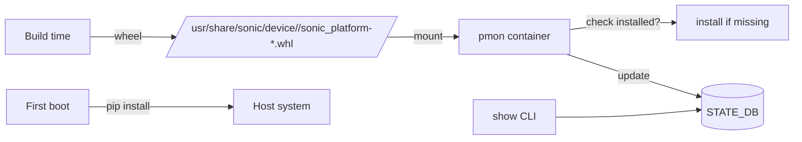

!!! warning "裏取りステータス: HLD-only / 旧設計から現行への移行記述"
    本ドキュメントは「旧 plugin 形式（`psuutil.py` 等の独立 plugin）」から「新 `sonic_platform` パッケージ階層」への移行を述べる、初期段階の HLD。現行 master では新 API がほぼ完全に普及済みだが、HLD の文面（特に "Current Solution" 節）は移行前の状態を述べている点に注意。

# 新 Platform API（sonic_platform / Chassis / PSU/Fan/Sfp の Python クラス階層）

## 概要

旧設計では `psuutil.py` / `sfputil.py` / `eeprom.py` 等を **独立した Python plugin** としてベンダーが個別に実装していたが、新設計では **すべてを 1 つの object-oriented パッケージ `sonic_platform` に統一** する[^1]。共通属性は `DeviceBase` 系の基底クラスにまとめ、ベンダーは具象クラス階層を一括で実装する。

これにより：

- 新規 device 追加時の plugin 増設が不要
- 共通属性（Presence / Model # / Serial #）はベース継承で済む
- 抽象メソッドはデフォルトで `NotImplementedError` を投げる「未実装 OK」設計で、ベース拡張で既存実装を壊さない

## 動作仕様

### クラス階層

```text
Platform
└── Chassis
    ├── base MAC / serial / EEPROM info / reboot cause / hw watchdog
    ├── env sensors / front-panel LEDs / status LEDs
    ├── PSU[0..p-1]
    ├── Fan[0..f-1]
    ├── SFP cage[0..s-1]
    └── Module[0..m-1]   (line card / supervisor card)
        ├── env sensors / LEDs
        ├── PSU[...] / Fan[...] / SFP cage[...]
```

### パッケージ構成

- 共通定義: `sonic-platform-common/sonic_platform_base/` （`Platform`, `Chassis`, `PsuBase`, `FanBase`, `SfpBase`, `ModuleBase` 等）
- ベンダー実装: 各 platform リポジトリの `platform/<vendor>/.../sonic_platform/` 配下に Python wheel として収まる

### 配置とロード



- ベンダーは build 時に `sonic_platform` パッケージを wheel にコンパイル。
- 初回ブート時、対応プラットフォーム用 wheel を `/usr/share/sonic/device/<PLATFORM>/` にコピー。
- pmon コンテナ起動時、`sonic_platform` が未インストールなら wheel をインストール。
- `pmon` 内の各デーモンが Platform API 経由でハードを読み、結果を STATE_DB に書く。
- ホスト側 CLI は STATE_DB を引いて表示。
- リアルタイム値（光モジュール光信号など）は CLI が DB に「読め」と書いて pmon デーモンが読み直す[^1]。

### 旧 → 新 API のサンプル比較

旧（`psuutil.py` plugin の動的ロード）：

```python
import imp, subprocess
# get platform/hwsku via sonic-cfggen
module = imp.load_source('psuutil', '/usr/share/sonic/device/.../plugins/psuutil.py')
platform_psuutil = module.PsuUtil()
print(platform_psuutil.get_psu_presence(1))
```

新：

```python
import sonic_platform
chassis = sonic_platform.platform.Platform().get_chassis()
psu1 = chassis.get_psu(1)
print(psu1.get_presence())
```

## 設定

### 関連する CONFIG_DB

HLD には CONFIG_DB エントリの記述は無い。

### 関連する CLI

新 API は CLI を直接定義しない。`pmon` 内のデーモンが書き込んだ STATE_DB を、既存の `show platform`、`show interfaces transceiver` 等の CLI が読み出す。

### 関連する YANG

HLD に YANG モデルの記述は無い。

### 設定例

ベンダー実装側の最小例（`sonic_platform/chassis.py`）：

```python
from sonic_platform_base.chassis_base import ChassisBase
from sonic_platform.psu import Psu

class Chassis(ChassisBase):
    def __init__(self):
        ChassisBase.__init__(self)
        for i in range(self.PSU_NUM):
            self._psu_list.append(Psu(i))
```

## 制限事項

- HLD 自体は移行設計の初期段階で、現行 master の `sonic-platform-common` のクラス階層と完全に一致するわけではない（後継 PR で多数のクラスが追加されている）。
- 旧 `psuutil.py` 等の plugin はしばらく後方互換のために残ったが、現行 master ではほぼ移行済み。
- `pmon` の wheel 自動インストール挙動はプラットフォームの初回ブートに依存する。

## 干渉する機能

- **xcvrd / pmon-d / fancontrold**: pmon コンテナ内の各デーモンが `sonic_platform` を import して使う。
- **`show platform` 系 CLI**: STATE_DB 経由で値を読むため、新 API 対応 platform でないと一部値が空になる。
- **fastboot / warm reboot**: pmon の再起動シーケンスで `sonic_platform` の再ロードが走る。

## トラブルシューティング

- `show platform psu` で値が出ない → pmon コンテナ内で `sonic_platform` が import できるか確認 (`docker exec pmon python3 -c 'import sonic_platform'`)。
- `NotImplementedError` が出る → ベンダー実装が当該メソッドを提供していない。`sonic-platform-common` の対応メソッドに対する placeholder 実装が必要。
- 新 plugin が読まれない → `/usr/share/sonic/device/<PLATFORM>/sonic_platform-*.whl` の存在と pmon の起動ログを確認。

## 引用元

[^1]: `sonic-net/SONiC` `doc/platform_api/new_platform_api.md` @ `49bab5b5ff0e924f1ea52b3d9db0dfa4191a7c06`
