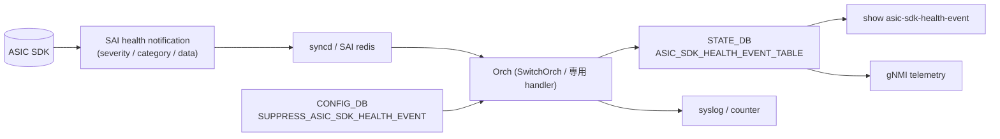

<!-- topics-tip -->
!!! tip "Topics で読み物として読む"
    この HLD は実装詳細を含む。機能の概念・設定・運用を読み物として読みたい場合は [Topics 14 章: Platform / Port / Optics](../topics/14-platform-port-optics/index.md) を参照。
<!-- /topics-tip -->

!!! info "裏取りステータス: code-verified"
    orchagent 側 health event handler は `sonic-swss/orchagent/switchorch.{h,cpp}`、CONFIG_DB suppress スキーマは `sonic-buildimage/src/sonic-yang-models/yang-models/sonic-suppress-asic-sdk-health-event.yang`、CLI は `sonic-utilities/{show,config}/main.py` および `tests/asic_sdk_health_event_test.py` で確認済み。SAI 側の各ベンダ実装の充足度は ASIC 依存。

# ASIC / SDK Health Event のハンドリング（SAI notification → STATE_DB → action）

## 概要

[ASIC](../reference/glossary.md#term-asic) / SDK が検出した内部不整合・FW assert・queue stuck・memory error などを **[SAI](../reference/glossary.md#term-sai) の health event 通知** として上に上げ、[SONiC](../reference/glossary.md#term-sonic) が運用フックに変換するパス[^1]。狙い:

- 従来 platform-specific ログに埋もれていた重要イベントを **共通スキーマで [STATE_DB](../reference/glossary.md#term-state_db) に出す**
- syslog / show / telemetry のいずれからも一貫した形で観測可能にする
- 重要度ごとに **shutdown / log-only / ignore** の運用ポリシーを設定できる

## 動作仕様



### イベントスキーマ（実装由来）

`switchorch.cpp` の `onSwitchAsicSdkHealthEvent()` が STATE_DB の `ASIC_SDK_HEALTH_EVENT_TABLE` に書く実体は以下のとおり[^2]。

- **Key**: `sai_timestamp` を `%Y-%m-%d %H:%M:%S` 形式で localtime 整形した文字列。vendor SAI が異常に大きい timestamp を渡した場合は現在時刻に差し替える防衛コードあり[^2]
- **Field**:
    - `severity` — `fatal` / `warning` / `notice` のいずれか[^3]
    - `category` — `software` / `firmware` / `cpu_hw` / `asic_hw` のいずれか[^4]
    - `description` — vendor SAI からの可変長 byte 列。0x0d / 0x0a 以外の非印字文字は除去される[^2]
- **追加 syslog**: severity=fatal は `SWSS_LOG_ERROR`、それ以外は `SWSS_LOG_NOTICE`。さらに `event_publish(g_events_handle, "asic-sdk-health-event", ...)` で sonic-events 経由の telemetry にも publish される[^2]

!!! warning "HLD と実装の差分"
    上位 HLD では category を「ASIC firmware / SDK / link / packet / temperature / memory ...」のように示唆するが、実装の community SAI enum は **4 値 (software / firmware / cpu_hw / asic_hw)** に正規化されている[^4]。「link」「packet」「temperature」等の細分類は description 文字列内の vendor 任意フォーマットに格下げされている点に注意。

### Suppress（抑制）

[CONFIG_DB](../reference/glossary.md#term-config_db) の `SUPPRESS_ASIC_SDK_HEALTH_EVENT` テーブルで **特定の severity / category を出さない** 設定が可能。orchagent は起動時と `SUPPRESS_ASIC_SDK_HEALTH_EVENT` テーブル更新時の双方で `registerAsicSdkHealthEventCategories()` を呼び、`SAI_SWITCH_ATTR_REG_{FATAL,WARNING,NOTICE}_SWITCH_ASIC_SDK_HEALTH_CATEGORY` に **「通知させたい category 集合」（universal_set から suppressed を引いたもの）** を設定し直す[^5]。つまり SUPPRESS は orchagent 内のフィルタではなく、SAI レイヤでの register 解除として実装されている。

## 設定

### 関連する CONFIG_DB

| Table | Key | Field | 説明 |
|-------|-----|-------|------|
| `SUPPRESS_ASIC_SDK_HEALTH_EVENT` | `<severity>` (`fatal` / `warning` / `notice`) | `categories` (leaf-list: `software` / `firmware` / `cpu_hw` / `asic_hw`), `max_events` (uint32) | 当該 severity で **suppress** したい category 集合と、保持する最大イベント数[^6] |

### 関連する CLI

| Command | 用途 |
|---------|------|
| `show asic-sdk-health-event` | 観測されたイベント一覧 |
| `show asic-sdk-health-event suppressed-categories` | 抑制中 category |
| `config asic-sdk-health-event suppress <severity> <categories>` | 抑制設定 |

## 制限事項

- **SAI 実装依存**: SAI vendor が health notification を上げない場合、本機構は動かない
- **抑制で見えなくなる**: ハードウェア障害解析時は抑制設定を一旦解除する必要がある
- **解釈は category 名にしか頼れない**: 詳細メッセージは vendor 文字列でフォーマットが固まっていない

## 干渉する機能

- **syslog rate limit**: イベント大量発生時に rate-limit でドロップされる可能性
- **system health monitor**: critical イベントを system health の状態に統合する設計
- **telemetry / dial-out**: STATE_DB の表を subscribe して外部送信
- **SAI failure handling / dump-on-sai-failure**: SAI API call 失敗のハンドリングと相補（こちらは notification ベース）

## トラブルシューティング

- イベントが出ない → vendor SAI が notification を register しているか、[orchagent](../reference/glossary.md#term-orchagent) ログを確認
- `show` で何も出ない → STATE_DB `ASIC_SDK_HEALTH_EVENT_TABLE` を `redis-cli` で直接確認
- 抑制が効かない → `SUPPRESS_ASIC_SDK_HEALTH_EVENT` の key 名と category 名のスペル確認

### コマンド例

SAI / SDK のエラーログと dump を確認する。

```bash
# SAI failure / SDK health
docker logs syncd 2>&1 | grep -iE 'sai_status|fail|error' | tail
ls -lt /var/dump/ | head
show techsupport --silent --since '1 hour ago'
redis-cli -n 6 keys 'ASIC_SDK_HEALTH_EVENT*'
```

## 引用元

[^1]: `sonic-net/SONiC` `doc/handle-ASIC-SDK-health-event/handle-ASIC-SDK-health-event.md` @ `49bab5b5ff0e924f1ea52b3d9db0dfa4191a7c06`
[^2]: `sonic-net/sonic-swss` `orchagent/switchorch.cpp` `SwitchOrch::onSwitchAsicSdkHealthEvent()` L1578-L1670（STATE_DB 書き込みと description サニタイズ、event_publish）
[^3]: `sonic-net/sonic-swss` `orchagent/switchorch.cpp` L78-L83 `switch_asic_sdk_health_event_severity_reverse_map`（`fatal` / `warning` / `notice` への文字列化）
[^4]: `sonic-net/sonic-swss` `orchagent/switchorch.cpp` L85-L107 `switch_asic_sdk_health_event_category_reverse_map` および `_universal_set`（`software` / `firmware` / `cpu_hw` / `asic_hw`）
[^5]: `sonic-net/sonic-swss` `orchagent/switchorch.cpp` `SwitchOrch::registerAsicSdkHealthEventCategories()` L1366-L1408 および `doCfgSuppressAsicSdkHealthEventTableTask()` L1410-L1487
[^6]: `sonic-net/sonic-buildimage` `src/sonic-yang-models/yang-models/sonic-suppress-asic-sdk-health-event.yang` L27-L60

<!-- concerns hint:
- 2026-06: severity / category enum と STATE_DB スキーマを switchorch.cpp と sonic-suppress-asic-sdk-health-event.yang から直接裏取り済 (footnote [^2]-[^6])
- 残課題: system health monitor / dump-on-sai-failure 側との具体的な status 連携 (どの DB key を共有するか) は別ページで深掘り余地あり
-->

<!-- glossary-links-injected: 896d391185a9 -->
