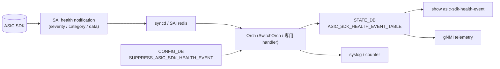

<!-- topics-tip -->
!!! tip "Topics で読み物として読む"
    この HLD は実装詳細を含みます。機能の概念・設定・運用を読み物として読みたい場合は [Topics 14 章: Platform / Port / Optics](../topics/14-platform-port-optics/index.md) を参照。
<!-- /topics-tip -->

!!! info "裏取りステータス: code-verified"
    orchagent 側 health event handler は `sonic-swss/orchagent/switchorch.{h,cpp}`、CONFIG_DB suppress スキーマは `sonic-buildimage/src/sonic-yang-models/yang-models/sonic-suppress-asic-sdk-health-event.yang`、CLI は `sonic-utilities/{show,config}/main.py` および `tests/asic_sdk_health_event_test.py` で確認済み。SAI 側の各ベンダ実装の充足度は ASIC 依存。

# ASIC / SDK Health Event のハンドリング（SAI notification → STATE_DB → action）

## 概要

[ASIC](../reference/glossary.md#term-asic) / SDK が検出した内部不整合・FW assert・queue stuck・memory error などを **[SAI](../reference/glossary.md#term-sai) の health event 通知** として上に上げ、[SONiC](../reference/glossary.md#term-sonic) が運用フックに変換するパス[^1]。狙い:

- 従来 platform-specific ログに埋もれていた重要イベントを **共通スキーマで [STATE_DB](../reference/glossary.md#term-state_db) に出す**
- syslog / show / telemetry のいずれからも一貫した形で観測可能にする
- 重要度ごとに **shutdown / log-only / ignore** の運用ポリシーを設定できる

## 動作仕様



イベントスキーマ（[HLD](../reference/glossary.md#term-hld) 概念）[^1]:

- **severity**: fatal / warning / notice
- **category**: ASIC firmware / SDK / link / packet / temperature / memory ...
- **timestamp**, **count**, **description**
- **action policy**: severity ごとに「ログのみ」「カウンタ計上」「critical 通知」を区別

### Suppress（抑制）

`SUPPRESS_ASIC_SDK_HEALTH_EVENT` テーブルで **特定の severity / category を出さない** 設定が可能。誤検知が頻発する platform で運用上のノイズを下げるための機構。

## 設定

### 関連する CONFIG_DB

| Table | Key | 説明 |
|-------|-----|------|
| `SUPPRESS_ASIC_SDK_HEALTH_EVENT` | `<severity>` | 抑制対象 category のリスト等 |

### 関連する CLI

| Command | 用途 |
|---------|------|
| `show asic-sdk-health-event` | 観測されたイベント一覧 |
| `show asic-sdk-health-event suppressed-categories` | 抑制中 category |
| `config asic-sdk-health-event suppress <severity> <categories>` | 抑制設定 |

## 制限事項

- **SAI 実装依存**: SAI vendor が health notification を上げない場合、本機構は動かない
- **抑制で見えなくなる**: ハードウェア障害解析時は抑制設定を一旦解除する必要がある
- **解釈は category 名にしか頼れない**: 詳細メッセージは vendor 文字列でフォーマットが固まっていない

## 干渉する機能

- **syslog rate limit**: イベント大量発生時に rate-limit でドロップされる可能性
- **system health monitor**: critical イベントを system health の状態に統合する設計
- **telemetry / dial-out**: STATE_DB の表を subscribe して外部送信
- **SAI failure handling / dump-on-sai-failure**: SAI API call 失敗のハンドリングと相補（こちらは notification ベース）

## トラブルシューティング

- イベントが出ない → vendor SAI が notification を register しているか、[orchagent](../reference/glossary.md#term-orchagent) ログを確認
- `show` で何も出ない → STATE_DB `ASIC_SDK_HEALTH_EVENT_TABLE` を `redis-cli` で直接確認
- 抑制が効かない → `SUPPRESS_ASIC_SDK_HEALTH_EVENT` の key 名と category 名のスペル確認

### コマンド例

SAI / SDK のエラーログと dump を確認する。

```bash
# SAI failure / SDK health
docker logs syncd 2>&1 | grep -iE 'sai_status|fail|error' | tail
ls -lt /var/dump/ | head
show techsupport --silent --since '1 hour ago'
redis-cli -n 6 keys 'ASIC_SDK_HEALTH_EVENT*'
```

## 引用元

[^1]: `sonic-net/SONiC` `doc/handle-ASIC-SDK-health-event/handle-ASIC-SDK-health-event.md` @ `49bab5b5ff0e924f1ea52b3d9db0dfa4191a7c06`

<!-- concerns hint:
- SAI health notification API（SAI_SWITCH_ATTR_*_NOTIFY 系）の community SAI 取り込み確認
- orchagent 側 health event handler の現行実装存在確認
- STATE_DB ASIC_SDK_HEALTH_EVENT_TABLE スキーマの現行値確認
- CONFIG_DB SUPPRESS_ASIC_SDK_HEALTH_EVENT スキーマと sonic-yang-models 取り込み確認
- show asic-sdk-health-event / config asic-sdk-health-event CLI の sonic-utilities 取り込み確認
- system health / dump-on-sai-failure / telemetry との統合経路の現行実装確認
-->

<!-- glossary-links-injected: ec18b66e3507 -->
