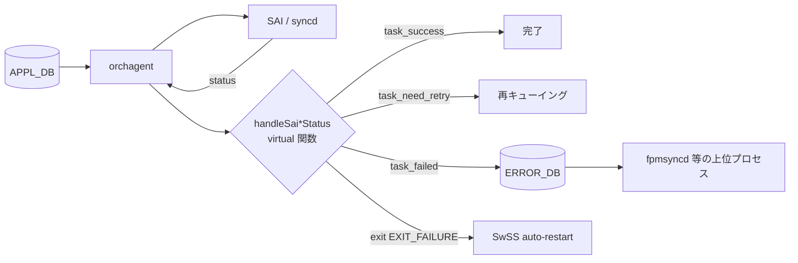

!!! warning "裏取りステータス: HLD-only / 採否不明な提案"
    HLD は改訂日付未記載で、本文中に複数の `TODO` が残る Proposal 段階の文書。`Orch` の `handleSai*Status` virtual 関数群と `ERROR_DB` の実装存在は要裏取り。

# SAI 失敗ハンドリング（handleSai*Status virtual + ERROR_DB）

## 概要

`orchagent` は APPL_DB 経由で受けた要求を SAI コール列に展開して syncd / SAI に投げる。SAI が失敗を返した場合の振る舞いはこれまで Orch ごとに散発的に書かれており、**統一された失敗ハンドリング枠組みが無かった**。本 HLD はその枠組みとして次の 2 点を導入する[^1]:

1. **`Orch` 基底クラスに 4 つの virtual 関数** (`handleSaiCreate/Set/Remove/Get Status`) を追加し、Create/Set/Remove/Get それぞれで失敗時動作を共通化／個別化する
2. **`ERROR_DB`** を新設し、orchagent で解決できない失敗を上位（fpmsyncd 等）にエスカレーションする経路を作る

## 動作仕様

### 失敗ハンドリング全体像



orchagent は同期モードで SAI status を受け取り、失敗時に **第一段で** virtual 関数で対応を試み、解決できなければ ERROR_DB に push して上位に処理を委ねる[^1]。

### Orch の virtual 関数

`Orch` 基底クラスに次の 4 関数を追加する[^1]:

```cpp
virtual task_process_status handleSaiCreateStatus(sai_api_t api, sai_status_t status, void *context = nullptr);
virtual task_process_status handleSaiSetStatus   (sai_api_t api, sai_status_t status, void *context = nullptr);
virtual task_process_status handleSaiRemoveStatus(sai_api_t api, sai_status_t status, void *context = nullptr);
virtual task_process_status handleSaiGetStatus   (sai_api_t api, sai_status_t status, void *context = nullptr);
```

- `api` と `status` から判定する
- 個別 Orch（`RouteOrch` 等）が override して固有ロジックを差し込める
- `context` は失敗時に ERROR_DB へ詳細情報（オブジェクト・属性等）を持ち上げるための optional パラメータ

### 戻り値の意味

| 戻り値 | 動作 | 例 |
|--------|------|-----|
| `task_success` | crash しない、retry しない、正常終了扱い | Remove で `SAI_STATUS_ITEM_NOT_FOUND` |
| `task_failed`  | crash しない、retry しない、orchagent は走り続けるが ERROR_DB に上げる | 不正な ACL、IP 衝突、HW permanent error |
| `task_need_retry` | crash しない、後で retry | 一時的に解決可能と見込める失敗 |
| `exit(EXIT_FAILURE)` | プロセス crash、SwSS auto-restart | SwSS 再起動で解消可能な失敗 |

`task_failed` ケースは「再試行しても直らない」ことが分かっている場合のため、`task_need_retry` と区別される[^1]。

### `SAI status` × Operation の対応表

HLD の現状版（`TODO` 多数）で記述されている主要対応[^1]:

| SAI status | Create | Set | Remove | Get |
|------------|--------|-----|--------|-----|
| `ITEM_ALREADY_EXISTS` | 対応する attribute を Set にフォールバック | should not happen / no retry | should not happen / no retry | should not happen / no retry |
| `ITEM_NOT_FOUND` | should not happen / no retry | item を作って attribute を set | success 返却（no retry）| no retry |
| `OBJECT_IN_USE` | should not happen / no retry | しばらく待って retry | しばらく待って retry | should not happen / no retry |
| `NOT_SUPPORTED` | crash orchagent | crash orchagent | crash orchagent | crash orchagent |

`NOT_SUPPORTED` は **設計時に SAI 能力チェック済みのはず** の状況なので、出たら crash させる方針[^1]。

その他 status・SAI API 別・Orch 別ロジックは HLD 内 `TODO` セクションに残されており、設計はまだ進行中[^1]。

### ERROR_DB スキーマ

orchagent から上位プロセスへのエスカレーション用 DB として ERROR_DB を新設する[^1]:

```
ERROR_{{DB_TYPE}}_{{TABLE_TYPE}}_TABLE|entry
  failed_orch  = <type>          ; どの Orch で発生したか
  failed_SAI   = <type>          ; どの SAI で発生したか
  opcode       = CREATE | SET | DELETE
  status       = <sai_status>
  attributes   = "attr_type0,attr_type1,..."  (optional)
  attr_values  = "attr_value0,attr_value1,..." (optional)
  counter      = <count>         ; 同 entry の連続失敗回数
```

例: APPL_DB の `ROUTE_TABLE:0.0.0.0/0` での SAI 失敗 → ERROR_DB に `ERROR_APPL_ROUTE_TABLE:0.0.0.0/0` として記録される[^1]。

`counter` は同一エントリでの失敗連続回数。ハンドリング戦略の入力に使える。

<!-- evidence:
source: sonic-net/SONiC/doc/SAI_failure_handling/SAI_failure_handling.md#L66-L99 (sha: 49bab5b5ff0e924f1ea52b3d9db0dfa4191a7c06)
excerpt: |
  An ERROR_DB will be introduced to escalate the failures from orchagent to upper layers such as fpmsyncd.
  ... The table and key in ERROR_DB correspond to the DB, table, and key where SAI failures happen
  ... The upstream processes are expected to consume the ERROR_DB entries and remove the handled failures
reasoning: ERROR_DB のキー命名規則と上位プロセス側コンシューム責務の根拠。
-->

### 上位プロセス側の責務

ERROR_DB は **上位プロセスが消費して削除する** 前提で設計される。fpmsyncd 等が処理ロジックを実装すれば ERROR_DB は溜まり続けない。ただし HLD は **「現時点で上位プロセスはこれを消費するロジックを持っていないため、別途追加が必要」** と明記している[^1]。

## 設定

### 関連する CONFIG_DB / CLI / YANG

外部設定表面は無い。すべて orchagent 内部 + ERROR_DB（Redis）に閉じる。

## 制限事項

- **HLD 自体が未完**: 「Other SAI statuses」「SAI API 別」「Orch 別」の対応表が `TODO` で空。実装は段階的に進む見込み[^1]。
- **上位プロセス側未対応**: ERROR_DB を消費するロジックが fpmsyncd 等に追加されないと、ERROR_DB はメモリに溜まり続けるリスクがある[^1]。
- **`NOT_SUPPORTED` で常に crash**: 健全な前提だが、SAI 実装が誤って `NOT_SUPPORTED` を返すバグがあると orchagent が無限再起動ループに陥る可能性がある。
- **Warm boot との整合**: 未処理の SAI 失敗が ERROR_DB に残った状態で warm reboot を打つことを禁止する。pre-warm-reboot check に ERROR_DB チェックを追加する設計[^1]。

## 干渉する機能

- **fpmsyncd / その他 APPL_DB writer**: ERROR_DB の主要消費者として想定。失敗を見て APPL_DB の該当エントリを引き戻す等の戦略が期待される。
- **SwSS auto-restart**: `exit(EXIT_FAILURE)` 経路は systemd の SwSS 再起動を前提とする。再起動で解消しない失敗を crash させると無限ループ。
- **既存 Orch のエラーパス**: 個別 Orch が独自に書いていた `SWSS_LOG_ERROR` ベースのハンドリングは段階的にこの virtual 関数経由に統合される想定。

## トラブルシューティング

- ERROR_DB が増え続ける: 上位プロセス側の消費ロジック未実装または停止を疑う。fpmsyncd 等のログを確認。
- orchagent が頻繁に再起動する: `exit(EXIT_FAILURE)` 経路を踏んでいる。`NOT_SUPPORTED` 等の crash 条件が立っていないか SAI status を syslog で確認。
- 同じエントリで `counter` が増え続ける: `task_need_retry` で再試行ループに入っている可能性。条件が解消しないなら `task_failed` 化を検討。

## 引用元

[^1]: `sonic-net/SONiC` `doc/SAI_failure_handling/SAI_failure_handling.md` @ `49bab5b5ff0e924f1ea52b3d9db0dfa4191a7c06`
