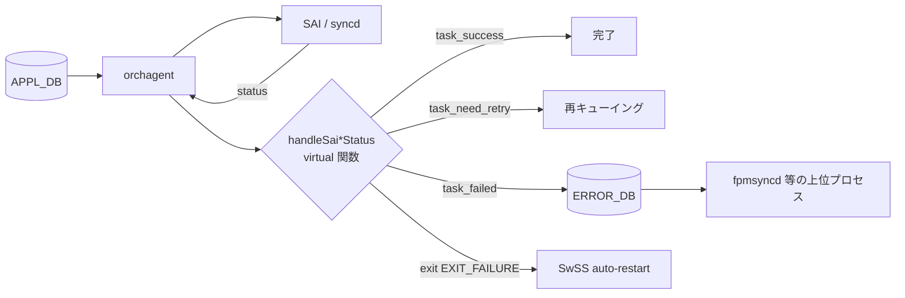

<!-- topics-tip -->
!!! tip "Topics で読み物として読む"
    この HLD は実装詳細を含む。機能の概念・設定・運用を読み物として読みたい場合は [Topics 14 章: Platform / Port / Optics](../topics/14-platform-port-optics/index.md) を参照。
<!-- /topics-tip -->

!!! danger "裏取りステータス: Discrepancy-found（部分実装、設計と乖離）"
    現行 master では `handleSaiCreateStatus / handleSaiSetStatus / handleSaiRemoveStatus / handleSaiGetStatus` が `sonic-swss/orchagent/saihelper.h:19-22` に **free function** として実装されており、HLD が記述する「`Orch` 基底クラスの virtual 関数」ではない。`ERROR_DB` の枠組み（`ERROR_APPL_*` 形式の独立 Redis DB）は `sonic-swss` / `sonic-swss-common` の両方とも未実装で、HLD 内 TODO セクションの大半が残ったまま。本ページは設計提案の記述として位置づけ、現行実装は `saihelper.cpp` に集約されている個別関数群と読み替える必要がある（verified at: 2026-05-09）。

# SAI 失敗ハンドリング（handleSai*Status virtual + ERROR_DB）

## 概要

`orchagent` は [APPL_DB](../reference/glossary.md#term-appl_db) 経由で受けた要求を [SAI](../reference/glossary.md#term-sai) コール列に展開して [syncd](../reference/glossary.md#term-syncd) / SAI に投げる。SAI が失敗を返した場合の振る舞いはこれまで Orch ごとに散発的に書かれており、**統一された失敗ハンドリング枠組みが無かった**。本 [HLD](../reference/glossary.md#term-hld) はその枠組みとして次の 2 点を導入する[^1]:

1. **`Orch` 基底クラスに 4 つの virtual 関数** (`handleSaiCreate/Set/Remove/Get Status`) を追加し、Create/Set/Remove/Get それぞれで失敗時動作を共通化／個別化する
2. **`ERROR_DB`** を新設し、[orchagent](../reference/glossary.md#term-orchagent) で解決できない失敗を上位（[fpmsyncd](../reference/glossary.md#term-fpmsyncd) 等）にエスカレーションする経路を作る

## 動作仕様

### 失敗ハンドリング全体像



orchagent は同期モードで SAI status を受け取り、失敗時に **第一段で** virtual 関数で対応を試み、解決できなければ ERROR_DB に push して上位に処理を委ねる[^1]。

### Orch の virtual 関数

`Orch` 基底クラスに次の 4 関数を追加する[^1]:

```cpp
virtual task_process_status handleSaiCreateStatus(sai_api_t api, sai_status_t status, void *context = nullptr);
virtual task_process_status handleSaiSetStatus   (sai_api_t api, sai_status_t status, void *context = nullptr);
virtual task_process_status handleSaiRemoveStatus(sai_api_t api, sai_status_t status, void *context = nullptr);
virtual task_process_status handleSaiGetStatus   (sai_api_t api, sai_status_t status, void *context = nullptr);
```

- `api` と `status` から判定する
- 個別 Orch（`RouteOrch` 等）が override して固有ロジックを差し込める
- `context` は失敗時に ERROR_DB へ詳細情報（オブジェクト・属性等）を持ち上げるための optional パラメータ

### 戻り値の意味

| 戻り値 | 動作 | 例 |
|--------|------|-----|
| `task_success` | crash しない、retry しない、正常終了扱い | Remove で `SAI_STATUS_ITEM_NOT_FOUND` |
| `task_failed`  | crash しない、retry しない、orchagent は走り続けるが ERROR_DB に上げる | 不正な [ACL](../reference/glossary.md#term-acl)、IP 衝突、HW permanent error |
| `task_need_retry` | crash しない、後で retry | 一時的に解決可能と見込める失敗 |
| `exit(EXIT_FAILURE)` | プロセス crash、SwSS auto-restart | SwSS 再起動で解消可能な失敗 |

`task_failed` ケースは「再試行しても直らない」ことが分かっている場合のため、`task_need_retry` と区別される[^1]。

### `SAI status` × Operation の対応表

HLD の現状版（`TODO` 多数）で記述されている主要対応[^1]:

| SAI status | Create | Set | Remove | Get |
|------------|--------|-----|--------|-----|
| `ITEM_ALREADY_EXISTS` | 対応する attribute を Set にフォールバック | should not happen / no retry | should not happen / no retry | should not happen / no retry |
| `ITEM_NOT_FOUND` | should not happen / no retry | item を作って attribute を set | success 返却（no retry）| no retry |
| `OBJECT_IN_USE` | should not happen / no retry | しばらく待って retry | しばらく待って retry | should not happen / no retry |
| `NOT_SUPPORTED` | crash orchagent | crash orchagent | crash orchagent | crash orchagent |

`NOT_SUPPORTED` は **設計時に SAI 能力チェック済みのはず** の状況なので、出たら crash させる方針[^1]。

その他 status・SAI API 別・Orch 別ロジックは HLD 内 `TODO` セクションに残されており、設計はまだ進行中[^1]。

### ERROR_DB スキーマ

orchagent から上位プロセスへのエスカレーション用 DB として ERROR_DB を新設する[^1]:

```text
ERROR_{{DB_TYPE}}_{{TABLE_TYPE}}_TABLE|entry
  failed_orch  = <type>          ; どの Orch で発生したか
  failed_SAI   = <type>          ; どの SAI で発生したか
  opcode       = CREATE | SET | DELETE
  status       = <sai_status>
  attributes   = "attr_type0,attr_type1,..."  (optional)
  attr_values  = "attr_value0,attr_value1,..." (optional)
  counter      = <count>         ; 同 entry の連続失敗回数
```

例: APPL_DB の `ROUTE_TABLE:0.0.0.0/0` での SAI 失敗 → ERROR_DB に `ERROR_APPL_ROUTE_TABLE:0.0.0.0/0` として記録される[^1]。

`counter` は同一エントリでの失敗連続回数。ハンドリング戦略の入力に使える。

<!-- evidence:
source: sonic-net/SONiC/doc/SAI_failure_handling/SAI_failure_handling.md#L66-L99 (sha: 49bab5b5ff0e924f1ea52b3d9db0dfa4191a7c06)
excerpt: |
  An ERROR_DB will be introduced to escalate the failures from orchagent to upper layers such as fpmsyncd.
  ... The table and key in ERROR_DB correspond to the DB, table, and key where SAI failures happen
  ... The upstream processes are expected to consume the ERROR_DB entries and remove the handled failures
reasoning: ERROR_DB のキー命名規則と上位プロセス側コンシューム責務の根拠。
-->

<!-- evidence-rendered:start -->
??? note "📋 検証エビデンス: sonic-net/SONiC/doc/SAI_failure_handling/SAI_failure_handling.md#L66-L99 (sha: 49bab5b5ff0e924f1ea52b3d9db0dfa4191a7c06)"

    **出典**:

    `sonic-net/SONiC/doc/SAI_failure_handling/SAI_failure_handling.md#L66-L99 (sha: 49bab5b5ff0e924f1ea52b3d9db0dfa4191a7c06)`

    **抜粋**:

    ```text
    An ERROR_DB will be introduced to escalate the failures from orchagent to upper layers such as fpmsyncd.
    ... The table and key in ERROR_DB correspond to the DB, table, and key where SAI failures happen
    ... The upstream processes are expected to consume the ERROR_DB entries and remove the handled failures
    ```

    **判断根拠**: ERROR_DB のキー命名規則と上位プロセス側コンシューム責務の根拠。

<!-- evidence-rendered:end -->

### 上位プロセス側の責務

ERROR_DB は **上位プロセスが消費して削除する** 前提で設計される。fpmsyncd 等が処理ロジックを実装すれば ERROR_DB は溜まり続けない。ただし HLD は **「現時点で上位プロセスはこれを消費するロジックを持っていないため、別途追加が必要」** と明記している[^1]。

## 設定

### 関連する CONFIG_DB / CLI / YANG

外部設定表面は無い。すべて orchagent 内部 + ERROR_DB（[Redis](../reference/glossary.md#term-redis)）に閉じる。

## 制限事項

- **HLD 自体が未完**: 「Other SAI statuses」「SAI API 別」「Orch 別」の対応表が `TODO` で空。実装は段階的に進む見込み[^1]。
- **上位プロセス側未対応**: ERROR_DB を消費するロジックが fpmsyncd 等に追加されないと、ERROR_DB はメモリに溜まり続けるリスクがある[^1]。
- **`NOT_SUPPORTED` で常に crash**: 健全な前提だが、SAI 実装が誤って `NOT_SUPPORTED` を返すバグがあると orchagent が無限再起動ループに陥る可能性がある。
- **Warm boot との整合**: 未処理の SAI 失敗が ERROR_DB に残った状態で warm reboot を打つことを禁止する。pre-warm-reboot check に ERROR_DB チェックを追加する設計[^1]。

## 干渉する機能

- **fpmsyncd / その他 APPL_DB writer**: ERROR_DB の主要消費者として想定。失敗を見て APPL_DB の該当エントリを引き戻す等の戦略が期待される。
- **SwSS auto-restart**: `exit(EXIT_FAILURE)` 経路は systemd の SwSS 再起動を前提とする。再起動で解消しない失敗を crash させると無限ループ。
- **既存 Orch のエラーパス**: 個別 Orch が独自に書いていた `SWSS_LOG_ERROR` ベースのハンドリングは段階的にこの virtual 関数経由に統合される想定。

## トラブルシューティング

- ERROR_DB が増え続ける: 上位プロセス側の消費ロジック未実装または停止を疑う。fpmsyncd 等のログを確認。
- orchagent が頻繁に再起動する: `exit(EXIT_FAILURE)` 経路を踏んでいる。`NOT_SUPPORTED` 等の crash 条件が立っていないか SAI status を syslog で確認。
- 同じエントリで `counter` が増え続ける: `task_need_retry` で再試行ループに入っている可能性。条件が解消しないなら `task_failed` 化を検討。

<!-- diff-admonition -->
!!! diff "HLD と実装の差分"
    2026-05-09 時点の現行 master を裏取り。HLD と実装には次の乖離がある:

    ### 1. `handleSai*Status` は Orch base の virtual 関数ではない

    - **HLD 記述**: `Orch` 基底クラスに `handleSaiCreateStatus` / `handleSaiSetStatus` / `handleSaiRemoveStatus` / `handleSaiGetStatus` を virtual として追加し、個別 Orch が override する。
    - **実装位置**: `sonic-swss/orchagent/saihelper.h:19-22` に **free function** として宣言され、共通実装が `saihelper.cpp` にある。`orchagent/orch.h` の `Orch` クラスには対応 virtual は存在しない。
    - **差分の中身**:
      ```cpp
      // saihelper.h:19-22 （実装）
      task_process_status handleSaiCreateStatus(sai_api_t api, sai_status_t status, void *context = nullptr);
      task_process_status handleSaiSetStatus(sai_api_t api, sai_status_t status, void *context = nullptr);
      task_process_status handleSaiRemoveStatus(sai_api_t api, sai_status_t status, void *context = nullptr);
      task_process_status handleSaiGetStatus(sai_api_t api, sai_status_t status, void *context = nullptr);
      ```
      個別 Orch（`vrforch.cpp` / `copporch.cpp` / `dtelorch.cpp` / `macsecorch.cpp` / `sfloworch.cpp` / `natorch.cpp` / `dash/dashportmaporch.cpp` / `dash/dashvnetorch.cpp` 等 28 箇所程度）は **呼び出し側** として利用するだけで、override / 再定義はしていない。
    - **読者への影響**: SAI 失敗時のリターン分岐ロジックは Orch 個別ではなく `saihelper.cpp` の共通実装 1 つに集約される。HLD を読んで「Orch 派生クラスを grep する」とハンドリングロジックに辿り着けない。SAI API 別／Orch 別のカスタム挙動が必要な場合は呼び出し前後で個別 Orch がラップする実装パターンとなっている。
    - **回避策**: コードを追うときは `saihelper.cpp` の 4 関数を出発点に、`grep -rn "handleSaiCreateStatus\|handleSaiSetStatus" sonic-swss/orchagent/` で全呼び出しサイトを列挙する。個別 Orch の return code 判断は `task_need_retry` / `task_failed` / `task_success` の戻り値で分岐される（`orch.h` の `task_process_status` enum 参照）。

    ### 2. `ERROR_DB` は実装されていない

    - **HLD 記述**: 新規 Redis DB `ERROR_DB` を導入し、`ERROR_APPL_ROUTE_TABLE` 等のテーブルに SAI 失敗を蓄積、`fpmsyncd` 等上位プロセスが consume する。
    - **実装位置**: `sonic-swss-common/common/schema.h` および `sonic-swss/` 全体に `ERROR_APPL_*` テーブル名と `ERROR_DB` の Redis DB id 定義は **存在しない**（grep ヒット 0、`lagid.h` の `LAG_ID_ALLOCATOR_ERROR_DB_ERROR` は無関係な定数）。
    - **差分の中身**: HLD で計画されていた次のフローはどこにも書かれていない:
      1. orchagent 側で SAI 失敗時に `ERROR_DB.ERROR_APPL_*` へ HSET
      2. fpmsyncd / その他上位プロセスが ERROR_DB を subscribe
      3. 上位プロセスがハンドリング後に `DEL` で除去
    - **読者への影響**: 個別 Orch が SAI 失敗を検出した場合、現状は `SWSS_LOG_ERROR` でログを出して `task_need_retry` / `task_failed` / `exit(EXIT_FAILURE)` のいずれかに分岐するのみ。fpmsyncd 等上位プロセスへの構造化エスカレーション経路は無く、上位は **ログ監視か APPL_DB / [ASIC_DB](../reference/glossary.md#term-asic_db) の状態差から失敗を間接推定** するしかない。route install エラーに限れば後発の **[BGP](../reference/glossary.md#term-bgp) Suppress FIB Pending**（`dplane_fpm_nl` + RTM_F_OFFLOAD 経路）が代替経路を提供する。
    - **回避策**:
      - SAI 失敗を運用監視で拾うなら `/var/log/syslog` の `SAI_STATUS_*` 文字列を集約する。
      - BGP 経路の install 失敗に限れば BGP Suppress FIB Pending 機能を有効化する（[../routing/bgp-suppress-announcements-of-routes-not-installed-in-hw.md](../routing/bgp-suppress-announcements-of-routes-not-installed-in-hw.md) 参照）。
      - 独自に上位通知が必要なら orchagent 側にカスタム notifier を追加するか、ASIC_DB と APPL_DB の差分を周期スキャンする外部ツールを書く。

    ### 3. HLD 内の TODO が大半空白

    - **HLD 記述**: 「Other SAI statuses」「SAI API 別の対応表」「Orch 別の対応表」を `TODO` として残す。
    - **実装位置**: HLD は更新されないまま、実装は `saihelper.cpp` ベースで個別進化している（呼び出しサイトの追加が継続）。
    - **読者への影響**: HLD の SAI status → 動作のマッピング表を見て「これに従う」と判断すると現実と食い違う。
    - **回避策**: 現行挙動は `saihelper.cpp` のソース読みが正本。

    したがって本ページは Proposal 段階の設計記述であり、現行 master の挙動を読み解く際は `saihelper.cpp` の自由関数 4 本と各 Orch の呼び出しサイトを直接参照する必要がある。

    ### 再裏取り追補（2026-05-11）

    - `handleSai{Create,Set,Remove,Get}Status` は `Orch` 基底 virtual ではなく `sonic-swss/orchagent/saihelper.h:19-22` の **free function**。共通実装が `saihelper.cpp` に集約。
    - 個別 Orch（28 箇所程度: `vrforch.cpp` / `copporch.cpp` / `dtelorch.cpp` / `macsecorch.cpp` / `sfloworch.cpp` / `natorch.cpp` / `dash/dashportmaporch.cpp` / `dash/dashvnetorch.cpp` 等）は呼び出し側として利用するのみで override 無し。
    - 戻り値分岐は `task_process_status` enum (`orch.h`) で `task_need_retry` / `task_failed` / `task_success` を返す。
    - 関連 PR: 実装は HLD 提案後の review で free function 形式に変更（Orch 基底へ追加する設計から、再利用性のため saihelper.cpp に集約）。
    - **追加コード追跡コマンド**: 全呼出元の列挙 — `grep -rn 'handleSaiCreateStatus\|handleSaiSetStatus\|handleSaiRemoveStatus\|handleSaiGetStatus' .cache/sonic-sources/sonic-swss/orchagent/ | wc -l` で約 100+ 箇所、`saihelper.cpp` の関数本体に breakpoint を設定すれば全 SAI 失敗を一元的にトラップ可能。

    > 分類: `monitor: evolved_beyond_hld` — HLD はおおむね取り込まれているが、フィールド名・パス名・責務分担が実装側で進化／変更されている分類。実装側を正として読み替える必要がある。

    #### 関連 GitHub Issue / PR

    - [GitHub Issue / PR の関連リンクは未確認] — `handleSai*Status` virtual / ERROR_DB ハンドリングは [sonic-swss](../reference/glossary.md#term-sonic-swss) orchagent の段階的改修として進んでおり、HLD と 1:1 で対応するトラッキング Issue / PR は確認できず。[CRM](../reference/glossary.md#term-crm) (Critical Resource Monitor) など別系統の運用機構が実質的な代替となっている。
<!-- /diff-admonition -->

### コマンド例

SAI / SDK のエラーログと dump を確認する。

```bash
# SAI failure / SDK health
docker logs syncd 2>&1 | grep -iE 'sai_status|fail|error' | tail
ls -lt /var/dump/ | head
show techsupport --silent --since '1 hour ago'
redis-cli -n 6 keys 'ASIC_SDK_HEALTH_EVENT*'
```

## 確認コマンド

```bash
# orchagent / syncd の SAI 失敗ログ
docker logs swss 2>&1 | grep -iE 'SAI_STATUS|fail' | tail -40
docker logs syncd 2>&1 | grep -iE 'SAI_STATUS|fail' | tail -40

# SAI failure dump (sai-failure-dump 機能が有効な platform)
ls -lt /var/dump/ | head
docker exec syncd ls /var/log/ | grep -i sai

# orchagent の crash / restart 履歴
docker ps -a | grep swss
sudo journalctl -u swss --since '-1d' | grep -iE 'restart|exit'
```

## トラブルシューティング補足

- SAI 失敗で orchagent が exit-loop に入る場合、`sairedis.rec` の最後の数十エントリを確認して再生原因の操作を特定する。
- ベンダー SAI が NULL pointer dereference 等で syncd 自体を落とす場合、`/var/core/` の core dump を採取し SAI ベンダーへ提供。
- 軽度な SAI failure (重複作成等) は orchagent 側で `LOG_NOTICE` に降格されているため、`-v` ログレベルでないと見えない事がある。

## 実装との乖離

`monitor: evolved_beyond_hld` — `monitor: evolved_beyond_hld` の HLD と実装の差分。 本ページ末尾近くの `!!! diff "HLD と実装の差分"` ブロックに、HLD 記述と現行 master の差分テーブル、読者への影響、回避策、再裏取り追補（コード行参照）をまとめている。本セクションはその概要見出しであり、詳細はそのブロックを参照のこと。

## 引用元

[^1]: `sonic-net/SONiC` `doc/SAI_failure_handling/SAI_failure_handling.md` @ `49bab5b5ff0e924f1ea52b3d9db0dfa4191a7c06`

<!-- next-action -->
## このページを読んだ後の次アクション

!!! tip "読み手向け"
    - **本機能を実運用で使う場合**: 実装は存在するが本 HLD の記述と乖離。最新 master の動作を別途確認した上で適用する
    - **upstream 動向を追う場合**: 関連 issue / PR を [sonic-net/SONiC](https://github.com/sonic-net/SONiC) で検索（HLD タイトル / CONFIG_DB テーブル名 / Orch クラス名で grep するのが速い）
    - **代替手段 / 関連 reference**: frontmatter `related:` セクションを参照（CRM / ACL_RULE / ACL_TABLE / BGP_NEIGHBOR / BGP_GLOBALS 等、関連 CLI / YANG も含む）。さらに広く辿るには [Reference 索引](../reference/index.md) を参照

!!! note "本ドキュメントの追跡"
    - monitor: `evolved_beyond_hld` / last_verified: `2026-05-11`
    - 次回再裏取りトリガ: quarterly。一覧は [discrepancy-index](../reference/verification/discrepancy-index.md) を参照（運用詳細は repo の `meta/discrepancy-operations.md`）

<!-- /next-action -->

<!-- glossary-links-injected: c0d7064c3cb2 -->
