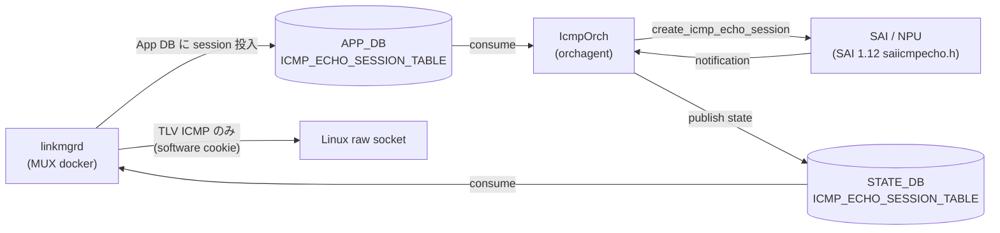
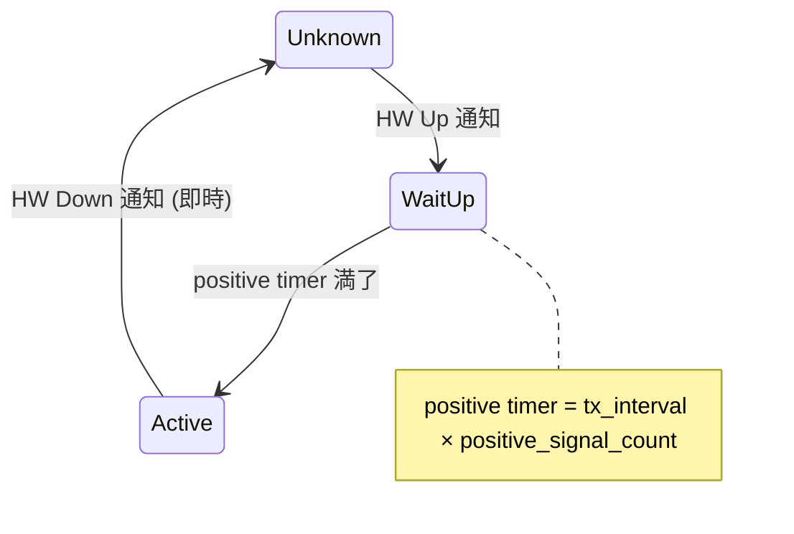

<!-- topics-tip -->
!!! tip "Topics で読み物として読む"
    この HLD は実装詳細を含みます。機能の概念・設定・運用を読み物として読みたい場合は [Topics 14 章: Platform / Port / Optics](../topics/14-platform-port-optics/index.md) を参照。
<!-- /topics-tip -->

!!! success "裏取りステータス: Code-verified"
    現行 master の `sonic-swss/orchagent/icmporch.cpp`（`IcmpOrch::create_icmp_session` 等、`sai_icmp_echo_api` 利用）、`sonic-linkmgrd/src/link_prober/LinkProberBase.cpp:702-729` の GUID 生成、`SAI_ICMP_ECHO_SESSION_ATTR_GUID`（icmporch.cpp:457）の使用を確認済み（verified at: 2026-05-09）。

# ICMP Hardware Offload（DualToR link prober の NPU 化）

## 概要

[SONiC](../reference/glossary.md#term-sonic) の DualToR では、ToR ↔ サーバ NIC 間のリンク状態を **ICMP echo の往復** で監視している。`linkmgrd` 内のソフトウェアベース link prober が Linux raw socket 経由でパケットを生成・受信するため、検出時間は **200〜400 ms** が下限となっていた[^1]。本機能は ICMP echo セッションを **[NPU](../reference/glossary.md#term-npu) にオフロード** することで、検出時間を **< 10 ms** まで短縮することを要件とする。

オフロードに伴い `linkmgrd` の挙動が大きく変わる。プローブには 3 ms オーダーの極小タイマーを使うため deadline timer を廃止し、ハードウェア処理と TLV パケットを処理するソフトウェアスレッドを併存させる **ハイブリッドモデル** を採用する。NPU が認識しないコントロールメッセージ（TLV 入り ICMP）はソフトウェア側 cookie で送出する。

## 動作仕様

### コンポーネント関係



`IcmpOrch` は新規追加コンポーネント[^1]。[SAI](../reference/glossary.md#term-sai) 1.12 で導入された `saiicmpecho.h` 系属性とスイッチ通知を扱う。

### セッションタイプ（NORMAL / RX）

各 mux ポートにつき **2 セッション** を作る[^1]:

| Type | tx_interval | 役割 |
|------|-------------|------|
| `NORMAL` | self_interval（または probing_interval） | 自 ToR 側の echo リクエスト送出 + 受信監視 |
| `RX` | 0（送信しない） | 対向 ToR から来る echo reply の **受信のみ** で対向セッションの状態を監視 |

セッションキーは `Vrf-name : Interface Alias : Session GUID : Session Type` の形式で、例:

```text
default:Ethernet0:5000:NORMAL
default:Ethernet0:6000:RX
default:default:12000:NORMAL   # Interface Alias=default は hw_lookup=true (dst_ip ベースルックアップ)
```

### Session GUID と cookie

| 項目 | 用途 | 注意 |
|------|------|------|
| Session GUID | NPU が ICMP echo パケットを **どのセッションに紐付けるか** を識別 | hw 化以降、software / hardware どちらでも **必ずユニーク** にする |
| Session Cookie | NPU で「software 経由 ICMP」と「offload session の ICMP」を区別 | hardware と software で **別 cookie** |

GUID は upper / lower ToR で衝突しないよう **上位 16bit に ToR 役割固有の値** を入れる設計[^1]。対向 ToR の GUID は `linkmgrd` が起動初期に Linux raw socket で対向の echo reply ペイロードから **学習** し、その値で APP_DB に RX session を作る。

### TLV パケットはソフトウェア処理

`linkmgrd` は ToR 間でメタ情報を運ぶための TLV を ICMP ペイロードに乗せる。TLV 入り ICMP は **NPU が consume してはいけない**（TLV を解釈できないため）ので、`linkmgrd` は **software cookie で生成** し、対向 NPU はこの cookie を見て自分の offload pipeline に取り込まずにスタックに上げる[^1]。これがハイブリッドモデルの肝。


### Dual timer (self_interval / peer_interval)

| パラメータ | 用途 | 既定 (HW モード) |
|-----------|------|-----------------|
| `self_interval` | 自 ToR が NORMAL session で打つ tx_interval | 3 ms |
| `peer_interval` | RX session の rx_interval ベース | 5 ms |

`probing_interval`（既存）が指定されていれば fallback として使われ、新パラメータが上書きする[^1]。

```text
NORMAL session:
  tx_interval = self_interval (or probing_interval)
  rx_interval = (self_interval | probing_interval) * negative_signal_count

RX session:
  tx_interval = 0
  rx_interval = (peer_interval | probing_interval) * negative_signal_count
```

### Deadline timer の撤去

ソフトウェアプローブでは `deadline_timer` でセッション境界を判定していたが、3 ms 周期のタイマーをユーザ空間で回すと無駄なスレッドウェイクで CPU を食う。HW モードでは **NPU が決定論的にタイミングを保証する** ため deadline timer を撤去する[^1]。

### State 遷移と positive timer

State DB から **最初に Up 通知を受けた直後** に positive timer (`tx_interval × positive_signal_count`) を起動し、その満了を待ってから link prober を `Active` に上げる。一方、Down 方向は **negative probing timer を介さずに即座に Unknown 状態へ遷移** する[^1]（HW 側で確定的に判定できるため）。



### Capability fallback

`linkmgrd` はハードウェアサポートを起動時にチェックし、未対応プラットフォームでは **software モードへフォールバック** する[^1]。`prober_type=hardware` を設定しても、capability が無ければ実質 software のままになる。

<!-- evidence:
source: sonic-net/SONiC/doc/dualtor/ICMP_Hardware_Offload_and_Protecion.md#L100-L113 (sha: 49bab5b5ff0e924f1ea52b3d9db0dfa4191a7c06)
excerpt: |
  * **Hardware Capability Detection:** LinkMgrd detects platform hardware offload capabilities before creating hardware sessions, falling back to software mode if hardware support is unavailable
reasoning: capability fallback の根拠。
-->

<!-- evidence-rendered:start -->
??? note "📋 検証エビデンス: sonic-net/SONiC/doc/dualtor/ICMP_Hardware_Offload_and_Protecion.md#L100-L113 (sha: 49bab5b5ff0e924f1ea52b3d9db0dfa4191a7c06)"

    **出典**:

    `sonic-net/SONiC/doc/dualtor/ICMP_Hardware_Offload_and_Protecion.md#L100-L113 (sha: 49bab5b5ff0e924f1ea52b3d9db0dfa4191a7c06)`

    **抜粋**:

    ```text
    * **Hardware Capability Detection:** LinkMgrd detects platform hardware offload capabilities before creating hardware sessions, falling back to software mode if hardware support is unavailable
    ```

    **判断根拠**: capability fallback の根拠。

<!-- evidence-rendered:end -->

## 設定

### 関連する CONFIG_DB

| Table | Key | フィールド | 説明 |
|-------|-----|-----------|------|
| `MUX_LINKMGR` | `LINK_PROBER` | `prober_type` | `software`（既定）/ `hardware` |
| `MUX_CABLE` | `Ethernet*` | `prober_type` | 同上（ポート単位）|
| | | `self_interval` | ms。既定 100ms (SW) / 3ms (HW) |
| | | `peer_interval` | ms。既定 100ms (SW) / 5ms (HW) |

`MUX_CABLE` の例[^1]:

```json
{
    "MUX_CABLE": {
        "Ethernet0": {
            "cable_type": "active-active",
            "server_ipv4": "192.168.0.2/32",
            "server_ipv6": "fc02:1000::2/128",
            "soc_ipv4": "192.168.0.3/32",
            "state": "auto",
            "prober_type": "hardware",
            "self_interval": "3",
            "peer_interval": "5"
        }
    }
}
```

### 関連する APP_DB / STATE_DB

| DB | Table | Key | 主なフィールド |
|----|-------|-----|---------------|
| APP_DB | `ICMP_ECHO_SESSION_TABLE` | `default:Ethernet0:6000:NORMAL` | `dst_ip`, `dst_mac`, `tx_interval`, `rx_interval`, `session_cookie`, `session_guid`, `src_ip` |
| [STATE_DB](../reference/glossary.md#term-state_db) | `ICMP_ECHO_SESSION_TABLE` | `default\|Ethernet0\|6000\|NORMAL` | 上記 + `state` (`Up`/`Down`), `hw_lookup` |

### 関連する CLI

| Command | 用途 |
|---------|------|
| `show mux config` | mux 設定一覧（拡張版で `prober_type` / `self_interval` / `peer_interval` 列追加）|
| `show icmp sessions` | HW ICMP セッションの詳細一覧 |
| `show icmp summary` | セッション総数 / Up / RX 数 |

`show icmp sessions` 出力例[^1]:

```text
Key                                  Dst IP         Tx Interval    Rx Interval  HW lookup    Cookie      State
default|Ethernet0|0x12e386aa|NORMAL  192.168.0.3            100            300  false        0x58767e7a  Up
default|Ethernet0|0xa458bfbc|RX      192.168.0.3              0            300  false        0x58767e7a  Up
```

### 設定例

```bash
# Ethernet0 を HW prober に切替（self=3ms, peer=5ms）
redis-cli -n 4 hset 'MUX_CABLE|Ethernet0' prober_type hardware
redis-cli -n 4 hset 'MUX_CABLE|Ethernet0' self_interval 3
redis-cli -n 4 hset 'MUX_CABLE|Ethernet0' peer_interval 5

show mux config
show icmp sessions
```

### 関連する YANG

[HLD](../reference/glossary.md#term-hld) には専用 [YANG](../reference/glossary.md#term-yang) モジュール定義の記述がない（既存 `sonic-mux-cable.yang` 系の拡張になると推測されるが未明記）。

## 干渉する機能

- **Software link prober**: 同一 mux ポートで HW / SW の両方を同時に走らせない設計。capability が無ければ自動 SW にフォールバック。
- **TLV パケット**: HW モードでも TLV 入り ICMP は SW 経路でやりとりされる。peer NPU が誤って offload しないよう、software cookie の固定値が peer 側 NPU の検査ロジックに浸透している必要がある。
- **[CoPP](../reference/glossary.md#term-copp) / [ACL](../reference/glossary.md#term-acl)**: ICMP echo が大量に増えるため、ACL / CoPP の制御値によっては [ASIC](../reference/glossary.md#term-asic) レベルで絞られる。HW offload なら CoPP を通らない経路が一般的だが、プラットフォーム依存。
- **Loopback IP**: HLD は両 ToR が **同じ Loopback IP を ICMP echo の src** として使うトポロジ前提。これは DualToR の active-active 設計と整合する。

## トラブルシューティング

- HW モードに切り替えたのに検出が速くならない: `show icmp sessions` で `state=Up` のセッションが立っているか、`hw_lookup` が想定通りか確認。capability が無いと内部的には SW のままで動いている可能性。
- 対向 ToR の RX セッションが立たない: `linkmgrd` の起動初期に対向 GUID 学習が失敗していると RX session が作れない。raw socket 経由の echo reply が届いているか tcpdump で確認。
- TLV メッセージだけ届かない: HW 側が誤って TLV ICMP を consume している可能性。software cookie / hardware cookie の設定を確認。
- positive timer 後の Active 遷移が遅い: `tx_interval × positive_signal_count` の積を見直す。HW 側 `tx_interval` が 3 ms 想定なら `positive_signal_count` を絞る。
- `show icmp summary` の Up 数が想定の半分: 各 mux ポートにつき NORMAL + RX の **2 セッション** ある。台数換算時は注意。

### コマンド例

ICMP オフロード設定を確認する。

```bash
# ICMP offload
redis-cli -n 0 hgetall 'COPP_TABLE|trap.group.icmp'
redis-cli -n 4 keys 'COPP_TRAP|*'
docker exec swss show copp 2>&1 | tail
```

## 参考リンク

- [CONFIG_DB: COPP_TRAP](../reference/config-db/copp-trap.md)
- [YANG: sonic-copp](../reference/yang/sonic-copp.md)
- [Topics: ACL / CoPP / Mirror](../topics/07-acl-copp-mirror/index.md)
- [Topics: Platform / Port / Optics](../topics/14-platform-port-optics/index.md)

## 引用元

[^1]: `sonic-net/SONiC` `doc/dualtor/ICMP_Hardware_Offload_and_Protecion.md` @ `49bab5b5ff0e924f1ea52b3d9db0dfa4191a7c06`

<!-- topics-back-ref -->
## 関連 Topics

- [Topics: Dual-ToR と Mux 制御](../topics/05-dual-tor/index.md)

<!-- /topics-back-ref -->

## 参考リンク

本ページに関連する参照ドキュメント:

- [`show acl` CLI リファレンス](../reference/cli/show-acl.md)
- [`config acl` CLI リファレンス](../reference/cli/config-acl.md)
- [`MUX_LINKMGR` CONFIG_DB スキーマ](../reference/config-db/mux-linkmgr.md)
- [`MUX_CABLE` CONFIG_DB スキーマ](../reference/config-db/mux-cable.md)
- [`ACL_RULE` CONFIG_DB スキーマ](../reference/config-db/acl-rule.md)

<!-- augmented-links: v1 -->

<!-- glossary-links-injected: ec18b66e3507 -->
