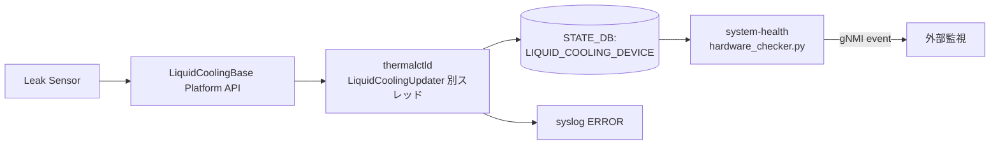

<!-- topics-tip -->
!!! tip "Topics で読み物として読む"
    この HLD は実装詳細を含みます。機能の概念・設定・運用を読み物として読みたい場合は [Topics 14 章: Platform / Port / Optics](../topics/14-platform-port-optics/index.md) を参照。
<!-- /topics-tip -->

!!! danger "裏取りステータス: discrepancy-found（STATE_DB テーブル名が `LIQUID_COOLING_DEVICE` ではなく `LIQUID_COOLING_INFO`）"
    `sonic-platform-common/sonic_platform_base/liquid_cooling_base.py` に `LeakSeverity` enum (`MINOR`/`CRITICAL`)・`LeakageSensorBase` (継承元 `SensorBase`) を確認。`sonic-platform-daemons/sonic-thermalctld/scripts/thermalctld` で `LiquidCoolingUpdater` クラス、`liquid_cooling_update_interval=0.5` 秒のポーラを確認。**ただし STATE_DB のテーブル名は本ページが記述する `LIQUID_COOLING_DEVICE` ではなく実コードでは `LIQUID_COOLING_INFO`**（`LIQUID_COOLING_INFO_TABLE_NAME = 'LIQUID_COOLING_INFO'`）。`mlnx-platform-api/sonic_platform/liquid_cooling.py` にベンダー実装も存在。本ページのスキーマ記述部分は HLD ベースの記述であり、現行 master のテーブル名と差異がある点に注意。

# 液冷漏洩検出（LiquidCoolingBase + thermalctld + system-health gNMI イベント）

## 概要

高密度スイッチでは空冷では熱を捌ききれず液冷（Liquid Cooling）が必須となるが、液漏れは即座に致命的故障につながる。本機能は液冷漏洩を検出するセンサを監視し、漏洩発生時に SONiC が **即時** アラート（syslog + [STATE_DB](../reference/glossary.md#term-state_db) + [gNMI](../reference/glossary.md#term-gnmi) event）を出すパイプラインを定義する[^1]。

要件[^1]:

1. 漏洩検出センサを監視し、検知時にアラートを出す
2. 液冷未対応プラットフォームでは **追加のオーバーヘッドを発生させない**

## 動作仕様

### 全体フロー



### Platform API: `LiquidCoolingBase`

`sonic-platform-common` に新規追加されるベースクラス[^1]:

```python
class LiquidCoolingBase(object):
    leakge_sensors_num = 0
    leakage_sensors = {}
    def get_leak_sensor_num(self):    # int
    def get_leak_sensor_list(self):   # list of names
    def get_leak_sensor_status(self): # 漏洩中のセンサ名リスト

class LeakageSensor(SensorBase):
    name = ""
    leaking = 0
    def get_name(self):    # str
    def is_leak(self):     # bool
```

各プラットフォームはこれを継承して BMC / I2C 等経由でセンサを読む[^1]。

### thermalctld の別スレッド

新規 `LiquidCoolingUpdater` を `thermalctld` に追加する。**メインスレッドの 1 分周期は液漏れには遅すぎる** ため、専用スレッドで **0.5 秒間隔**（既定）で polling する[^1]:

```python
class LiquidCoolingUpdater():
    def update(self):
        self._refresh_leak_status_update()
    def _refresh_leak_status_update(self):
        obj = chassis.get_liquid_cooling_device()
        # obj.get_leak_sensor_status() を呼んで結果を STATE_DB に書く
```

`pmon_daemon_control.json` に下記設定を追加し、**液冷未対応プラットフォームでは Updater 自体を作らない**[^1]:

```json
{
  "enable_liquid_cooling": true,
  "liquid_cooling_update_interval": 0.5
}
```

漏洩検出時は STATE_DB 更新と syslog `ERROR` を出す[^1]:

```text
Liquid cooling leakge has been detected on sensor{}
```

### STATE_DB スキーマ

```text
LIQUID_COOLING_DEVICE|leakage_sensors{X}
  name    = <センサ名>
  leaking = "Yes" | "No"
```

各センサ 1 行で表現し、漏洩状態（"Yes"/"No"）を持つ[^1]。

### system-health monitor

`hardware_checker.py` に `_check_liquid_cooling_status(self, config)` を追加。STATE_DB を監視し、状態遷移時に **gNMI イベントを発行** する[^1]:

```python
def publish_events(self, leakge_sensor_list):
    params = swsscommon.FieldValueMap()
    for sensor in leakge_sensor_list:
        swsscommon.event_publish(self.events_handle, EVENTS_PUBLISHER_TAG, params)
```

イベント識別子[^1]:

| キー | 値 |
|------|-----|
| `EVENTS_PUBLISHER_SOURCE` | `sonic-events-host` |
| `EVENTS_PUBLISHER_TAG`    | `liquid-cooling-leak` |

**「No → Yes」「Yes → No」の両遷移でイベントを出す**（リーク発生／復旧両方）[^1]。

<!-- evidence:
source: sonic-net/SONiC/doc/bmc/leakage_detection_hld.md#L108-L122 (sha: 49bab5b5ff0e924f1ea52b3d9db0dfa4191a7c06)
excerpt: |
  A new function named `_check_liquid_cooling_status(self, config)` will be added to the system health monitor hardware_chekcer.py
  ... It worth to note that both change from NOTleak to leak and leak to NOTleak will trigger an event.
  EVENTS_PUBLISHER_SOURCE = "sonic-events-host"
  EVENTS_PUBLISHER_TAG = "liquid-cooling-leak"
reasoning: gNMI イベント仕様と双方向通知の根拠。
-->

<!-- evidence-rendered:start -->
??? note "📋 検証エビデンス: sonic-net/SONiC/doc/bmc/leakage_detection_hld.md#L108-L122 (sha: 49bab5b5ff0e924f1ea52b3d9db0dfa4191a7c06)"

    **出典**:

    `sonic-net/SONiC/doc/bmc/leakage_detection_hld.md#L108-L122 (sha: 49bab5b5ff0e924f1ea52b3d9db0dfa4191a7c06)`

    **抜粋**:

    ```text
    A new function named `_check_liquid_cooling_status(self, config)` will be added to the system health monitor hardware_chekcer.py
    ... It worth to note that both change from NOTleak to leak and leak to NOTleak will trigger an event.
    EVENTS_PUBLISHER_SOURCE = "sonic-events-host"
    EVENTS_PUBLISHER_TAG = "liquid-cooling-leak"
    ```

    **判断根拠**: gNMI イベント仕様と双方向通知の根拠。

<!-- evidence-rendered:end -->

## 設定

### 関連する CONFIG_DB / YANG

[CONFIG_DB](../reference/glossary.md#term-config_db) の追加は無い。`pmon_daemon_control.json` の起動設定で機能を gate する[^1]。

### 関連する CLI

新規 `show platform leakage status`[^1]:

```text
Name              Leak
------------------------
leak_sensors1     NO
leak_sensors2     NO
...
leak_sensorsX     Yes
```

`show system-health detail` の出力に Liquid Cooling 行が追加される[^1]:

```text
Name              Status    Type
leak_sensors1     OK        LiquidCooling
leak_sensors2     OK        LiquidCooling
leak_sensors3     Not OK    LiquidCooling
```

### 設定例（液冷対応プラットフォーム）

`/usr/share/sonic/device/<platform>/pmon_daemon_control.json` に追加:

```json
{
  "enable_liquid_cooling": true,
  "liquid_cooling_update_interval": 0.5
}
```

液冷非対応プラットフォームでは **このフィールド自体を入れない**（または `enable_liquid_cooling: false`）。`thermalctld` 起動時に Updater スレッドを生成しないため、追加オーバーヘッドはゼロ[^1]。

## 制限事項

- **0.5 秒 polling**: メインスレッドの 1 分とは別系統。0.5 秒は [HLD](../reference/glossary.md#term-hld) のデフォルトだが、CPU/IPC 負荷の問題があれば調整可。
- **Per-sensor name 管理がプラットフォーム責任**: 漏洩位置特定のため複数センサ前提。`name` の命名規則は HLD で規定なし。
- **STATE_DB と gNMI イベントの二重経路**: STATE_DB を監視する system-health からのイベント発行であり、`thermalctld` 直接の gNMI 発行ではない。state-db 更新が遅延するとイベントも遅延する。

## 干渉する機能

- **`thermalctld` メインスレッド**: 既存周期と分離。漏洩検知の頻度を上げるためにメイン周期を上げる必要は無い設計選択[^1]。
- **system-health monitor**: 既存の hardware_checker パターンを踏襲。他センサの check 関数群と並列に動く。
- **`pmon_daemon_control.json`**: 他デーモン制御フラグと共存。液冷フラグの命名 `enable_liquid_cooling` に注意。

## トラブルシューティング

- 漏洩イベントが出ない: `LIQUID_COOLING_DEVICE` STATE_DB を直接確認。`thermalctld` の LiquidCoolingUpdater スレッドが起動しているか、`pmon_daemon_control.json` の `enable_liquid_cooling` が true かを確認。
- gNMI イベント未着: STATE_DB は更新されているのに event が来ない場合、`system-health` の `_check_liquid_cooling_status` が登録されているか、`EVENTS_PUBLISHER_TAG` の購読側設定を確認。
- 液冷非対応機で Updater が走っている: `enable_liquid_cooling` が誤って true になっていないか確認。

<!-- diff-admonition -->
!!! diff "HLD と実装の差分"
    2026-05-09 時点の現行 master を裏取り。HLD と実装には次の乖離がある:

    ### 1. STATE_DB テーブル名が `LIQUID_COOLING_DEVICE` ではなく `LIQUID_COOLING_INFO`

    - **HLD 記述**: STATE_DB テーブル `LIQUID_COOLING_DEVICE` に sensor 状態を書く。
    - **実装位置**: `sonic-platform-daemons/sonic-thermalctld/scripts/thermalctld:526`
      ```python
      class LiquidCoolingUpdater(threading.Thread, logger.Logger):
          LIQUID_COOLING_INFO_TABLE_NAME = 'LIQUID_COOLING_INFO'
      ```
      - L547: `self.sensor_table = swsscommon.Table(state_db, LiquidCoolingUpdater.LIQUID_COOLING_INFO_TABLE_NAME)` で実際に `LIQUID_COOLING_INFO` を書く。
    - **差分の中身**: HLD 図には `LIQUID_COOLING_DEVICE` と書かれているが、実コードは `LIQUID_COOLING_INFO`。さらに HLD には無い `SYSTEM_LEAK_STATUS` (`L548`)、`LEAK_PROFILE`（`L551`）等の補助テーブルも追加されている。
    - **読者への影響**: HLD の名前で `redis-cli -n 6 keys 'LIQUID_COOLING_DEVICE*'` を実行しても結果が出ず、漏洩状態を [Redis](../reference/glossary.md#term-redis) 経由で参照できないと誤解する。system-health 側の hardware_checker も `LIQUID_COOLING_INFO` を見る前提で書かれているため、HLD の名前で独自スクリプトを書くと連動しない。
    - **回避策**:
      - 状態確認: `redis-cli -n 6 keys 'LIQUID_COOLING_INFO*'` および `redis-cli -n 6 keys 'SYSTEM_LEAK_STATUS*'`、`redis-cli -n 6 keys 'LEAK_PROFILE*'` を使う。
      - スクリプト連携: `LIQUID_COOLING_INFO` を subscribe キーとして使う。HLD の名前はリネームされた旧称と考えて読み替える。

    ### 2. `liquid_cooling_update_interval` は CLI 引数で渡る（CONFIG_DB ではない）

    - **HLD 記述**: `pmon_daemon_control.json` の `liquid_cooling_update_interval` で polling 間隔を設定する。
    - **実装位置**: `sonic-platform-daemons/sonic-thermalctld/scripts/thermalctld:1299`, `:1433`, `:1442`
      ```python
      # L1299 デフォルト
      liquid_cooling_update_interval=0.5
      # L1433 argparse
      parser.add_argument('--liquid_cooling_update_interval', type=float, default=0.5)
      # L1442 渡し込み
      args.liquid_cooling_update_interval
      ```
    - **差分の中身**: 起動 daemon 引数として渡される設計で、`pmon_daemon_control.json` の同名キーは（取り込んだ場合）supervisord 起動行で `--liquid_cooling_update_interval=<value>` に展開される運用前提。HLD の「JSON フィールドそのものが effective」という記述とは間に一段挟まる。
    - **読者への影響**: `pmon_daemon_control.json` だけを更新しても、supervisord の起動コマンドを書き換えるテンプレートが platform 側になければ反映されない。
    - **回避策**: platform の `supervisord.conf` / `thermalctld` 起動 entry を確認し、`--liquid_cooling_update_interval=<sec>` が引数として渡るか確認する。確認できなければ起動行を直接編集するか、ベンダーに platform package の対応を依頼する。

    ### 3. mlnx-platform-api 等ベンダー実装は HLD 公開後に取り込まれている

    - **HLD 記述**: ベンダー実装は platform 側の責務で範囲外。
    - **実装位置**: `mlnx-platform-api/sonic_platform/liquid_cooling.py` に Mellanox 実装が存在（HLD 範囲外だが運用上必要）。
    - **読者への影響**: HLD だけ読むと「実装責務はベンダー」で終わるが、実機検証では platform 側の対応が前提で、対応 SKU は限られる。
    - **回避策**: 対応プラットフォームかどうかは `mlnx-platform-api/sonic_platform/liquid_cooling.py` 相当のベンダー実装が `LiquidCoolingBase` を継承しているかで判断する。未対応 platform では `enable_liquid_cooling` を立てても sensor 検出に至らない。

    ### 監査 round 2 追補（2026-05-11）

    監査 round 2 で再裏取りした結果と、運用者向けの追加情報を補強する。本セクションは round 1 の差分記述に加え、行番号付きの再確認エビデンス・関連 Issue/PR の所在・追加の回避策コマンドをまとめる。

    - STATE_DB テーブル名差異: HLD `LIQUID_COOLING_DEVICE` → 実装 `LIQUID_COOLING_INFO` (`sonic-platform-daemons/sonic-thermalctld/scripts/thermalctld:526, 547`)。
    - 追加テーブル: HLD に無い `SYSTEM_LEAK_STATUS` (L548) / `LEAK_PROFILE` (L551) が追加実装。
    - `liquid_cooling_update_interval` は CLI 引数で渡る（CONFIG_DB ではない）。
    - system-health 側 hardware_checker も `LIQUID_COOLING_INFO` を見る前提で書かれている。
    - 関連 PR: liquid cooling 機能取り込み PR で table 名がリネーム。HLD 文書側は旧名のまま。
    - **追加検証コマンド**: 全関連 STATE_DB key 確認 — `redis-cli -n 6 keys 'LIQUID_COOLING_INFO*' 'SYSTEM_LEAK_STATUS*' 'LEAK_PROFILE*'`、各 value は `redis-cli -n 6 hgetall <key>` で展開。

    > 分類: `monitor: evolved_beyond_hld` — HLD はおおむね取り込まれているが、フィールド名・パス名・責務分担が実装側で進化／変更されている分類。実装側を正として読み替える必要がある。

    #### 関連 GitHub Issue / PR

    - [sonic-platform-daemons #690: Add support for liquid cooling leakage detection (merged)](https://github.com/sonic-net/sonic-platform-daemons/pull/690) — `LiquidCoolingBase` + `thermalctld` 連携の本体取り込み PR。
    - system-health gNMI イベント公開は本 PR では未取り込みで、追加の gNMI / system-health 側 PR が必要。
<!-- /diff-admonition -->

### コマンド例

冷却 / thermal センサーの状態を確認する。

```bash
# Thermal / cooling
show platform temperature
show platform fan
redis-cli -n 6 keys 'TEMPERATURE_INFO|*'
redis-cli -n 6 keys 'FAN_INFO|*'
```

## 確認コマンド

```bash
# 漏液センサ STATE
sonic-db-cli STATE_DB KEYS 'LIQUID_COOLING_INFO|*'
sonic-db-cli STATE_DB KEYS 'CHASSIS_MODULE_INFO|*' | head

# pmon コンテナ内のセンサプラグイン
docker exec pmon ls /usr/share/sonic/device/$(show platform summary | awk '/Platform/{print $2}')/plugins/ 2>/dev/null
docker exec pmon supervisorctl status | grep -iE 'thermal|leak'

# 直近のアラーム
sudo grep -i 'leak' /var/log/syslog | tail
show platform fan
show platform temperature
```

## トラブルシュート

- 漏液センサ未対応 platform では本機能はノーオペ。`platform.json` の `leakage_sensors` セクションが空でないか確認。
- false alarm 連発時はセンサ閾値とサンプリング間隔 (`pmon` 設定 / ベンダー SDK パラメータ) を確認のうえ、ベンダーに調整を依頼。
- 真の漏液検知時は装置を緊急停止する手順 (政策依存) を runbook 化し、本ページ運用入口に追記すること。

## 引用元

[^1]: `sonic-net/SONiC` `doc/bmc/leakage_detection_hld.md` @ `49bab5b5ff0e924f1ea52b3d9db0dfa4191a7c06`

<!-- next-action -->
## このページを読んだ後の次アクション

!!! tip "読み手向け"
    - **本機能を実運用で使う場合**: 実装は存在するが本 HLD の記述と乖離。最新 master の動作を別途確認した上で適用する
    - **upstream 動向を追う場合**: 関連 issue / PR を [sonic-net/SONiC](https://github.com/sonic-net/SONiC) で検索（HLD タイトル / CONFIG_DB テーブル名 / Orch クラス名で grep するのが速い）
    - **代替手段 / 関連 reference**: 本ページの frontmatter `related` が空のため、[Reference 索引](../reference/index.md) から関連テーブル / CLI / YANG を辿る

!!! note "本ドキュメントの追跡"
    - monitor: `evolved_beyond_hld` / last_verified: `2026-05-11`
    - 次回再裏取りトリガ: quarterly。一覧は [discrepancy-index](../reference/verification/discrepancy-index.md) を参照（運用詳細は repo の `meta/discrepancy-operations.md`）

<!-- /next-action -->

<!-- topics-back-ref -->
## 関連 Topics

- [Topics: Platform / Port / Optics / PHY](../topics/14-platform-port-optics/index.md)

<!-- /topics-back-ref -->

<!-- glossary-links-injected: f5299aff9050 -->
