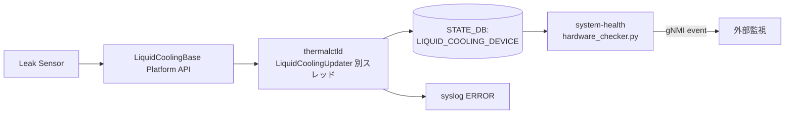

!!! danger "裏取りステータス: discrepancy-found（STATE_DB テーブル名が `LIQUID_COOLING_DEVICE` ではなく `LIQUID_COOLING_INFO`）"
    `sonic-platform-common/sonic_platform_base/liquid_cooling_base.py` に `LeakSeverity` enum (`MINOR`/`CRITICAL`)・`LeakageSensorBase` (継承元 `SensorBase`) を確認。`sonic-platform-daemons/sonic-thermalctld/scripts/thermalctld` で `LiquidCoolingUpdater` クラス、`liquid_cooling_update_interval=0.5` 秒のポーラを確認。**ただし STATE_DB のテーブル名は本ページが記述する `LIQUID_COOLING_DEVICE` ではなく実コードでは `LIQUID_COOLING_INFO`**（`LIQUID_COOLING_INFO_TABLE_NAME = 'LIQUID_COOLING_INFO'`）。`mlnx-platform-api/sonic_platform/liquid_cooling.py` にベンダー実装も存在。本ページのスキーマ記述部分は HLD ベースの記述であり、現行 master のテーブル名と差異がある点に注意。

# 液冷漏洩検出（LiquidCoolingBase + thermalctld + system-health gNMI イベント）

## 概要

高密度スイッチでは空冷では熱を捌ききれず液冷（Liquid Cooling）が必須となるが、液漏れは即座に致命的故障につながる。本機能は液冷漏洩を検出するセンサを監視し、漏洩発生時に SONiC が **即時** アラート（syslog + STATE_DB + gNMI event）を出すパイプラインを定義する[^1]。

要件[^1]:

1. 漏洩検出センサを監視し、検知時にアラートを出す
2. 液冷未対応プラットフォームでは **追加のオーバーヘッドを発生させない**

## 動作仕様

### 全体フロー



### Platform API: `LiquidCoolingBase`

`sonic-platform-common` に新規追加されるベースクラス[^1]:

```python
class LiquidCoolingBase(object):
    leakge_sensors_num = 0
    leakage_sensors = {}
    def get_leak_sensor_num(self):    # int
    def get_leak_sensor_list(self):   # list of names
    def get_leak_sensor_status(self): # 漏洩中のセンサ名リスト

class LeakageSensor(SensorBase):
    name = ""
    leaking = 0
    def get_name(self):    # str
    def is_leak(self):     # bool
```

各プラットフォームはこれを継承して BMC / I2C 等経由でセンサを読む[^1]。

### thermalctld の別スレッド

新規 `LiquidCoolingUpdater` を `thermalctld` に追加する。**メインスレッドの 1 分周期は液漏れには遅すぎる** ため、専用スレッドで **0.5 秒間隔**（既定）で polling する[^1]:

```python
class LiquidCoolingUpdater():
    def update(self):
        self._refresh_leak_status_update()
    def _refresh_leak_status_update(self):
        obj = chassis.get_liquid_cooling_device()
        # obj.get_leak_sensor_status() を呼んで結果を STATE_DB に書く
```

`pmon_daemon_control.json` に下記設定を追加し、**液冷未対応プラットフォームでは Updater 自体を作らない**[^1]:

```json
{
  "enable_liquid_cooling": true,
  "liquid_cooling_update_interval": 0.5
}
```

漏洩検出時は STATE_DB 更新と syslog `ERROR` を出す[^1]:

```
Liquid cooling leakge has been detected on sensor{}
```

### STATE_DB スキーマ

```
LIQUID_COOLING_DEVICE|leakage_sensors{X}
  name    = <センサ名>
  leaking = "Yes" | "No"
```

各センサ 1 行で表現し、漏洩状態（"Yes"/"No"）を持つ[^1]。

### system-health monitor

`hardware_checker.py` に `_check_liquid_cooling_status(self, config)` を追加。STATE_DB を監視し、状態遷移時に **gNMI イベントを発行** する[^1]:

```python
def publish_events(self, leakge_sensor_list):
    params = swsscommon.FieldValueMap()
    for sensor in leakge_sensor_list:
        swsscommon.event_publish(self.events_handle, EVENTS_PUBLISHER_TAG, params)
```

イベント識別子[^1]:

| キー | 値 |
|------|-----|
| `EVENTS_PUBLISHER_SOURCE` | `sonic-events-host` |
| `EVENTS_PUBLISHER_TAG`    | `liquid-cooling-leak` |

**「No → Yes」「Yes → No」の両遷移でイベントを出す**（リーク発生／復旧両方）[^1]。

<!-- evidence:
source: sonic-net/SONiC/doc/bmc/leakage_detection_hld.md#L108-L122 (sha: 49bab5b5ff0e924f1ea52b3d9db0dfa4191a7c06)
excerpt: |
  A new function named `_check_liquid_cooling_status(self, config)` will be added to the system health monitor hardware_chekcer.py
  ... It worth to note that both change from NOTleak to leak and leak to NOTleak will trigger an event.
  EVENTS_PUBLISHER_SOURCE = "sonic-events-host"
  EVENTS_PUBLISHER_TAG = "liquid-cooling-leak"
reasoning: gNMI イベント仕様と双方向通知の根拠。
-->

## 設定

### 関連する CONFIG_DB / YANG

CONFIG_DB の追加は無い。`pmon_daemon_control.json` の起動設定で機能を gate する[^1]。

### 関連する CLI

新規 `show platform leakage status`[^1]:

```
Name              Leak
------------------------
leak_sensors1     NO
leak_sensors2     NO
...
leak_sensorsX     Yes
```

`show system-health detail` の出力に Liquid Cooling 行が追加される[^1]:

```
Name              Status    Type
leak_sensors1     OK        LiquidCooling
leak_sensors2     OK        LiquidCooling
leak_sensors3     Not OK    LiquidCooling
```

### 設定例（液冷対応プラットフォーム）

`/usr/share/sonic/device/<platform>/pmon_daemon_control.json` に追加:

```json
{
  "enable_liquid_cooling": true,
  "liquid_cooling_update_interval": 0.5
}
```

液冷非対応プラットフォームでは **このフィールド自体を入れない**（または `enable_liquid_cooling: false`）。`thermalctld` 起動時に Updater スレッドを生成しないため、追加オーバーヘッドはゼロ[^1]。

## 制限事項

- **0.5 秒 polling**: メインスレッドの 1 分とは別系統。0.5 秒は HLD のデフォルトだが、CPU/IPC 負荷の問題があれば調整可。
- **Per-sensor name 管理がプラットフォーム責任**: 漏洩位置特定のため複数センサ前提。`name` の命名規則は HLD で規定なし。
- **STATE_DB と gNMI イベントの二重経路**: STATE_DB を監視する system-health からのイベント発行であり、`thermalctld` 直接の gNMI 発行ではない。state-db 更新が遅延するとイベントも遅延する。

## 干渉する機能

- **`thermalctld` メインスレッド**: 既存周期と分離。漏洩検知の頻度を上げるためにメイン周期を上げる必要は無い設計選択[^1]。
- **system-health monitor**: 既存の hardware_checker パターンを踏襲。他センサの check 関数群と並列に動く。
- **`pmon_daemon_control.json`**: 他デーモン制御フラグと共存。液冷フラグの命名 `enable_liquid_cooling` に注意。

## トラブルシューティング

- 漏洩イベントが出ない: `LIQUID_COOLING_DEVICE` STATE_DB を直接確認。`thermalctld` の LiquidCoolingUpdater スレッドが起動しているか、`pmon_daemon_control.json` の `enable_liquid_cooling` が true かを確認。
- gNMI イベント未着: STATE_DB は更新されているのに event が来ない場合、`system-health` の `_check_liquid_cooling_status` が登録されているか、`EVENTS_PUBLISHER_TAG` の購読側設定を確認。
- 液冷非対応機で Updater が走っている: `enable_liquid_cooling` が誤って true になっていないか確認。

## 引用元

[^1]: `sonic-net/SONiC` `doc/bmc/leakage_detection_hld.md` @ `49bab5b5ff0e924f1ea52b3d9db0dfa4191a7c06`
