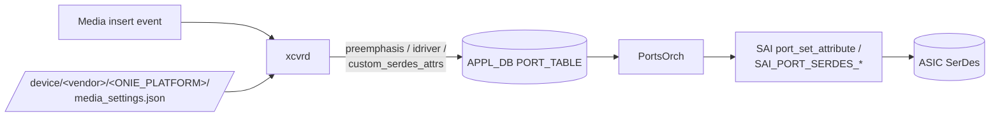

<!-- topics-tip -->
!!! tip "Topics で読み物として読む"
    この HLD は実装詳細を含みます。機能の概念・設定・運用を読み物として読みたい場合は [Topics 14 章: Platform / Port / Optics](../topics/14-platform-port-optics/index.md) を参照。
<!-- /topics-tip -->

!!! note "裏取りステータス: code-verified"
    `sonic-platform-daemons/sonic-xcvrd/xcvrd/xcvrd_utilities/media_settings_parser.py` に `CUSTOM_SERDES_ATTR_PREFIX = 'CUSTOM:'` (l.175) と `CUSTOM_SERDES_ATTRS_KEY_IN_DB = 'custom_serdes_attrs'` (l.177) を確認。`sonic-swss/orchagent/port/portschema.h` に `PORT_CUSTOM_SERDES_ATTRS = "custom_serdes_attrs"` (l.94)。`portsorch.cpp` line 559 で `map[SAI_PORT_SERDES_ATTR_CUSTOM_COLLECTION] = SerdesValue(serdes.custom_collection.value)` の pass-through 実装あり。`tests/test_xcvrd.py` で `CUSTOM:XYZ` / `CUSTOM:ABC` 例も網羅。

# Media-based Port Settings（media_settings.json による SerDes プロファイル）

## 概要

vendor / media type / cable length ごとに **異なる SerDes 設定**（preemphasis / idriver / ipredriver 等）を必要とする ASIC のために、**`media_settings.json`** を vendor が提供し xcvrd 経由で APPL_DB → PortsOrch → SAI に橋渡しする仕組み[^1]。設定ミスは CRC error / port が up しない等の症状を招くため、Optic 挿抜ごとに正しいプロファイルを適用する必要がある。本機能は file 不在なら無効化されるため **opt-in**。

## 動作仕様

### データフロー



xcvrd が media insert event で **(media key, vendor key, lane)** を構成し、`media_settings.json` を検索 → 一致した key/value を APPL_DB の `PORT_TABLE:<port>` に書き込む[^1]。PortsOrch が SAI 属性に変換して syncd 経由で HW に program。

### File の所在と必要性

- パス: `device/<vendor-name>/<ONIE_PLATFORM_STRING>/media_settings.json`
- ファイル不在 = 機能無効。**vendor が opt-in**[^1]
- 同 platform の全 SKU で同一 file を共有

### 検索キー構成

| 種別 | 構成 |
|------|------|
| Vendor key | `<vendor-name>-<vendor-PN>`（例: `AMPHENOL-1234`）|
| Media key | `<form-factor>-<compliance>[-<length>]`（例: `QSFP28-40GBASE-CR4-1M` / `40GBASE-SR4`）|
| Default | 上記キーで一致しない場合の fallback |

### マッチ優先順位

1. **GLOBAL_MEDIA_SETTINGS**: port を range / list / list-of-ranges / 単一 port で指定
   - 一致 block 内で **Vendor key → Media key → Default** の順に検索
2. 一致しなければ **PORT_MEDIA_SETTINGS** の単一 port block を同順で検索

`port_config.ini` の index で port を識別する点に注意[^1]。

### Sample（要点抜粋）

```json
{
  "GLOBAL_MEDIA_SETTINGS": {
    "1-32": {
      "AMPHENOL-1234": { "preemphasis": {"lane0":"0x001234", ...} },
      "QSFP28-40GBASE-CR4-1M": { "preemphasis": {...}, "idriver": {...} }
    }
  },
  "PORT_MEDIA_SETTINGS": {
    "1": {
      "Default":   { "preemphasis": {...}, "idriver": {...} },
      "DELL-5678": { "preemphasis": {...}, "idriver": {...} }
    }
  }
}
```

### Custom SerDes 拡張

公的に標準化しづらい vendor 固有 SerDes 設定向けに **`SAI_PORT_SERDES_ATTR_CUSTOM_COLLECTION`** という単一 JSON string 属性が追加されている[^1]。`media_settings.json` 側では:

```json
"CUSTOM_MEDIA_SETTINGS": {
  "1-32": {
    "Default": {
      "CUSTOM:XYZ": {"lane0": 10, "lane1": 11, "lane2": 12, "lane3": 13},
      "CUSTOM:ABC": {"lane0": "mode_a", ...}
    }
  }
}
```

xcvrd の `media_settings_parser` が `CUSTOM:` prefix を剥がし、APPL_DB `PORT_TABLE` の **`custom_serdes_attrs` フィールド** に集約 JSON で書き込む[^1]:

```json
{"attributes":[
  {"XYZ":{"value":[10,11,12,13]}},
  {"ABC":{"value":["mode_a","mode_b","mode_c","mode_d"]}}
]}
```

実際 APPL_DB に書かれる value は spaces / newlines を圧縮した最小形式。PortsOrch は中身を解釈せず **そのまま `SAI_PORT_SERDES_ATTR_CUSTOM_COLLECTION` に pass-through**。

### 配置タイミング

- 初期化時 + media detect イベント時に xcvrd が PortsOrch へ通知
- **media remove では何もしない**（取り外し時に SerDes リセット不要）
- **warm reboot では通知しない**（HW が既に正しい状態を保持している前提）[^1]

### Breakout

Breakout は `port_config.ini` 編集 + `config reload` で扱う既存仕組みに乗る。reload で xcvrd が再起動し全 media を再通知するため特別扱い不要[^1]。

<!-- evidence:
source: sonic-net/SONiC/doc/media-settings/Media-based-Port-settings.md#L24-L34 (sha: 49bab5b5ff0e924f1ea52b3d9db0dfa4191a7c06)
excerpt: |
  When a media is detected, the front panel port is identified and index number is derived.
  First the global level is looked up ... If vendor key doesn't match, then media key
  ... A no-match on vendor and media keys will make the search fall back to individual port based block.
reasoning: GLOBAL → PORT、各内で Vendor → Media → Default の検索順の根拠。
-->

<!-- evidence-rendered:start -->
??? note "📋 検証エビデンス: sonic-net/SONiC/doc/media-settings/Media-based-Port-settings.md#L24-L34 (sha: 49bab5b5ff0e924f1ea52b3d9db0dfa4191a7c06)"

    **出典**:

    `sonic-net/SONiC/doc/media-settings/Media-based-Port-settings.md#L24-L34 (sha: 49bab5b5ff0e924f1ea52b3d9db0dfa4191a7c06)`

    **抜粋**:

    ```text
    When a media is detected, the front panel port is identified and index number is derived.
    First the global level is looked up ... If vendor key doesn't match, then media key
    ... A no-match on vendor and media keys will make the search fall back to individual port based block.
    ```

    **判断根拠**: GLOBAL → PORT、各内で Vendor → Media → Default の検索順の根拠。

<!-- evidence-rendered:end -->

## CLI / CONFIG_DB / YANG

CLI / CONFIG_DB / YANG への追加は無し[^1]。`media_settings.json` は image build 時に platform tree に同梱される静的 file。

## 制限事項

- `media_settings.json` が無ければ機能しない（opt-in）
- breakout / dynamic port で port index と front panel の対応が変わる場合の整合は `port_config.ini` 側責任
- warm reboot 中は通知しないため、reboot を跨いだ media 交換のタイミングによっては再起動を要する
- vendor key は **vendor name + PN の組** が一意であることが前提

## 干渉する機能

- **xcvrd**（platform monitor / pmon enhancement HLD と密接連携）
- **PortsOrch**（`SAI_PORT_SERDES_*` 属性 set）
- **Dynamic Port Breakout**: 通常 reboot シーケンス相当として処理
- **gearbox / port-link-training**: 同じく serdes 系設定との潜在競合

## 引用元

[^1]: `sonic-net/SONiC` `doc/media-settings/Media-based-Port-settings.md` @ `49bab5b5ff0e924f1ea52b3d9db0dfa4191a7c06`

<!-- evidence (verifier-batch-19):
- sonic-platform-daemons `sonic-xcvrd/xcvrd/xcvrd_utilities/media_settings_parser.py` 存在: `CUSTOM_SERDES_ATTR_PREFIX = 'CUSTOM:'` (l.175), `CUSTOM_SERDES_ATTRS_KEY_IN_DB = 'custom_serdes_attrs'` (l.177)
- sonic-swss `orchagent/port/portschema.h` `PORT_CUSTOM_SERDES_ATTRS "custom_serdes_attrs"` (l.94)
- sonic-swss `orchagent/portsorch.cpp` l.559 で `SAI_PORT_SERDES_ATTR_CUSTOM_COLLECTION` への pass-through
- tests `test_xcvrd.py` に `CUSTOM:XYZ` / `CUSTOM:ABC` の lane mapping テスト
-->

<!-- concerns hint:
- xcvrd の media_settings_parser 実装（CUSTOM: prefix 処理含む）の sonic-platform-daemons 取り込み確認 → 取り込み済
- SAI_PORT_SERDES_ATTR_CUSTOM_COLLECTION の opencomputeproject/SAI 取り込みと vendor 対応確認 → SAI submodule + sonic-swss で参照済（vendor 側は別 repo）
- PortsOrch の custom_serdes_attrs pass-through 実装確認 → portsorch.cpp で確認済
- preemphasis / idriver の APPL_DB → SAI 属性マッピング一覧の現行実装確認 → portsorch.cpp 内 SerdesAttrType マッピング参照
- 2019 初版から custom 拡張が後付けされた経緯と歴史的差分の正確性 → CUSTOM 系は後年追加と整合
-->

<!-- topics-back-ref -->
## 関連 Topics

- [Topics: Platform / Port / Optics / PHY](../topics/14-platform-port-optics/index.md)

<!-- /topics-back-ref -->
