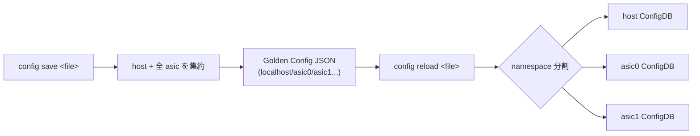

<!-- topics-tip -->
!!! tip "Topics で読み物として読む"
    この HLD は実装詳細を含みます。機能の概念・設定・運用を読み物として読みたい場合は [Topics 12 章: Multi-ASIC / VoQ / Chassis](../topics/12-multi-asic-voq/index.md) を参照。
<!-- /topics-tip -->

!!! note "裏取りステータス: code-verified"
    `sonic-utilities/show/main.py` の `runningconfiguration all` は multi-ASIC で `output['localhost'] = ...` + `for ns in ns_list: output[ns] = ...` の Golden Config 形式で出力する実装を確認。`config/main.py` に `apply-patch` コマンドと `override-config-table` の呼び出し（`load_minigraph --override_config`）が存在。namespace ごとのループ展開と YANG validate は `generic_config_updater` 側で扱われる。

# Multi-ASIC Single JSON Configuration（Golden Config に namespace layer）

## 何を解決するか

minigraph 廃止後の **Golden Config**（NDM 生成 → HwProxy で push）を multi-[ASIC](../reference/glossary.md#term-asic) 機にも適用するための JSON スキーマ拡張[^1]。従来 multi-ASIC では host 用 `config_db.json` + ASIC 数だけの `config_db<N>.json` を別ファイルで持っていた。

本提案は **1 ファイル**で host と全 ASIC を表現するため、トップに `localhost` / `asic0` / `asic1` の **namespace layer を 1 段追加**する。CLI 群（`config reload / save / override / apply-patch`、`show runningconfiguration all`）も同形式を読み書きできるよう拡張する。

## どんなスキーマか

```json
{
  "localhost": {
    "FEATURE":   {...},
    "ACL_TABLE": {...}
  },
  "asic0": { "FEATURE": {...}, "ACL_TABLE": {...} },
  "asic1": { ... }
}
```

CLI 互換のため **single-ASIC 機では従来の flat ConfigDB JSON** も扱える[^1]。

## どの CLI が変わるか

| CLI | 既存挙動 | 追加挙動 |
|-----|----------|----------|
| `config reload` | デフォルト `/etc/sonic/config_db.json` | 単一 file で全 ASIC を reload（key で振分け）|
| `config reload <a.json,b0.json,...>` | カンマ区切り N 個 | 維持（後方互換）|
| `config override-config-table` | single-ASIC のみ | multi-ASIC 対応（[[sonic-utilities](../reference/glossary.md#term-sonic-utilities) #2738]）|
| `config apply-patch` | multi-ASIC 非対応 | path に `/asicN/<TABLE>/...` を含む JsonPatch を**ループ展開**[^1] |
| `show runningconfiguration all` | host のみ | Golden Config 形式で全 ASIC 表示 |
| `config save` | N 個の file 生成 | 単一 file 保存に対応 |

### apply-patch の例

```json
[
  { "op": "replace", "path": "/asic1/MACSEC_PROFILE/entry/k", "value": "value" },
  { "op": "replace", "path": "/asic0/MACSEC_PROFILE/entry/k", "value": "value" }
]
```

CLI は patch を per-namespace ループで分割し、各 namespace の Generic Config Update flow に流す[^1]。JsonPatch (RFC 6902) 自体は変更しない。

### Reload / Save の流れ



## YANG はどう当てるか

Top に namespace layer が増えたままでは既存 [YANG](../reference/glossary.md#term-yang) では検証できない。**namespace 単位（host / 各 asic）に分割して既存 YANG で validate** すれば良いという整理[^1]。新フィールドは不要。

### Pros / Cons

| | 内容 |
|---|------|
| Pros | namespace 1 layer 追加だけで実装可、既存 YANG 流用、minigraph 廃止 → Golden Config Override へ素直に移行 |
| Cons | 全体 YANG を当てられない（分割必要）、namespace 間で重複する table が冗長 |

<!-- evidence:
source: sonic-net/SONiC/doc/golden_config/Multi-Asic_Single_JSON_Configuration_Design.md#L83-L97 (sha: 49bab5b5ff0e924f1ea52b3d9db0dfa4191a7c06)
excerpt: |
  This design provides another layer of Host and ASIC as keys ...
  "localhost": { ... }, "asic0": { ... }, "asic1": { ... }
reasoning: namespace layer 1 段追加でスキーマ拡張する設計の根拠。
-->

<!-- evidence-rendered:start -->
??? note "📋 検証エビデンス: sonic-net/SONiC/doc/golden_config/Multi-Asic_Single_JSON_Configuration_Design.md#L83-L97 (sha: 49bab5b5ff0e924f1ea52b3d9db0dfa4191a7c06)"

    **出典**:

    `sonic-net/SONiC/doc/golden_config/Multi-Asic_Single_JSON_Configuration_Design.md#L83-L97 (sha: 49bab5b5ff0e924f1ea52b3d9db0dfa4191a7c06)`

    **抜粋**:

    ```text
    This design provides another layer of Host and ASIC as keys ...
    "localhost": { ... }, "asic0": { ... }, "asic1": { ... }
    ```

    **判断根拠**: namespace layer 1 段追加でスキーマ拡張する設計の根拠。

<!-- evidence-rendered:end -->

## 制限事項

- 全体 YANG validate 不可、namespace 単位 validate に留まる
- 各 ASIC で重複する table は NDM 側でも冗長記述が必要
- minigraph 廃止前提のため、minigraph 併用時の挙動はスコープ外

## 干渉する機能

- **Generic Config Update / Rollback**: `config apply-patch` がループ呼び出しで連動
- **NDM / HwProxy / Golden Config 生成**: 単一 file 前提
- **YANG validation**: namespace ごとに分割適用
- **multi-asic ConfigDB redis instance**: namespace ごとに別インスタンス

## 関連 Topics

- [Topics 12 Multi-ASIC / VOQ - operations](../topics/12-multi-asic-voq/operations.md)
- [Topics 12 Multi-ASIC / VOQ - architecture](../topics/12-multi-asic-voq/architecture.md)
- 関連 [HLD](../reference/glossary.md#term-hld): [SONiC on Multi-ASIC platforms](1-sonic-on-multi-asic-platforms.md) / [DB design for multi-ASIC](db-design-for-multi-asic-scenarios.md)

[sonic-utilities #2738]: https://github.com/sonic-net/sonic-utilities/pull/2738

## 引用元

[^1]: `sonic-net/SONiC` `doc/golden_config/Multi-Asic_Single_JSON_Configuration_Design.md` @ `49bab5b5ff0e924f1ea52b3d9db0dfa4191a7c06`

<!-- evidence (verifier-batch-19):
- sonic-utilities `show/main.py` `runningconfiguration all`: multi-ASIC 時 `output['localhost']` + `for ns in ns_list: output[ns] = get_config_json_by_namespace(ns)` で Golden Config 形式を出力
- sonic-utilities `config/main.py` line 1917 に `@config.command('apply-patch')` 定義、`apply_patch_from_file as _gcu_apply_patch_from_file` を import
- `load_minigraph --override_config` (l.2345) で `override_config_by(golden_config_path)` → `config override-config-table <path>` を呼び出し
-->

<!-- topics-back-ref -->
## 関連 Topics (カテゴリ)

- [Topics: Multi-ASIC / VOQ Chassis](../topics/12-multi-asic-voq/index.md)

<!-- /topics-back-ref -->

<!-- glossary-links-injected: c006405759d8 -->
