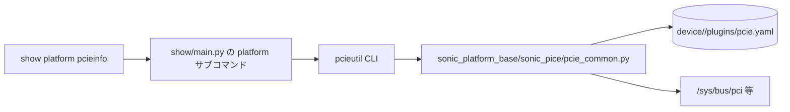

<!-- topics-tip -->
!!! tip "Topics で読み物として読む"
    この HLD は実装詳細を含みます。機能の概念・設定・運用を読み物として読みたい場合は [Topics 14 章: Platform / Port / Optics](../topics/14-platform-port-optics/index.md) を参照。
<!-- /topics-tip -->

!!! info "裏取りステータス: code-verified"
    `sonic-platform-common/sonic_platform_base/sonic_pcie/` に `pcie_base.py`（抽象 `PcieBase`）と `pcie_common.py`（共通実装）を確認。`sonic-platform-daemons/sonic-pcied/` に PCIe 監視デーモン（pcied）も存在。本ページの設計（pcie.yaml をリファレンスとした PCIe デバイス検査と `pcie_generate` で yaml 自動生成）は実装に取り込み済み。HLD は改訂日付が無く Open Questions のまま終わっているが、実コードは安定している。

# pcieutil / show platform pcieinfo（PCIe デバイス検査と pcie.yaml 比較）

## 概要

[SONiC](../reference/glossary.md#term-sonic) スイッチ上の PCIe デバイス（NIC / Bridge / Root Port 等）が **本来あるべきトポロジ** から欠落していないかを検査するためのツール群を追加する [HLD](../reference/glossary.md#term-hld)。プラットフォーム標準の PCIe デバイス一覧を `pcie.yaml` に焼いておき、起動時や運用中に実際の lspci 相当出力と比較してハードウェア異常を検知する[^1]。

提供される CLI は 3 コマンド[^1]:

| CLI | 用途 |
|-----|------|
| `show platform pcieinfo` | 現在の PCIe デバイス情報を表示 |
| `show platform pcieinfo -c` (`--check`) | 期待構成 (`pcie.yaml`) と比較し pass/fail を出力 |
| `pcieutil pcie_generate` | 現在の PCIe 情報から `pcie.yaml` を生成 |

`pcie_generate` は **誤上書きを避けるため** `show platform pcieinfo` 経由では呼べず、`pcieutil` を直接使う[^1]。

## 動作仕様

### コンポーネント階層



`show/main.py` の `platform` メニューに `pcieinfo` 項目を追加し、内部的に `pcieutil [pcie_show|pcie_check]` を実行する[^1]:

| `show` 形 | `pcieutil` 形 |
|-----------|-------------|
| `show platform pcieinfo`         | `pcieutil pcie_show`  |
| `show platform pcieinfo --check` | `pcieutil pcie_check` |
| `show platform pcieinfo -c`      | `pcieutil pcie_check` |

`pcie_generate` は **show 経由では呼ばない**。これは `pcie.yaml` 上書き防止のための意図的な分離[^1]。

### pcieutil の実装

新ユーティリティ `sonic-utilities/pcieutil/` がデバイスプラグイン `pcie_common.py` を import して使う。共通 API[^1]:

| 関数 | 動作 |
|------|------|
| `get_pcie_device()` | 現在の PCIe デバイス一覧を返す |
| `get_pcie_check()`  | 現在の一覧と `pcie.yaml` の比較結果を返す。`pcie.yaml` 不在ならシステムエラーで終了 |
| `dump_conf_yaml()`  | 現在の PCIe 情報から `pcie.yaml` を生成 |

実装パスは `sonic_platform_base/sonic_pice/pcie_common.py`（HLD 原文どおり、ディレクトリ名スペル `sonic_pice` のまま）[^1]。

### 設定ファイル `pcie.yaml`

各プラットフォーム配下に置く[^1]:

```text
device/<Platform>/plugins/pcie.yaml
```

YAML の形式（list of mapping）[^1]:

```yaml
- bus: '00'
  dev: '00'
  fn:  '0'
  id:  1f0c
  name: 'Host bridge: Intel Corporation Atom processor C2000 SoC Transaction Router'
- bus: '00'
  dev: '01'
  fn:  '0'
  id:  1f10
  name: 'PCI bridge: Intel Corporation Atom processor C2000 PCIe Root Port 1'
```

各エントリは bus / dev / fn / id / name を保持する。`get_pcie_check()` は同じキー集合で実機側と突合する。

<!-- evidence:
source: sonic-net/SONiC/doc/pcie-mon/pcieinfo_design.md#L36-L78 (sha: 49bab5b5ff0e924f1ea52b3d9db0dfa4191a7c06)
excerpt: |
  Common API ... get_pcie_device(), get_pcie_check(), dump_conf_yaml()
  Config file Location: device/Platform/plugins/pcie.yaml
reasoning: API シグネチャと設定ファイル配置の根拠。
-->

<!-- evidence-rendered:start -->
??? note "📋 検証エビデンス: sonic-net/SONiC/doc/pcie-mon/pcieinfo_design.md#L36-L78 (sha: 49bab5b5ff0e924f1ea52b3d9db0dfa4191a7c06)"

    **出典**:

    `sonic-net/SONiC/doc/pcie-mon/pcieinfo_design.md#L36-L78 (sha: 49bab5b5ff0e924f1ea52b3d9db0dfa4191a7c06)`

    **抜粋**:

    ```text
    Common API ... get_pcie_device(), get_pcie_check(), dump_conf_yaml()
    Config file Location: device/Platform/plugins/pcie.yaml
    ```

    **判断根拠**: API シグネチャと設定ファイル配置の根拠。

<!-- evidence-rendered:end -->

### 出力例

```bash
$ show platform pcieinfo
==============================Display PCIe Device===============================
bus:dev.fn 01:00.0 - dev_id=0xb960, Ethernet controller: Broadcom Limited Device b960
bus:dev.fn 01:00.1 - dev_id=0xb960, Ethernet controller: Broadcom Limited Device b960

$ show platform pcieinfo -c
===============================PCIe Device Check================================
Error: [Errno 2] No such file or directory:
       '/usr/share/sonic/device/x86_64-cel_seastone-r0/plugins/pcie.yaml'
Not found config file, please add a config file manually,
 or generate it by running [pcieutil pcie_generate]

$ pcieutil pcie_generate
Are you sure to overwrite config file pcie.yaml with current pcie device info? [y/N]: y
generate config file pcie.yaml under path /usr/share/sonic/device/x86_64-cel_seastone-r0/plugins

$ show platform pcieinfo -c
===============================PCIe Device Check================================
PCI Device: Ethernet controller: Broadcom Limited Device b960 ------------------ [Passed]
PCI Device: Ethernet controller: Broadcom Limited Device b960 ------------------ [Passed]
PCIe Device Checking All Test ----------->>> PASSED
```

## 設定

### 関連する CONFIG_DB / YANG

該当しない。`pcie.yaml` はプラットフォーム同梱ファイルであり [CONFIG_DB](../reference/glossary.md#term-config_db) / [YANG](../reference/glossary.md#term-yang) 経路は持たない。

### 関連する CLI

| CLI | 詳細 |
|-----|------|
| `show platform pcieinfo` | `pcieutil pcie_show` を実行 |
| `show platform pcieinfo -c` | `pcieutil pcie_check` を実行。`pcie.yaml` と比較 |
| `pcieutil pcie_generate` | 現状の PCIe 情報から `pcie.yaml` を生成（show 経由では不可）|

### 設定例

新規プラットフォーム持ち込み時の標準手順[^1]:

```bash
# 1. 期待値ファイル生成
sudo pcieutil pcie_generate

# 2. 起動後・運用中の検査
show platform pcieinfo -c
```

## 制限事項

- **`pcie.yaml` 不在で `pcie_check` が即エラー終了**: 新プラットフォームでは事前に `pcie_generate` が必要[^1]。
- **`pcie_generate` は show 経由禁止**: 誤上書き防止の設計選択。スクリプト化する場合は `pcieutil pcie_generate` を直接呼ぶ。
- **PCIe トポロジの変更対応**: ハード交換やリビジョン違いがあると `pcie.yaml` の再生成が必要。HLD はリビジョン管理を規定していない。
- **HLD は Open Questions が空のまま** で打ち切られており、設計の細部（並び順比較の厳密性、エラー詳細出力等）は実装側に委ねられている[^1]。

## 干渉する機能

- **プラットフォームプラグイン (`sonic_platform_base`)**: `pcie_common.py` を経由するため、ベンダ固有の PCIe 列挙ロジック差は無く統一動作する想定。
- **`show platform` 系コマンド**: 同じ `platform` サブコマンドの兄弟（`summary`、`syseeprom` 等）と共存。コマンド系の整合（オプション規約）に注意。

## トラブルシューティング

- `[Errno 2] No such file or directory: pcie.yaml`: 該当プラットフォームの `device/.../plugins/` に `pcie.yaml` が無い。`pcieutil pcie_generate` で生成する[^1]。
- 一部デバイスが `[Failed]`: PCIe トポロジ実状と yaml の bus/dev/fn/id が合っていない。ハード交換・差し替えや、yaml の更新漏れを疑う。
- `pcieutil` 自体が見つからない: `sonic-utilities` パッケージ版が古い可能性。

### コマンド例

PCIe デバイス情報を確認する。

```bash
# PCIe
show platform pcieinfo -c
sudo lspci -nn | head
redis-cli -n 6 keys 'PCIE_DEVICE|*'
```

## 引用元

[^1]: `sonic-net/SONiC` `doc/pcie-mon/pcieinfo_design.md` @ `49bab5b5ff0e924f1ea52b3d9db0dfa4191a7c06`

<!-- topics-back-ref -->
## 関連 Topics

- [Topics: Platform / Port / Optics / PHY](../topics/14-platform-port-optics/index.md)

<!-- /topics-back-ref -->

## 参考リンク

- [CLI: show platform](../reference/cli/show-platform.md)
- [CLI: show environment](../reference/cli/show-environment.md)
- [CLI: show system-health](../reference/cli/show-system-health.md)
- [CLI: show techsupport](../reference/cli/show-techsupport.md)
- [CLI: show version](../reference/cli/show-version.md)
- [Glossary](../reference/glossary.md)
- [Reference 索引](../reference/index.md)

<!-- glossary-links-injected: 8ba32e5aa69d -->
