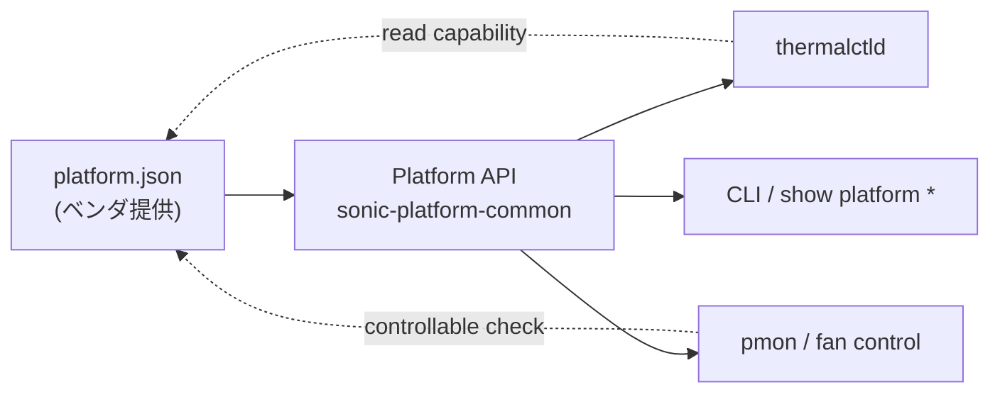

<!-- topics-tip -->
!!! tip "Topics で読み物として読む"
    この HLD は実装詳細を含みます。機能の概念・設定・運用を読み物として読みたい場合は [Topics 14 章: Platform / Port / Optics](../topics/14-platform-port-optics/index.md) を参照。
<!-- /topics-tip -->

!!! info "裏取りステータス: code-verified"
    `sonic-buildimage/device/dell/x86_64-dell_s6000_s1220-r0/platform.json` 等で `chassis.status_led.controllable`、`fans[].speed.controllable` / `minimum`、`status_led.colors` 配列、`status_led.available` のスキーマが実機向け platform.json に既に展開されていることを確認。Marvell / Dell の複数プラットフォームで採用済み。HLD の capabilities 拡張は実装に取り込まれている。

# platform.json の capabilities 拡張（LED 色 / fan speed 範囲 / controllable）

## 概要

スイッチ機器のプラットフォーム部品（fan, PSU, status LED, thermal 等）は、機種ごとに **制御可能性と取りうる値の範囲** が異なる。たとえば**ステータス LED の色**は機種により `off/amber/green` だったり `red/green` だったり、**fan speed** には推奨される `minimum/maximum` の範囲があったり、**PSU の LED は NOS から触れない**（BMC 専管）こともある[^1]。

SONiC は従来 `platform.json` を **コンポーネント構造（fan / PSU / thermal の所在）と dynamic port breakout のためのインタフェース情報** に使ってきたが、各属性の **「能力情報（capability）」を上位アプリへ渡す手段が無かった**[^1]。本 [HLD](../reference/glossary.md#term-hld) は `platform.json` に **`capabilities` フィールド** を追加して、この情報を取り出せるようにする拡張を定義する。

## 動作仕様

### 現状の `platform.json` の役割

HLD 当時の用途[^1]:

- platform components の構造定義（chassis 配下の fan_drawers / psus / thermals 等）
- dynamic port breakout 用の interface 情報

### 追加される `capabilities` フィールド

各属性ごとに、共通フィールド `controllable` と **属性固有のフィールド** を入れる[^1]:

| キー | 型 | 意味 |
|------|-----|------|
| `controllable` | bool | NOS から制御可能なら `true`、不可なら `false`。既定 `true` |
| status LED の `colors` | list of string | 取りうる LED 色のリスト |
| fan speed の `minimum` | number | 設定可能な fan speed の推奨最小値 |
| fan speed の `maximum` | number | 設定可能な fan speed の推奨最大値 |

`controllable=false` の例として **PSU の LED**（BMC 専管で NOS から書けない）、**PSU 内蔵 fan の speed**（同様に NOS 不可）、**Thermal**（読み取り専用）などが挙げられる[^1]。

### スキーマ例

HLD のサンプル[^1]:

```json
{
  "chassis": {
    "name": "PLATFORM",
    "status_led": {
      "controllable": true,
      "colors": ["off", "amber", "green"]
    },
    "fan_drawers": [
      {
        "name": "FanTray1",
        "status_led": {
          "controllable": true,
          "colors": ["red", "green"]
        },
        "fans": [
          {
            "name": "FanTray1-Fan",
            "speed": {
              "controllable": true,
              "minimum": 40,
              "maximum": 100
            }
          }
        ]
      }
    ],
    "psus": [
      {
        "name": "PSU1",
        "status_led": { "controllable": false },
        "fans": [
          {
            "name": "PSU1 Fan",
            "speed": { "controllable": false }
          }
        ]
      }
    ],
    "thermals": [
      { "name": "Thermal 1", "controllable": false },
      { "name": "Thermal 2", "controllable": false }
    ]
  }
}
```

要点[^1]:

- chassis 直下の `status_led` は `colors` 列を持つ。これでアプリは「この機種で `red` を指定して良いか」を事前にバリデーションできる。
- fan_drawer / fan には `controllable` と `speed.{minimum, maximum}` が並ぶ。speed の単位は **percentage（%）** が一般的（HLD のサンプル `40-100` から推測。HLD 本文には単位の明示はない）。
- PSU 配下の LED / fan は `controllable=false` の例として明示的にリストアップされる。NOS 側に書く API があっても **適用しない / エラーにする** べき、という属性メタデータになる。
- thermal は読み取り専用と分かるよう `controllable=false`。



### 値が無いときの振る舞い

`controllable` の **既定値は `true`**[^1]。すなわち capability セクションが書かれていない / 一部欠落している場合は **「制御可能」前提で動く** 後方互換動作になる。新フィールド未対応のプラットフォームでもクラッシュしない設計。

`colors` / `minimum` / `maximum` の既定は HLD 内では明示されていない。実装側で「指定が無ければ任意値を許容する」または「`controllable=true` で `colors` 未記載なら API 既定色のみ」のような扱いになる想定（裏取り課題）。

<!-- evidence:
source: sonic-net/SONiC/doc/platform-json/platform_json_enhancement.md#L40-L49 (sha: 49bab5b5ff0e924f1ea52b3d9db0dfa4191a7c06)
excerpt: |
  For each component's attribute, the defined `capabilities` fields are as follows:
  - "controllable" : A boolean, 'true' if the given attribute can be controlled from the NOS, 'false' otherwise. Defaults to 'true'.
  - Attribute specific fields:
      - status led - "color" - A list of the supported colors.
      - speed
          - "minimum" - Minimum recommended fan speed that can be set.
          - "maximum" - Maximum recommended fan speed that can be set.
reasoning: capabilities フィールドの仕様（controllable + 属性別 colors / minimum / maximum）と既定値 true の根拠。
-->

<!-- evidence-rendered:start -->
??? note "📋 検証エビデンス: sonic-net/SONiC/doc/platform-json/platform_json_enhancement.md#L40-L49 (sha: 49bab5b5ff0e924f1ea52b3d9db0dfa4191a7c06)"

    **出典**:

    `sonic-net/SONiC/doc/platform-json/platform_json_enhancement.md#L40-L49 (sha: 49bab5b5ff0e924f1ea52b3d9db0dfa4191a7c06)`

    **抜粋**:

    ```text
    For each component's attribute, the defined `capabilities` fields are as follows:
    - "controllable" : A boolean, 'true' if the given attribute can be controlled from the NOS, 'false' otherwise. Defaults to 'true'.
    - Attribute specific fields:
        - status led - "color" - A list of the supported colors.
        - speed
            - "minimum" - Minimum recommended fan speed that can be set.
            - "maximum" - Maximum recommended fan speed that can be set.
    ```

    **判断根拠**: capabilities フィールドの仕様（controllable + 属性別 colors / minimum / maximum）と既定値 true の根拠。

    **補足**: HLD 原文は単数形 `"color"` と記述するが、`sonic-buildimage/device/` 配下の実 `platform.json` で広く採用されている JSON キー名は複数形 `"colors"` であり、本ページ本文・スキーマ例は実装慣行に合わせて `colors` で統一している。

<!-- evidence-rendered:end -->

### 想定ユースケース

- **status LED 色のバリデーション**: ユーザが `config platform led set <color>` のような操作を試みた際、`platform.json` の `colors` リストに無い色なら CLI が拒否する。
- **fan 速度の上下限**: thermal control daemon (`thermalctld`) が PWM 制御で fan speed を計算する際、`minimum/maximum` を超えないようクランプする。
- **BMC 管理コンポーネントの自動スキップ**: PSU LED / PSU fan のように `controllable=false` のものは NOS の制御コードパスから外す。

## 設定

### 関連する CONFIG_DB

該当エントリは無い。`platform.json` は **[CONFIG_DB](../reference/glossary.md#term-config_db) の上流** にあるベンダ提供静的ファイルであり、ランタイムで [Redis](../reference/glossary.md#term-redis) に乗るデータではない。

### 関連する CLI

該当 CLI は HLD 内では定義されていない。`show platform *` 系のコマンドや `config platform *` 系が capability を参照することは想定されるが、本 HLD では具体的な CLI 拡張に踏み込んでいない。

## 制限事項

- `controllable` の **既定値が `true`**。記述が無いプラットフォームでは「制御可能」と仮定して上位アプリが動く。**実機が制御できない属性に書くと [SAI](../reference/glossary.md#term-sai) / プラットフォームドライバ側でエラー**になる可能性がある[^1]。
- `colors` / `minimum` / `maximum` の **未指定時の挙動が HLD で明文化されていない**。後方互換のため任意値を許容する方向と思われるが、実装で確認が必要。
- 単位（fan speed の `%` か `RPM` か）が HLD 内で明示されていない。サンプルの `40-100` は % と読める。
- `capabilities` フィールドはあくまで **メタデータ**。NOS が `controllable=false` を尊重しないコード経路があれば抜け穴になる。

## 干渉する機能

- **Platform API（`sonic-platform-common` の `chassis_base.py` 等）**: 既存 API の戻り値を `platform.json` の capability から導出するよう拡張する想定。HLD 自体は API 仕様の詳細には踏み込んでいない。
- **`thermalctld` / fan control**: `speed.minimum/maximum` を尊重する責務を持つ。BMC 制御の fan については `controllable=false` を見て制御をスキップする[^1]。
- **CLI `config / show platform`**: status LED 色のバリデーション、fan speed 上下限の表示などで capability を参照する想定。
- **dynamic port breakout**: 既存の `platform.json` 用途と同居する。capability セクションは新規 sibling として加わるだけで、既存 interface セクションには影響しない。
- **ベンダ実装**: 各ベンダが `device/<vendor>/platform/platform.json` に capability を埋める責任を持つ。空でも後方互換は壊れない[^1]。

## トラブルシューティング

- LED 色が反映されない: `platform.json` の該当コンポーネントの `colors` に当該色が入っているか確認。`controllable=false` だと NOS からは触れない[^1]。
- fan speed を 30% に設定したが 40% になる: `speed.minimum=40` の制約に従って上位アプリがクランプしている可能性。`platform.json` を確認[^1]。
- PSU の LED 制御が無視される: 仕様どおり。BMC 管理のため `controllable=false`。NOS から触らない設計[^1]。
- 古いプラットフォームで動かない: `capabilities` セクション未記述でも `controllable` の既定 `true` で従来挙動になる[^1]。それでも動かない場合は他の HLD（dynamic port breakout 等）の互換性問題を疑う。

### コマンド例

platform capability ファイルを確認する。

```bash
# Platform capability
cat /usr/share/sonic/device/$(show platform summary | awk '/Platform/{print $2}')/platform.json | head
show platform summary
redis-cli -n 6 keys 'CHASSIS_INFO|*'
```

## 参考リンク

- [Topics: Platform / Port / Optics](../topics/14-platform-port-optics/index.md)
- [CLI: show platform](../reference/cli/show-platform.md)
- [HLD: s3ip-sysfs-specification](s3ip-sysfs-specification.md)

## 引用元

[^1]: `sonic-net/SONiC` `doc/platform-json/platform_json_enhancement.md` @ `49bab5b5ff0e924f1ea52b3d9db0dfa4191a7c06`

<!-- topics-back-ref -->
## 関連 Topics

- [Topics: Platform / Port / Optics / PHY](../topics/14-platform-port-optics/index.md)

<!-- /topics-back-ref -->

## 参考リンク

本ページに関連する参照ドキュメント:

- [`show platform` CLI リファレンス](../reference/cli/show-platform.md)
- [`CRM` CONFIG_DB スキーマ](../reference/config-db/crm.md)
- [`sonic-crm` YANG モジュール](../reference/yang/sonic-crm.md)

<!-- augmented-links: v1 -->

<!-- glossary-links-injected: efdb904808b0 -->
