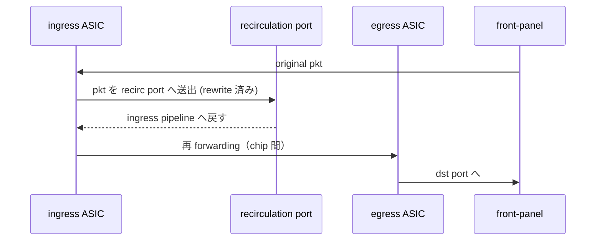
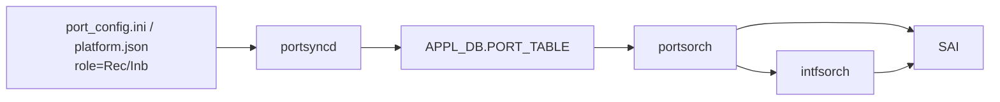

<!-- topics-tip -->
!!! tip "Topics で読み物として読む"
    この HLD は実装詳細を含む。機能の概念・設定・運用を読み物として読みたい場合は [Topics 12 章: Multi-ASIC / VoQ / Chassis](../topics/12-multi-asic-voq/index.md) を参照。
<!-- /topics-tip -->

!!! info "裏取りステータス: code-verified"
    sonic-swss `orchagent/port.h` L158-167 で `enum Role { Ext, Int, Inb, Rec, Dpc }` を確認。`portsorch.h` L600 で `map<string, Port::Role> m_recircPortRole` メンバを確認、`portsorch.cpp` L4250-4252 で `role == Port::Role::Rec || role == Port::Role::Inb` のとき m_recircPortRole に登録、L10846-10857 `getRecircPort(Port&, Port::Role)` を確認。minigraph 側は sonic-buildimage `src/sonic-config-engine/minigraph.py` L126 で `role.lower() == 'inb' or role.lower() == 'rec'` 受理（VOQ intf 属性抽出）、L2509-2512 で `port_role == 'Rec'` の port を admin_status=up + INTERFACE テーブル登録（routed 化）する経路を確認。Mirror 側は `mirrororch.cpp` L594/L964/L1195 で `getRecircPort(port, Port::Role::Rec)` 呼び出しを確認（verified at: 2026-05-09）。

# VOQ シャシでの recirculation port サポート（Inb / Rec ポートロール）

## 概要

[VOQ](../reference/glossary.md#term-voq) ベースのシャシでは **入口 chip（ingress [ASIC](../reference/glossary.md#term-asic)）** と **出口 chip（egress ASIC）** が異なることがあり、両 chip の rewrite 設定を協調プログラムする必要がある。**recirculation port (= recycle port)** は egress を ingress にループバックする特殊ポートで、これを使えば **egress chip の rewrite を協調設定する代わりに ingress 側で 1 度処理し直す** ことで chip 間 forwarding を達成できる[^1]。

利用ケース[^1]:

1. **Inband port** (Inb): VOQ アーキテクチャの inband 通信用
2. **Everflow 等 encap して再 routing する機能** (Rec): mirror パケットを recycle して egress ASIC へ届ける

## 動作仕様

### Recirculation port の動作

ingress 側に戻ってきたパケットは **適切に作り直し / 書き換え** されている前提で再 forwarding される[^1]。DMAC や DIP が壊れていると正しく転送されない。パケットの起点は **network 側 / local kernel interface** どちらでも可。



### Recycle-to-bridged vs Recycle-to-routed

DMAC と recycle port の設定により分岐する[^1]:

| パターン | 条件 | 振る舞い |
|----------|------|---------|
| **Recycle-to-bridged** | DMAC ≠ ingress ASIC の router MAC | DMAC で **L2 bridging** |
| **Recycle-to-routed** | DMAC = ingress ASIC の router MAC かつ recycle port が routed port | **L3 routing** （DIP ベース、[ECMP](../reference/glossary.md#term-ecmp) 利用可） |

trade-off[^1]:

- routed の方が ECMP 等 L3 の利点を活かせるため **一般に preferred**
- ただし routed では **ルーティング 2 回** で **TTL が 2 度 decrement** される副作用

bridge / route いずれの場合も **対応する [FDB](../reference/glossary.md#term-fdb) / route entry が ingress ASIC に programming されている必要**。

### Explicit recycle port

統計（counter / error）を front panel port と同じく取得するため、**recycle port を [SONiC](../reference/glossary.md#term-sonic) から見える形にする**[^1]。[SAI](../reference/glossary.md#term-sai) 側は **既存の port API で create できれば追加変更なし**。

### 設定方法

`port_config.ini` または `platform.json` で **port role** を指定[^1]:

| Role | 用途 |
|------|------|
| `Ext` | 通常の front panel port |
| `Rec` | Everflow など、機能による recycle 用 |
| `Inb` | VOQ アーキテクチャの inband 用 |

#### `port_config.ini` 例

```text
#name           lanes                     alias        index  role  speed
Ethernet0       48,49,50,51,52,53,54,55   Ethernet1/1  1      Ext   400000
Ethernet-Rec0   221                       Recirc0/0    5      Rec   400000
Ethernet-IB0    222                       Recirc0/1    6      Inb   400000
```

#### `platform.json` 例

```json
{
  "Ethernet-Rec0": {
    "index": "5", "lanes": "221",
    "breakout_modes": {"1x400G": ["Recirc0/0"]},
    "role": "Rec"
  },
  "Ethernet-IB0": {
    "index": "6", "lanes": "222",
    "breakout_modes": {"1x400G": ["Recirc0/1"]},
    "role": "Inb"
  }
}
```

### SWSS 内の処理

通常 port と同等[^1]:



- `portsyncd`: recycle port を [APPL_DB](../reference/glossary.md#term-appl_db).PORT_TABLE に投入
- `portsorch`: 初期化 + host interface 作成
- `intfsorch`: router interface ([RIF](../reference/glossary.md#term-rif)) 作成

### `show interfaces status` 例

```text
Interface     Lanes  Speed  MTU   FEC   Alias        Vlan    Oper Admin  Type  Asym PFC
Ethernet0     48-55  400G   9100  none  Ethernet1/1  routed  up   up     OSFP  off
Ethernet-Rec0 221    400G   9100  N/A   Recirc0/0    routed  up   up     N/A   off
Ethernet-IB0  222    400G   9100  N/A   Recirc0/1    routed  up   up     N/A   off
```

`Type=N/A` で transceiver が無いことが視覚的に分かる。

## 設定

### 関連する CONFIG_DB

| Table | Key | フィールド | 説明 |
|-------|-----|-----------|------|
| `PORT` | `<port>` | `role: Ext/Rec/Inb` | port role により recycle 用と判定 |

### 関連する CLI

| Command | 用途 |
|---------|------|
| `show interfaces status` | recycle port も front panel port と同様に表示 |
| `show interfaces counters` | recycle port も統計表示対象 |

### 設定例

通常運用ではユーザは触らない。プラットフォーム実装が `platform.json` / `port_config.ini` で role を定義する。確認のみ:

```bash
show interfaces status | grep -E 'Recirc|Ether-(Rec|IB)'
```

## 制限事項

- **recycle-to-routed では TTL が 2 回 decrement** する[^1]。end-to-end の hop count が +1 になる
- recycle 経路で正しく転送されるためには **DMAC / DIP の rewrite が完了していること** が前提
- 対応する **FDB / route entry が ingress ASIC に programming 済み** でないと recycle 後に黒穴
- ASIC ベンダによって recycle port の実装方法が異なる。**front panel port と同等に作れない場合は SAI 拡張が必要**[^1]
- `show interfaces` の Type 列は recycle port では `N/A` 表示。transceiver 監視機能は無効
- VOQ アーキテクチャ前提。pizza box 機への適用は本 [HLD](../reference/glossary.md#term-hld) の対象外
- HLD は 2021-01 改訂と古い。recycle-to-routed の細部実装はベンダ追従

## 干渉する機能

- **`portsyncd` / `portsorch` / `intfsorch`**: recycle port を front panel と同等に取り回す
- **`Everflow` / mirror**: encap 後の recycle 経由 routing で `Rec` port を消費
- **VOQ inband 通信**: `Inb` port を消費
- **SAI port API**: 既存 API のまま（ベンダ実装次第で追加が必要）
- **ECMP / route**: recycle-to-routed 時の経路選択に活用
- **TTL 関連 SLA**: 2 回 decrement の影響に注意

## トラブルシューティング

- recycle 経由で traffic が消える → ingress ASIC の FDB / route entry に対応 entry があるか確認
- TTL drop が想定より早い → recycle-to-routed の **2 回 decrement** が原因の可能性
- `show interfaces status` に recycle port が出ない → `port_config.ini` / `platform.json` の `role: Rec/Inb` を確認、`portsyncd` ログを確認
- VOQ 機の inband が機能しない → `Ethernet-IB0` 等の port が APPL_DB.PORT_TABLE に作られているか確認
- mirror 用 recycle が動かない → Everflow が `Rec` role の port を選んでいるか確認

### コマンド例

multi-ASIC / VoQ chassis の各 namespace 状態を確認する。

```bash
# multi-ASIC / VoQ chassis
show chassis modules status
show platform summary
sudo ip netns list
for ns in $(sudo ip netns list | awk '{print $1}'); do
  echo "== $ns =="
  sudo ip netns exec "$ns" show interfaces status | head
done
```

## 引用元

[^1]: `sonic-net/SONiC` `doc/recirculation-port/recirculation_port.md` @ `49bab5b5ff0e924f1ea52b3d9db0dfa4191a7c06`

<!-- concerns hint:
- port_config.ini / platform.json の role=Rec/Inb 受理コード（portsyncd / sonic-cfggen）の現行実装確認
- portsorch が recycle port に対し host interface / SAI port を作成する経路の現行確認
- intfsorch が recycle port に router interface を作る挙動の確認
- recycle-to-routed の DMAC / 設定条件と TTL 2 重 decrement の現行 ASIC SAI 挙動確認
- Everflow / mirror が Rec role port を選択するロジックの実装確認
- VOQ inband port (Inb role) を消費する VOQ inband 機能側の実装確認
-->

<!-- topics-back-ref -->
## 関連 Topics

- [Topics: Multi-ASIC / VOQ Chassis](../topics/12-multi-asic-voq/index.md)

<!-- /topics-back-ref -->

<!-- glossary-links-injected: ec18b66e3507 -->
