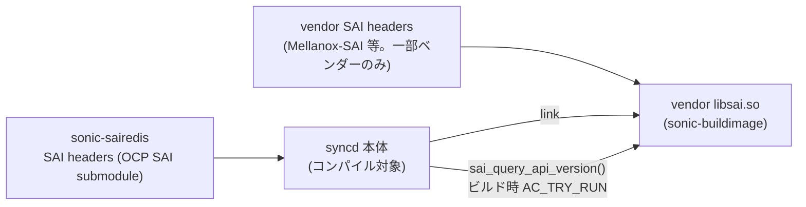
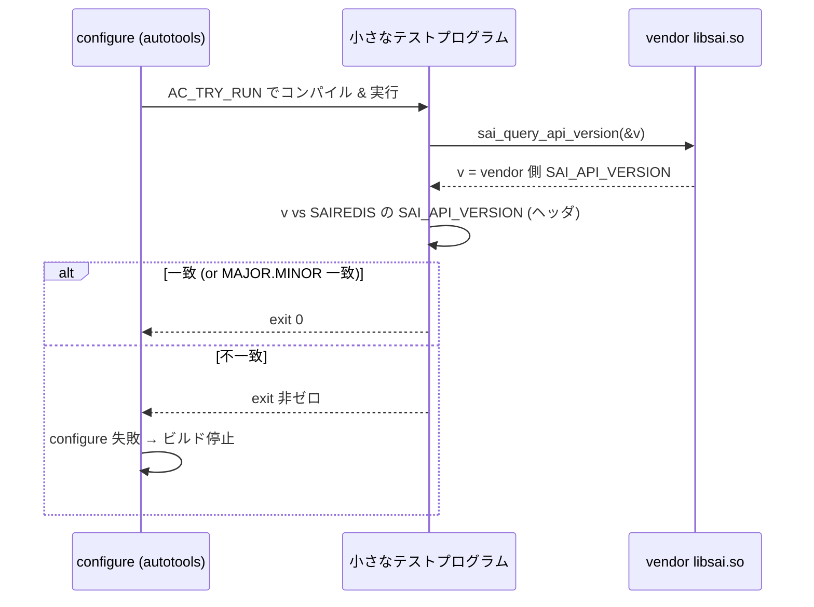

<!-- topics-tip -->
!!! tip "Topics で読み物として読む"
    この HLD は実装詳細を含む。機能の概念・設定・運用を読み物として読みたい場合は [Topics 14 章: Platform / Port / Optics](../topics/14-platform-port-optics/index.md) を参照。
<!-- /topics-tip -->

!!! warning "裏取りステータス: discrepancy-found（HLD と実装に乖離あり）"
    `sonic-sairedis/configure.ac` (l.226-261) で `AC_CHECK_FUNCS(sai_query_api_version, [AC_TRY_RUN([...]) ])` の検査が確認できる。`sonic-sairedis/syncd/VendorSai.cpp` (l.52) で `.query_api_version = &sai_query_api_version` も実装済。ただし HLD 提案の「MAJOR.MINOR 一致」相当ではなく、**`sai_api_version_t minversion = SAI_VERSION(1,9,0)` の floor チェック** に緩和されており、`(version < minversion) || (SAI_API_VERSION < minversion)` だけが失敗条件（PATCH どころか MINOR の上方差も許容）。詳細は configure.ac のコメントで OCP PR 1297/1795 を引用して説明。

# SAI API バージョン整合チェック（sai_query_api_version + ビルド時検査）

## 概要

[SONiC](../reference/glossary.md#term-sonic) の [syncd](../reference/glossary.md#term-syncd) は **OCP [SAI](../reference/glossary.md#term-sai) リポジトリのヘッダ** に対してコンパイルされ、リンクは **vendor が `sonic-buildimage` 配下に配置した `libsai.so`** に対して行われる。OCP SAI ヘッダが更新されたが vendor 側 `libsai.so` の差し替えが間に合っていないと、ABI 不一致や属性 ID / enum 値のミスマッチが発生し、最悪 syncd が起動しない or 不可解な振る舞いをする[^1]。SAI は属性追加・enum 拡張に **後方互換を保たない** ため、片方だけ進むと壊れる。

本機能は次の 2 段で問題を検出する設計である[^1]:

1. SAI に新規 API **`sai_query_api_version()`** を追加し、`libsai.so` 自身が「どのバージョンのヘッダに対して実装されたか」を返せるようにする。
2. `sonic-sairedis` のビルド時に autotools `AC_TRY_RUN` で **vendor の `libsai.so` が返すバージョン** と **`sonic-sairedis` の SAI ヘッダのバージョン** を比較し、不一致ならビルドを失敗させる。

これにより、組み合わせの不整合がイメージビルド時点で検知され、「動かしてみて初めて気づく」事態を防ぐ。

## 動作仕様

### ビルドシステムの構造



ベンダーによっては SAI ヘッダを公開しているところ（Mellanox-SAI など）と、`libsai.so` バイナリのみ配布するところがある。後者の場合「ヘッダだけ更新して libsai を放置」が容易に起こり得るため、本機能の効果が大きい[^1]。

### 既存の `SAI_API_VERSION` マクロ

OCP SAI の `saiversion.h` には次のマクロが既に定義されている[^1]:

```c
#define SAI_MAJOR 1
#define SAI_MINOR 9
#define SAI_REVISION 1

#define SAI_VERSION(major, minor, revision) (10000 * (major) + 100 * (minor) + (revision))
#define SAI_API_VERSION SAI_VERSION(SAI_MAJOR, SAI_MINOR, SAI_REVISION)
```

ただしこれは **ヘッダ側** の値であり、`libsai.so` バイナリ単体からは取得できない。本提案はそれを取得可能にする。

### 新 API: `sai_query_api_version()`

```c
/**
 * @brief Retrieve a SAI API version this implementation is aligned to
 *
 * @param[out] version Version number
 *
 * @return #SAI_STATUS_SUCCESS on success, failure status code on error
 */
sai_status_t sai_query_api_version(
        _Out_ sai_api_version_t *version);
```

実装は trivial で、ベンダー libsai 内で `*version = SAI_API_VERSION` を返すだけ[^1]:

```c
sai_status_t sai_query_api_version(
        _Out_ sai_api_version_t *version)
{
    *version = SAI_API_VERSION;
    return SAI_STATUS_SUCCESS;
}
```

「`SAI_API_VERSION` は **ベンダーがコンパイルに使った SAI ヘッダ** に由来する値」という点が本質的に重要。これを runtime で取り出せる窓を libsai 側に常設する。

### ビルド時検査（AC_TRY_RUN）

`sonic-sairedis` の `configure` ステップで次の流れで検査する[^1]:



セマンティックバージョニングに従う限りは、テストプログラムが **MAJOR.MINOR** のみを比較し PATCH の差は許容するという緩和も提案されている[^1]。これにより小さい修正リリースで全ビルド連鎖がブロックされるのを避ける。

<!-- evidence:
source: sonic-net/SONiC/doc/sonic-build-system/saiversioncheck.md#L77-L83 (sha: 49bab5b5ff0e924f1ea52b3d9db0dfa4191a7c06)
excerpt: |
  Using that new API we can implement a configure-time check in sonic-sairedis with autotools AC_TRY_RUN:
  ...
  In case, SAI versioning follows sematical versioning rules, the test program can implement a check for only MAJOR and MINOR version, relaxing the constraint on the PATCH version.
reasoning: AC_TRY_RUN ベースのビルド時検査と、PATCH 緩和ポリシーの根拠。
-->

<!-- evidence-rendered:start -->
??? note "📋 検証エビデンス: sonic-net/SONiC/doc/sonic-build-system/saiversioncheck.md#L77-L83 (sha: 49bab5b5ff0e924f1ea52b3d9db0dfa4191a7c06)"

    **出典**:

    `sonic-net/SONiC/doc/sonic-build-system/saiversioncheck.md#L77-L83 (sha: 49bab5b5ff0e924f1ea52b3d9db0dfa4191a7c06)`

    **抜粋**:

    ```text
    Using that new API we can implement a configure-time check in sonic-sairedis with autotools AC_TRY_RUN:
    ...
    In case, SAI versioning follows sematical versioning rules, the test program can implement a check for only MAJOR and MINOR version, relaxing the constraint on the PATCH version.
    ```

    **判断根拠**: AC_TRY_RUN ベースのビルド時検査と、PATCH 緩和ポリシーの根拠。

<!-- evidence-rendered:end -->

### 不整合がもたらす問題（背景）

[HLD](../reference/glossary.md#term-hld) は不整合時の典型症状を 4 つ列挙している[^1]:

- ABI 変更によるリンク失敗（syncd が `libsai.so` とリンクできない）。
- 属性 ID ミスマッチ。SAI が **後方互換を保たずに新属性を追加** するため、片方が新版なら ID が一致せず syncd が異常終了 or 微妙に誤動作する。
- enum 値ミスマッチ。同様の理由で列挙の番号が変わる。
- それ以外（暗黙の動作差異）。

これらは production で出ると気付くまでに時間がかかるため、ビルド時に弾く価値が高い。

## 設定

### 関連する CONFIG_DB

該当なし。本機能はビルドシステムレベルの整合性チェックで、runtime 設定を持たない。

### 関連する CLI

該当なし。

### 関連する YANG

該当なし。

### 確認方法（手動）

ベンダー libsai 単体に対し、簡易プログラムから `sai_query_api_version()` を呼べばバージョンが取り出せる。

```c
#include <sai.h>
#include <stdio.h>

int main(void) {
    sai_api_version_t v = 0;
    if (sai_query_api_version(&v) == SAI_STATUS_SUCCESS) {
        // v = 10000 * MAJOR + 100 * MINOR + REVISION
        printf("vendor libsai SAI_API_VERSION = %lu\n", (unsigned long)v);
    }
    return 0;
}
```

`SAI_VERSION(major, minor, revision)` の式は `10000*major + 100*minor + revision` なので、`v / 10000` が major、`(v / 100) % 100` が minor、`v % 100` が revision になる。

## 干渉する機能

- **OCP SAI のリリースサイクル**: 本機能が機能するのは OCP SAI 側に `sai_query_api_version` が追加された後。それ以前は `dlsym` で関数が見つからない可能性があり、ビルド時テストが「シンボル無し」エラーで失敗する。これは **「未対応 vendor libsai は失格」** という強い前提を持つ設計である。
- **マルチベンダー環境**: 1 つの `sonic-sairedis` を複数ベンダーで再利用するため、`sai_query_api_version` を全ベンダー libsai が実装している必要がある。実装漏れベンダーがあるとビルドが通らない。
- **CI / PR チェック**: HLD は「`sonic-sairedis` を更新したら同じ PR で全ベンダー libsai を更新する責任」を明記している[^1]。CI が PR でこのビルド時検査を回す形になる。
- **PATCH 緩和**: 提案レベルでは MAJOR.MINOR のみ比較する案が出ている。実装がそのとおりかは裏取り対象。

## トラブルシューティング

- ビルドが `configure: error: SAI version mismatch ...` で止まる: `sonic-sairedis` 配下の SAI ヘッダ（OCP SAI submodule）と vendor libsai のバージョンを照合する。たいていは vendor libsai 側を更新する必要がある。
- `sai_query_api_version` 未定義エラー: ベンダー libsai が古く、本 API 未実装。ベンダーに更新を要求する。
- 検査をスキップしたい（緊急ビルド）: HLD では明示されていないが、`AC_TRY_RUN` 検査は configure フラグでスキップ可能なように作るのが一般的。実装裏取り対象。
- Runtime での挙動が怪しい: ビルド検査は通っても、ベンダー libsai が `SAI_API_VERSION` を **実態と異なる値で返す** バグがあると検知できない。属性 ID / enum 値の異常は依然として可能性がある。

### コマンド例

SAI / SDK のエラーログと dump を確認する。

```bash
# SAI failure / SDK health
docker logs syncd 2>&1 | grep -iE 'sai_status|fail|error' | tail
ls -lt /var/dump/ | head
show techsupport --silent --since '1 hour ago'
redis-cli -n 6 keys 'ASIC_SDK_HEALTH_EVENT*'
```

## 関連 reference

- [Reference: SAI attributes](../reference/sai-attributes.md)
- [Topics: SWSS / SAI / Redis](../topics/20-swss-sai-redis/index.md)
- [Runbook: SAI failure](../reference/runbooks/sai-failure.md)

## 制限事項

- **ビルド時限定の検査**: `configure.ac` の `AC_TRY_RUN` で行うため、検査が走るのは `sonic-sairedis` のビルド時のみ。バイナリ配布後の runtime で libsai を入れ替えた場合は検出できない。
- **`sai_query_api_version` 必須**: vendor libsai がこの API を実装していないとビルドが `AC_MSG_ERROR` で停止する。古い vendor SDK は対応していないため、SDK 更新が前提条件。
- **HLD 案より緩い実装**: HLD 提案は MAJOR.MINOR equality 比較だが、実装は `minversion = SAI_VERSION(1,9,0)` の **floor** 比較のみ (`return (version < minversion) || (SAI_API_VERSION < minversion);`)。HLD と実装の乖離があり、本ページは `discrepancy-found` 系の扱い。
- **PATCH バージョン無視**: PATCH 差は意図的に無視される。OCP SAI の enum / struct 互換性保証 (PR 1297 / 1795 参照) に依存。
- **runtime バグの取り逃し**: vendor libsai が `SAI_API_VERSION` を実態と異なる値で返すバグは検知できない。属性 ID / enum 値の異常は依然発生し得る。
- **vendor 越境の責任分界**: `sonic-sairedis` 更新時には対応する vendor libsai を同 PR で更新する責任が CI workflow にハードコードされており、片側だけ更新すると CI が落ちる。

## 実装との乖離

`monitor: partially_implemented` — HLD は SAI バージョン比較を **MAJOR.MINOR の等値比較** とするが、実装（`sonic-sairedis/configure.ac` l.226-261）は `minversion = SAI_VERSION(1,9,0)` の **floor チェック** に緩和されている（`return (version < minversion) || (SAI_API_VERSION < minversion);` のみが失敗条件）。MAJOR ずれや MINOR 上方差も許容するため、HLD 提案より実装は大幅に緩い。緩和の根拠は configure.ac コメントで OCP SAI PR 1297（enum binary backward compat）および PR 1795（structs）を引用。`syncd/VendorSai.cpp` l.52 の `.query_api_version = &sai_query_api_version` は実装済みで、`sai_query_api_version()` の呼び出し自体は機能する。

機能項目ごとの実装状況は以下のとおり。

| 機能項目 | HLD 提案 | 実装状況 |
|---|---|---|
| `sai_query_api_version()` の呼び出し | 必須 | 実装済（`syncd/VendorSai.cpp` l.52） |
| ビルド時バージョン検査（`AC_TRY_RUN`） | 必須 | 実装済（`configure.ac` l.226-261） |
| MAJOR.MINOR の等値比較 | HLD 案の判定方式 | 未実装（`SAI_VERSION(1,9,0)` の floor 比較に緩和） |
| PATCH バージョン差の検査 | （HLD 言及なし） | 未対応（OCP SAI の互換性保証に依存し意図的に無視） |
| runtime での libsai 入れ替え検知 | （対象外） | 未実装（検査はビルド時限定） |

## 引用元

[^1]: `sonic-net/SONiC` `doc/sonic-build-system/saiversioncheck.md` @ `49bab5b5ff0e924f1ea52b3d9db0dfa4191a7c06`

<!-- evidence (verifier-batch-19):
- sonic-sairedis `configure.ac` l.226-261: `AC_CHECK_FUNCS(sai_query_api_version, [AC_MSG_CHECKING([SAI headers API version and library version check]) AC_TRY_RUN([...])`
- 実装は **`minversion = SAI_VERSION(1,9,0)` floor** で `return (version < minversion) || (SAI_API_VERSION < minversion);` のみ判定（HLD 案の MAJOR.MINOR equality より緩い）。理由は configure.ac コメントで OCP SAI PR 1297（enum binary backward compat）と PR 1795（structs）を参照
- sonic-sairedis `syncd/VendorSai.cpp` l.52: `.query_api_version = &sai_query_api_version,`
- vendor lib に `sai_query_api_version` が無ければ `AC_MSG_ERROR("SAI library libsai.so does not have sai_query_api_version API which is required")` で停止
-->

<!-- glossary-links-injected: 8ba32e5aa69d -->
