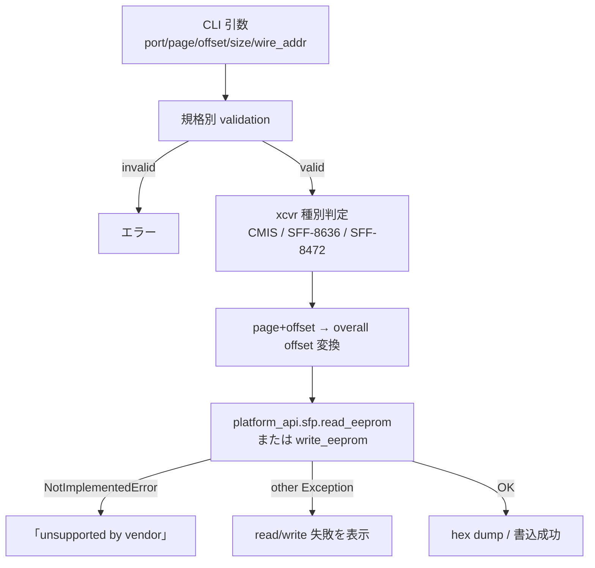

!!! warning "このページはファイル名が誤って切り詰められた旧スラグです"
    正式なページは [sfputil read-eeprom / write-eeprom（page+offset 単位の生 EEPROM 読み書き）](sfputil-add-the-ability-to-read-write-any-byte-from-eerpom-both-by-page-and-offset.md) です。

<!-- topics-tip -->
!!! tip "Topics で読み物として読む"
    この HLD は実装詳細を含む。機能の概念・設定・運用を読み物として読みたい場合は [Topics 14 章: Platform / Port / Optics](../topics/14-platform-port-optics/index.md) を参照。
<!-- /topics-tip -->

!!! info "裏取りステータス: code-verified"
    `sonic-utilities/sfputil/main.py` で `read-eeprom` (L1812-) / `write-eeprom` (L1862-) サブコマンドを確認。`-n/--page` (hex) / `-o/--offset` (`click.IntRange(0, MAX_EEPROM_OFFSET)`) / `--size` / `--no-format` / `--wire-addr` (sff8472 用) / `--verify` (write 後リードバック比較) を実装。`get_overall_offset_sff8472` ヘルパで sff8472 wire-addr (a0h/a2h) を解決し、`sfp.read_eeprom(flat_offset, size)` / `sfp.write_eeprom(overall_offset, len(bytes), bytes)` の platform API を呼ぶ。NotImplementedError 経路も `Sfp.read_eeprom() is currently not implemented for this platform` で返却。

# sfputil read-eeprom / write-eeprom（page+offset 単位の生 EEPROM 読み書き）

## 概要

光モジュールやケーブル（CMIS QSFP-DD / SFF-8636 QSFP+ / SFF-8472 SFP）の EEPROM を **page + offset + size** で直接読み書きするための CLI を `sfputil` に追加する。既存の platform API `sfp.read_eeprom` / `sfp.write_eeprom` は **overall offset 1 本** しか取らず、ユーザは規格ごとの page→overall 変換を手で行う必要があった。新 CLI はこの変換と入力 validation を肩代わりする[^1]。

## 動作仕様

### CLI（2 個追加）

`sfputil read-eeprom`[^1]:

```text
Options:
  -p, --port <logical_port_name>   Logical port name        [required]
  -n, --page <page>                EEPROM page number       [required]
  -o, --offset <offset>            EEPROM offset (page 内) [required]
  -s, --size <size>                読込バイト数              [required]
  --wire-addr TEXT                 SFF-8472 のみ (a0h / a2h)
  --no-format                      ヘキサダンプでなく hex 連結
```

`sfputil write-eeprom`[^1]:

```text
Options:
  -p, --port <logical_port_name>   [required]
  -n, --page <page>                [required]
  -o, --offset <offset>            [required]
  -d, --data <data>                hex string  [required]
  --wire-addr TEXT                 SFF-8472 のみ
  --verify                         書込後に read してベリファイ
```

### 規格別 validation 規則

| 規格 | passive cable | active cable | 注 |
|------|---------------|--------------|----|
| **CMIS** | page 0 のみ。offset 0-255 | page 0-255。page 0 は 0-255、それ以外は **128-255** | active の page 存在は cable user manual に責任を委譲 |
| **SFF-8636 / SFF-8436** | 同上 | 同上 | 同上 |
| **SFF-8472** | wire `A0h` のみ。offset 0-128 | wire `A0h`/`A2h`。各 0-255 | `--wire-addr` 必須、case insensitive |

`size > (page サイズ − offset)` は invalid。例:

```text
sfputil read-eeprom -p Ethernet0 -n 0 -o 255 -s 2     # invalid: 255+2=257 で page 0 範囲外
sfputil read-eeprom -p Ethernet0 -n 1 -o 0   -s 1     # invalid: page 1 は offset >=128
```

### 内部ロジック



要点[^1]:

- **規格ごとの page-to-overall 変換は [sonic-utilities](../reference/glossary.md#term-sonic-utilities) 側で実装**（platform API は触らない）
- ベンダ実装が `NotImplementedError` を上げた場合は **「unsupported」を専用にハンドル** し、その他例外は read/write 失敗扱い
- RJ45 ポートは対象外（EEPROM が無い）

### `--verify` フラグ

write 直後に同 page+offset+size を read して **書いた値と一致** するかを確認。一致しなければエラー[^1]:

```text
sfputil write-eeprom -p Ethernet0 -n 0 -o 100 -d 4a44 --verify
Error: Write data failed! Write: 4a44, read: 0000.
```

## 設定

### 関連する CONFIG_DB

該当なし。本機能は **EEPROM 直接アクセス** であり [CONFIG_DB](../reference/glossary.md#term-config_db) は使わない。

### 関連する CLI

`sfputil read-eeprom`, `sfputil write-eeprom`（上記）

### 設定例

```bash
# CMIS の page 0 から 32 byte
sfputil read-eeprom -p Ethernet0 -n 0 -o 0 -s 32

# SFF-8472 の A2h 領域から DDM
sfputil read-eeprom -p Ethernet0 -n 0 -o 96 -s 10 --wire-addr a2h

# CMIS module level command を発行する書込
sfputil write-eeprom -p Ethernet0 -n 0 -o 26 -d 08 --verify
```

## 制限事項

- ベンダの platform plugin が `sfp.read_eeprom` / `sfp.write_eeprom` を実装していないと使えない[^1]
- **RJ45 ポートは対象外**[^1]
- active cable の page 存在チェックは「完璧にはできない」と [HLD](../reference/glossary.md#term-hld) 自身が認めている[^1]。手元の cable / module の datasheet 照合はユーザ責任
- HLD は `Open/Action items` に項目記載なし。warmboot / fastboot 影響も `N/A`[^1]

## 干渉する機能

- **xcvrd / xcvrd_utilities**: pmon の transceiver daemon が同じ EEPROM を周期的に読んでいる。`write-eeprom` で破壊的変更をすると xcvrd 側のキャッシュとも齟齬が出うる
- **DOM / SFP monitoring**: A2h 領域の Diagnostic Monitoring Interface を上書きすると DOM 表示が壊れる
- **media_settings.json / port auto-negotiation**: TX FIR や interface_type の設定が transceiver の vendor 領域を読んでいる場合は注意
- **secure module / NVR**: 一部 module は write protect / signed firmware 領域を持つ。`write-eeprom` でアクセスすると硬い失敗を返す可能性

## トラブルシューティング

```bash
# vendor plugin が未実装
sfputil read-eeprom -p Ethernet0 -n 0 -o 0 -s 16
# → "Sfp read/write feature is not implemented" 等

# 読めるが値が想定と違う
# 1) page 番号と wire address (SFF-8472) の取り違いを確認
# 2) size が page 境界を跨いでいないか
sfputil read-eeprom -p Ethernet0 -n 0 -o 128 -s 200   # invalid

# write が反映されない
sfputil write-eeprom ... --verify
# モジュールの read-only 領域 / page 不在の可能性
```

## 参考リンク

- [CONFIG_DB: PORT](../reference/config-db/port.md)
- [CLI: show platform](../reference/cli/show-platform.md)
- [CLI: show interfaces](../reference/cli/show-interfaces.md)
- [Topics: Platform / Port / Optics](../topics/14-platform-port-optics/index.md)
- [Glossary](../reference/glossary.md)
- [Reference 索引](../reference/index.md)

## 引用元

[^1]: `sonic-net/SONiC` `doc/sfputil/read_write_eeprom_by_page.md` @ `49bab5b5ff0e924f1ea52b3d9db0dfa4191a7c06`

<!-- glossary-links-injected: 46ea0b57b0b3 -->
