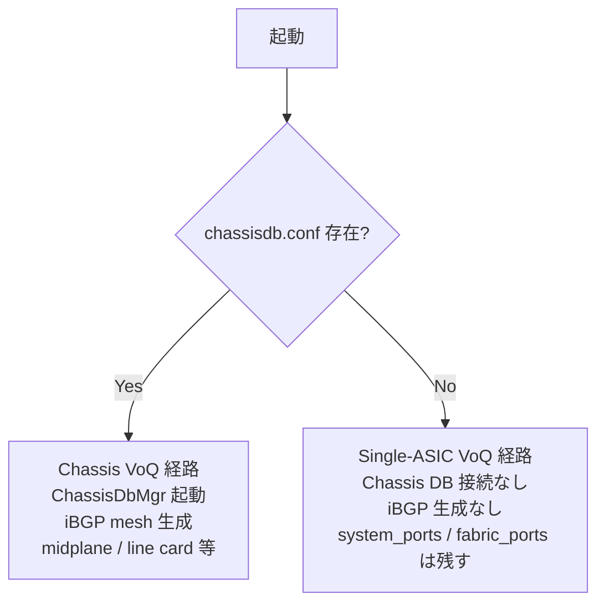

<!-- topics-tip -->
!!! tip "Topics で読み物として読む"
    この HLD は実装詳細を含む。機能の概念・設定・運用を読み物として読みたい場合は [Topics 12 章: Multi-ASIC / VoQ / Chassis](../topics/12-multi-asic-voq/index.md) を参照。
<!-- /topics-tip -->

!!! success "裏取りステータス: code-verified"
    sonic-buildimage `src/sonic-py-common/sonic_py_common/device_info.py` L43 `CHASSIS_DB_CONF_FILENAME = "chassisdb.conf"`、L261/L265 で chassis_db_conf_path 候補列挙、L622 `is_chassis_config_absent()`、L630-635 `is_voq_chassis()` で `switch_type ∈ {voq, fabric} かつ not is_chassis_config_absent()` の判定（chassisdb.conf 存在チェックで single-ASIC VoQ を区別）を確認。L668 `is_chassis()` で voq+disagg 除外 / packet / virtual を OR 結合。bgpcfgd 側は `src/sonic-bgpcfgd/bgpcfgd/managers_device_global.py` L241 と `bgpcfgd/main.py` L112 で `device_info.is_chassis()` 分岐、テストデータ `tests/data/sonic-cfggen/bgpd.main.conf.j2/voq_chassis.json` L7 で `chassisdb_conf_present` フラグを確認（verified at: 2026-05-09）。

# 単一 ASIC VoQ 固定システム（chassisdb.conf による is_voq_chassis 分岐）

## 概要

VoQ（Virtual Output Queue）アーキテクチャはこれまで **マルチ [ASIC](../reference/glossary.md#term-asic) のシャーシシステム** でのみ前提とされ、Chassis DB（`chassisdb.conf` の有無で識別される）を経由した system port 共有・iBGP メッシュ・midplane などの仕組みに強く依存していた[^1]。

本 [HLD](../reference/glossary.md#term-hld) は VoQ 機能を **単一 ASIC の固定システム** にも持ち込む構成（single-ASIC VoQ）の差分を定義する。switch type `voq` をシャーシ／非シャーシで **共用** し、Chassis DB の存在で動作を分岐する設計思想を取る[^1]。

主要原則[^1]:

- **Chassis DB に依存しない VoQ 動作** が単一 ASIC では必須
- iBGP メッシュ、line card 拡張、midplane など **シャーシ固有設定は生成しない**
- `system_ports` は依然として必要（ローカルポートに対してのみ）。`fabric_ports` も統計取得のため残す
- `inband` ポートは作らない

## 動作仕様

### 振り分けキー: `chassisdb.conf` の存在

シャーシ／単一 ASIC を判定するための単一の signal は `chassisdb.conf` の存在。`sonic-py-common/device_info.is_voq_chassis()` を **このファイルの存在チェックに改修** する[^1]。

`platform.env` に既存の `disaggregated_chassis` フラグもあるが、本機能では Chassis DB を使わないため使用しない[^1]。



### Orchagent

- VoQ 機能（`system_port` 作成等）は両モードで実行する
- **Chassis DB への接続は `is_voq_chassis()` が True のときのみ**
- 単一 ASIC モードでは **inband ポートを探さない** ように修正[^1]
- `fabric_ports` の有効化と統計収集は単一 ASIC でも継続

### Bgpconfd

- **`ChassisDbMgr`** はシャーシ系でのみ起動。`is_voq_chassis()` の判定でスキップする[^1]。
- iBGP メッシュ用の自動生成設定（`BGP_VOQ_CHASSIS_NEIGHBOR` 等）は生成不要

### sonic-utilities

| 機能 | Chassis VoQ | Single-ASIC VoQ |
|------|------------|-----------------|
| Line card 拡張サポート | ✅ | ❌ |
| internal/external [BGP](../reference/glossary.md#term-bgp) 区別 | ✅ | ❌（local のみ）|
| Fabric port status を Chassis DB から取得 | ✅ | ❌（ローカル取得）|
| [Multi-ASIC](../reference/glossary.md#term-multi-asic) チェック | True | **必ず False** |

`is_voq_chassis()` を CLI 各コマンドで参照し、Chassis 専用ロジックをスキップする[^1]。

### sonic-host-services / caclmgrd

`caclmgrd` の **midplane トラフィック** 関連 [ACL](../reference/glossary.md#term-acl) 生成は Chassis VoQ でのみ動作させる[^1]。

### CLI

`show chassis` 系コマンドは `is_chassis()` / `is_voq_chassis()` のいずれかが True のときだけ表示する[^1]。単一 ASIC VoQ でも `is_voq_chassis()` を返したいかどうかが微妙な点だが、HLD 表記では「Chassis 系の出力は本機能では出さない」前提に読める。

### Config 生成

minigraph→config 変換側で、シャーシ系の自動生成（iBGP peer、internal peers、midplane）は **chassis フラグが立っているときだけ** 行う。単一 ASIC VoQ ではスキップ[^1]。

<!-- evidence:
source: sonic-net/SONiC/doc/voq/single_asic_voq.md#L119-L147 (sha: 49bab5b5ff0e924f1ea52b3d9db0dfa4191a7c06)
excerpt: |
  This method reuses the voq switch type for non chassis systems as well.
  ... API is_voq_chassis will check for the presence of the chassisdb.conf file.
  ... Orchagent will handle VOQ functionality the same way i.e. creation of system ports.
  But connect to Chassis DB only if chassis DB is supported in the sonic system.
reasoning: chassisdb.conf による分岐方式と、Orchagent の chassis-DB 接続条件の根拠。
-->

<!-- evidence-rendered:start -->
??? note "📋 検証エビデンス: sonic-net/SONiC/doc/voq/single_asic_voq.md#L119-L147 (sha: 49bab5b5ff0e924f1ea52b3d9db0dfa4191a7c06)"

    **出典**:

    `sonic-net/SONiC/doc/voq/single_asic_voq.md#L119-L147 (sha: 49bab5b5ff0e924f1ea52b3d9db0dfa4191a7c06)`

    **抜粋**:

    ```text
    This method reuses the voq switch type for non chassis systems as well.
    ... API is_voq_chassis will check for the presence of the chassisdb.conf file.
    ... Orchagent will handle VOQ functionality the same way i.e. creation of system ports.
    But connect to Chassis DB only if chassis DB is supported in the sonic system.
    ```

    **判断根拠**: chassisdb.conf による分岐方式と、Orchagent の chassis-DB 接続条件の根拠。

<!-- evidence-rendered:end -->

## 設定

### 関連する CONFIG_DB / YANG

該当なし。判定は **`/etc/sonic/chassisdb.conf` の有無** で行う。

### 関連する CLI

| CLI | 単一 ASIC VoQ での挙動 |
|-----|------------------------|
| `show chassis` 系 | 表示しない（または最小限）|
| `show interface` / `show fabric-ports` 系 | local データのみ |
| `show ip bgp summary` | internal/external 区別なし |

## 制限事項

- **`disaggregated_chassis` フラグは使わない**: 既存フラグが似た用途を匂わせるが、HLD は本機能で **使用しない** と明記している[^1]。
- **`is_voq_chassis()` のセマンティクス変化**: 既存呼び出し元が「VoQ シャーシかどうか」と「VoQ 全般か」のどちらを意図していたかでバグになりうる。改修先は `chassisdb.conf` の有無のみを見る[^1]。
- **inband ポート不在**: シャーシで前提だった inband 経路を使う他コードパスは単一 ASIC VoQ で例外的に扱う必要がある[^1]。
- **HLD は 2025-08 の比較的新しい改訂**: 改修は進行中の可能性が高く、master との差分の方向は「未実装かもしれない」が中心[^1]。

## 干渉する機能

- **`BGP_VOQ_CHASSIS_NEIGHBOR`**: 単一 ASIC VoQ では生成されない。[CONFIG_DB](../reference/glossary.md#term-config_db) 上に空のまま。
- **fabric port 統計**: 単一 ASIC VoQ でも `fabric_ports` は残す方針[^1]。`fabricstat` 系コマンドの挙動が両モードで微妙に違いうる。
- **mirror orch**: HLD Rev 1.3 で「neighbors and mirror orch の詳細を追加」と言及されているが、本ファイルの本文側には mirror orch の具体差分は明記されていない（追加更新で記載される想定）[^1]。

## トラブルシューティング

- 単一 ASIC VoQ 機種なのに Chassis 系挙動になる: `/etc/sonic/chassisdb.conf` の存在を確認。誤って配備されていないか。
- iBGP 設定が生成されてしまう: `is_voq_chassis()` が True を返している可能性。改修版の判定ロジックが効いているかを確認。
- `fabric_ports` が表示されない: 単一 ASIC VoQ でも残す前提のため、[orchagent](../reference/glossary.md#term-orchagent) の fabric ポート列挙経路を確認。

### コマンド例

multi-ASIC / VoQ chassis の各 namespace 状態を確認する。

```bash
# multi-ASIC / VoQ chassis
show chassis modules status
show platform summary
sudo ip netns list
for ns in $(sudo ip netns list | awk '{print $1}'); do
  echo "== $ns =="
  sudo ip netns exec "$ns" show interfaces status | head
done
```

## 関連 reference

- [Topics: Multi-ASIC / VOQ](../topics/12-multi-asic-voq/index.md)
- [HLD: db-design-for-multi-asic-scenarios](db-design-for-multi-asic-scenarios.md)
- [Reference index](../reference/index.md)

## 引用元

[^1]: `sonic-net/SONiC` `doc/voq/single_asic_voq.md` @ `49bab5b5ff0e924f1ea52b3d9db0dfa4191a7c06`

<!-- topics-back-ref -->
## 関連 Topics

- [Topics: Multi-ASIC / VOQ Chassis](../topics/12-multi-asic-voq/index.md)

<!-- /topics-back-ref -->

<!-- glossary-links-injected: a4e1093efab5 -->
