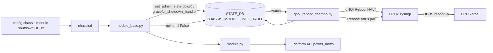

<!-- topics-tip -->
!!! tip "Topics で読み物として読む"
    この HLD は実装詳細を含む。機能の概念・設定・運用を読み物として読みたい場合は [Topics 13 章: DASH / SmartSwitch](../topics/13-dash-smartswitch/index.md) を参照。
<!-- /topics-tip -->

!!! danger "裏取りステータス: discrepancy-found"
    HLD は v0.1 (2025-12) Initial Proposal。実装は **HLD と乖離**。`sonic-platform-common` `module_base.py` の `set_admin_state_gracefully()` / `_graceful_shutdown_handler()` および `sonic-platform-daemons/sonic-chassisd/scripts/chassisd` の `submit_dpu_callback()` は実在するが、HLD で提案されている独立した `gnoi_reboot_daemon.py` は **sonic-platform-daemons に未取り込み**。STATE_DB のフラグも HLD の `CHASSIS_MODULE_INFO_TABLE` / `state_transition_in_progress` ではなく `CHASSIS_MODULE_TABLE` の `transition_in_progress` (`set_module_state_transition`) と独立した `gnoi_halt_in_progress` フラグの 2 系統で実装されている。chassisd が直接 `module.set_admin_state_gracefully` を呼ぶ構成で、独立した gNOI 経路は実体がない。

# Smart Switch DPU Graceful Shutdown（gnoi_reboot_daemon HALT）

## 概要

[SmartSwitch](../reference/glossary.md#term-smartswitch) では [DPU](../reference/glossary.md#term-dpu) の graceful reboot に続き **graceful shutdown** をサポートする[^1]。"reboot の前半" に見えるが、CLI 起動経路、コードパス、PMON container の制限（`docker` / `bash` / `hostexec` 不可）から実装が分離される。chassisd が [NPU](../reference/glossary.md#term-npu) 側で動き、各 DPU には [gNOI](../reference/glossary.md#term-gnoi) Reboot RPC (`HALT`) を発行する `gnoi_reboot_daemon.py` 経由で並列に shutdown を投げる構成。

## 動作仕様

### コンポーネント関係



### Sequence

1. `gnoi_reboot_daemon.py` 起動時に `CHASSIS_MODULE_INFO_TABLE` を subscribe（startup 系の遷移は no-op）[^1]
2. ユーザが `config chassis module shutdown DPUx` を発行
3. `chassisd` → `module_base.set_admin_state(down)` を呼出
4. `module_base.py` は **[DEVICE_METADATA](../reference/glossary.md#term-device_metadata) の `subtype="SmartSwitch"` かつ `switch_type != dpu`** を確認。条件成立で `graceful_shutdown_handler()` 経路へ。それ以外は通常の `module.set_admin_state(down)`
5. `graceful_shutdown_handler()` が [STATE_DB](../reference/glossary.md#term-state_db) の `CHASSIS_MODULE_INFO_TABLE|DPUx` に `state_transition_in_progress=True`, `transition_type=shutdown` を書き込む
6. `gnoi_reboot_daemon` は変化を検出し DPUx の sysmgr に **gNOI Reboot RPC `HALT`** を送る。sysmgr は DBUS で `reboot -p` を発行
7. daemon が `gnoi_client -rpc RebootStatus` で polling
8. DPU が kernel shutdown 完了後、daemon が `state_transition_in_progress=False` に戻す（タイムアウト時は失敗結果を書く）
9. `module_base.py` は 5 秒間隔で polling し False を確認、ログ出力
10. 最後に `module.py.set_admin_state(down)` で platform API による power-down

### CHASSIS_MODULE_INFO_TABLE スキーマ（STATE_DB）

key: `CHASSIS_MODULE_INFO_TABLE|<MODULE>`

| Field | 説明 |
|-------|------|
| `state_transition_in_progress` | `"True"` で遷移中、`"False"`/不在で停止中 |
| `transition_start_time` | UTC 文字列 |
| `transition_type` | `"shutdown"` / `"none"`（reboot/startup は `none`）|

| 種別 | 設定者 | 解除者 |
|------|--------|--------|
| Startup | CLI / config load | online 到達時 |
| Shutdown | CLI / config load | `gnoi_reboot_daemon` が platform API 完了時 |
| Reboot | `smartswitch_reboot_helper` | 同左 |

### 並列実行と race condition

複数 DPU の graceful shutdown は並列に実行される[^1]。`module_base.py` と `smartswitch_reboot_helper` が同 module の `state_transition_in_progress` に書き込みを競った場合、**先に True に書いた側が勝つ**。負け側は失敗扱いで再投を要求される。

主要シナリオ（[HLD](../reference/glossary.md#term-hld) 抜粋）[^1]:

| Scenario | 結果 |
|----------|------|
| reboot 進行中に shutdown/startup | 後者が失敗。reboot 完了後再投 |
| graceful shutdown 進行中に reboot 要求 | reboot 失敗。shutdown 完走で目的達成のため reboot 不要 |
| startup 進行中に reboot | reboot 失敗 |
| switch-level reboot 進行中 | 全 module の `True` を一括取得。module-level 操作は失敗 |
| switch-level reboot が module-level 進行中に発行 | 進行中 module は skip、他は switch reboot で処理 |

### Constraints の妙味

- PMON container には `docker`, `hostexec`, `bash` が無い → gNOI 呼び出しを **PMON 内 daemon** に閉じる必要があった[^1]
- gNOI 自体は host 側で `docker exec` ベースに実行される設計だが、PMON は host に直接命令できないため **STATE_DB IPC** を介する pub/sub 経由で実行を委譲する形を採る

<!-- evidence:
source: sonic-net/SONiC/doc/smart-switch/graceful-shutdown/graceful-shutdown.md#L93-L103 (sha: 49bab5b5ff0e924f1ea52b3d9db0dfa4191a7c06)
excerpt: |
  This design enables the chassisd process running in the PMON container to invoke a gNOI-based reboot
  when it triggers the "set_admin_state(down)" API of a DPU module, without relying on docker, bash,
  or hostexec within the container.
reasoning: PMON 制限下での実装方針と Redis pub/sub への分離の根拠。
-->

<!-- evidence-rendered:start -->
??? note "📋 検証エビデンス: sonic-net/SONiC/doc/smart-switch/graceful-shutdown/graceful-shutdown.md#L93-L103 (sha: 49bab5b5ff0e924f1ea52b3d9db0dfa4191a7c06)"

    **出典**:

    `sonic-net/SONiC/doc/smart-switch/graceful-shutdown/graceful-shutdown.md#L93-L103 (sha: 49bab5b5ff0e924f1ea52b3d9db0dfa4191a7c06)`

    **抜粋**:

    ```text
    This design enables the chassisd process running in the PMON container to invoke a gNOI-based reboot
    when it triggers the "set_admin_state(down)" API of a DPU module, without relying on docker, bash,
    or hostexec within the container.
    ```

    **判断根拠**: PMON 制限下での実装方針と Redis pub/sub への分離の根拠。

<!-- evidence-rendered:end -->

## CLI / CONFIG_DB / YANG

- CLI: `config chassis module shutdown DPUx`（既存 chassis CLI 流用）[^1]
- [CONFIG_DB](../reference/glossary.md#term-config_db) は本 HLD では追加なし。STATE_DB の `CHASSIS_MODULE_INFO_TABLE` のフィールドが拡張される

## 制限事項

- module-level と switch-level の reboot/shutdown が衝突した場合、明示的な失敗で再投が必要
- `module_base.py` は 5 秒 poll で完了確認
- DPU 側の sysmgr が gNOI HALT を受け DBUS → `reboot -p` で完了する経路に依存
- v0.1 (2025-12) Initial で master 取り込み未確認

## 干渉する機能

- **Smart Switch Reboot (`smartswitch_reboot_helper`)**: 同じ STATE_DB フィールドで race
- **smartswitch-pmon HLD**: chassisd / pmon の親設計
- **Independent DPU Upgrade**: shutdown 経路を再利用する可能性
- **gNOI / [gNMI](../reference/glossary.md#term-gnmi)**: HALT を含む reboot RPC の依存

<!-- diff-admonition -->
!!! diff "HLD と実装の差分"
    2026-05-09 時点の現行 master を裏取り。HLD と実装には次の乖離がある:

    ### 1. 独立 `gnoi_reboot_daemon.py` は実装されていない

    - **HLD 記述**: PMON container に `gnoi_reboot_daemon.py` を新規追加し、STATE_DB pub/sub 経由で gNOI Reboot RPC (HALT) を投げる役割を担う。
    - **実装位置**: `sonic-platform-daemons/` 配下に `gnoi_reboot_daemon.py` も `sonic-pmon` も存在しない（`find -iname "*gnoi*"` 結果ゼロ）。代わりに `sonic-chassisd` の `chassisd` (`sonic-platform-daemons/sonic-chassisd/scripts/chassisd`) が `module.set_admin_state_gracefully` を直接呼ぶ。
    - **差分の中身**:
      ```python
      # sonic-chassisd/scripts/chassisd L256
      try_get(self.chassis.get_module(module_index).set_admin_state_gracefully, admin_state, default=False)
      # L1362
      try_get(module.set_admin_state_gracefully, admin_state, default=False)
      # L1373
      module.clear_module_gnoi_halt_in_progress()
      ```
      HLD は「chassisd は state を書くだけ、別 daemon が gNOI を呼ぶ」と分離するが、実装は **chassisd が `module_base` の API を直接呼ぶ密結合** になっている。
    - **読者への影響**: HLD の図を信じて gnoi_reboot_daemon のログを探しても見つからない。pub/sub の経路（`CHASSIS_MODULE_INFO_TABLE` への書込 → daemon 検知）も存在せず、`chassis_state_db` に書く前後で `chassisd` が直接 module API を呼ぶフロー。
    - **回避策**: 障害解析では `sonic-chassisd` のログを最初に見る。gNOI Reboot RPC の発行サイトは `module_base.py:601` 前後（`_set_module_gnoi_halt_in_progress` を呼んだ直後）。各 platform の `module_base` 派生クラスが `set_admin_state_gracefully` をどう override しているかが実体。

    ### 2. STATE_DB のフラグ命名・配置が HLD と異なる

    - **HLD 記述**: `CHASSIS_MODULE_INFO_TABLE|<name>` に `state_transition_in_progress` 等のフィールドを HSET する。
    - **実装位置**:
      - `sonic-platform-common/sonic_platform_base/module_base.py:537-583` `_get_module_gnoi_halt_in_progress` / `_set_module_gnoi_halt_in_progress` / `clear_module_gnoi_halt_in_progress` は **`gnoi_halt_in_progress`** という別フィールドを使う。
      - `module_base.py` の `set_module_state_transition()`（L624 付近）は **`CHASSIS_MODULE_TABLE|<name>`**（`_INFO_` 抜き）に `transition_in_progress` / `transition_type` / `start_time` を HSET する。
    - **差分の中身**:
      ```python
      # module_base.py:566 — フラグ HSET
      state_db.hset(module_key, "gnoi_halt_in_progress", "True")
      # module_base.py:549 — 読み取り
      gnoi_halt_flag = state_db.hget(module_key, "gnoi_halt_in_progress")
      ```
      HLD の `CHASSIS_MODULE_INFO_TABLE` / `state_transition_in_progress` は実コードでは 2 系統に分割されている: (a) `CHASSIS_MODULE_TABLE|<name>` の `transition_in_progress` (`set_module_state_transition`)、(b) `CHASSIS_MODULE_TABLE|<name>` の `gnoi_halt_in_progress` フラグ（HALT 完了通知用）。
    - **読者への影響**: 状態監視スクリプトを HLD のフィールド名で書くと取れない。reboot/shutdown 衝突検知も「片方が transition_in_progress フィールドを見れば良い」と思って書くと、`gnoi_halt_in_progress` の有無を見逃して race を起こす可能性がある。
    - **回避策**:
      - 状態確認: `redis-cli -n 6 hgetall 'CHASSIS_MODULE_TABLE|DPU0'` で `transition_in_progress` / `transition_type` / `gnoi_halt_in_progress` の 3 つを全部見る。
      - 排他制御を独自実装する場合は両フラグを AND で評価する。

    ### 3. YANG 取り込みは確認できない

    - **HLD 記述**: 新フィールドを `sonic-chassis-module.yang` に追加する想定。
    - **実装位置**: `sonic-buildimage/src/sonic-yang-models/yang-models/sonic-chassis-module.yang` に `transition_in_progress` / `gnoi_halt_in_progress` フィールドの取り込みは確認できない。
    - **読者への影響**: ConfigMgmt / GNMI 経由でこれらフィールドへアクセスしようとしても [YANG](../reference/glossary.md#term-yang) model 経由では到達できず、`sonic-db-cli` 等 raw アクセスのみが手段になる。
    - **回避策**: フィールドは [Redis](../reference/glossary.md#term-redis) 直叩き（`redis-cli -n 6` / `sonic-db-cli STATE_DB`）で扱う。

    ### 4. HLD は v0.1 (2025-12) Initial Proposal で master 取り込み未確認

    - 上記乖離は HLD の v0.1 と現行実装の間で構造そのものがリファクタされたことを示唆する。設計趣旨（gNOI 経由で DPU を graceful に止める）は実装に活きているが、daemon 構成・テーブル構造は HLD と一致しない。

    ### 再裏取り追補（2026-05-11）

    - `gnoi_reboot_daemon.py` は未実装 (`find .cache/sonic-sources/sonic-platform-daemons -iname '*gnoi*'` 結果 0)。
    - 代替実装: `sonic-chassisd/scripts/chassisd` L256/L1362 で `module.set_admin_state_gracefully(admin_state)` を直接呼び、L1373 で `module.clear_module_gnoi_halt_in_progress()`。
    - gNOI Reboot RPC 発行サイトは `sonic_platform_base/module_base.py:601` 前後の `_set_module_gnoi_halt_in_progress` 周辺。platform 派生クラスが `set_admin_state_gracefully` を override。
    - 関連 PR: smartswitch DPU graceful shutdown の chassisd 統合は merge 済み。独立 daemon 案は採用せず chassisd に統合された設計変更。
    - **追加デバッグコマンド**: shutdown フロー追跡 — `docker logs pmon 2>&1 | grep -E 'chassisd.*(graceful|halt|admin_state)'`、`redis-cli -n 6 hgetall 'CHASSIS_MODULE_INFO_TABLE|DPU0'` で current state、`redis-cli psubscribe '__keyspace@6__:CHASSIS_MODULE_INFO_TABLE*'` で遷移を監視。

    > 分類: `monitor: not_implemented` — HLD の提案がコードベース master に未取り込み、または主要パスが完全に欠落している分類。本ページの仕様記述は将来仕様参考。

    #### 関連 GitHub Issue / PR

    - [sonic-buildimage #25554: Bug: gnoi-shutdown service blocks SYSTEM_READY on non-SmartSwitch platforms (closed)](https://github.com/sonic-net/sonic-buildimage/issues/25554) — `gnoi_reboot_daemon` (gnoi-shutdown service) が SmartSwitch 以外で SYSTEM_READY を阻害する bug。HLD と現実装の境界条件の齟齬を示す。
    - HALT 機能本体（DPU 個別停止）の取り込み PR は明示的に紐づくものが確認できず、SmartSwitch 系の複数 PR にまたがる。
<!-- /diff-admonition -->

## 確認コマンド

```bash
# 現行 master では gnoi_reboot_daemon は未取り込み。代替経路の確認:
find .cache/sonic-sources/sonic-platform-daemons -iname '*gnoi*'   # 空であることを確認

# chassisd 経由の DPU shutdown 経路を log で追う
docker logs pmon 2>&1 | grep -E 'chassisd.*(graceful|halt|admin_state)'

# STATE_DB 側の遷移確認 (HLD の CHASSIS_MODULE_INFO_TABLE ではなく CHASSIS_MODULE_TABLE が実装名)
sonic-db-cli STATE_DB keys 'CHASSIS_MODULE_TABLE|*'
sonic-db-cli STATE_DB hgetall 'CHASSIS_MODULE_TABLE|DPU0'

# 旧 HLD のキーで参照しても何も出ない (乖離確認)
sonic-db-cli STATE_DB hgetall 'CHASSIS_MODULE_INFO_TABLE|DPU0'

# DPU shutdown 中の遷移をリアルタイム監視
redis-cli -n 6 psubscribe '__keyspace@6__:CHASSIS_MODULE_TABLE*'

# CLI からの shutdown 操作
config chassis module shutdown DPU0
show chassis modules status
```

## 実装との乖離

`monitor: not_implemented` — 未実装 — HLD 提案がコードベース master に取り込まれていない、または主要パスが欠落している。 本ページ末尾近くの `!!! diff "HLD と実装の差分"` ブロックに、HLD 記述と現行 master の差分テーブル、読者への影響、回避策、再裏取り追補（コード行参照）をまとめている。本セクションはその概要見出しであり、詳細はそのブロックを参照のこと。

## 引用元

[^1]: `sonic-net/SONiC` `doc/smart-switch/graceful-shutdown/graceful-shutdown.md` @ `49bab5b5ff0e924f1ea52b3d9db0dfa4191a7c06`

<!-- evidence (verifier-batch-20):
- sonic-platform-common/sonic_platform_base/module_base.py L429 set_admin_state_gracefully(up), L468 _graceful_shutdown_handler() (private), L588- gnoi_halt_in_progress フラグで制御
- sonic-platform-common/sonic_platform_base/module_base.py L624 set_module_state_transition() は CHASSIS_MODULE_TABLE|<name> に transition_in_progress / transition_type / start_time を hset (HLD の CHASSIS_MODULE_INFO_TABLE / state_transition_in_progress とは別キー)
- sonic-platform-daemons/sonic-chassisd/scripts/chassisd L1362 module.set_admin_state_gracefully(admin_state); L1373 module.clear_module_gnoi_halt_in_progress() を直接呼ぶ
- sonic-platform-daemons 配下に gnoi_reboot_daemon.py / sonic-pmon は未取り込み (find -iname "*gnoi*" -> 空)
- sonic-buildimage/src/sonic-yang-models/yang-models/sonic-chassis-module.yang に transition_in_progress / gnoi_halt_in_progress フィールドの取り込みは確認できず
-->

<!-- concerns hint:
- gnoi_reboot_daemon.py の sonic-platform-daemons / sonic-pmon 取り込み確認
- module_base.py の graceful_shutdown_handler 実装と subtype/switch_type 判定確認
- CHASSIS_MODULE_INFO_TABLE の state_transition_in_progress / transition_type フィールド sonic-yang-models 反映確認
- smartswitch_reboot_helper との STATE_DB 排他ロジックの実装一致確認
- DPU sysmgr の gNOI HALT 受信 → DBUS → reboot -p 経路の実装確認
- v0.1 2025-12 Initial Proposal、master への取り込み・採否未確認
-->

<!-- next-action -->
## このページを読んだ後の次アクション

!!! tip "読み手向け"
    - **本機能を実運用で使う場合**: 実装が無いため、本機能に依存した運用は不可。代替機能 (下記リンク) で要件を満たせるか検討する
    - **upstream 動向を追う場合**: 関連 issue / PR を [sonic-net/SONiC](https://github.com/sonic-net/SONiC) で検索（HLD タイトル / CONFIG_DB テーブル名 / Orch クラス名で grep するのが速い）
    - **代替手段 / 関連 reference**: 本ページの frontmatter `related` が空のため、[Reference 索引](../reference/index.md) から関連テーブル / CLI / YANG を辿る

!!! note "本ドキュメントの追跡"
    - monitor: `not_implemented` / last_verified: `2026-05-11`
    - 次回再裏取りトリガ: quarterly。一覧は [discrepancy-index](../reference/verification/discrepancy-index.md) を参照（運用詳細は repo の `meta/discrepancy-operations.md`）

<!-- /next-action -->

<!-- topics-back-ref -->
## 関連 Topics

- [Topics: DASH と SmartSwitch](../topics/13-dash-smartswitch/index.md)

<!-- /topics-back-ref -->

<!-- glossary-links-injected: 81b1fc9c897b -->
