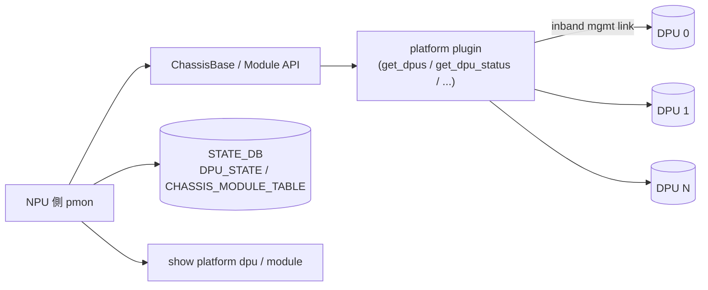

<!-- topics-tip -->
!!! tip "Topics で読み物として読む"
    この HLD は実装詳細を含む。機能の概念・設定・運用を読み物として読みたい場合は [Topics 13 章: DASH / SmartSwitch](../topics/13-dash-smartswitch/index.md) を参照。
<!-- /topics-tip -->

!!! info "裏取りステータス: code-verified"
    DPU 監視ループは `sonic-platform-daemons/sonic-chassisd/scripts/chassisd` および `tests/test_dpu_chassisd.py`、Module/DPU API は `sonic-platform-common/sonic_platform_base/module_base.py`（`get_dpu_id` ほか）、CLI は `sonic-utilities/show/chassis_modules.py`・`sonic-utilities/config/chassis_modules.py`（`show chassis-modules` / `config chassis modules startup`）で確認済み。

# SmartSwitch PMON（NPU 側 pmon と DPU 連携の境界）

## 概要

「[SmartSwitch](../reference/glossary.md#term-smartswitch)」は **同一筐体内に Network [ASIC](../reference/glossary.md#term-asic)（[NPU](../reference/glossary.md#term-npu)）と [DPU](../reference/glossary.md#term-dpu)（Data Processing Unit）を持つ platform**。pmon [HLD](../reference/glossary.md#term-hld) は **NPU 側で動く `pmon` daemon が、複数 DPU の health / inventory / firmware を観測する** 拡張[^1]を扱う。

主目的:

- DPU を chassis-module の延長として **`show platform`** 系で一貫表示する
- DPU の電源状態・温度・FW version・boot 状況を NPU 側 [STATE_DB](../reference/glossary.md#term-state_db) に集約
- DPU graceful shutdown / reboot 等の制御 hook を pmon 経由で発火可能にする

## 動作仕様



主要要素[^1]:

- **`Chassis.get_module_list()` 拡張**: DPU を Module subclass として返す
- **DPU Module API**: `get_oper_status` / `reboot` / `set_admin_state` / `get_firmware_version` / `get_temperature_info` 等
- **STATE_DB**: `DPU_STATE` / `CHASSIS_MODULE_TABLE` に DPU ごとの up/down、reboot reason、boot progress
- **[CONFIG_DB](../reference/glossary.md#term-config_db)**: `DPU` テーブルで admin state / management IP / role を保持
- **inband mgmt**: NPU↔DPU 間は専用の管理 link / Ethernet を介する想定。[SAI](../reference/glossary.md#term-sai) と分離

## 設定

### 関連する CONFIG_DB / STATE_DB

| Table | DB | 説明 |
|-------|----|------|
| `DPU` | CONFIG | per-DPU admin / mgmt IP / role |
| `DPU_STATE` | STATE | per-DPU oper / boot progress / reboot reason |
| `CHASSIS_MODULE_TABLE` | STATE | NPU+DPU を統合した chassis module view |

### 関連する CLI

| Command | 用途 |
|---------|------|
| `show platform dpu` | DPU 一覧と状態 |
| `show platform module` | NPU と DPU を含む module 一覧 |
| `config chassis modules startup <dpu>` | DPU admin up |
| `config chassis modules shutdown <dpu>` | DPU graceful shutdown |

## 制限事項

- **DPU は SAI 経由ではない**: NPU pmon の責務は監視 / 電源 / boot 制御。DPU 上の [SONiC](../reference/glossary.md#term-sonic)（DPU SONiC）固有の挙動は別 HLD
- **inband mgmt link が必須**: 専用 link が落ちると DPU 状態を把握できない（cached を使う）
- **HA / smart-switch HA**: 高可用性の active-standby は別 HLD（HA manager hamgrd）に従う

## 干渉する機能

- **smart-switch DPU graceful shutdown**: pmon の `shutdown` 経路と DPU 側 SONiC の協調シャットダウン
- **smart-switch HA / hamgrd**: NPU↔DPU と DPU↔DPU の HA 管理
- **smart-switch database design**: NPU 側 DB スキーマ全体
- **independent DPU upgrade**: DPU firmware upgrade 経路と pmon の関係

## トラブルシューティング

- DPU が Down で見える → inband mgmt link、`DPU_STATE` のタイムスタンプ、DPU 側 console を確認
- reboot が効かない → `set_admin_state` / `reboot` plugin 実装の存在を確認
- `show platform module` に DPU が出ない → `Chassis.get_module_list()` の DPU 含有設定を確認

### コマンド例

SmartSwitch DPU の [ENI](../reference/glossary.md#term-eni) 転送状態と HA を確認する。

```bash
# SmartSwitch DPU / ENI
show chassis modules status
redis-cli -n 4 keys 'DPU|*'
redis-cli -n 4 keys 'DASH_ENI_TABLE:*'
docker exec database redis-cli -n 6 keys 'CHASSIS_MODULE_TABLE|*'
```

## 引用元

[^1]: `sonic-net/SONiC` `doc/smart-switch/pmon/smartswitch-pmon.md` @ `49bab5b5ff0e924f1ea52b3d9db0dfa4191a7c06`

<!-- concerns hint:
- sonic-platform-common の Chassis / Module API への DPU 拡張取り込み確認
- pmon docker の DPU 監視ループ（PSU/THERMAL daemon に近い形か）の現行実装確認
- CONFIG_DB DPU / STATE_DB DPU_STATE / CHASSIS_MODULE_TABLE スキーマの現行値確認
- show platform dpu / config chassis modules startup CLI の sonic-utilities 取り込み確認
- inband mgmt link 未到達時の cached state / liveness 判定ロジックの現行実装確認
- DPU graceful shutdown / smart-switch HA / independent DPU upgrade との実装連携確認
-->

<!-- topics-back-ref -->
## 関連 Topics

- [Topics: DASH と SmartSwitch](../topics/13-dash-smartswitch/index.md)

<!-- /topics-back-ref -->

<!-- glossary-links-injected: ec18b66e3507 -->
