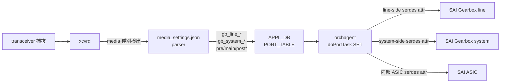

<!-- topics-tip -->
!!! tip "Topics で読み物として読む"
    この HLD は実装詳細を含みます。機能の概念・設定・運用を読み物として読みたい場合は [Topics 14 章: Platform / Port / Optics](../topics/14-platform-port-optics/index.md) を参照。
<!-- /topics-tip -->

!!! success "裏取りステータス: code-verified"
    実装裏取り済み（下記コード位置）。gearbox: sonic-swss/orchagent/portsorch.cpp の m_gearboxTable / m_gearboxEnabled 経路 + tests/mock_tests/portsorch_ut.cpp:1711-1721 (gb_line_pre1..3, gb_line_main, gb_line_post1..3, gb_system_*) で 7 種 attr を確認。

# Gearbox 動的チューニング（gb_line_* / gb_system_* in media_settings.json）

## 概要

Gearbox は [ASIC](../reference/glossary.md#term-asic) 内部レーンとフロントポート速度を変換する **外付け PHY**（例: ASIC 4×10G → フロント 1×40G）。信号は ASIC↔gearbox（system-side）と gearbox↔transceiver（line-side）の **2 か所** で伝送されるので、pre-emphasis チューニング値（`pre1/pre2/pre3/main/post1/post2/post3`）も両側に独立に必要[^1]。

従来は **`gearbox_config.json` を手書き** して boot 時に決め打ち programming していたため、トランシーバ種別 / serdes lane speed / 媒体を変えるたびにファイル更新と再起動が必要だった。本機能は ASIC 側の動的チューニング（`media_settings.json` ベース）を gearbox にも拡張し、media 検出に応じて値を引き直すことを目的とする[^1]。

## 動作仕様

### media_settings.json 拡張: `gb_line_*` / `gb_system_*` 属性

既存の serdes 属性名に prefix を付けて gearbox の各サイドを指す[^1]:

| prefix | 対象サイド |
|--------|------------|
| `gb_line_` | gearbox の **line-side**（フロントポート / トランシーバ向き）|
| `gb_system_` | gearbox の **system-side**（ASIC 向き）|

例（`media_settings.json` の MEDIA_SETTINGS / PORT_MEDIA_SETTINGS 配下）:

```json
{
  "MEDIA_SETTINGS": {
    "2-32": {
      "COPPER100": {
        "gb_line_pre1":   { "lane0":"0x75","lane1":"0x75" },
        "gb_line_main":   { "lane0":"0x75","lane1":"0x75" },
        "gb_line_post1":  { "lane0":"0x75","lane1":"0x75" },
        "gb_system_pre1": { "lane0":"0x75","lane1":"0x75","lane2":"0x75","lane3":"0x75" },
        "gb_system_main": { "lane0":"0x75","lane1":"0x75","lane2":"0x75","lane3":"0x75" },
        "gb_system_post1":{ "lane0":"0x75","lane1":"0x75","lane2":"0x75","lane3":"0x75" }
      }
    }
  },
  "PORT_MEDIA_SETTINGS": { "1": { "COPPER100": { "gb_line_pre1": { "lane0":"0x5", ... } } } }
}
```

system-side の値は **物理メディアに依存しないので通常は静的**。それでも統一管理のため `media_settings.json` に置き、media 種別をまたがって共有したいときは `Default` キーが使える[^1]。

### 全体フロー（既存 ASIC tuning と同形）



ポイント[^1]:

- xcvrd / media_settings parser は **既存の更新メカニズムを流用**。ASIC 用 `pre1/main/post1/...` と並べて `gb_line_*` / `gb_system_*` を [APPL_DB](../reference/glossary.md#term-appl_db) に書く（[HLD](../reference/glossary.md#term-hld) Rev 0.3 で format を整理し xcvrd 改造を不要にした[^1]）
- [orchagent](../reference/glossary.md#term-orchagent) は APPL_DB 変化を検出し `doPortTask(SET)` を実行。**line-side / system-side ごとに新 serdes attribute** を作って [SAI](../reference/glossary.md#term-sai) 経由で gearbox に programming する
- 現バージョンでは `pre1/pre2/pre3/main/post1/post2/post3` 7 種のみ対応[^1]

### APPL_DB の形

gearbox port では PORT_TABLE に line-side / system-side のチューニング値が並列に並ぶ[^1]:

```text
PORT_TABLE:Ethernet48
  speed = 400000
  lanes = 56,57,58,59
  role = Ext        # gearbox 配下の "external" port
  line_oper_status = up
  system_oper_status = up
  oper_status = up
  gb_line_main   = 0x8a,0x8b,...
  gb_line_post1  = 0xfffffff6,...
  gb_line_pre1   = 0xffffffee,...
  gb_system_main = 0x80,0x80,0x80,0x80
  gb_system_pre1 = 0x00,0x00,0x00,0x00
  ...
```

非 gearbox port は従来どおり `pre1/main/post1/...` のみ。

<!-- evidence:
source: sonic-net/SONiC/doc/media-settings/Dynamic-gearbox-tuning.md#L229-L233 (sha: 49bab5b5ff0e924f1ea52b3d9db0dfa4191a7c06)
excerpt: |
  Upon detecting a change within APPL_DB for a particular port, orchagent will be triggered to run doPortTask() with SET_COMMAND on the logical port. ... new serdes attributes for line-side and system-side tunings ... [sonic-swss PR #4113]
reasoning: orchagent doPortTask での反映と新 serdes 属性、PR #4113 の根拠。
-->

<!-- evidence-rendered:start -->
??? note "📋 検証エビデンス: sonic-net/SONiC/doc/media-settings/Dynamic-gearbox-tuning.md#L229-L233 (sha: 49bab5b5ff0e924f1ea52b3d9db0dfa4191a7c06)"

    **出典**:

    `sonic-net/SONiC/doc/media-settings/Dynamic-gearbox-tuning.md#L229-L233 (sha: 49bab5b5ff0e924f1ea52b3d9db0dfa4191a7c06)`

    **抜粋**:

    ```text
    Upon detecting a change within APPL_DB for a particular port, orchagent will be triggered to run doPortTask() with SET_COMMAND on the logical port. ... new serdes attributes for line-side and system-side tunings ... [sonic-swss PR #4113]
    ```

    **判断根拠**: orchagent doPortTask での反映と新 serdes 属性、PR #4113 の根拠。

<!-- evidence-rendered:end -->

### 関連 PR

- 動的反映のための buildimage / 設定生成: HLD 中で参照
- swss 側 orchagent 改修: [sonic-swss#4113](https://github.com/sonic-net/sonic-swss/pull/4113)[^1]

## 設定

### 関連する CONFIG_DB

該当なし。設定は `media_settings.json`（platform-specific のファイル）に集約され、ランタイム反映は APPL_DB 経由。

### 関連する CLI

該当なし（HLD で言及なし）。`show interfaces ...` 系の既存コマンドが gearbox port の状態を表示する。

### 設定例

`media_settings.json` で **media 種別と物理 port 範囲** ごとに gearbox 両サイドの値を指定する。`Default` キーで media 横断の共有値を置ける（特に system-side）:

```json
{
  "MEDIA_SETTINGS": {
    "2-32": {
      "Default": {
        "gb_system_main":  { "lane0":"0x80","lane1":"0x80","lane2":"0x80","lane3":"0x80" },
        "gb_system_pre1":  { "lane0":"0x00","lane1":"0x00","lane2":"0x00","lane3":"0x00" }
      },
      "COPPER100": {
        "gb_line_main": { "lane0":"0x75","lane1":"0x75" }
      }
    }
  }
}
```

## 制限事項

- 対応 serdes 属性は **`pre1/pre2/pre3/main/post1/post2/post3` の 7 種** のみ[^1]
- ベンダ SAI が gearbox の line-side / system-side 別 serdes 属性を持っていないと反映できない
- 旧 `gearbox_config.json` ベースの platform は引き続き共存可能だが、本機能を使うなら `media_settings.json` への一本化が前提

## 干渉する機能

- **Media-based Port Settings (ASIC 側 dynamic tuning)**: 同じ `media_settings.json` を共有する。Gearbox は line-side / system-side のキーが追加されただけ
- **link-training / auto-negotiation**: AN / LT が動的にも調整するため、`media_settings.json` 値は初期値として与えられ、AN / LT 結果との競合解決はベンダ SAI に依存
- **port breakout / serdes lane assignment**: gearbox を介する port は `lanes` の数が ASIC 側 / line-side で異なる（system 側は内部 lane 数、line 側はフロント lane 数）。両者の lane インデックスを整合させる責務は media_settings.json の記述者に
- **`role: Ext` の port**: gearbox 配下の external port にのみ gb_* 属性が効く

## トラブルシューティング

```bash
# 値が APPL_DB に反映されているか
redis-cli -n 0 HGETALL "PORT_TABLE:Ethernet48" | grep -E 'gb_line_|gb_system_'

# 反映タイミング
# transceiver 挿抜 → xcvrd → APPL_DB → orchagent
journalctl -u xcvrd
docker logs swss 2>&1 | grep -i gearbox

# 旧 gearbox_config.json 残置
ls /usr/share/sonic/device/$PLATFORM/ | grep gearbox

# media_settings.json の port-range / Default キー
jq '.MEDIA_SETTINGS' /usr/share/sonic/device/$PLATFORM/media_settings.json | head -40
```

## 引用元

[^1]: `sonic-net/SONiC` `doc/media-settings/Dynamic-gearbox-tuning.md` @ `49bab5b5ff0e924f1ea52b3d9db0dfa4191a7c06`

<!-- topics-back-ref -->
## 関連 Topics

- [Topics: Platform / Port / Optics / PHY](../topics/14-platform-port-optics/index.md)

<!-- /topics-back-ref -->

<!-- glossary-links-injected: c006405759d8 -->
