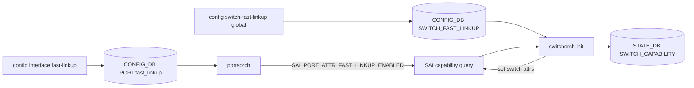
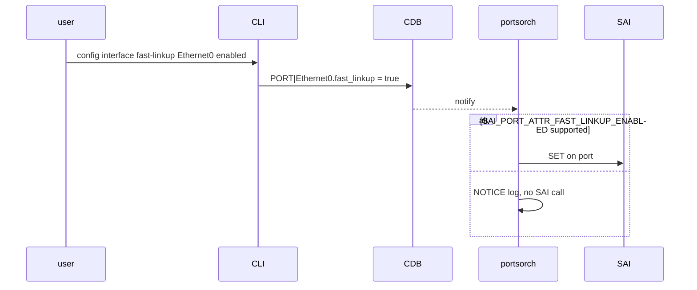

<!-- topics-tip -->
!!! tip "Topics で読み物として読む"
    この HLD は実装詳細を含みます。機能の概念・設定・運用を読み物として読みたい場合は [Topics 14 章: Platform / Port / Optics](../topics/14-platform-port-optics/index.md) を参照。
<!-- /topics-tip -->

!!! success "裏取りステータス: Code-verified"
    `switchorch.cpp:2094-2271`（`setFastLinkupCapability` / `doCfgSwitchFastLinkupTableTask`）、`portsorch.h:300`（`setPortFastLinkupEnabled`）、SAI `SAI_SWITCH_ATTR_FAST_LINKUP_POLLING_TIMEOUT[_RANGE]` / `_GUARD_TIMEOUT[_RANGE]` / `_BER_THRESHOLD`、`sonic-utilities/show/main.py:2933` / `config/main.py:5095` の `switch-fast-linkup` CLI を確認済み (verified at: 2026-05-09)。

# SONiC Fast Link-Up

## 読み手が知りたいこと

- 何を解決する機能か（なぜ「再リンク時の EQ 再利用」が必要か）
- 動くのは「初回リンク」か「フラップ後」か
- どの 3 パラメータを設定すれば良いか、単位は何か
- プラットフォーム未対応時はどうなる（拒否？ no-op？）

## 解こうとしている問題

100G 以上の高速 Ethernet（特に PAM4）では link training (EQ) 自体が秒オーダーかかる。リンクフラップごとにフル EQ を回すと数秒〜10 秒の収束遅延になる。Fast Link-Up は **「直前の良好 EQ が残っているなら再利用して即 Up」** を試み、品質劣化なら **フル EQ にフォールバック** する設計[^1]。

要点 4 つ:

1. **回復時のみ動作**: 初回はフル EQ、フラップ後の再起動でのみ高速経路を試行
2. **品質ゲート**: `guard_time` で BER をチェック、`ber_threshold` 超過なら full EQ
3. **3 グローバル + ポート毎 enable**: `polling_time` / `guard_time` / `ber_threshold` をスイッチ全体、`fast_linkup` をポート毎
4. **Capability ゲート**: [SAI](../reference/glossary.md#term-sai) から対応可否とレンジを問合せ、未対応は拒否 or safe no-op

## 全体経路



## どこで capability を確認するか

`switchorch` init で次を問い合わせる[^1]:

- `SAI_SWITCH_ATTR_FAST_LINKUP_POLLING_TIME` の create/set 可否で **対応可否**
- `_POLLING_TIME_RANGE` / `_GUARD_TIME_RANGE` で **許容レンジ**

結果は `STATE_DB:SWITCH_CAPABILITY|switch` に公開[^1]:

```text
FAST_LINKUP_CAPABLE             = "true"/"false"
FAST_LINKUP_POLLING_TIMER_RANGE = "<min>,<max>"
FAST_LINKUP_GUARD_TIMER_RANGE   = "<min>,<max>"
```

CLI / OA はこれを参照して入力検証する。レンジ未公表時は CLI 側のレンジチェックを skip し、SAI 側で拒否させる。

## 3 つのパラメータ（単位とセマンティクス）

| パラメータ | 単位 | 意味 |
|---|---|---|
| `polling_time` | 秒 | Fast Link-Up 試行最大時間。超えたら通常 Up に切替 |
| `guard_time` | 秒 | Up 後この期間 BER を計測 |
| `ber_threshold` | **負指数の絶対値** | `12` を入れると `1e-12` を許容上限。超過で full EQ にフォールバック |

部分更新が許容され、未指定フィールドは保持される（partial update）[^1]。未対応プラットフォームでは NOTICE ログを出し SAI 呼出さず return（safe no-op）。

## 動作モデル（recovery only）

[ASIC](../reference/glossary.md#term-asic) ファームウェアは **既に Up していて落ちた後の再起動** にのみ Fast Link-Up を試みる[^1]:

1. リンクフラップ発生
2. ASIC FW が前回 EQ を使い `polling_time` 秒以内に Up を試行
3. 成功したら `guard_time` ガード開始、満了時に BER 計測
4. BER > 閾値ならフル EQ にフォールバック
5. `polling_time` 内に成功しなければ通常 Link-Up に戻る

## ポート単位の経路



`portsorch` init でも `querySwitchCapability(SAI_OBJECT_TYPE_PORT, SAI_PORT_ATTR_FAST_LINKUP_ENABLED)` を打ちキャッシュする[^1]。

## エラーハンドリング

| 事象 | 主体 | 重大度 |
|------|------|--------|
| Capability query failed | switchorch | ERROR |
| Global params applied | switchorch | INFO |
| Out-of-range rejected | switchorch | NOTICE |
| Unknown field ignored | switchorch | WARN |
| Per-port apply failed | [portsorch](../reference/glossary.md#term-portsorch) | ERROR |
| Not supported (no-op) | both | NOTICE |

## 設定

### CONFIG_DB

| Table | Key | フィールド | 説明 |
|-------|-----|-----------|------|
| `SWITCH_FAST_LINKUP` | `GLOBAL` | `polling_time` / `guard_time` / `ber_threshold` | 秒 / 秒 / 負指数 |
| `PORT` | `<ifname>` | `fast_linkup` | `"true"` / `"false"`（既定 false）|

### STATE_DB

| Table | Key | フィールド |
|-------|-----|-----------|
| `SWITCH_CAPABILITY` | `switch` | `FAST_LINKUP_CAPABLE`、`FAST_LINKUP_POLLING_TIMER_RANGE`、`FAST_LINKUP_GUARD_TIMER_RANGE` |

### CLI

```bash
config switch-fast-linkup global [--polling-time <sec>] [--guard-time <sec>] [--ber <E>]
config interface fast-linkup <ifname> {enabled|disabled}
show switch-fast-linkup global [--json]
show interfaces fast-linkup status
```

### YANG

`sonic-fast-linkup.yang` モジュール（`SWITCH_FAST_LINKUP.GLOBAL` のみ）[^1]。ポート側 `fast_linkup` は `sonic-port.yang`。動的レンジは [YANG](../reference/glossary.md#term-yang) ではモデリングせず CLI で [STATE_DB](../reference/glossary.md#term-state_db) を見て検証する[^1]。

### 設定例

```bash
redis-cli -n 6 HGETALL 'SWITCH_CAPABILITY|switch'   # capability 確認
config switch-fast-linkup global --polling-time 60 --guard-time 10 --ber 12
config interface fast-linkup Ethernet0 enabled
show switch-fast-linkup global
show interfaces fast-linkup status
```

## 干渉する機能

- **Auto-FEC / Link Training / Auto-Neg**: パラメータ再利用が前提のため、ピア側設定が変わるシナリオでは収束しない
- **Warm / Fast reboot**: ASIC FW にどこまで前回 EQ が残るかは ASIC 依存
- **Capability 未公表**: グローバル設定は CLI で拒否、ポート側は safe no-op
- **BER 計測精度**: 低トラフィック時は信頼区間が広くフォールバック判定が遅延

## トラブルシューティング

- 設定反映されない → `SWITCH_CAPABILITY.FAST_LINKUP_CAPABLE` を確認
- レンジ外で拒否 → `*_TIMER_RANGE` を `redis-cli -n 6` で確認
- フラップ後の収束が遅い → `ber_threshold` を緩めると fallback 頻度減（品質劣化リスクとトレードオフ）
- 一部ポートだけ効かない → syslog の `Fast-linkup not supported (port path)` NOTICE を確認
- syslog `Unknown field ignored` WARN → CLI / OA のスキーマズレ

### コマンド例

FEC / fast link up の状態を確認する。

```bash
# FEC / Link up
show interfaces status
show interfaces fec status
redis-cli -n 4 hgetall 'PORT|Ethernet0'
docker exec swss show fast-link-status 2>&1 | tail
```

## 引用元

[^1]: `sonic-net/SONiC` `doc/fast-linkup/fast-link-up-hld.md` @ `49bab5b5ff0e924f1ea52b3d9db0dfa4191a7c06`

## 関連ページ

- [Topic: Platform / Port / Optics](../topics/14-platform-port-optics/index.md)
- [Topic: L2 VLAN LAG](../topics/06-l2-vlan-lag/index.md)

<!-- topics-back-ref -->
## 関連 Topics

- [Topics: Platform / Port / Optics / PHY](../topics/14-platform-port-optics/index.md)

<!-- /topics-back-ref -->

<!-- glossary-links-injected: 9937abcefc29 -->
