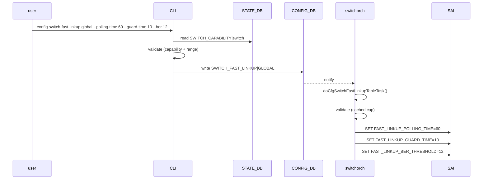
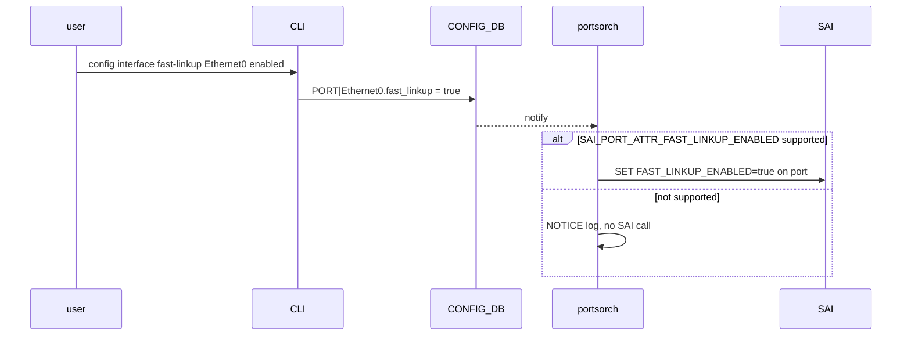

!!! warning "裏取りステータス: HLD-only"
    このページは公式 HLD のみを根拠に書かれている。`switchorch` の `setFastLinkupCapability` / `doCfgSwitchFastLinkupTableTask`、`portsorch` の `setPortFastLinkupEnabled`、SAI 属性 (`SAI_SWITCH_ATTR_FAST_LINKUP_*` / `SAI_PORT_ATTR_FAST_LINKUP_ENABLED`) の対応状況は未裏取り。

# SONiC Fast Link-Up（リンク再起動時の EQ 再利用）

## 概要

100G 以上の高速イーサネット（特に PAM4）では、リンクトレーニング (Equalization, EQ) 自体に秒オーダーの時間がかかる。リンクフラップ後に **毎回フル EQ を走らせる** と、ピア側 ASIC ファームと協調するうえで数秒〜10 秒前後の停止になり、データプレーンの収束時間に効いてくる。Fast Link-Up は **「直前の良好な EQ パラメータが残っているなら、それを再利用して即座に Up を試みる」** 設計（Just-Do-Fast）で、回復シナリオに限定して動作する[^1]。

主要要素は以下のとおり[^1]。

1. **回復時のみ動作**: 初回リンクアップではフル EQ を行い、フラップ後の再起動でのみ高速経路を試みる。
2. **品質ゲート**: 高速経路で UP した後、`guard_time` 経過時点で BER をチェックし、`ber_threshold` を超えていれば フル EQ にフォールバック。
3. **3 つのグローバルパラメータ + ポート単位 enable/disable**: `polling_time` / `guard_time` / `ber_threshold` をスイッチ全体に。`fast_linkup` をポート毎に。
4. **Capability ゲート**: 起動時に SAI から対応可否と許容レンジを問い合わせ、未対応のプラットフォームでは設定を拒否する（あるいは ports 側は **safe no-op**）。

## 動作仕様

### 全体経路

```mermaid
flowchart LR
    SAI[SAI capability query\nSAI_SWITCH_ATTR_FAST_LINKUP_*] --> SO[switchorch\n(init)]
    SO --> SDB[(STATE_DB\nSWITCH_CAPABILITY|switch)]
    User1[config switch-fast-linkup global ...] --> CLI1[CLI 検証]
    CLI1 --> CDB1[(CONFIG_DB\nSWITCH_FAST_LINKUP|GLOBAL)]
    CDB1 --> SO
    SO -->|set switch attrs| SAI
    User2[config interface fast-linkup ...] --> CDB2[(CONFIG_DB\nPORT|<intf>.fast_linkup)]
    CDB2 --> PO[portsorch]
    PO -->|SAI_PORT_ATTR_FAST_LINKUP_ENABLED| SAI
```

### Capability discovery

`switchorch` の init 時に次を問い合わせる[^1]:

- `SAI_SWITCH_ATTR_FAST_LINKUP_POLLING_TIME` の create/set 可否で **対応可否** を判定
- 任意の **レンジ** を `SAI_SWITCH_ATTR_FAST_LINKUP_POLLING_TIME_RANGE` / `_GUARD_TIME_RANGE` から取得

結果は `STATE_DB:SWITCH_CAPABILITY|switch` に下記キーで公開される[^1]:

```text
FAST_LINKUP_CAPABLE             = "true" / "false"
FAST_LINKUP_POLLING_TIMER_RANGE = "<min>,<max>"  (任意)
FAST_LINKUP_GUARD_TIMER_RANGE   = "<min>,<max>"  (任意)
```

CLI / OA はこれを参照して入力検証する。レンジ未公表のプラットフォームでは「対応はあるが範囲制約は非公開」として、CLI 側はレンジチェックをスキップし、OA も SAI のエラーで拒否する形になる。

### グローバルパラメータの設定経路



部分更新が許容されており、未指定のフィールドはそのまま残る（partial update semantics）[^1]。未対応プラットフォームでは NOTICE ログを出して **SAI 呼び出しなしでリターン**（safe no-op）。

### ポート単位の enable/disable



`portsorch` 側でも `querySwitchCapability(SAI_OBJECT_TYPE_PORT, SAI_PORT_ATTR_FAST_LINKUP_ENABLED)` を init で打ち、`m_fastLinkupPortAttrSupported` にキャッシュ。CLI でのアラインメント（インタフェース別名解決）は CLI 側責務[^1]。

### 動作モデル（recovery only）

ASIC ファームウェアの挙動として、**リンクが既に Up していて落ちた後の再起動** にのみ Fast Link-Up を試みる。フローは次のとおり[^1]:

1. リンクフラップ発生。
2. ASIC FW は前回の EQ を使って `polling_time` 秒以内に Up を試みる。
3. 成功したら `guard_time` のガードタイマーを開始。満了時点で BER を計測。
4. BER が `ber_threshold = 1e-<E>` を超えていたら **フル EQ にフォールバック**。
5. `polling_time` 内に Fast Link-Up が成功しなければ通常の Link-Up シーケンスに戻る。

### BER 閾値の表記

`ber_threshold` は **負指数の絶対値** を入れる[^1]。例えば `12` を指定すると `1e-12` を許容上限とする。

<!-- evidence:
source: sonic-net/SONiC/doc/fast-linkup/fast-link-up-hld.md#L60-L70 (sha: 49bab5b5ff0e924f1ea52b3d9db0dfa4191a7c06)
excerpt: |
  - polling_time (sec): max time to attempt fast link-up before falling back.
  - guard_time (sec): period the link must remain UP with acceptable BER.
  - ber_threshold (exponent): acceptable BER as 1e-<E> (e.g., 12 → 1e-12).
reasoning: 3 つのパラメータの単位とセマンティクスの根拠。
-->

### エラーハンドリング / ログ

エラーは CLI 側 / OA 側の両方で多段にチェック。代表的な事象とログ重大度[^1]:

| 事象 | 主体 | 重大度 |
|------|------|--------|
| Capability query failed | switchorch | ERROR |
| Global parameters applied (SAI) | switchorch | INFO |
| Out-of-range global rejected | switchorch | NOTICE |
| Unsupported operation on SWITCH_FAST_LINKUP | switchorch | ERROR |
| Unknown field in SWITCH_FAST_LINKUP ignored | switchorch | WARN |
| Per-port fast_linkup applied (SAI) | portsorch | INFO |
| Per-port fast_linkup apply failed (SAI) | portsorch | ERROR |
| Fast-linkup not supported (switch/port path) | both | NOTICE |

## 設定

### 関連する CONFIG_DB

| Table | Key | フィールド | 説明 |
|-------|-----|-----------|------|
| `SWITCH_FAST_LINKUP` | `GLOBAL` | `polling_time` | 秒。Fast Link-Up 試行最大時間 |
| | | `guard_time` | 秒。BER 評価までのガード期間 |
| | | `ber_threshold` | 整数。負指数（例: `12` → `1e-12`）|
| `PORT` | `<ifname>` | `fast_linkup` | `"true"` / `"false"`（既定 `"false"`）|

### 関連する STATE_DB

| Table | Key | フィールド | 説明 |
|-------|-----|-----------|------|
| `SWITCH_CAPABILITY` | `switch` | `FAST_LINKUP_CAPABLE` | `true` / `false` |
| | | `FAST_LINKUP_POLLING_TIMER_RANGE` | `"<min>,<max>"`（任意） |
| | | `FAST_LINKUP_GUARD_TIMER_RANGE` | `"<min>,<max>"`（任意） |

### 関連する CLI

| Command | 用途 |
|---------|------|
| `config switch-fast-linkup global [--polling-time <sec>] [--guard-time <sec>] [--ber <E>]` | グローバル設定 |
| `config interface fast-linkup <ifname> {enabled\|disabled}` | ポート単位の有効化 |
| `show switch-fast-linkup global [--json]` | 設定確認 |
| `show interfaces fast-linkup status` | ポート単位状態 |

### 関連する YANG

`sonic-fast-linkup.yang` モジュール（`SWITCH_FAST_LINKUP.GLOBAL` のみ）[^1]:

```yang
container GLOBAL {
    leaf polling_time  { type uint16; }
    leaf guard_time    { type uint16; }
    leaf ber_threshold { type uint8;  }
}
```

ポート側 `fast_linkup` は既存の `sonic-port.yang` に従う。動的レンジは YANG ではモデリングせず CLI 側で STATE_DB を参照して検証する設計[^1]。

### 設定例

```bash
# capability 確認
redis-cli -n 6 HGETALL 'SWITCH_CAPABILITY|switch'

# グローバル設定
config switch-fast-linkup global --polling-time 60 --guard-time 10 --ber 12

# ポート毎に有効化
config interface fast-linkup Ethernet0 enabled

# 確認
show switch-fast-linkup global
show interfaces fast-linkup status
```

## 干渉する機能

- **Auto-FEC / Link Training (LT) / Auto-Negotiation**: フル EQ シーケンスのうち、FEC モードや LT 状態は EQ パラメータと密接に関連する。Fast Link-Up はパラメータ再利用のみが対象で、ピア設定が変わるシナリオでは再利用しても収束しない。
- **Warm reboot / Fast reboot**: リンクが事前に Down → Up になる経路では「直前の EQ」が ASIC FW にどこまで残るかは ASIC 依存。HLD はその点まで踏み込んでいない。
- **Capability 未公表のプラットフォーム**: `FAST_LINKUP_CAPABLE=false` の場合、グローバル設定は CLI で拒否され、ポート側は safe no-op になる。誤って `enabled` を入れたときに何が起きるかを事前に CLI で確認する。
- **BER 計測精度**: `guard_time` 内の BER 計測精度は ASIC FW 依存。低トラフィック時は BER の信頼区間が広く、フォールバック判定が遅延する可能性。

## トラブルシューティング

- 設定したのに反映されない: `STATE_DB SWITCH_CAPABILITY|switch.FAST_LINKUP_CAPABLE` を確認。`false` ならプラットフォーム未対応。
- レンジ外で拒否される: `FAST_LINKUP_POLLING_TIMER_RANGE` / `FAST_LINKUP_GUARD_TIMER_RANGE` を `redis-cli -n 6` で確認し、許容範囲内に収める。
- リンクフラップ後の収束が遅い: BER 閾値を厳しくしすぎている可能性。`ber_threshold` を緩めるとフォールバック頻度が下がる代わりに品質劣化リスクが上がる。
- 一部ポートだけ Fast Link-Up が効かない: ポート側 `fast_linkup=true` になっていてもプラットフォーム / SAI 実装が未対応の可能性。`syslog` の `Fast-linkup not supported (switch/port path)` NOTICE を確認。
- syslog に `Unknown field in SWITCH_FAST_LINKUP ignored` WARN: 古い CLI / 新しい OA、または逆の組み合わせでスキーマズレが発生している可能性。

## 引用元

[^1]: `sonic-net/SONiC` `doc/fast-linkup/fast-link-up-hld.md` @ `49bab5b5ff0e924f1ea52b3d9db0dfa4191a7c06`
