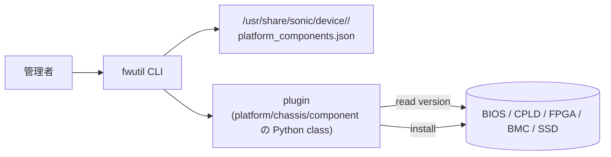

<!-- topics-tip -->
!!! tip "Topics で読み物として読む"
    この HLD は実装詳細を含む。機能の概念・設定・運用を読み物として読みたい場合は [Topics 14 章: Platform / Port / Optics](../topics/14-platform-port-optics/index.md) を参照。
<!-- /topics-tip -->

!!! info "裏取りステータス: code-verified"
    `sonic-utilities/fwutil/{main,lib,log}.py` と `sonic-platform-common/sonic_platform_base/component_base.py`（`get_firmware_version` / `install_firmware` 等）の存在を確認。各 platform plugin と `platform_components.json` の正確な記述差はベンダ依存のため範囲外。

# fwutil（platform component firmware の install / update / show）

## 概要

BIOS、CPLD、[FPGA](../reference/glossary.md#term-fpga)、BMC、SSD などのプラットフォームコンポーネントの **ファームウェアを統一 CLI から操作** するためのユーティリティ[^1]。狙い:

- ベンダ固有 utility に頼らず [SONiC](../reference/glossary.md#term-sonic) 標準コマンドで firmware を扱う
- バージョン情報の取得・install・update（次回起動時反映）を共通インタフェース化
- platform 側の plugin で実機固有の install ロジックを吸収する

## 動作仕様



主要要素[^1]:

- **`platform_components.json`**: platform ごとに **install 可能な component と既定 firmware path** を宣言する manifest
- **plugin API**: `Chassis.get_component_list()` / `Component.install_firmware(image_path)` / `Component.get_firmware_version()` 等を platform 実装が提供
- **CLI サブコマンド**: `show` / `install` / `update` / `show status` 等を統一フォーマットで提供

### `platform_components.json` のスキーマ

`fwutil` 本体（`sonic-utilities/fwutil/lib.py` の `PlatformComponentsParser`）は manifest を `/usr/share/sonic/device/<platform>/platform_components.json` から読み出す[^3]。トップレベルキーは `chassis`（必須・1 件のみ）と `module`（modular chassis 用、任意）の 2 種で、それぞれの配下に **`component` 辞書を 1 つだけ** 持ち、各 component のレコードは **`firmware` / `version` / `utility` の 3 キーまで** に制限される（`firmware` は必須）[^4]。fixed chassis の最小例は次の形になる[^1]。

```json
{
    "chassis": {
        "Chassis1": {
            "component": {
                "BIOS": {
                    "firmware": "/lib/firmware/<vendor>/bios.bin",
                    "version": "0ACLH003_02.02.010"
                },
                "CPLD": {
                    "firmware": "/lib/firmware/<vendor>/cpld.bin",
                    "version": "10"
                }
            }
        }
    }
}
```

modular chassis では同一構造の `module` セクションを並べる（こちらは複数 module 可）[^1]。`<vendor>` 部は platform 配布側で実 path に置換する。

### Component plugin API（`ComponentBase`）

platform plugin は `sonic-platform-common/sonic_platform_base/component_base.py` の `ComponentBase` を継承し、最低限 **`get_name` / `get_description` / `get_firmware_version` / `get_available_firmware_version` / `install_firmware`** を実装する（`update_firmware` / `auto_update_firmware` も同 base にシグネチャがある）[^5]。

```python
class ComponentBase(device_base.DeviceBase):
    # 識別と現行 version
    def get_name(self): ...                      # -> str
    def get_description(self): ...               # -> str
    def get_firmware_version(self): ...          # HW から読み出す

    # image 側 version と install/update
    def get_available_firmware_version(self, image_path): ...   # image から読む
    def get_firmware_update_notification(self, image_path): ... # 既定 None
    def install_firmware(self, image_path): ...                 # -> bool
    def update_firmware(self, image_path): ...                  # install + load
    def auto_update_firmware(self, image_path, boot_type): ...  # boot_type: none/fast/warm/cold
```

`auto_update_firmware` の `boot_type` は `none` / `fast` / `warm` / `cold` を受け、戻り値の正の整数（`status_installed=1` / `status_updated=2` / `status_scheduled=3`）/ 負（`-1`〜`-3`）で結果を区別する仕様が docstring に明記されている[^5]。

### 主な操作

| CLI | 用途 |
|-----|------|
| `fwutil show status` | 各 component の現行 firmware version / chassis ・ module ごとの一覧[^2] |
| `fwutil show updates` | 利用可能な update（manifest 由来、`-i current/next` で image を選択）[^2] |
| `fwutil show update-all-status` | `fwutil update all` の実行進捗ステータスを表示[^2] |
| `fwutil show version` | **fwutil ユーティリティ自身のバージョン** を表示（firmware version ではない）[^2] |
| `fwutil install chassis component <name> fw <path>` | image を直接 install |
| `fwutil update all` / `fwutil update {chassis,module}` | manifest に従って一括 / 範囲指定で update |

!!! warning "`fwutil show version` の誤解しやすい点"
    `fwutil show version` は **fwutil コマンド自身のバージョン文字列**（例: `fwutil version 2.0.0.0`）を表示するもので、各 component の firmware version を表示するものではない[^2]。component の現行 firmware version を確認するには `fwutil show status` を使う。

### Boot type による動作差

ファームウェア書き換えは多くの platform で **再起動を伴う**。`fwutil` は cold reboot を要求するもの、warm reboot を許容するもの、即時反映するものを **plugin の declaration** で区別する設計。詳細な順序制御は platform plugin に委ねられる。

## 制限事項

- **platform plugin が必要**: plugin 未実装の component は `fwutil` から触れない
- **[ASIC](../reference/glossary.md#term-asic) 本体の firmware は対象外**: [SAI](../reference/glossary.md#term-sai)/SDK 経由で扱う想定（fwutil は周辺コンポーネント向け）
- **手動 image 指定 vs manifest**: 両者で受け付ける引数フォーマットが異なる
- **書き換え失敗の rollback**: 多くは hardware 側保証（dual-bank） に依存

## 干渉する機能

- **secure-upgrade / secure-boot**: 署名検証や TPM 連携が必要な platform では fwutil の install 経路にも影響
- **show platform**: `show platform firmware` で同じ情報を見られる platform もある
- **smart-switch [DPU](../reference/glossary.md#term-dpu) graceful shutdown**: DPU 側 firmware 更新時のシャットダウン整合
- **kdump / fast-reboot**: firmware install で求められる reboot 種別との相性

## トラブルシューティング

- component が表示されない → `platform_components.json` と plugin 実装の存在を確認
- `install` が失敗 → image 形式（vendor-specific binary）と plugin の対応版を確認
- 反映されない → 再起動種別（cold が必要）を満たしているか確認

### コマンド例

firmware ユーティリティを確認する。

```bash
# 各 component の現行 firmware version を確認
sudo fwutil show status

# manifest と照合して利用可能な update を確認
sudo fwutil show updates

# fwutil コマンド自身のバージョン（firmware version ではない）
sudo fwutil show version

# platform 同梱 firmware イメージの実体（platform 依存）
ls /usr/share/sonic/device/*/fw/ 2>/dev/null | head
```

## 引用元

[^1]: `sonic-net/SONiC` `doc/fwutil/fwutil.md` @ `49bab5b5ff0e924f1ea52b3d9db0dfa4191a7c06`
[^2]: `sonic-net/sonic-utilities` `fwutil/main.py` の `show` サブグループ定義（`status` L467-475 / `updates` L478 付近 / `update-all-status` L479-487 / `version` L490-494）と `VERSION = '2.0.0.0'`（L20）を参照。
[^3]: `sonic-net/sonic-utilities` `fwutil/lib.py` `PlatformComponentsParser` クラス（L344 以降）。`PLATFORM_COMPONENTS_PATH_TEMPLATE = "{}/usr/share/sonic/device/{}/{}"`（L348）、`PLATFORM_COMPONENTS_FILE = "platform_components.json"`（L36）。
[^4]: 同 `fwutil/lib.py` L351-356 の `CHASSIS_KEY="chassis"` / `MODULE_KEY="module"` / `COMPONENT_KEY="component"` / `FIRMWARE_KEY="firmware"` / `UTILITY_KEY="utility"` / `VERSION_KEY="version"` と、`__parse_component_section` (L397-433) のレコード数 `1〜3` 制限・`firmware` キー必須チェック、`__parse_chassis_section` (L435-461) の `chassis` 1 件制約。
[^5]: `sonic-net/sonic-platform-common` `sonic_platform_base/component_base.py` の `ComponentBase` クラス（L24 `get_name` / L42 `get_firmware_version` / L53 `get_available_firmware_version` / L67 `get_firmware_update_notification` / L81 `install_firmware` / L100 `update_firmware` / L120 `auto_update_firmware`）。

<!-- concerns hint:
- sonic-utilities/fwutil/ の現行 master 取り込みと CLI subcommand 一覧確認
- platform_components.json スキーマと現行 platform 実装での記述差分確認
- Chassis / Component plugin API の現行 sonic-platform-common での定義確認
- secure-upgrade / secure-boot との install 検証統合の現行実装確認
- smart-switch / DPU 環境での fwutil 拡張（DPU 個別更新）の現行実装確認
- ASIC 本体 firmware の扱い境界（fwutil / SAI / vendor SDK）の整理状況確認
-->

<!-- topics-back-ref -->
## 関連 Topics

- [Topics: Platform / Port / Optics / PHY](../topics/14-platform-port-optics/index.md)

<!-- /topics-back-ref -->

<!-- glossary-links-injected: ec18b66e3507 -->
