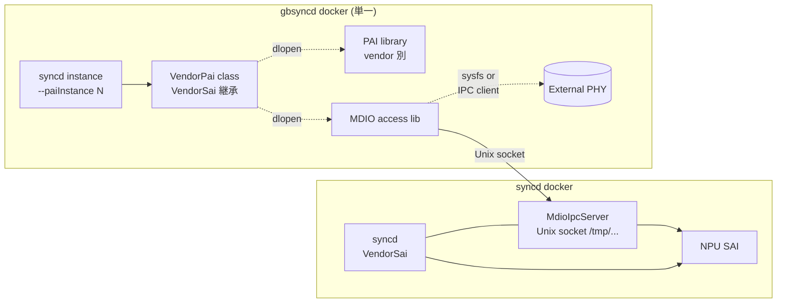

<!-- topics-tip -->
!!! tip "Topics で読み物として読む"
    この HLD は実装詳細を含みます。機能の概念・設定・運用を読み物として読みたい場合は [Topics 14 章: Platform / Port / Optics](../topics/14-platform-port-optics/index.md) を参照。
<!-- /topics-tip -->

!!! note "裏取りステータス: code-verified（命名差分あり）"
    `sonic-sairedis/syncd/MdioIpcServer.{h,cpp}` と `Syncd.cpp` での `m_mdioIpcServer = std::make_shared<MdioIpcServer>(m_vendorSai, m_commandLineOptions->m_globalContext)` を確認済み。HLD の `VendorPai` 相当は `sonic-sairedis/syncd/VendorSai.h` (class VendorSai) として実装。`gearbox_config.json` の `phys[].lib_name` も device 配下に存在（Arista 等）。**ただし**: `phy_access_lib_name` / `mdio_cl22_only` は HLD 文書のみで device 側 JSON には未浸透。単一 gbsyncd docker の方針も `sonic-buildimage/platform/components/docker-gbsyncd-{credo,broncos,agera2,milleniob}` のように **vendor 別 docker** が並存しており、HLD の "single gbsyncd docker" は完全には達成されていない。

# NPU MDIO アクセスと gbsyncd 単一 docker 化

## 概要

外部 PHY (gearbox) を制御するために gbsyncd は **PAI library** を使う。PHY が接続される MDIO バスは platform により異なり、(a) [FPGA](../reference/glossary.md#term-fpga)/CPLD ベースで Linux kernel driver + sysfs 経由のもの と (b) **switch [NPU](../reference/glossary.md#term-npu) の MDIO bus** で [SAI](../reference/glossary.md#term-sai) 経由でアクセスするもの の 2 系統がある[^1]。後者では syncd と gbsyncd の **プロセス間通信（IPC）** が必要になる。本 [HLD](../reference/glossary.md#term-hld) は (i) NPU MDIO 経由のアクセスを Unix socket IPC で実現し、(ii) PAI library と MDIO access library を **runtime ロード** することで **単一 gbsyncd docker** で全 platform を扱えるようにする設計。

## 動作仕様

### コンポーネント関係



### IPC

- IPC は Unix domain socket、[syncd](../reference/glossary.md#term-syncd) 側に **MdioIpcServer** クラスが新設され、独立スレッドで listen/accept/read/reply を行う[^1]
- gbsyncd 側は **MDIO IPC client** を**動的ライブラリ**として実装。kernel sysfs ベース platform では同じ抽象の sysfs MDIO アクセス lib を選べる
- IPC 速度は **PHY firmware download が現実的時間で完了する** ことが要件
- デバッグでは IPC 部分を `socat` 等で simulate 可能

### `VendorPai` クラス

- `VendorSai` を継承する新クラス[^1]
- コンストラクタで **PAI library path** と **MDIO access library path** を引数に取り、両者を **runtime に dlopen** する
- これにより gbsyncd docker 1 つで vendor 別 PAI / MDIO 実装に切替可能になる

```cpp
int syncd_main(int argc, char **argv) {
    ...
    if (commandLineOptions->m_paiInstance >= 0) {
        auto vendorSai = std::make_shared<VendorPai>(
            commandLineOptions->m_paiInstance,
            commandLineOptions->m_contextConfig);
        ...
    } else {
        auto vendorSai = std::make_shared<VendorSai>();
        ...
    }
}
```

### コマンドライン

gbsyncd 内で動く syncd instance は `--paiInstance` (`-i <N>`) を受ける[^1]。`-x <gearbox_config.json>` で gearbox 設定ファイルパス、`-i N` が config 内 `phys[N]` を選ぶインデックスになる。

### `gearbox_config.json` の拡張

`phys` 配列の各要素に次のキーが追加される[^1]:

| key | 内容 |
|-----|------|
| `phy_id` | 既存。PHY 番号 |
| `lib_name` | PAI library のファイル名（dlopen 対象）|
| `phy_access_lib_name` | MDIO access library のファイル名（IPC client / sysfs lib）|
| `mdio_cl22_only` | この PHY が IEEE 802.3 Clause 22 のみ使う場合に true |

### MDIO Clause 22 / 45

| | アドレス空間 | port × reg |
|---|--------------|------------|
| Clause 22 | 32 reg × 32 port × 32 addr | 古い PHY 向け |
| Clause 45 | 65,536 reg × 32 dev × 32 port | 10G+ で標準 |

SAI switch api に **clause 22 用 MDIO read/write 関数**が追加され、`SaiInterface` に clause 45/22 の virtual 関数、`VendorSai` がそれを override する[^1]。

### Warm boot

- IPC socket の生成 / 接続手順は coldboot と同一[^1]
- platform 側ソフトは warm boot 中に外部 PHY を **reset しない**ことが必須

<!-- evidence:
source: sonic-net/SONiC/doc/gearbox/gearbox_mdio-HLD.md#L82-L94 (sha: 49bab5b5ff0e924f1ea52b3d9db0dfa4191a7c06)
excerpt: |
  Our design choice is to use the Unix socket as the IPC mechanism. Our design has the MDIO IPC server
  in the syncd daemon with its own thread. A new syncd class MdioIpcServer is added to start a new thread,
  to create an unix socket, to listen on the socket, to accept connection and to read/reply IPC messages.
reasoning: Unix socket IPC + MdioIpcServer 採用の根拠。
-->

<!-- evidence-rendered:start -->
??? note "📋 検証エビデンス: sonic-net/SONiC/doc/gearbox/gearbox_mdio-HLD.md#L82-L94 (sha: 49bab5b5ff0e924f1ea52b3d9db0dfa4191a7c06)"

    **出典**:

    `sonic-net/SONiC/doc/gearbox/gearbox_mdio-HLD.md#L82-L94 (sha: 49bab5b5ff0e924f1ea52b3d9db0dfa4191a7c06)`

    **抜粋**:

    ```text
    Our design choice is to use the Unix socket as the IPC mechanism. Our design has the MDIO IPC server
    in the syncd daemon with its own thread. A new syncd class MdioIpcServer is added to start a new thread,
    to create an unix socket, to listen on the socket, to accept connection and to read/reply IPC messages.
    ```

    **判断根拠**: Unix socket IPC + MdioIpcServer 採用の根拠。

<!-- evidence-rendered:end -->

## 制限事項

- HLD 検証は Broadcom NPU でのみ。他 vendor は未確認[^1]
- `--enableBulk` のような他フラグとの兼ね合いはスコープ外
- 外部 PHY firmware download の時間制約が IPC 設計の制約に直結

## 干渉する機能

- **Gearbox Manager (`gearbox_mgr_design.md`)**: 親 framework
- **syncd**（NPU 用）と **gbsyncd**（PHY 用）の責務分離
- **`gearbox_config.json`**: PHY topology 記述
- **`platform.json` / `port_config.ini`**: PHY を介する port の表現
- **`xcvrd` / `media_settings`**: PHY の前段に位置する optic 制御

## 引用元

[^1]: `sonic-net/SONiC` `doc/gearbox/gearbox_mdio-HLD.md` @ `49bab5b5ff0e924f1ea52b3d9db0dfa4191a7c06`

<!-- evidence (verifier-batch-20):
- sonic-sairedis/syncd/MdioIpcServer.h, MdioIpcServer.cpp 実在
- sonic-sairedis/syncd/Syncd.cpp:137 m_mdioIpcServer = std::make_shared<MdioIpcServer>(m_vendorSai, m_commandLineOptions->m_globalContext)
- sonic-sairedis/syncd/VendorSai.h class VendorSai (HLD の VendorPai に対応する一本化クラス)
- sonic-sairedis/syncd/CommandLineOptionsParser.cpp:119 -g/global context オプションで m_globalContext 設定 (HLD の paiInstance 相当)
- sonic-buildimage/device/arista/.../gearbox_config.json に lib_name キーが存在 (phy_access_lib_name / mdio_cl22_only は HLD 文中のみ)
- sonic-buildimage/platform/components/docker-gbsyncd-{credo,broncos,agera2,milleniob} に加え platform/vs/docker-gbsyncd-vs / files/scripts/gbsyncd.sh が並存 -> 単一 docker への統合は部分的
-->

<!-- concerns hint:
- syncd の MdioIpcServer 実装と Unix socket path 規約の sonic-sairedis 取り込み確認
- VendorPai クラス定義と paiInstance / contextConfig 引数の sonic-sairedis 取り込み確認
- gearbox_config.json の lib_name / phy_access_lib_name / mdio_cl22_only キー sonic-buildimage 反映確認
- SAI switch api の clause 22 read/write 拡張の opencomputeproject/SAI 取り込み確認
- 単一 gbsyncd docker での vendor 別 PAI/MDIO lib 同梱方針の現行 build 構成確認
-->

<!-- topics-back-ref -->
## 関連 Topics

- [Topics: Platform / Port / Optics / PHY](../topics/14-platform-port-optics/index.md)

<!-- /topics-back-ref -->

<!-- glossary-links-injected: d12a6eddadee -->
