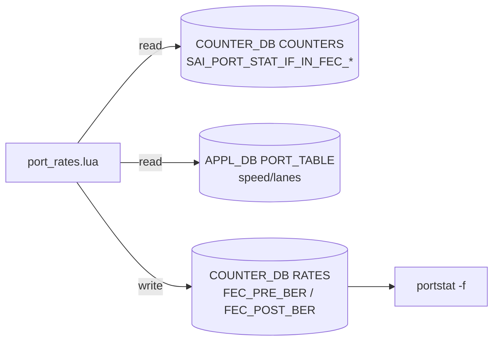

<!-- topics-tip -->
!!! tip "Topics で読み物として読む"
    この HLD は実装詳細を含む。機能の概念・設定・運用を読み物として読みたい場合は [Topics 14 章: Platform / Port / Optics](../topics/14-platform-port-optics/index.md) を参照。
<!-- /topics-tip -->

!!! info "裏取りステータス: code-verified"
    `sonic-swss/orchagent/port_rates.lua` に `compute_ber()`[^src1] と `SAI_PORT_STAT_IF_IN_FEC_CORRECTED_BITS` / `SAI_PORT_STAT_IF_IN_FEC_NOT_CORRECTABLE_FRAMES` の HGET、Pre/Post FEC BER 計算 (`rs_average_frame_ber = 1e-8`)、`calculate_lane_and_serdes_speed()` による serdes lookup (1G/10G/25G/50G/100G/200G の 6 段階) を確認。さらに `find_maxT()` で FEC codeword エラーの最大 bin (`FEC_MAX_T`) も `RATES` に書き込む。`sonic-utilities/scripts/portstat` に `-f`/`--fec-stats`、`-fh`/`--fec_hist` flag を実装済み (verified at: 2026-05-09)。

# Port FEC BER（Pre/Post FEC BER の算出と show fec-stat 拡張）

## なぜこの機能が必要か

ポートの **FEC（Forward Error Correction）統計** から **Pre / Post FEC BER** を計算し、`show interface counter fec-stat` に列を 2 つ追加するとともに、COUNTER_DB の `RATES` テーブルにも書き込んでテレメトリで取れるようにする[^1]。[SAI](../reference/glossary.md#term-sai) 側修正は **不要**（既存 `SAI_PORT_STAT_IF_IN_FEC_*` を利用）。

- **Pre FEC BER**: FEC が訂正できた bit のレート
- **Post FEC BER**: FEC が訂正失敗したフレームの worst-case BER 推定

PORT_STAT のポーリング周期（1 秒）に乗る。

## 何をどう計算するか

`port_rates.lua` を拡張し、各ポーリング周期で[^1]:



```text
lane_speed = port_speed / lanes_count   # Mbps
serdes = lookup(lane_speed)             # bits/s, 6 段階 lookup (下表)
delta_ms = ARGV[3]                      # ポーリング間隔 (ms, FlexCounter から渡される)

serdes_rate_total = lanes_count * serdes * delta_ms / 1000

pre_ber  = ΔSAI_PORT_STAT_IF_IN_FEC_CORRECTED_BITS
           / serdes_rate_total
post_ber = ΔSAI_PORT_STAT_IF_IN_FEC_NOT_CORRECTABLE_FRAMES
           * rs_average_frame_ber (1e-8)
           / serdes_rate_total
```

Post BER は「フレーム内全 bit 誤り」最悪ケース + 1e-8 の統計係数で近似[^1]。なお `serdes_rate_total` は lane 当たり serdes 速度 × lane 数 × 経過時間 (ms→s 換算) で得られる総 bit 数のため、ポーリング間隔は FlexCounter 側設定 (一般に 1000 ms) に追従する[^src1]。

### serdes lookup テーブル[^src1]

| lane speed | serdes (bps) |
|------------|--------------|
| 1G   (1000 Mbps)   | 1.25e9 |
| 10G  (10000 Mbps)  | 10.3125e9 |
| 25G  (25000 Mbps)  | 25.78125e9 |
| 50G  (50000 Mbps)  | 53.125e9 |
| 100G (100000 Mbps) | 106.25e9 |
| 200G (200000 Mbps) | 212.5e9 |

lane speed が `speed / lanes_count` で割り切れない場合、または上記いずれにも合致しない場合は `serdes = 0` となり、`compute_ber()` は当該ポートの FEC BER 更新をスキップする[^src1]。

### 関連 SAI カウンタ

| [Redis](../reference/glossary.md#term-redis) | Table | Field |
|-------|-------|-------|
| COUNTER_DB | COUNTERS | `SAI_PORT_STAT_IF_IN_FEC_CORRECTED_BITS` / `..._NOT_CORRECTABLE_FRAMES` |
| COUNTER_DB | RATES | `SAI_PORT_STAT_IF_FEC_CORRECTED_BITS_last` / `SAI_PORT_STAT_IF_FEC_NOT_CORRECTABLE_FARMES_last` (原文ママ、typo あり)、`FEC_PRE_BER` / `FEC_POST_BER` / `FEC_PRE_BER_MAX` / `FEC_MAX_T` (いずれも新規)[^src1] |
| [APPL_DB](../reference/glossary.md#term-appl_db) | PORT_TABLE | `lanes`、`speed` |

## CLI / 設定例

[CONFIG_DB](../reference/glossary.md#term-config_db) / [YANG](../reference/glossary.md#term-yang) への変更なし。CLI は既存表示の列追加:

```bash
show interface counter fec-stat
# IFACE     STATE  FEC_CORR  FEC_UNCORR  FEC_SYMBOL_ERR  FEC_PRE_BER   FEC_POST_BER
# Ethernet0 U      0         0           0               1.48e-20      0.00e+00

portstat -f          # 上記と同等のエイリアス
```

## 制限事項

- SAI 側で対応カウンタが未実装の platform では値が空 ([HLD](../reference/glossary.md#term-hld) で「return not support」と明記)[^1]
- Post FEC BER は worst-case 推定。**絶対値比較ではなく時系列トレンド** に使う
- serdes lookup は **1G / 10G / 25G / 50G / 100G / 200G の 6 段階のみ**[^src1]。`speed / lanes_count` がこのいずれにも一致しない (例: 40G の 10G×4 以外の特殊な lane 構成、400G 1lane=400Gbps) と `serdes = 0` となり、当該ポートの `FEC_PRE_BER` / `FEC_POST_BER` は更新されない (`compute_ber()` は早期 return)。なお 400G/800G ポートは通常 200G×2 / 100G×8 / 200G×4 のように複数 lane で構成されるため上表でカバーされる
- `speed` が `lanes_count` で割り切れない (`math.fmod(speed, count) ~= 0`) 場合も同様に `serdes = 0` に倒れる[^src1]

## 干渉する機能

- **port_rates.lua / [FlexCounter](../reference/glossary.md#term-flexcounter)**: 同 lua に乗るためポーリング負荷は他レート計算と共有
- **xcvrd / pmon**: 物理層異常との相関に有用
- **テレメトリ**: `RATES` 経由で [gNMI](../reference/glossary.md#term-gnmi) 公開可能

## トラブルシューティング

```bash
redis-cli -n 2 hgetall 'COUNTERS:oid:0x1000000000003'   # SAI カウンタ存在
redis-cli -n 2 hgetall 'RATES:Ethernet0' | grep -i fec  # FEC_PRE/POST_BER
show interface counter fec-stat
```

- 空欄 → SAI カウンタ未対応か、speed/lanes が lookup 外
- 値が異常に大きい → serdes 速度 lookup ミスマッチ
- Post BER 常時 0 → uncorrectable frame が本当に 0 か、SAI 取得失敗

## 引用元

[^1]: `sonic-net/SONiC` `doc/port_fec-ber/port_fec_ber.md` @ `49bab5b5ff0e924f1ea52b3d9db0dfa4191a7c06`
[^src1]: `sonic-net/sonic-swss` `orchagent/port_rates.lua` の `calculate_lane_and_serdes_speed()` (lane→serdes lookup、99〜113 行)、`compute_ber()` (213〜276 行)、`find_maxT()` (197〜210 行)

<!-- topics-back-ref -->
## 関連 Topics (カテゴリ)

- [Topics: Platform / Port / Optics / PHY](../topics/14-platform-port-optics/index.md)

<!-- /topics-back-ref -->

<!-- glossary-links-injected: eebc53211c97 -->
