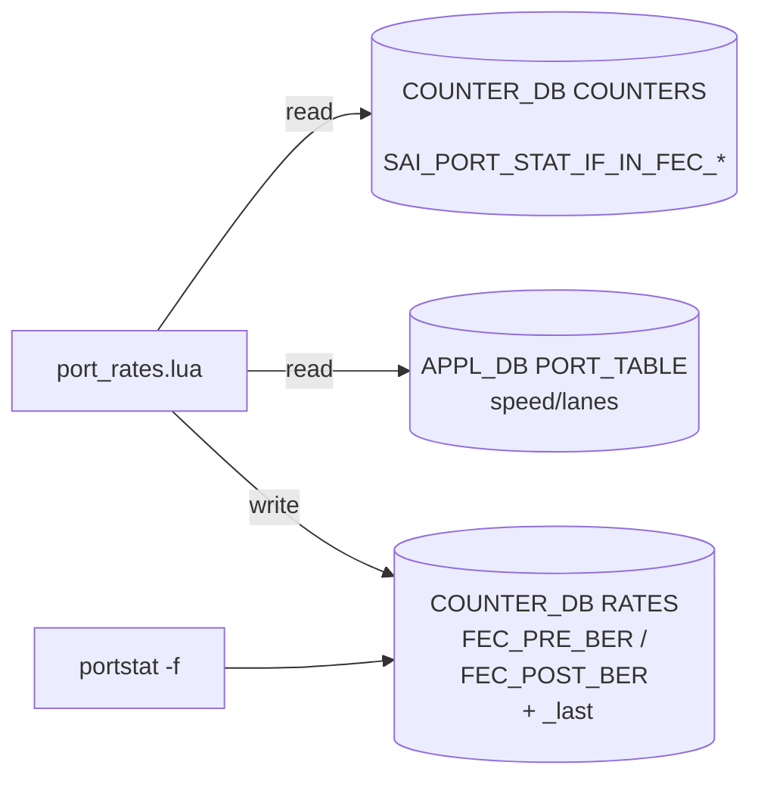

!!! info "裏取りステータス: code-verified"
    `sonic-swss/orchagent/port_rates.lua` master に `compute_ber()` 関数と `SAI_PORT_STAT_IF_IN_FEC_CORRECTED_BITS` / `SAI_PORT_STAT_IF_IN_FEC_NOT_CORRECTABLE_FRAMES` の HGET、Pre/Post FEC BER 計算（`rs_average_frame_ber` を使用）、lanes と serdes_speed lookup を確認。`sonic-utilities/scripts/portstat` に `-f`/`--fec-stats`、`-fh`/`--fec_hist` フラグ実装済み。HLD の主要要素は master 取り込み済み。

# Port FEC BER（Pre/Post FEC BER の算出と show fec-stat 拡張）

## 概要

ポートの **FEC（Forward Error Correction）統計から Pre/Post FEC BER を計算** し、`show interface counter fec-stat` に列を 2 つ追加するとともに、Redis DB（COUNTER_DB / RATES）にも書き込んでテレメトリで購読できるようにする[^1]。SAI 側の修正は **不要**（既存の `SAI_PORT_STAT_IF_IN_FEC_*` を使う）。

- **Pre FEC BER**: FEC が訂正できた bit のレート
- **Post FEC BER**: FEC が訂正失敗したフレームの worst-case BER 推定

PORT_STAT のポーリング周期（現状 1 秒）と同じ周期で更新される。

## 動作仕様

### 計算フロー

`port_rates.lua` を拡張し、各ポーリング周期で以下を行う[^1]：



### 計算式（HLD 抜粋）

```text
port_data_rate = port_speed / lanes_count
serdes = lookup(port_data_rate)        # 1Gbps→1.25e9, 25G→25.78125e9, 100G→106.25e9 ...
interval_s = 1.0                        # poll 周期 1s
pre_ber  = ΔSAI_PORT_STAT_IF_IN_FEC_CORRECTED_BITS
           / (serdes * lanes_count * interval_s)
post_ber = ΔSAI_PORT_STAT_IF_IN_FEC_NOT_CORRECTABLE_FRAMES
           * rs_average_frame_ber (1e-8)
           / (serdes * lanes_count * interval_s)
```

Post BER は「フレーム内のすべての bit が誤りだった」最悪ケース仮定 + フレームあたり 1e-8 の統計平均係数で近似する[^1]。

### 関連 SAI カウンタ

| Redis | Table | Field |
|-------|-------|-------|
| COUNTER_DB | COUNTERS | `SAI_PORT_STAT_IF_IN_FEC_CORRECTED_BITS` |
| COUNTER_DB | COUNTERS | `SAI_PORT_STAT_IF_IN_FEC_NOT_CORRECTABLE_FRAMES` |
| COUNTER_DB | RATES    | `*_last`（前回値）, `FEC_PRE_BER`, `FEC_POST_BER`（新規） |
| APPL_DB    | PORT_TABLE | `lanes`, `speed` |

## 設定

### 関連する CONFIG_DB

HLD には CONFIG_DB エントリの記述は無い（既存の PORT_STAT poll 周期に乗る）。

### 関連する CLI

```text
show interface counter fec-stat        # 既存に FEC_PRE_BER / FEC_POST_BER 列を追加
portstat -f                            # 同上の中の素直なエイリアス
```

### 関連する YANG

HLD に YANG モデルの記述は無い。

### 設定例

```bash
show interface counter fec-stat
# 出力例:
#       IFACE  STATE  FEC_CORR  FEC_UNCORR  FEC_SYMBOL_ERR  FEC_PRE_BER  FEC_POST_BER
#   Ethernet0     U          0           0               0   1.48e-20      0.00e+00
```

## 制限事項

- SAI 側で `SAI_PORT_STAT_IF_IN_FEC_CORRECTED_BITS` / `SAI_PORT_STAT_IF_IN_FEC_NOT_CORRECTABLE_FRAMES` 未対応のプラットフォームでは値が空になる（HLD で「return not support if its not working」と明記）[^1]。
- Post FEC BER は worst-case 仮定のため、絶対値の比較ではなく **時系列のトレンド観察** に使う。
- serdes 速度の lookup テーブルは limited セットのみ（1G/10G/25G/50G/100G）。これ以外の data rate は `serdes = 0` となり計算が壊れる[^1]。

## 干渉する機能

- **port_rates.lua / FlexCounter**: 同 lua スクリプトに乗るため、ポーリング負荷は他のレート計算と共有。
- **xcvrd / pmon**: 物理層異常時に FEC エラーが急増するシナリオで、こちらの統計と相関させて切り分けに使える。
- **テレメトリ**: `RATES` テーブル経由で gNMI 公開可能。

## トラブルシューティング

- `FEC_PRE_BER` が空になる → SAI 側カウンタ未対応か、port speed / lanes の組み合わせが lookup テーブルに無い可能性。
- 値が異常に大きい → serdes 速度テーブルのミスマッチ。HLD 表に無い data rate を計算しようとしている可能性。
- post BER がゼロのまま → uncorrectable frame は本当にゼロか、SAI 側カウンタ取得に失敗していないか確認。

## 引用元

[^1]: `sonic-net/SONiC` `doc/port_fec-ber/port_fec_ber.md` @ `49bab5b5ff0e924f1ea52b3d9db0dfa4191a7c06`
