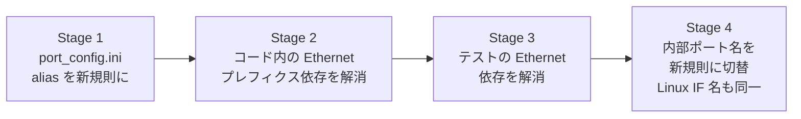

!!! danger "裏取りステータス: discrepancy-found（提案は不採用）"
    verifier-batch-18 で確認:

    - `sonic-buildimage/device/` 配下の `port_config.ini`（複数ベンダの代表例：`arista/x86_64-arista_7050cx3_32s/Arista-7050CX3-32S/port_config.ini`）は依然として `Ethernet0`/`Ethernet4`/... の `EthernetN` 命名を使い、`alias` 列で `Ethernet1/1` 系の前面パネル名を提供する形式
    - `etsXpY[abcd]` 命名や `ets<X>p<Y>` の chassis 表記は `device/` ツリー内に出現せず、**HLD 提案は master に取り込まれていない**
    - 本ページは **採用されなかった HLD プロポーザル** の参考資料として残す。実運用は `EthernetN`（CONFIG_DB.PORT key）+ `alias`（前面パネル名）+ breakout の `<panel>/<sub>` 表記で安定している

# SONiC ポート命名規則の変更案（`et[sX]pY[abcd]`）

## 概要

SONiC は伝統的に `Ethernet0` / `Ethernet4` / ... のような **`Ethernet` プレフィクス + ASIC レーン番号** をポート名に使ってきた。Microsoft からのプロポーザルとして本ドキュメントは以下の問題を指摘し、Linux Network Interface Naming に揃える命名規則を提案する[^1]:

- プレフィクス `Ethernet` が冗長（長い）
- ポート番号（ASIC lane 起点）が **前面パネル番号と一致しない**
- chassis（slot 概念あり）に対応できない

提案する新規命名規則は **`et[sX]pY[abcd]`** で、systemd / udev の永続デバイス名規則に近いスタイルである。

## 動作仕様

### 現行の命名

```
Ethernet0, Ethernet1, ..., Ethernet(N-1)        # N=32 or 64
Ethernet0, Ethernet4, Ethernet8, ...            # 4 lane 単位 / breakout 想定
```

問題点[^1]:

- `Ethernet` プレフィクスが長くタイピングしづらい
- 前面パネルポートと番号が直結しない
- 同じ ASIC を多重 slot に積む chassis では番号衝突を起こす

### 新提案: `et[sX]pY[abcd]`

```
et   sX        pY        [abcd]
↑    ↑         ↑          ↑
prefix slot番号  front panel   breakout
(任意, x=1..)  port  (必須)    (任意)
```

| 部分 | 必須/任意 | 説明 |
|-----|----------|------|
| `et` | 必須 | SONiC が選んだ prefix。`em` / `en` 等の Linux predictable name と類似。よく使われる Linux 規則の一族 |
| `sX` | 任意 | slot 番号。chassis 構成で使う。X は通常 1 から |
| `pY` | 必須 | 前面パネルポート Y。通常 1 から |
| `[a\|b\|c\|d]` | 任意 | breakout サブポート |

### 例

| 構成 | ポート名例 |
|-----|-----------|
| breakout なし、32 ポート pizza box | `etp1, etp2, ..., etp32` |
| 2 分割 breakout | `etp16a, etp16b` |
| 4 分割 breakout | `etp18a, etp18b, etp18c, etp18d` |
| chassis 複数 line card | `ets0p1, ets1p10` |

数字の起点は **「通常 1 から」**。Microsoft 提案のコメントとして、index を 1 起点にすると C/C++ 配列など 0 起点言語との橋渡しで「先頭エントリが無駄になる/ならない」が実装と言語に依存する旨の議論がある[^1]。

### 未解決の論点

提案文書時点で未解決として明示されているもの[^1]:

- **PortChannel（LAG）の命名規則**: `et[sX]pY[abcd]` のような枠組みに乗せるか、別系統で持つか未定

### 移行ステージ

破壊的変更を一気にやるのではなく、4 段階に分けて段階移行する案[^1]:



| Stage | 変更内容 |
|-------|---------|
| 1 | `port_config.ini` の **alias 列** を新命名で埋める。内部名はまだ `EthernetN` |
| 2 | SONiC コードベースから `Ethernet` プレフィクス前提（hardcode）を順次除去 |
| 3 | テスト（DVS / pytest など）から `Ethernet` プレフィクス・`Ethernet0` ハードコードを除去 |
| 4 | 内部ポート名と Linux IF 名の両方を新命名に切替 |

Stage 1 の段階で **alias は新命名、内部名は EthernetN のまま** という共存状態が続く。CLI 表示・SNMP・LLDP などユーザ視認領域は alias を出すことで命名移行を先行できる構成。

<!-- evidence:
source: sonic-net/SONiC/doc/sonic-port-name/sonic-port-name.md#L32-L40 (sha: 49bab5b5ff0e924f1ea52b3d9db0dfa4191a7c06)
excerpt: |
  ## Change stages ##
  1. Change port_config.ini alias column to use the new naming convention.
  2. Break SONiC code dependency of 'Ethernet' prefix.
  3. Break SONiC test dependency of 'Ethernet' prefix and/or 'Ethernet0'.
  4. Change SONiC port name to new naming convention.
reasoning: 4 段階移行プランの根拠。
-->

## 設定

### 関連する CONFIG_DB

本提案は CONFIG_DB のスキーマを直接変えるのではなく、`port_config.ini` の `alias` 列をまず新命名にする運用面の提案[^1]。`PORT|alias` の値が変わる。

### 関連する CLI

CLI 自体の追加・削除は提案されていない。`show interface` 等の出力や CLI 入力で使うキーが alias ベースに切替わるかが運用上のポイント。

### 関連する YANG

該当 YANG モジュールは HLD で言及されていない。

## 制限事項

- **本ドキュメントは提案段階**。コミュニティが採択して全 stage を完了したかは別途確認が必要
- Stage 4（内部名切替）は SONiC コードベース全体・テスト・自動化スクリプトに広く影響するため、移行には大規模な検証が必要
- PortChannel 等 LAG 系名称の取り扱いは **未解決**[^1]
- 1 起点インデクスとプログラミング言語の 0 起点との橋渡しは実装ごとに注意

## 干渉する機能

- **`port_config.ini` / hwsku パッケージング**: alias 列の更新
- **CLI / `show interface` / SNMP / LLDP**: alias がユーザ可視領域に出るので、運用ドキュメントとの整合
- **テスト基盤（DVS / pytest / sonic-mgmt）**: `Ethernet0` 等のハードコード除去が必要
- **chassis HLD**: slot 番号 (`sX`) を意識した命名は chassis ユースケースが主動機

## トラブルシューティング

- 新命名と従来命名の混在で alias 解決が壊れる場合、CLI と内部名のどちらを参照しているかを確認
- chassis で `ets0p1` が `ets1p1` と衝突する場合、line card の slot 番号が想定どおりに振られているか確認

## 引用元

[^1]: `sonic-net/SONiC` `doc/sonic-port-name/sonic-port-name.md` @ `49bab5b5ff0e924f1ea52b3d9db0dfa4191a7c06`

<!-- concerns hint:
- 本提案がどの Stage まで実装されたか（master では未だ EthernetN が主流）
- port_config.ini alias 列の運用ガイドライン
- chassis での ets<X>p<Y> 命名の実装事例
- PortChannel 命名の最終決定
- breakout (a/b/c/d) と CONFIG_DB.PORT のキーの整合
-->
