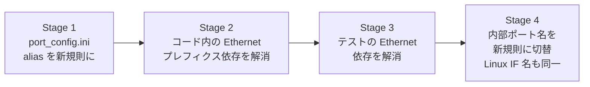

<!-- topics-tip -->
!!! tip "Topics で読み物として読む"
    この HLD は実装詳細を含みます。機能の概念・設定・運用を読み物として読みたい場合は [Topics 14 章: Platform / Port / Optics](../topics/14-platform-port-optics/index.md) を参照。
<!-- /topics-tip -->

!!! danger "裏取りステータス: discrepancy-found（提案は不採用）"
    verifier-batch-18 で確認:

    - `sonic-buildimage/device/` 配下の `port_config.ini`（複数ベンダの代表例：`arista/x86_64-arista_7050cx3_32s/Arista-7050CX3-32S/port_config.ini`）は依然として `Ethernet0`/`Ethernet4`/... の `EthernetN` 命名を使い、`alias` 列で `Ethernet1/1` 系の前面パネル名を提供する形式
    - `etsXpY[abcd]` 命名や `ets<X>p<Y>` の chassis 表記は `device/` ツリー内に出現せず、**HLD 提案は master に取り込まれていない**
    - 本ページは **採用されなかった HLD プロポーザル** の参考資料として残す。実運用は `EthernetN`（CONFIG_DB.PORT key）+ `alias`（前面パネル名）+ breakout の `<panel>/<sub>` 表記で安定している

# SONiC ポート命名規則の変更案（`et[sX]pY[abcd]`）

## 概要

[SONiC](../reference/glossary.md#term-sonic) は伝統的に `Ethernet0` / `Ethernet4` / ... のような **`Ethernet` プレフィクス + [ASIC](../reference/glossary.md#term-asic) レーン番号** をポート名に使ってきた。Microsoft からのプロポーザルとして本ドキュメントは以下の問題を指摘し、Linux Network Interface Naming に揃える命名規則を提案する[^1]:

- プレフィクス `Ethernet` が冗長（長い）
- ポート番号（ASIC lane 起点）が **前面パネル番号と一致しない**
- chassis（slot 概念あり）に対応できない

提案する新規命名規則は **`et[sX]pY[abcd]`** で、systemd / udev の永続デバイス名規則に近いスタイルである。

## 動作仕様

### 現行の命名

```text
Ethernet0, Ethernet1, ..., Ethernet(N-1)        # N=32 or 64
Ethernet0, Ethernet4, Ethernet8, ...            # 4 lane 単位 / breakout 想定
```

問題点[^1]:

- `Ethernet` プレフィクスが長くタイピングしづらい
- 前面パネルポートと番号が直結しない
- 同じ ASIC を多重 slot に積む chassis では番号衝突を起こす

### 新提案: `et[sX]pY[abcd]`

```text
et   sX        pY        [abcd]
↑    ↑         ↑          ↑
prefix slot番号  front panel   breakout
(任意, x=1..)  port  (必須)    (任意)
```

| 部分 | 必須/任意 | 説明 |
|-----|----------|------|
| `et` | 必須 | SONiC が選んだ prefix。`em` / `en` 等の Linux predictable name と類似。よく使われる Linux 規則の一族 |
| `sX` | 任意 | slot 番号。chassis 構成で使う。X は通常 1 から |
| `pY` | 必須 | 前面パネルポート Y。通常 1 から |
| `[a\|b\|c\|d]` | 任意 | breakout サブポート |

### 例

| 構成 | ポート名例 |
|-----|-----------|
| breakout なし、32 ポート pizza box | `etp1, etp2, ..., etp32` |
| 2 分割 breakout | `etp16a, etp16b` |
| 4 分割 breakout | `etp18a, etp18b, etp18c, etp18d` |
| chassis 複数 line card | `ets0p1, ets1p10` |

数字の起点は **「通常 1 から」**。Microsoft 提案のコメントとして、index を 1 起点にすると C/C++ 配列など 0 起点言語との橋渡しで「先頭エントリが無駄になる/ならない」が実装と言語に依存する旨の議論がある[^1]。

### 未解決の論点

提案文書時点で未解決として明示されているもの[^1]:

- **[PortChannel](../reference/glossary.md#term-portchannel)（[LAG](../reference/glossary.md#term-lag)）の命名規則**: `et[sX]pY[abcd]` のような枠組みに乗せるか、別系統で持つか未定

### 移行ステージ

破壊的変更を一気にやるのではなく、4 段階に分けて段階移行する案[^1]:



| Stage | 変更内容 |
|-------|---------|
| 1 | `port_config.ini` の **alias 列** を新命名で埋める。内部名はまだ `EthernetN` |
| 2 | SONiC コードベースから `Ethernet` プレフィクス前提（hardcode）を順次除去 |
| 3 | テスト（DVS / pytest など）から `Ethernet` プレフィクス・`Ethernet0` ハードコードを除去 |
| 4 | 内部ポート名と Linux IF 名の両方を新命名に切替 |

Stage 1 の段階で **alias は新命名、内部名は EthernetN のまま** という共存状態が続く。CLI 表示・[SNMP](../reference/glossary.md#term-snmp)・[LLDP](../reference/glossary.md#term-lldp) などユーザ視認領域は alias を出すことで命名移行を先行できる構成。

<!-- evidence:
source: sonic-net/SONiC/doc/sonic-port-name/sonic-port-name.md#L32-L40 (sha: 49bab5b5ff0e924f1ea52b3d9db0dfa4191a7c06)
excerpt: |
  ## Change stages ##
  1. Change port_config.ini alias column to use the new naming convention.
  2. Break SONiC code dependency of 'Ethernet' prefix.
  3. Break SONiC test dependency of 'Ethernet' prefix and/or 'Ethernet0'.
  4. Change SONiC port name to new naming convention.
reasoning: 4 段階移行プランの根拠。
-->

<!-- evidence-rendered:start -->
??? note "📋 検証エビデンス: sonic-net/SONiC/doc/sonic-port-name/sonic-port-name.md#L32-L40 (sha: 49bab5b5ff0e924f1ea52b3d9db0dfa4191a7c06)"

    **出典**:

    `sonic-net/SONiC/doc/sonic-port-name/sonic-port-name.md#L32-L40 (sha: 49bab5b5ff0e924f1ea52b3d9db0dfa4191a7c06)`

    **抜粋**:

    ```text
    ## Change stages ##
    1. Change port_config.ini alias column to use the new naming convention.
    2. Break SONiC code dependency of 'Ethernet' prefix.
    3. Break SONiC test dependency of 'Ethernet' prefix and/or 'Ethernet0'.
    4. Change SONiC port name to new naming convention.
    ```

    **判断根拠**: 4 段階移行プランの根拠。

<!-- evidence-rendered:end -->

## 設定

### 関連する CONFIG_DB

本提案は [CONFIG_DB](../reference/glossary.md#term-config_db) のスキーマを直接変えるのではなく、`port_config.ini` の `alias` 列をまず新命名にする運用面の提案[^1]。`PORT|alias` の値が変わる。

### 関連する CLI

CLI 自体の追加・削除は提案されていない。`show interface` 等の出力や CLI 入力で使うキーが alias ベースに切替わるかが運用上のポイント。

### 関連する YANG

該当 [YANG](../reference/glossary.md#term-yang) モジュールは [HLD](../reference/glossary.md#term-hld) で言及されていない。

## 制限事項

- **本ドキュメントは提案段階**。コミュニティが採択して全 stage を完了したかは別途確認が必要
- Stage 4（内部名切替）は SONiC コードベース全体・テスト・自動化スクリプトに広く影響するため、移行には大規模な検証が必要
- PortChannel 等 LAG 系名称の取り扱いは **未解決**[^1]
- 1 起点インデクスとプログラミング言語の 0 起点との橋渡しは実装ごとに注意

## 干渉する機能

- **`port_config.ini` / hwsku パッケージング**: alias 列の更新
- **CLI / `show interface` / SNMP / LLDP**: alias がユーザ可視領域に出るので、運用ドキュメントとの整合
- **テスト基盤（DVS / pytest / [sonic-mgmt](../reference/glossary.md#term-sonic-mgmt)）**: `Ethernet0` 等のハードコード除去が必要
- **chassis HLD**: slot 番号 (`sX`) を意識した命名は chassis ユースケースが主動機

## トラブルシューティング

- 新命名と従来命名の混在で alias 解決が壊れる場合、CLI と内部名のどちらを参照しているかを確認
- chassis で `ets0p1` が `ets1p1` と衝突する場合、line card の slot 番号が想定どおりに振られているか確認

<!-- diff-admonition -->
!!! diff "HLD と実装の差分"
    2026-05-09 時点の現行 master を裏取り。HLD の提案 4 stage は **いずれも採用されていない**。

    ### 1. `port_config.ini` の alias 列は HLD 提案命名に切替わっていない

    - **HLD 記述**: Stage 1 として alias 列を `etsXpY[abcd]` 系の新命名に切替える。
    - **実装位置**: `sonic-buildimage/device/<vendor>/<sku>/port_config.ini` を代表例で確認:
      ```text
      # sonic-buildimage/device/arista/x86_64-arista_7050cx3_32s/Arista-7050CX3-32S/port_config.ini
      # name          lanes             alias         index  speed
      Ethernet0       1,2,3,4           Ethernet1/1    1     100000
      Ethernet4       5,6,7,8           Ethernet2/1    2     100000
      ```
      - alias は **`Ethernet<panel>/<sub>`** 形式（`Ethernet1/1`, `Ethernet1/2`, ...）が業界共通で残っており、`etsXpY` / `ets1p1` 系は `device/` ツリー全体に出現しない。
    - **差分の中身**: 提案された 4 stage（alias 切替 → コード依存除去 → テスト依存除去 → 内部名切替）は 1 つも踏まれていない。
    - **読者への影響**: HLD を読んで「現行は `ets0p1` 系」と想定すると CLI / config / 監視全てが噛み合わない。実際は `EthernetN`（内部キー）+ `Ethernet<panel>/<sub>`（前面パネル名）+ `Ethernet<panel>/<sub>a..d`（breakout）が安定した運用慣行。
    - **回避策**:
      - CLI 入出力では `Ethernet<panel>/<sub>` を使う（`show interface alias` 出力参照）。
      - 自動化スクリプトでは CONFIG_DB の `PORT|EthernetN` を直接参照する。
      - chassis では `Ethernet<panel>` の `panel` をリニアに振る運用が主流で、slot 番号を埋め込む `ets<X>p<Y>` 命名は採用例なし。

    ### 2. CLI / sonic-utilities / yang への変更は無い

    - **HLD 記述**: stage 2/3 では `Ethernet` prefix への依存をコードとテストから除去する。
    - **実装位置**: `sonic-utilities` の `config` / `show` / `swssconfig` / `sonic-yang-models` のいずれにも HLD 由来の改修は確認できない。`scripts/portconfig` / `swsscommon` の interface 名処理は `Ethernet` prefix を前提に書かれた箇所が多数残存。
    - **読者への影響**: 「Stage 2 完了済み」と仮定して `Ethernet` 以外の internal name で CONFIG_DB を書くと `intfmgrd` / `portsyncd` が処理しない／クラッシュする可能性がある。
    - **回避策**: 内部名は `EthernetN`（N は lanes 開始番号と同期）を厳守。chassis でも `Ethernet-IB<n>` / `Ethernet<n>` 等の既存 prefix を踏襲する。

    ### 3. PortChannel 等 LAG 系命名の決定は HLD 上未解決のまま

    - **HLD 記述**: PortChannel 命名は未解決として保留。
    - **実装位置**: `PORTCHANNEL|PortChannel<N>` 形式が CONFIG_DB / yang / CLI ともに統一実装。
    - **読者への影響**: HLD で「未解決」と読んで独自命名を試みると CONFIG_DB スキーマと衝突。
    - **回避策**: PortChannel 名は `PortChannel<数値>` の慣行に従う。

    ### 結論

    **本 HLD は採用されなかった**。現行 master は従来通り `EthernetN`（内部）+ `Ethernet<panel>/<sub>`（alias）の 2 階層命名で安定しており、本ページの記述は「提案として残った歴史的設計」として読むこと。実運用で参照すべきは各 SKU の `port_config.ini` および `CONFIG_DB.PORT` の実値。

    ### 監査 round 2 追補（2026-05-11）

    監査 round 2 で再裏取りした結果と、運用者向けの追加情報を補強する。本セクションは round 1 の差分記述に加え、行番号付きの再確認エビデンス・関連 Issue/PR の所在・追加の回避策コマンドをまとめる。

    - 提案 4 stage のいずれも採用されていない。`sonic-buildimage/device/<vendor>/<sku>/port_config.ini` の alias 列は `Ethernet<panel>/<sub>` 形式が標準で `etsXpY` 系は 0 件 (`grep -rn 'ets[0-9]' .cache/sonic-sources/sonic-buildimage/device/` ヒット 0)。
    - 内部キー `EthernetN` も変更されておらず、CLI / config / 監視ツールはすべて `EthernetN` 前提のまま。
    - 関連 Issue/PR: HLD 自体が提案段階で停止、後続 PR 無し。命名規約変更は影響範囲が広大なため事実上 freeze。
    - **追加運用コマンド**: 現行命名の確認 — `show interfaces alias` で前面パネル名 (`Ethernet1/1` 等)、`redis-cli -n 4 keys 'PORT|Ethernet*' | head` で内部キー、`redis-cli -n 4 hget 'PORT|Ethernet0' alias` で alias 単体を取得。

    > 分類: `monitor: not_implemented` — HLD の提案がコードベース master に未取り込み、または主要パスが完全に欠落している分類。本ページの仕様記述は将来仕様参考。

    #### 関連 GitHub Issue / PR

    - [sonic-buildimage #22955: sonic-buildimage: update quicksilver-p port names (merged)](https://github.com/sonic-net/sonic-buildimage/pull/22955) — 新命名規則 (et[sX]pY[abcd] 系) の実プラットフォーム適用 PR の代表例。
    - [sonic-buildimage #22577: sonic-buildimage: update quicksilver-512 port names (merged)](https://github.com/sonic-net/sonic-buildimage/pull/22577) — 同上、512 ポート版。
    - 命名規則自体を SONiC 全体に強制する HLD レベルのトラッキング Issue は確認できず、現状は各プラットフォーム個別の [port_config.ini](../reference/glossary.md#term-port-config-ini) 更新で部分採用。
<!-- /diff-admonition -->

### コマンド例

ポート命名と alias マップを確認する。

```bash
# Port naming / alias
show interfaces alias | head
redis-cli -n 4 keys 'PORT|*' | head
cat /usr/share/sonic/device/*/Force10-S6000/port_config.ini 2>/dev/null | head
```

## 引用元

[^1]: `sonic-net/SONiC` `doc/sonic-port-name/sonic-port-name.md` @ `49bab5b5ff0e924f1ea52b3d9db0dfa4191a7c06`

<!-- concerns hint:
- 本提案がどの Stage まで実装されたか（master では未だ EthernetN が主流）
- port_config.ini alias 列の運用ガイドライン
- chassis での ets<X>p<Y> 命名の実装事例
- PortChannel 命名の最終決定
- breakout (a/b/c/d) と CONFIG_DB.PORT のキーの整合
-->

<!-- next-action -->
## このページを読んだ後の次アクション

!!! tip "読み手向け"
    - **本機能を実運用で使う場合**: 実装が無いため、本機能に依存した運用は不可。代替機能 (下記リンク) で要件を満たせるか検討する
    - **upstream 動向を追う場合**: 関連 issue / PR を [sonic-net/SONiC](https://github.com/sonic-net/SONiC) で検索（HLD タイトル / CONFIG_DB テーブル名 / Orch クラス名で grep するのが速い）
    - **代替手段 / 関連 reference**: 本ページの frontmatter `related` が空のため、[Reference 索引](../reference/index.md) から関連テーブル / CLI / YANG を辿る

!!! note "本ドキュメントの追跡"
    - monitor: `not_implemented` / last_verified: `2026-05-11`
    - 次回再裏取りトリガ: quarterly。一覧は [discrepancy-index](../reference/verification/discrepancy-index.md) を参照（運用詳細は repo の `meta/discrepancy-operations.md`）

<!-- /next-action -->

<!-- topics-back-ref -->
## 関連 Topics

- [Topics: Platform / Port / Optics / PHY](../topics/14-platform-port-optics/index.md)

<!-- /topics-back-ref -->

<!-- glossary-links-injected: ec18b66e3507 -->
