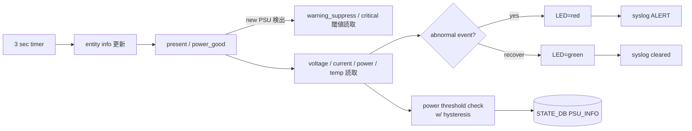

<!-- topics-tip -->
!!! tip "Topics で読み物として読む"
    この HLD は実装詳細を含みます。機能の概念・設定・運用を読み物として読みたい場合は [Topics 14 章: Platform / Port / Optics](../topics/14-platform-port-optics/index.md) を参照。
<!-- /topics-tip -->

!!! note "裏取りステータス: code-verified"
    `sonic-platform-daemons/sonic-psud/scripts/psud` で `PSU_INFO_UPDATE_PERIOD_SECS = 3`、`PSU_INFO_POWER_OVERLOAD = 'power_overload'`、`PSU_INFO_POWER_WARNING_SUPPRESS_THRESHOLD` / `PSU_INFO_POWER_CRITICAL_THRESHOLD` の定数と判定ロジックが確認できた。`sonic-platform-common/sonic_platform_base/psu_base.py` の `get_psu_power_warning_suppress_threshold` / `get_psu_power_critical_threshold` / `get_input_voltage` / `get_input_current` 抽象 API も実在。`sonic-utilities/scripts/psushow` で `power_overload` を読み取り `WARNING` / `OK` を表示。

# psud（PSU 監視デーモン / power threshold ヒステリシス）

## 概要

`psud` は **PSU の物理状態と電力指標を周期収集し [STATE_DB](../reference/glossary.md#term-state_db) に書く platform monitor 系 daemon**[^1]。supervisord が `psud` を起動。3 秒ループで platform API（fallback で plugin）を呼び、PSU の present / power_good / 電圧 / 電流 / 電力 / 温度 / 各種閾値を取得して `PSU_INFO` table を更新する。電圧範囲超過 / 温度過熱 / 電源喪失 / PSU 抜去 / **power critical threshold 超過** に対し PSU LED 色変更と syslog 発報を行う。`power threshold` チェックは v0.4 で追加され、ヒステリシス付き 2 段閾値 (`warning-suppress`, `critical`) で alarm flapping を抑止する。

## 動作仕様

### 主要ループ



### Power threshold ヒステリシス

```text
        critical ─────── alarm raise
                         (power が critical を上方向に横切る)
        ............
        warning_supp ── alarm clear
                         (power が warning_suppress を下方向に横切る)
```

- `power_overload=true` のとき、**warning_suppress 未満まで下がる**と false に戻して NOTICE log
- `power_overload=false` のとき、**critical 以上**で true に上げて WARNING log
- どちらの閾値も platform API が `NotImplemented` / `None` なら **その PSU では check 無効**[^1]

非対称閾値にする理由: 単一閾値だと閾値付近で alarm flapping が起きる。クリア閾値を低く取ることで安定化[^1]。

### `PSU_INFO` テーブル（STATE_DB）

key: `PSU_INFO|<psu_name>`

| フィールド | 内容 |
|-----------|------|
| `presence` / `status` / `change_event` | PSU 物理状態 |
| `model` / `serial` / `revision` / `is_replaceable` / `fan` / `led_status` | metadata |
| `voltage` / `voltage_min_threshold` / `voltage_max_threshold` | 出力電圧と範囲 |
| `current` / `power` / `max_power` | 出力 |
| `input_voltage` / `input_current` | 入力 |
| `temp` / `temp_threshold` | 温度 |
| `power_overload` | "true" / "false" |
| `power_warning_suppress_threshold` / `power_critical_threshold` | 2 段閾値 |

PSU 数自体は別途 `chassis_info` テーブルに格納（pmon-enhancement [HLD](../reference/glossary.md#term-hld) と整合）[^1]。

### イベント定義

| イベント | LED | Alert メッセージ |
|---------|-----|-----------------|
| 電圧範囲外 | red | `PSU voltage warning: <name> voltage out of range, ...` |
| 温度過熱 | red | `PSU temperature warning: <name> too hot, ...` |
| Power absence | red | `Power absence warning: <name> is out of power.` |
| PSU 抜去 | red (LED 不可な場合あり) | `PSU absence warning: <name> is not present.` |
| Power threshold 超過 | （LED は変えず status=WARNING）| WARNING level syslog |

回復時は `... cleared: ... back to normal` の Recover メッセージと LED=green。

### Platform API 拡張（`PsuBase`）

vendor は `sonic_platform_base/psu_base.py` の以下を実装する[^1]:

```python
get_temperature(), get_temperature_high_threshold()
get_voltage_high_threshold(), get_voltage_low_threshold()
get_input_voltage(), get_input_current()
get_psu_power_warning_suppress_threshold()  # 揮発値、毎回呼ぶ
get_psu_power_critical_threshold()           # 揮発値、毎回呼ぶ
```

Volatile 注記が重要: 閾値が温度等で動的に変化する platform があり、psud は値を cache せず毎周回取得する想定。

### CLI

| Command | 表示内容 |
|---------|----------|
| `show platform psustatus` | psud が STATE_DB に書いた状態。**`Status` に `WARNING` を含む**（threshold 超過 alarm）|
| `psuutil` | platform API 直叩き。one-shot のため state を持たず **`WARNING` 列は出さない**（warning_suppress < power < critical の判別ができない）|

`show platform psustatus` の出力（HLD 抜粋）:

```text
PSU    Model          Serial        HW Rev  Voltage(V) Current(A) Power(W) Status  LED
PSU 1  MTEF-PSF-AC-A  MT1629X14911  A3        12.08      5.19      62.62   WARNING green
PSU 2  MTEF-PSF-AC-A  MT1629X14913  A3        12.01      4.38      52.50   OK      green
```

`psuutil` 出力には `Power Warn-supp Thres (W)` と `Power Crit Thres (W)` 列が追加される（platform 非対応なら `N/A`）。

<!-- evidence:
source: sonic-net/SONiC/doc/psud/PSU_daemon_design.md#L80-L110 (sha: 49bab5b5ff0e924f1ea52b3d9db0dfa4191a7c06)
excerpt: |
  We use asymmetric thresholds between raising and clearing the alarm for the purpose of creating a hysteresis ...
  - an alarm will be raised when a PSU's power is rising across the critical threshold
  - an alarm will be cleared when a PSU's power is dropping across the warning-suppress threshold
reasoning: 2 段閾値ヒステリシスの根拠。
-->

<!-- evidence-rendered:start -->
??? note "📋 検証エビデンス: sonic-net/SONiC/doc/psud/PSU_daemon_design.md#L80-L110 (sha: 49bab5b5ff0e924f1ea52b3d9db0dfa4191a7c06)"

    **出典**:

    `sonic-net/SONiC/doc/psud/PSU_daemon_design.md#L80-L110 (sha: 49bab5b5ff0e924f1ea52b3d9db0dfa4191a7c06)`

    **抜粋**:

    ```text
    We use asymmetric thresholds between raising and clearing the alarm for the purpose of creating a hysteresis ...
    - an alarm will be raised when a PSU's power is rising across the critical threshold
    - an alarm will be cleared when a PSU's power is dropping across the warning-suppress threshold
    ```

    **判断根拠**: 2 段閾値ヒステリシスの根拠。

<!-- evidence-rendered:end -->

## 制限事項

- `psuutil` は state を持たないため `WARNING` を表示しない
- `power threshold` は platform API が両方の getter を提供する必要あり（片方欠けたら無効）
- 動的閾値 platform では値が時間変化する前提で **cache 禁止**
- LED 制御不能な PSU 抜去状態では LED 表示は更新できない

## 干渉する機能

- **pmon-enhancement-design**: PSU 数を `chassis_info` に置く設計と接続
- **thermal-control**: PSU 温度や電力が thermal policy にも影響
- **`psuutil`** / **`show platform psustatus`** CLI: 状態露出
- **modular switch**: 全 PSU 合計 power が **switch power budget** を超えるかも別途監視

## 確認コマンド

- `show platform psustatus` — `WARNING` ステータス（`power_overload`）が見える
- `sonic-db-cli STATE_DB hgetall "PSU_INFO|PSU 1"` — voltage / current / power / threshold / overload を直接確認
- `docker exec pmon supervisorctl status psud` — psud デーモンの動作確認
- `docker logs pmon 2>&1 | grep -i psu` — psud のログを確認

### コマンド例

PSU の状態と daemon を確認する。

```bash
# PSU
show platform psustatus
redis-cli -n 6 keys 'PSU_INFO|*'
redis-cli -n 6 hgetall 'PSU_INFO|PSU 1'
ps aux | grep -E 'psud|pmon'
```

## 引用元

[^1]: `sonic-net/SONiC` `doc/psud/PSU_daemon_design.md` @ `49bab5b5ff0e924f1ea52b3d9db0dfa4191a7c06`

<!-- evidence (verifier-batch-20):
- sonic-platform-daemons/sonic-psud/scripts/psud:81 PSU_INFO_UPDATE_PERIOD_SECS = 3, :540 self.stop_event.wait(PSU_INFO_UPDATE_PERIOD_SECS)
- sonic-platform-daemons/sonic-psud/scripts/psud:60-62 PSU_INFO_POWER_OVERLOAD/_WARNING_SUPPRESS_THRESHOLD/_CRITICAL_THRESHOLD
- sonic-platform-daemons/sonic-psud/scripts/psud:637 power_critical_threshold + power_warning_suppress_threshold で判定
- sonic-platform-common/sonic_platform_base/psu_base.py:227 get_psu_power_warning_suppress_threshold, :237 get_psu_power_critical_threshold, :269 get_input_voltage, :279 get_input_current
- sonic-utilities/scripts/psushow:41 db.get(STATE_DB, PSU_INFO|<name>, 'power_overload'); :42 status = 'WARNING' if power_overload == 'True' else 'OK'
-->

<!-- concerns hint:
- psud の 3 秒ループ実装と power_overload 判定ロジックの sonic-platform-daemons 取り込み確認
- PSU_INFO の power_warning_suppress_threshold / power_critical_threshold / power_overload の sonic-yang-models 反映確認
- PsuBase の get_psu_power_*_threshold / get_input_voltage / get_input_current の sonic-platform-common 取り込み確認
- show platform psustatus の WARNING ステータス表示の sonic-utilities 取り込み確認
- psuutil 出力での threshold 列追加の確認
-->

<!-- topics-back-ref -->
## 関連 Topics

- [Topics: Platform / Port / Optics / PHY](../topics/14-platform-port-optics/index.md)

<!-- /topics-back-ref -->

## 関連リファレンス

- CLI: [show platform](../reference/cli/show-platform.md) / [show environment](../reference/cli/show-environment.md) / [show system-health](../reference/cli/show-system-health.md)
- 関連 HLD: [storage monitoring daemon](../system/sonic-storage-monitoring-daemon-design.md) / [platform monitor enhancement](../system/platform-monitor-enhancement-design.md) / [pcieinfo design](pcieinfo-design.md) / [System Health Monitor](../system/sonic-system-health-monitor-high-level-design.md)

<!-- glossary-links-injected: 10394a5e95a8 -->
