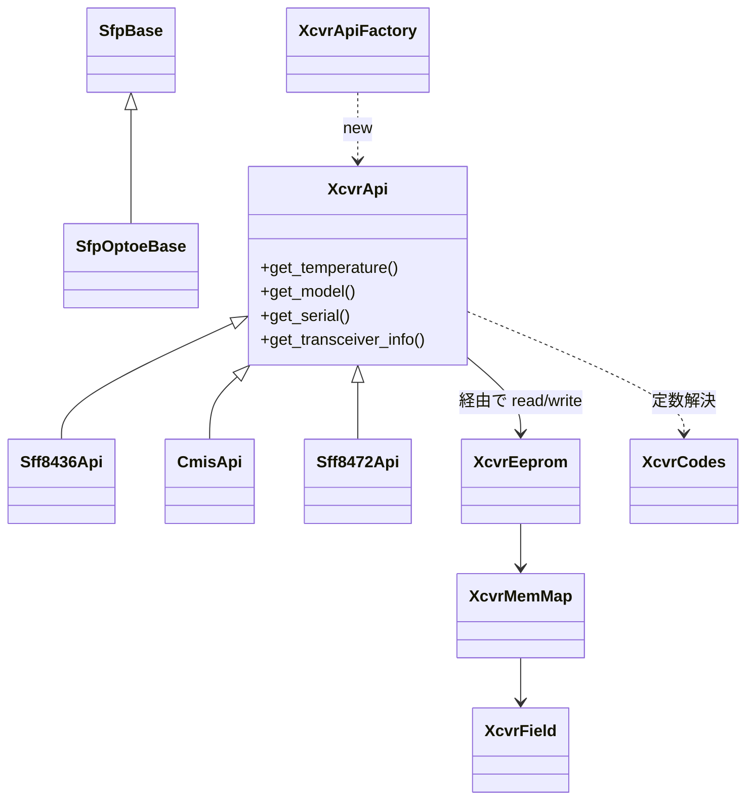

<!-- topics-tip -->
!!! tip "Topics で読み物として読む"
    この HLD は実装詳細を含む。機能の概念・設定・運用を読み物として読みたい場合は [Topics 14 章: Platform / Port / Optics](../topics/14-platform-port-optics/index.md) を参照。
<!-- /topics-tip -->

!!! note "裏取りステータス: code-verified"
    `sonic-platform-common/sonic_platform_base/sonic_xcvr/` 配下に `api/` `mem_maps/` `codes/` `fields/` `cdb/` `utils/` および `xcvr_api_factory.py` `xcvr_eeprom.py` `sfp_optoe_base.py` を確認。`api/public/` に `cmis.py` `c_cmis.py` `sff8472.py` 等が実装され、`xcvr_api_factory.py:51 class XcvrApiFactory` が `id_mapping` で identifier → API クラスを切り替える。`sonic-platform-daemons/sonic-xcvrd/xcvrd/` は `sfp.get_xcvr_api()` を全面使用。

# SFP リファクタ（XcvrApi / XcvrEeprom / spec 自動判別）

## なぜ作り直したか

[SONiC](../reference/glossary.md#term-sonic) の SFP 関連 platform API は **PI（Platform Independent）と PD（Platform Dependent）が混在**しており、vendor が `SfpBase` 派生で両方を実装する必要があった[^1]。`sonic_sfp` は旧 platform API モデルの遺物で新要件を満たさず、各 vendor が同じ PI ロジックを重複実装する状態だった。

本リファクタは **xcvr 仕様（SFF-8436 / SFF-8472 / CMIS 等）を中心に PI ロジックを `sonic-platform-common` に集約**し、vendor は真に PD な部分だけ実装すれば済むよう infrastructure を作り直す。

## どんなクラス階層にしたか



| Component | 役割 |
|-----------|------|
| **XcvrApi** | xcvr EEPROM 操作の **PI 共通 interface**。`get_temperature` / `get_transceiver_info` 等を spec 別 subclass で実装 |
| **XcvrEeprom** | EEPROM read/write 抽象。Sfp 実装が DB read/write callable を渡す |
| **XcvrMemMap** | spec ごとの **field 配置**（`offset` / `size` / `decode 方式`） |
| **XcvrField** | 1 field の表現。Numeric / String / Bit / Code 等の subclass で `decode()` を持つ |
| **XcvrCodes** | spec 内の固定 enum/code テーブル（SFF-8024 Identifier、CMIS Module State 等）|
| **XcvrApiFactory** | EEPROM 先頭バイト（identifier）から spec を判定し `XcvrApi` を生成[^1] |

## どう spec を選ぶか（identifier-based）

旧設計は **port 番号** で parser を選ぶ実装があり、誤った memory map で読むことがあった[^1]。新設計は:

1. EEPROM 0x00 を読み、SFF-8024 Table 4-1 の identifier 値を取得
2. `id_mapping.py` の `identifier → XcvrApi class` map を参照
3. 該当 spec の `XcvrApi` を `XcvrApiFactory` がインスタンス化

vendor 固有 identifier も同様に拡張可。**1 port = 1 xcvr** が前提。

### Vendor 拡張のディレクトリ

```text
api/public/<spec>.py            # public spec 用 XcvrApi 実装
api/<vendorA>/custom_qsfp.py    # vendor 固有派生
mem_maps/public/<spec>.py
mem_maps/<vendorA>/model_qsfp.py
codes/public/sff8024.py
codes/public/cmis.py
```

vendor は `api/` 下に自社 subclass を追加し、必要なら `mem_maps/` で field 配置を上書きするだけで済む[^1]。

### 既存 `SfpBase` との関係

- 既存 PI ロジックは新 PI 階層（`XcvrApi` 系）に移譲
- `SfpBase` は xcvrd 向け top-level interface のまま、`XcvrApi` を内部に保持
- `SfpOptoeBase` が CMIS / SFF 系を扱う多くの platform 向け共通 PD ヘルパーを提供[^1]

```python
class XcvrApi(object):
    def __init__(self, xcvr_eeprom): ...
    def get_temperature(self): raise NotImplementedError
    def get_transceiver_info(self): raise NotImplementedError

class Sff8436Api(XcvrApi):
    def get_temperature(self):
        return self.xcvr_eeprom.read(TEMPERATURE_FIELD)
```

<!-- evidence:
source: sonic-net/SONiC/doc/sfp-refactor/sfp-refactor.md#L150-L154 (sha: 49bab5b5ff0e924f1ea52b3d9db0dfa4191a7c06)
excerpt: |
  The correct specification abstraction needs to be selected at runtime to interpret a xcvr's memory map correctly.
  This should be done by reading the first byte in the xcvr's EEPROM ...
  This approach is in contrast to what's currently done with selecting parsers based on the xcvr's port number.
reasoning: identifier-based spec 判定への切替の根拠。
-->

<!-- evidence-rendered:start -->
??? note "📋 検証エビデンス: sonic-net/SONiC/doc/sfp-refactor/sfp-refactor.md#L150-L154 (sha: 49bab5b5ff0e924f1ea52b3d9db0dfa4191a7c06)"

    **出典**:

    `sonic-net/SONiC/doc/sfp-refactor/sfp-refactor.md#L150-L154 (sha: 49bab5b5ff0e924f1ea52b3d9db0dfa4191a7c06)`

    **抜粋**:

    ```text
    The correct specification abstraction needs to be selected at runtime to interpret a xcvr's memory map correctly.
    This should be done by reading the first byte in the xcvr's EEPROM ...
    This approach is in contrast to what's currently done with selecting parsers based on the xcvr's port number.
    ```

    **判断根拠**: identifier-based spec 判定への切替の根拠。

<!-- evidence-rendered:end -->

## In Scope / Out of Scope

| Scope | 内容 |
|-------|------|
| In | SFP / QSFP / OSFP-QSFP-DD（SFF-8472 / SFF-8436 / CMIS）の基本サポート、新 spec 追加の拡張枠、vendor 拡張枠、identifier-based 自動切替 |
| Out | SFP-DD 等の他 form factor、`sfpshow` / `xcvrd` 自身の本格リファクタ、vendor 別実装本体、`sonic_y_cable` 統合、Coherent 400G ZR |

## 制限事項

- 1 port 1 xcvr 前提
- xcvrd / sfpshow 自体の刷新は別 [HLD](../reference/glossary.md#term-hld) 待ち
- 既存 vendor は `SfpBase` を直接派生しており、移行期は新旧 API が並走

## 干渉する機能

- **xcvrd**: `XcvrApi` 経由で transceiver 情報を取得する想定
- **media_settings.json**: 同じ xcvrd 配下、xcvr 識別との関係
- **CMIS / C-CMIS for ZR**: 別 HLD（[cmis-and-c-cmis-support-for-zr](cmis-and-c-cmis-support-for-zr.md)）が CMIS 側を扱う
- **gearbox / external PHY**: `XcvrApi` ではなく `PAI` 配下、別系統

## 関連 Topics

- [Topics 14 Platform / Port / Optics - internals](../topics/14-platform-port-optics/internals.md)
- [Topics 14 Platform / Port / Optics - architecture](../topics/14-platform-port-optics/architecture.md)
- 関連 HLD: [CMIS / C-CMIS for ZR](cmis-and-c-cmis-support-for-zr.md) / [Custom SI settings for CMIS modules](custom-si-settings-for-cmis-modules.md) / [Media-based port settings](media-based-port-settings-in-sonic.md)

## 引用元

[^1]: `sonic-net/SONiC` `doc/sfp-refactor/sfp-refactor.md` @ `49bab5b5ff0e924f1ea52b3d9db0dfa4191a7c06`

<!-- evidence (verifier-batch-20):
- sonic-platform-common/sonic_platform_base/sonic_xcvr/{__init__.py,api,cdb,codes,fields,mem_maps,utils,sfp_optoe_base.py,xcvr_api_factory.py,xcvr_eeprom.py}
- sonic_xcvr/api/public/{cmis.py, c_cmis.py, sff8472.py, ...} と vendor 別 (amphenol/credo/hisense/innolight)
- sonic_xcvr/xcvr_api_factory.py:51 class XcvrApiFactory; :125 id_mapping = {...} で 0x18/0x19/0x1b/0x1e -> CmisApi, など切替
- sonic_xcvr/sfp_optoe_base.py:14 class SfpOptoeBase(SfpBase)
- sonic-platform-daemons/sonic-xcvrd/xcvrd/{xcvrd_utilities/optics_si_parser.py:162, media_settings_parser.py:337/375/396, sff_mgr.py:396, common.py:119/242, utils.py:19} で sfp.get_xcvr_api() 使用
-->

<!-- topics-back-ref -->
## Topics 索引

- [Topics: Platform / Port / Optics / PHY](../topics/14-platform-port-optics/index.md)

<!-- /topics-back-ref -->

<!-- glossary-links-injected: 8ba32e5aa69d -->
