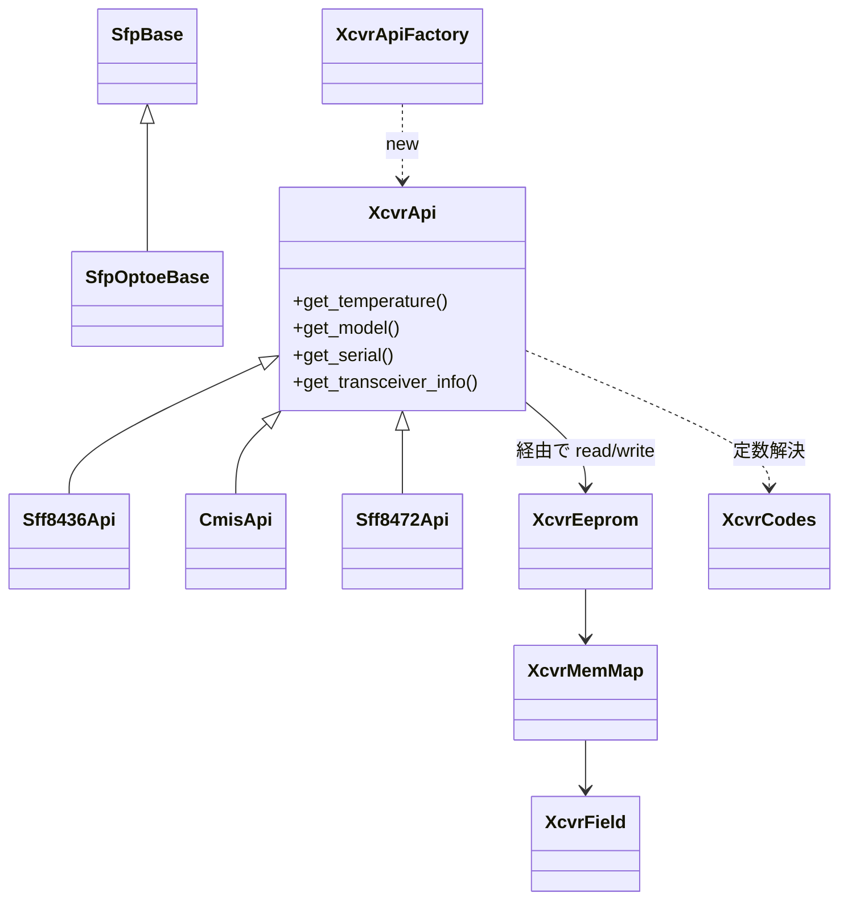

!!! note "裏取りステータス: code-verified"
    `sonic-platform-common/sonic_platform_base/sonic_xcvr/` 配下に `api/` `mem_maps/` `codes/` `fields/` `cdb/` `utils/` および `xcvr_api_factory.py` `xcvr_eeprom.py` `sfp_optoe_base.py` が確認できた。`api/public/` に `cmis.py` `c_cmis.py` `sff8472.py` 等が実装されており、`xcvr_api_factory.py:51 class XcvrApiFactory` が `id_mapping` で identifier → API クラスを切り替える。`sonic-platform-daemons/sonic-xcvrd/xcvrd/` 配下が `sfp.get_xcvr_api()` を全面的に使用。

# SFP リファクタ（XcvrApi / XcvrEeprom / spec 自動判別）

## 概要

SONiC の SFP 関連 platform API は **PI (Platform Independent) と PD (Platform Dependent) が混在** しており、vendor が `SfpBase` 派生クラスで両方を実装する必要があった[^1]。`sonic_sfp` は旧 platform API モデルの遺物で新しい platform API の要件を満たさず、各 vendor が同じような PI ロジックを重複実装する悲しい状態。本リファクタは、**xcvr 仕様（SFF-8436 / SFF-8472 / CMIS 等）を中心に PI ロジックを `sonic-platform-common` に集約**し、vendor が真に PD な部分だけ実装すれば済むよう infrastructure を作り直す。

## 動作仕様

### 新クラス階層



### コンポーネント

| Component | 役割 |
|-----------|------|
| **XcvrApi** | xcvr EEPROM 操作の **PI な共通 interface**。`get_temperature` / `get_transceiver_info` 等を spec 別 subclass で実装 |
| **XcvrEeprom** | EEPROM read/write 抽象。Sfp 実装が DB read/write callable を渡してくる |
| **XcvrMemMap** | spec ごとの **field 配置**（`offset` / `size` / `decode 方式`）。`api/` から論理 field 名で問い合わせる |
| **XcvrField** | 1 field の表現。Numeric / String / Bit / Code 等の subclass で `decode()` を持つ |
| **XcvrCodes** | spec 内の固定 enum/code テーブル（例: `SFF-8024 Identifier table`、CMIS の Module State 等） |
| **XcvrApiFactory** | EEPROM 先頭バイト（identifier）を読み spec を判定して **適切な `XcvrApi` を生成**[^1] |

### Spec 自動判定（identifier-based）

旧設計は **port 番号** で parser を選ぶ実装があり、間違った memory map で読むケースがあった[^1]。新設計は:

1. EEPROM 0x00 を読み、SFF-8024 Table 4-1 の identifier 値を取得
2. `id_mapping.py` に書かれた `identifier → XcvrApi class` の map を参照
3. 該当 spec の `XcvrApi` を `XcvrApiFactory` がインスタンス化

vendor 固有 identifier も同様に拡張可能（vendor-specific Identifier の節）[^1]。**1 port = 1 xcvr** が前提。

### Vendor 拡張

```
api/public/<spec>.py            # public spec 用 XcvrApi 実装
api/<vendorA>/custom_qsfp.py    # vendor 固有派生
mem_maps/public/<spec>.py
mem_maps/<vendorA>/model_qsfp.py
codes/public/sff8024.py
codes/public/cmis.py
```

vendor は `api/` 下に自社 subclass を追加し、必要に応じて `mem_maps/` で field 配置を上書きするだけで済む[^1]。

### `SfpBase` 改修

- 既存 PI ロジックは **新 PI 階層 (`XcvrApi` 系)** に移譲
- `SfpBase` は xcvrd から呼ばれる top-level interface のまま、`XcvrApi` を内部に保持
- **`SfpOptoeBase`** が CMIS / SFF 系を扱う多くの platform 向けの共通 PD ヘルパーを提供[^1]

```python
class XcvrApi(object):
    def __init__(self, xcvr_eeprom): ...
    def get_temperature(self): raise NotImplementedError
    def get_model(self): raise NotImplementedError
    def get_serial(self): raise NotImplementedError
    def get_transceiver_info(self): raise NotImplementedError

class Sff8436Api(XcvrApi):
    def get_temperature(self):
        return self.xcvr_eeprom.read(TEMPERATURE_FIELD)
```

<!-- evidence:
source: sonic-net/SONiC/doc/sfp-refactor/sfp-refactor.md#L150-L154 (sha: 49bab5b5ff0e924f1ea52b3d9db0dfa4191a7c06)
excerpt: |
  The correct specification abstraction needs to be selected at runtime to interpret a xcvr’s memory map correctly.
  This should be done by reading the first byte in the xcvr's EEPROM ...
  This approach is in contrast to what's currently done with selecting parsers based on the xcvr's port number.
reasoning: identifier-based spec 判定への切替の根拠。
-->

## In Scope / Out of Scope

| Scope | 内容 |
|-------|------|
| In | SFP / QSFP / OSFP-QSFP-DD（SFF-8472 / SFF-8436 / CMIS）の基本サポート、新 spec 追加の拡張枠、vendor 拡張枠、identifier-based 自動切替 |
| Out | SFP-DD 等の他 form factor、`sfpshow` / `xcvrd` の本格リファクタ、vendor 別実装本体、`sonic_y_cable` 統合、Coherent 400G ZR |

## 制限事項

- 1 port 1 xcvr 前提
- xcvrd / sfpshow 自体の刷新は別 HLD 待ち
- 既存 vendor は `SfpBase` を直接派生しているため、移行期間に新旧 API が並走

## 干渉する機能

- **xcvrd**: `XcvrApi` 経由で transceiver 情報を取得する未来形が想定される
- **media_settings.json**: 同じ xcvrd 配下、xcvr 識別との関係
- **CMIS / C-CMIS for ZR**: 別 HLD（`cmis-and-c-cmis-support-for-zr`）が CMIS 側を扱う
- **gearbox / external PHY**: `XcvrApi` ではなく `PAI` 配下、別系統

## 引用元

[^1]: `sonic-net/SONiC` `doc/sfp-refactor/sfp-refactor.md` @ `49bab5b5ff0e924f1ea52b3d9db0dfa4191a7c06`

<!-- evidence (verifier-batch-20):
- sonic-platform-common/sonic_platform_base/sonic_xcvr/{__init__.py,api,cdb,codes,fields,mem_maps,utils,sfp_optoe_base.py,xcvr_api_factory.py,xcvr_eeprom.py}
- sonic_xcvr/api/public/{cmis.py, c_cmis.py, sff8472.py, ...} と vendor 別 (amphenol/credo/hisense/innolight)
- sonic_xcvr/xcvr_api_factory.py:51 class XcvrApiFactory; :125 id_mapping = {...} で 0x18/0x19/0x1b/0x1e -> CmisApi, など切替
- sonic_xcvr/sfp_optoe_base.py:14 class SfpOptoeBase(SfpBase)
- sonic-platform-daemons/sonic-xcvrd/xcvrd/{xcvrd_utilities/optics_si_parser.py:162, media_settings_parser.py:337/375/396, sff_mgr.py:396, common.py:119/242, utils.py:19} で sfp.get_xcvr_api() 使用
-->

<!-- concerns hint:
- sonic_xcvr (api/ mem_maps/ codes/ xcvr_eeprom.py xcvr_api_factory.py) の sonic-platform-common 取り込み確認
- SFF-8024 / SFF-8436 / SFF-8472 / CMIS 各 XcvrApi 実装の存在確認
- identifier → XcvrApi class マップ (id_mapping) の実装確認
- SfpOptoeBase の現行クラス階層と vendor 移行状況の確認
- xcvrd が新 XcvrApi を使う形に書き換わっているかの確認
-->
