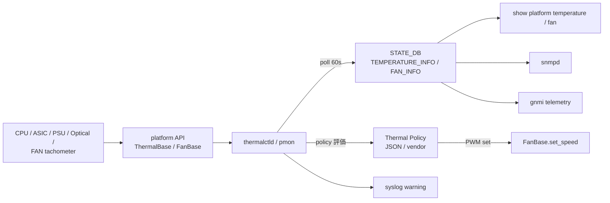

<!-- topics-tip -->
!!! tip "Topics で読み物として読む"
    この HLD は実装詳細を含む。機能の概念・設定・運用を読み物として読みたい場合は [Topics 14 章: Platform / Port / Optics](../topics/14-platform-port-optics/index.md) を参照。
<!-- /topics-tip -->

!!! success "裏取りステータス: code-verified"
    実装裏取り済み。`thermalctld`: `sonic-platform-daemons/sonic-thermalctld/scripts/thermalctld`（`POLICY_FILE = /usr/share/sonic/platform/thermal_policy.json:1291`）/ `ThermalBase` / `FanBase`: `sonic-platform-common/sonic_platform_base/{thermal_base.py,fan_base.py,fan_drawer_base.py,sonic_thermal_control/}`。

# Thermal Control（thermalctld + ポリシー駆動 fan / cooling 制御）

## 何のための daemon か

switch を適温に保つために cooling device（主に fan）を制御する 2 階建ての仕組み[^1]:

1. **thermal device monitoring**: CPU / [ASIC](../reference/glossary.md#term-asic) / 光モジュール / PSU 等の温度と fan running status を周期 poll し `STATE_DB` に保存
2. **thermal control management**: 取得値と **ポリシー** を突合し、PWM 調整・アラート・syslog を発する

ベンダ独自アルゴリズムが kernel / BMC 等で動く場合は [SONiC](../reference/glossary.md#term-sonic) 側制御を **disable** にして監視のみも可[^1]。

## どんな platform API を使うか

### `ThermalBase`（温度センサ抽象）

| メソッド | 用途 |
|----------|------|
| `get_temperature()` | 現在値 |
| `get_high_threshold()` / `get_critical_high_threshold()` | 高温側 |
| `get_low_threshold()` / `get_critical_low_threshold()` | 低温側 |

しきい値超過 → `warning_status=true` を [STATE_DB](../reference/glossary.md#term-state_db) に書き syslog 出力[^1]。

### `FanBase`（fan 抽象）

`get_speed()` / `set_speed()` / `get_target_speed()` / `get_presence()` 等で PWM 制御と冗長監視を行う。

## どこに値が出るか（STATE_DB）

```text
TEMPERATURE_INFO|<object_name>
  temperature             = float
  timestamp               = string
  high_threshold          = float
  critical_high_threshold = float
  low_threshold           = float
  critical_low_threshold  = float
  warning_status          = bool

FAN_INFO|<fan_name>
  drawer_name      = string
  presence         = bool
  model / serial   = string
  status           = bool
  direction        = string     # F2B / B2F 等
  speed            = int        # 現在 RPM 比
  speed_target     = int
  speed_tolerance  = int
  led_status       = string
```

`object_name` は `cpu_core_0` / `asic` / `psu_2` のように **device_name + index**。温度の推奨 poll 間隔は **60 秒**（短期変動が小さいため）[^1]。

## ポリシーの例

[HLD](../reference/glossary.md#term-hld) で例示されている代表ケース[^1]:

- PSU 1 個が未挿入 → PWM 100%
- FAN drawer 未挿入 / tachometer 故障 → PWM 100%
- thermal control disable → PWM 60% 固定
- 一定温度超過 → shutdown 系発動（ベンダ依存）

ポリシー実装はベンダ specific 許容。kernel / BMC でやる場合は SONiC daemon の制御 loop を OFF にする。

### Syslog 出力例

```text
High temperature warning: PSU 1 current temperature 85C, high threshold 80C
High temperature warning cleared, PSU 1 temperature restore to 75C, high threshold 80C
Fan removed warning: Fan 1 was removed from the system, potential overheat hazard!
Fan removed warning cleared: Fan 1 was inserted.
```

event-driven 監視 / techsupport にも乗る。

### コンポーネント関係



<!-- evidence:
source: sonic-net/SONiC/doc/thermal-control/thermal-control-design.md#L84-L101 (sha: 49bab5b5ff0e924f1ea52b3d9db0dfa4191a7c06)
excerpt: |
  Adjust cooling device according to the current temperature can be very vendor specific ... This cooling device control function can be disabled if the vendor have their own implementation in the kernel or somewhere else.
  - Set PWM to full speed if one of PS units is not present
  - Set the fan speed to a consant value (60% of full speed) thermal control functions was disabled.
reasoning: ベンダ実装と SONiC 共通実装の境界、ポリシー例の根拠。
-->

<!-- evidence-rendered:start -->
??? note "📋 検証エビデンス: sonic-net/SONiC/doc/thermal-control/thermal-control-design.md#L84-L101 (sha: 49bab5b5ff0e924f1ea52b3d9db0dfa4191a7c06)"

    **出典**:

    `sonic-net/SONiC/doc/thermal-control/thermal-control-design.md#L84-L101 (sha: 49bab5b5ff0e924f1ea52b3d9db0dfa4191a7c06)`

    **抜粋**:

    ```text
    Adjust cooling device according to the current temperature can be very vendor specific ... This cooling device control function can be disabled if the vendor have their own implementation in the kernel or somewhere else.
    - Set PWM to full speed if one of PS units is not present
    - Set the fan speed to a consant value (60% of full speed) thermal control functions was disabled.
    ```

    **判断根拠**: ベンダ実装と SONiC 共通実装の境界、ポリシー例の根拠。

<!-- evidence-rendered:end -->

## 設定 / CLI

[CONFIG_DB](../reference/glossary.md#term-config_db) スキーマは無し。policy はベンダの `/usr/share/sonic/device/$PLATFORM/thermal_policy.json` 等で配布される。CLI は HLD で明示されないが、典型的には `show platform temperature` / `show platform fan` で STATE_DB 値を取り出す。

```bash
redis-cli -n 6 KEYS "TEMPERATURE_INFO|*"
redis-cli -n 6 HGETALL "TEMPERATURE_INFO|asic"
redis-cli -n 6 HGETALL "FAN_INFO|fan1"
journalctl | grep -iE "high temperature warning|fan removed"
```

## 制限事項

- 具体的な thermal algorithm / PWM 制御は ASIC / chassis 依存で共通実装は限定的
- HLD は Rev 0.3 で日付欄空欄。改訂時期不明
- thermal control disable 時は SONiC 側は fan 速度を 60% 固定するだけ
- 光モジュール温度は xcvrd 側でも取得しており、本 HLD テーブルとの統合経路は未明示

## 干渉する機能

- **PMON enhancement design**: `FAN_INFO` / `PSU_INFO` table フォーマットは別 HLD（`doc/pmon/pmon-enhancement-design.md`）
- **xcvrd / 光モジュール温度**: 同一 device の温度が 2 経路で取得され得る
- **system health / system-ready**: 重大温度・fan 異常は ready 判定に影響
- **chassis platform management**: シャーシ全体での集約は別 HLD

## トラブルシューティング

```bash
# 警告が出ているか
redis-cli -n 6 KEYS "TEMPERATURE_INFO|*" | while read k; do
  redis-cli -n 6 HGET "$k" warning_status | grep -q true && echo "$k WARN"
done

# fan が target に達しているか
redis-cli -n 6 HGETALL "FAN_INFO|fan1" | grep -E "speed|target|tolerance"

docker exec pmon supervisorctl status thermalctld
ls /usr/share/sonic/device/$PLATFORM/thermal_policy.json 2>/dev/null
```

## 関連 Topics

- [Topics 14 Platform / Port / Optics - operations](../topics/14-platform-port-optics/operations.md)
- [Topics 14 Platform / Port / Optics - internals](../topics/14-platform-port-optics/internals.md)
- 関連 HLD: [PSU daemon](sonic-psu-daemon-design.md) / [Liquid cooling leakage detection](liquid-cooling-leakage-detection-in-sonic.md)

## 引用元

[^1]: `sonic-net/SONiC` `doc/thermal-control/thermal-control-design.md` @ `49bab5b5ff0e924f1ea52b3d9db0dfa4191a7c06`

<!-- topics-back-ref -->
## Topics 索引

- [Topics: Platform / Port / Optics / PHY](../topics/14-platform-port-optics/index.md)

<!-- /topics-back-ref -->

<!-- glossary-links-injected: ec18b66e3507 -->
