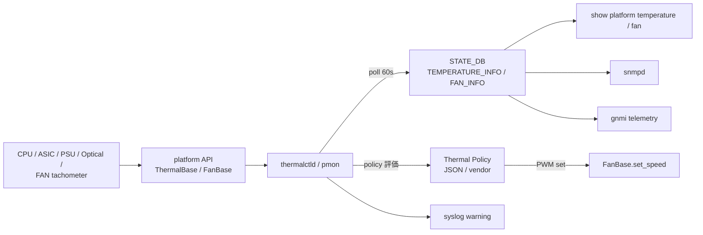

!!! success "裏取りステータス: code-verified"
    実装裏取り済み（下記コード位置）。thermalctld: sonic-platform-daemons/sonic-thermalctld/scripts/thermalctld (POLICY_FILE = /usr/share/sonic/platform/thermal_policy.json:1291) / ThermalBase / FanBase: sonic-platform-common/sonic_platform_base/{thermal_base.py,fan_base.py,fan_drawer_base.py,sonic_thermal_control/} で確認。

# Thermal Control（thermalctld + ポリシー駆動 fan / cooling 制御）

## 概要

Thermal Control は switch を適温に保つために cooling device（主に fan）を制御する仕組み[^1]:

1. **thermal device monitoring**: CPU / ASIC / 光モジュール / PSU 等の温度と fan の running status を周期 poll して `STATE_DB` に保存
2. **thermal control management**: 取得した温度・fan 状態と **ポリシー** を突合し、PWM の調整やアラート / syslog を発する

ベンダ独自のアルゴリズムが kernel 等で動いている場合は SONiC 側の cooling device 制御を **disable** にして、監視のみ行うこともできる[^1]。

## 動作仕様

### platform API（`ThermalBase`）

ThermalBase() クラスが温度センサを抽象化[^1]:

| メソッド | 用途 |
|----------|------|
| `get_temperature()` | 現在値 |
| `get_high_threshold()` / `get_critical_high_threshold()` | 高温側しきい値 |
| `get_low_threshold()` / `get_critical_low_threshold()` | 低温側しきい値 |

しきい値超過 → `warning_status = true` を STATE_DB に書き、syslog 出力。

### STATE_DB スキーマ

```
TEMPERATURE_INFO|<object_name>
  temperature             = float
  timestamp               = string
  high_threshold          = float
  critical_high_threshold = float
  low_threshold           = float
  critical_low_threshold  = float
  warning_status          = bool
```

`object_name` は `cpu_core_0` / `asic` / `psu_2` のように **device_name + index** 形式[^1]。

```
FAN_INFO|<fan_name>
  drawer_name      = string
  presence         = bool
  model / serial   = string
  status           = bool
  direction        = string         # F2B / B2F 等
  speed            = int            # 現在 RPM 比
  speed_target     = int            # 目標
  speed_tolerance  = int
  led_status       = string
  timestamp        = string
```

### Polling 周期

温度は 60 秒間隔を推奨[^1]（短期間で大きく変動しないため）。fan は別途 poll される。

### ポリシー例

HLD で例示されている代表ポリシー[^1]:

- PSU 1 個が未挿入 → PWM 100%
- FAN drawer 未挿入 / tachometer 故障 → PWM 100%
- thermal control 機能が disable → PWM 60% 固定
- 一定温度を超えたら **shutdown 系** を発動するベンダ実装も典型

ポリシー実装はベンダ specific が許容される。kernel / BMC でやる場合は SONiC daemon 側の制御 loop を OFF にする。

### Fan / 温度の不一致時のログ例

```
High temperature warning: PSU 1 current temperature 85C, high threshold 80C
High temperature warning cleared, PSU 1 temperature restore to 75C, high threshold 80C
Fan removed warning: Fan 1 was removed from the system, potential overheat hazard!
Fan removed warning cleared: Fan 1 was inserted.
```

これらは syslog 経由で event-driven 監視 / techsupport にも乗る。

### コンポーネント関係



<!-- evidence:
source: sonic-net/SONiC/doc/thermal-control/thermal-control-design.md#L84-L101 (sha: 49bab5b5ff0e924f1ea52b3d9db0dfa4191a7c06)
excerpt: |
  Adjust cooling device according to the current temperature can be very vendor specific ... This cooling device control function can be disabled if the vendor have their own implementation in the kernel or somewhere else.
  - Set PWM to full speed if one of PS units is not present
  - Set the fan speed to a consant value (60% of full speed) thermal control functions was disabled.
reasoning: ベンダ実装と SONiC 共通実装の境界、ポリシー例の根拠。
-->

## 設定

### 関連する CONFIG_DB

該当なし。policy はベンダ JSON / コードに置かれ、CONFIG_DB ではない[^1]。

### 関連する CLI

HLD は CLI を明示しないが、典型的には `show platform temperature` / `show platform fan` 等で STATE_DB の値を取り出す。詳細は HLD では未確認のため列挙しない。

### 設定例

```bash
# 温度・fan 状態の確認
redis-cli -n 6 KEYS "TEMPERATURE_INFO|*"
redis-cli -n 6 HGETALL "TEMPERATURE_INFO|asic"
redis-cli -n 6 HGETALL "FAN_INFO|fan1"

# 警告ログ
journalctl | grep -i "high temperature warning\|fan removed"
```

## 制限事項

- **ベンダ依存**: 具体的な thermal algorithm や PWM 制御は ASIC / chassis ごとに異なり、共通実装は限定的
- HLD は **Rev 0.3 で日付欄空欄**[^1]。改訂時期不明。`pmon-enhancement-design.md` の FAN テーブル等と相互参照
- thermal control disable 時は SONiC 側で fan 速度を一定（60%）に固定するだけ
- 光モジュール温度は xcvrd 側でも取得しているが、本 HLD のテーブルとの統合経路は明示なし

## 干渉する機能

- **PMON enhancement design**: FAN_INFO / PSU_INFO の table フォーマット定義は別 HLD（`doc/pmon/pmon-enhancement-design.md`）に依拠
- **xcvrd / 光モジュール温度**: 同じ device の温度を 2 経路で取り得る
- **fancontrol（旧 lm-sensors 由来）**: SONiC は基本これを置換するが、ベンダ実装次第
- **system health monitoring / system-ready**: 重大温度・fan 異常はシステム ready 判定に影響
- **chassis platform management**: シャーシ全体での集約は別 HLD

## トラブルシューティング

```bash
# 警告が出ているか
redis-cli -n 6 KEYS "TEMPERATURE_INFO|*" | while read k; do
  redis-cli -n 6 HGET "$k" warning_status | grep -q true && echo "$k WARN"
done

# fan が target 速度に達しているか
redis-cli -n 6 HGETALL "FAN_INFO|fan1" | grep -E "speed|target|tolerance"

# サブシステム
docker exec pmon supervisorctl status thermalctld

# policy ファイル
ls /usr/share/sonic/device/$PLATFORM/thermal_policy.json 2>/dev/null
```

## 引用元

[^1]: `sonic-net/SONiC` `doc/thermal-control/thermal-control-design.md` @ `49bab5b5ff0e924f1ea52b3d9db0dfa4191a7c06`
