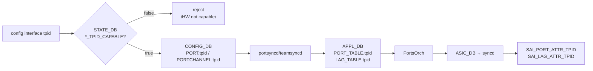

<!-- topics-tip -->
!!! tip "Topics で読み物として読む"
    この HLD は実装詳細を含みます。機能の概念・設定・運用を読み物として読みたい場合は [Topics 14 章: Platform / Port / Optics](../topics/14-platform-port-optics/index.md) を参照。
<!-- /topics-tip -->

!!! success "裏取りステータス: code-verified (2026-05-10)"
    `sonic-swss/orchagent/switchorch.cpp` で `sai_query_attribute_capability(... SAI_PORT_ATTR_TPID ...)` と `SAI_LAG_ATTR_TPID` の capability query が実装され、`SWITCH_CAPABILITY_TABLE_PORT_TPID_CAPABLE` / `LAG_TPID_CAPABLE` を STATE_DB に書き込み済み (`switchorch.h`)。`portsorch.cpp` で `SAI_PORT_ATTR_TPID` / `SAI_LAG_ATTR_TPID` の `set_*_attribute` を発行。CLI は `sonic-utilities/config/main.py` の `def tpid()` (line 5614) と `show/interfaces/__init__.py` の `def tpid()` (line 175) で実装。HLD どおりに community 取り込み済み。

# ポート / LAG の TPID 設定（0x8100/0x9100/0x9200/0x88A8）

## 概要

TPID（Tag Protocol Identifier）は [VLAN](../reference/glossary.md#term-vlan) tag を識別する Ethernet frame 内の 16-bit 値。デフォルトは IEEE 802.1Q の `0x8100`、Q-in-Q 外側で使われる `0x88A8` や歴史的な `0x9100` / `0x9200` がある。[SONiC](../reference/glossary.md#term-sonic) 既定では port の TPID は `0x8100` 固定だったが、[ASIC](../reference/glossary.md#term-asic) 側に「**指定 TPID と一致しない VLAN tag は customer payload として扱う**」モードを設定できるようにする[^1]。

主用途は **fanout switch** の置換[^1]: PTF テストで tagged packet を流すために fanout 側で 802.1Q tunnel を張りたい場合、TPID を別値に振ることで tunnel 動作を再現できる。

> 重要: TPID を `0x88A8` に設定したからといって **Q-in-Q や PBB の完全機能が使える訳ではない**。あくまで「外側 TPID として認識させる / させない」を切り替えるだけ[^1]。

## 動作仕様

### 設定可能 TPID 値（4 値固定）

簡素化のため、設定できるのは以下の 4 値のみ[^1]:

- `0x8100`（既定、IEEE 802.1Q）
- `0x9100`
- `0x9200`
- `0x88A8`

その他値は CLI で reject:

```bash
admin@SONiC:~$ sudo config interface tpid Ethernet64 0x0800
TPID 0x0800 is not allowed. Allowed: 0x8100, 0x9100, 0x9200, or 0x88A8.
```

### Capability query と STATE_DB

ベンダ [SAI](../reference/glossary.md#term-sai) が `SAI_PORT_ATTR_TPID` / `SAI_LAG_ATTR_TPID` を実装しているかを **boot 時に問い合わせ** て `STATE_DB` の `SWITCH_CAPABILITY|switch` に保存する[^1]:

```text
SWITCH_CAPABILITY|switch
  PORT_TPID_CAPABLE = "true" | "false"
  LAG_TPID_CAPABLE  = "true" | "false"
  ...
```

CLI / RESTful フロントエンドは設定前にこの値を見て **拒否を行う**:

```bash
# capability チェック前
admin@SONiC:~$ sudo config interface tpid Ethernet64 0x9200
System not ready to accept TPID config. Please try again later.

# LAG が non-capable
admin@SONiC:~$ sudo config interface tpid PortChannel0002 0x9200
HW is not capable to support PortChannel TPID config.
```

これにより [orchagent](../reference/glossary.md#term-orchagent) / SAI 層で fail させずに **早期に拒否** する設計。

### Config flow



### LAG メンバへの直接設定は禁止

ポートが既に [LAG](../reference/glossary.md#term-lag) メンバである場合、port 単独への TPID 設定はできない[^1]:

```bash
admin@SONiC:~$ sudo config interface tpid Ethernet4 0x9200
Ethernet4 is already member of PortChannel0002. Set TPID NOT allowed.
```

これは LAG として整合する TPID を保証するための制約。LAG 設定を経由する。

### CONFIG_DB / APPL_DB スキーマ

```text
PORT|<port>:        tpid = "0x8100" | "0x9100" | "0x9200" | "0x88A8"
PORTCHANNEL|<lag>:  tpid = "0x8100" | "0x9100" | "0x9200" | "0x88A8"
PORT_TABLE:<port>:  tpid = ...
LAG_TABLE:<lag>:    tpid = ...
```

### SAI レベル

```c
sai_attribute_t attr;
attr.id = SAI_PORT_ATTR_TPID;        // または SAI_LAG_ATTR_TPID
attr.value.u16 = tpid;
sai_port_api->set_port_attribute(port_id, &attr);

// boot 時 capability query
sai_query_attribute_capability(gSwitchId, SAI_OBJECT_TYPE_PORT, SAI_PORT_ATTR_TPID, &capability);
sai_query_attribute_capability(gSwitchId, SAI_OBJECT_TYPE_LAG,  SAI_LAG_ATTR_TPID,  &capability);
```

community SAI 提案は [SAI PR #1089](https://github.com/opencomputeproject/SAI/pull/1089)[^1]。

<!-- evidence:
source: sonic-net/SONiC/doc/tpid/SonicTPIDSettingHLD1.md#L82-L108 (sha: 49bab5b5ff0e924f1ea52b3d9db0dfa4191a7c06)
excerpt: |
  SONiC during boot up will query SAI using SAI capability query API to check if the HW SKU can support TPID setting for PORT and LAG objects.
  PORT_TPID_CAPABLE = true / LAG_TPID_CAPABLE = false
reasoning: capability query を STATE_DB に保存して CLI 前段で拒否する設計の根拠。
-->

<!-- evidence-rendered:start -->
??? note "📋 検証エビデンス: sonic-net/SONiC/doc/tpid/SonicTPIDSettingHLD1.md#L82-L108 (sha: 49bab5b5ff0e924f1ea52b3d9db0dfa4191a7c06)"

    **出典**:

    `sonic-net/SONiC/doc/tpid/SonicTPIDSettingHLD1.md#L82-L108 (sha: 49bab5b5ff0e924f1ea52b3d9db0dfa4191a7c06)`

    **抜粋**:

    ```text
    SONiC during boot up will query SAI using SAI capability query API to check if the HW SKU can support TPID setting for PORT and LAG objects.
    PORT_TPID_CAPABLE = true / LAG_TPID_CAPABLE = false
    ```

    **判断根拠**: capability query を STATE_DB に保存して CLI 前段で拒否する設計の根拠。

<!-- evidence-rendered:end -->

### Linux Kernel との関係

Linux kernel は VLAN TPID を `0x8100` (802.1Q) または `0x88A8` (802.1ad) しか受け付けない[^1]。SONiC TPID 設定は **ASIC 側だけ** を変える。Kernel 側で送受信する VLAN frame は引き続き 0x8100/0x88A8 のいずれか。Q-in-Q の完全実装ではない、と [HLD](../reference/glossary.md#term-hld) が明言。

## 設定

### 関連する CONFIG_DB

| Table | Key | フィールド |
|-------|-----|------------|
| `PORT` | `<port>` | `tpid` |
| `PORTCHANNEL` | `<lag>` | `tpid` |

### 関連する CLI

| Command | 用途 |
|---------|------|
| `config interface tpid <if> <0x8100\|0x9100\|0x9200\|0x88A8>` | TPID 設定 |
| `show interface tpid` | 全 port / LAG の TPID 一覧 |

### 設定例

```bash
# Capability 確認
redis-cli -n 6 HGETALL "SWITCH_CAPABILITY|switch" | grep TPID

# 設定
sudo config interface tpid Ethernet64 0x9200
sudo config interface tpid PortChannel0002 0x9100

# 表示
show interface tpid
```

## 制限事項

- **設定可能 TPID は 4 値のみ**（0x8100 / 0x9100 / 0x9200 / 0x88A8）
- LAG メンバ port への直接 TPID 設定は不可。LAG 単位での設定経由
- ベンダ SAI が `SAI_PORT_ATTR_TPID` / `SAI_LAG_ATTR_TPID` 未対応 → 機能無効
- HLD は **Status: In Review (2020-07, Rev 0.2)** で 5 年以上停滞気味。実装取り込み状況の追跡要
- Linux kernel 側は 0x8100/0x88A8 のみ。完全な Q-in-Q 動作ではない

## 干渉する機能

- **VLAN / 802.1Q**: 既定 0x8100 のままなら従来動作。それ以外は ingress で「unrecognized VLAN tag = customer payload」扱い
- **port breakout**: breakout で sub-port が新規生成される際、TPID は default の 0x8100 に戻る想定（HLD で明記なし）
- **LAG ([PortChannel](../reference/glossary.md#term-portchannel)) / [teamd](../reference/glossary.md#term-teamd-teamsyncd-teammgrd)**: LAG TPID は member port 全部に効く。capability が LAG に対して false の SKU では LAG TPID 設定不可
- **show interface status**: HLD は既存出力に TPID を足す案を退け、別途 `show interface tpid` を追加[^1]

## トラブルシューティング

```bash
# capability 確認
redis-cli -n 6 HGETALL "SWITCH_CAPABILITY|switch" | grep TPID

# CONFIG_DB 確認
redis-cli -n 4 HGETALL "PORT|Ethernet64" | grep tpid
redis-cli -n 4 HGETALL "PORTCHANNEL|PortChannel0002" | grep tpid

# APPL_DB 確認
redis-cli -n 0 HGETALL "PORT_TABLE:Ethernet64" | grep tpid

# ASIC レベルで反映されているか
redis-cli -n 1 HGETALL "ASIC_STATE:SAI_OBJECT_TYPE_PORT:<oid>" | grep TPID
```

## 引用元

[^1]: `sonic-net/SONiC` `doc/tpid/SonicTPIDSettingHLD1.md` @ `49bab5b5ff0e924f1ea52b3d9db0dfa4191a7c06`

<!-- topics-back-ref -->
## Topics 索引

- [Topics: L2 / VLAN / LAG / MC-LAG](../topics/06-l2-vlan-lag/index.md)

<!-- /topics-back-ref -->

<!-- glossary-links-injected: ec18b66e3507 -->
