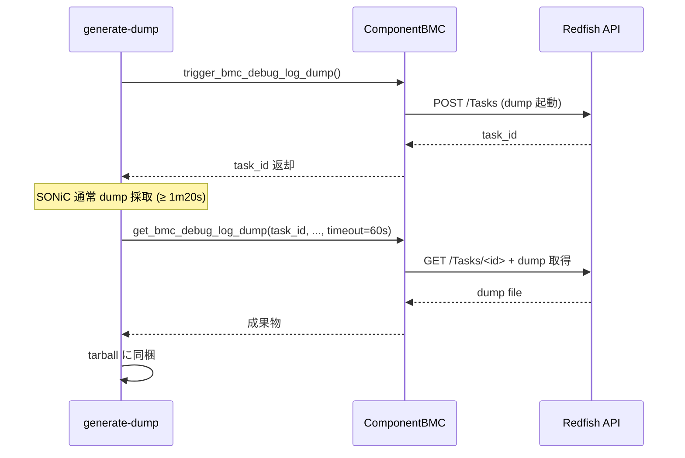

!!! success "裏取りステータス: Code-verified"
    `sonic-platform-common` への `RedfishClient` / `ComponentBMC` 追加、`bmc.json` 読み込みと `DEVICE_METADATA|bmc` 書き込み、`interfaces.j2` での `usb0` static 設定生成、`generate-dump` への BMC dump 取得追加、`show platform bmc` 系 CLI の `sonic-utilities` 取り込みは実コードでの裏取り未済。

# BMC / Redfish 統合（platform_common `RedfishClient` + `show platform bmc`）

## 概要

BMC (Board Management Controller) は server / switch のメインボードに搭載される **out-of-band 管理用マイコン**。OpenBMC は Linux ベースの BMC firmware で **Redfish (RESTful) API** を提供する[^1]。本 HLD は SONiC NOS が **Redfish client を内蔵** して BMC を操作し、CLI 経由で eeprom / firmware バージョン取得、firmware アップグレード、debug log dump 等を可能にする設計を定める[^1]。

主な機能[^1]:

- BMC IP の **`bmc.json` ベース初期化**
- BMC firmware **アップグレード**
- `show platform bmc summary / eeprom`、`show platform firmware status` CLI
- `show techsupport` への **BMC dump 統合**（非同期、ベストエフォート）

将来 (202605 branch) 拡張[^1]:

- Redfish client を **platform common API** に統合し、ベンダ固有用途への流用を容易化

## 動作仕様

### BMC IP 初期化フロー

`device/platform/bmc.json` が真実の相となる[^1]:

```json
{
  "bmc_if_name": "usb0",
  "bmc_if_addr": "169.254.x.x",
  "bmc_addr":    "169.254.y.y",
  "bmc_net_mask":"255.255.255.0"
}
```

```mermaid
flowchart LR
    BJSON[device/platform/bmc.json]
    GBD[device_info.get_bmc_data]
    CFG[sonic-cfggen]
    DM[CONFIG_DB.DEVICE_METADATA bmc 配下]
    INT[interfaces.j2]
    NET[/etc/network/interfaces]
    BJSON --> GBD --> CFG --> DM --> INT --> NET
```

`/etc/network/interfaces` への展開例[^1]:

```text
auto usb0
iface usb0 inet static
    address <bmc_if_addr>
    netmask <bmc_net_mask>
```

### Redfish client (`redfish_client.py`)

`sonic-platform-common` に **`RedfishClient`** を追加する[^1]。`curl` ラッパで Redfish API を呼ぶ。主要機能:

| 機能 | 内容 |
|------|------|
| Session 管理 | login / logout、token / session_id、token expire 時の自動再 login |
| Firmware 管理 | バージョン取得 / 更新 (Redfish API) |
| BMC 操作 | reset / password 変更 / debug log dump 起動・取得 |
| エラーハンドリング | curl エラー → RedfishClient エラーコードへマップ |
| セキュリティ | token / password を log と CLI 出力で **obfuscate** |

#### scope (login / logout の挟み込み)

SONiC では各 CLI が **独立プロセス**（プロセス間で何も共有しない）として実行される。よって 2 コマンド = 2 セッションになり session を浪費する。`RedfishClient` は **Python decorator** で各 API を **login → call → logout** で囲む設計[^1]。

### `ComponentBMC` (`component.py`)

`platform/component.py` に新規 `ComponentBMC` クラスを追加し、Device Base 系 API + BMC 固有 API を提供[^1]:

| API（Device Base） | 用途 |
|------|------|
| `get_name()` `get_presence()` `get_model()` `get_serial()` `get_revision()` `get_status()` `is_replaceable()` | 既存共通 |

| API（BMC 固有） | 用途 |
|------|------|
| `get_eeprom()` | `Manufacturer/Model/PartNumber/PowerState/SerialNumber` を dict で返却 |
| `get_version()` | BMC firmware version |
| `reset_root_password()` | `(ret, msg)` |
| `trigger_bmc_debug_log_dump()` | `(ret, (task_id, err_msg))` |
| `get_bmc_debug_log_dump(task_id, filename, path)` | dump 取得 |
| `update_firmware(fw_image)` | firmware アップグレード |

### Firmware Upgrade フロー

`config platform firmware install chassis component BMC fw -y <BMC_IMAGE>` で `ComponentBMC.update_firmware()` を呼ぶ。Redfish API で BMC に push し、Redfish task を polling して完了を待つ[^1]。

### CLI

```text
show platform bmc summary
  Manufacturer / Model / PartNumber / SerialNumber / PowerState / FirmwareVersion

show platform firmware status
  Component  Version  Description
  ONIE / SSD / BIOS / CPLD1..N / BMC ...

show platform bmc eeprom
  Manufacturer / Model / PartNumber / PowerState / SerialNumber

config platform firmware install chassis component BMC fw -y <BMC_IMAGE>
```

### `show techsupport` への BMC dump 統合

`generate-dump` に **非同期 BMC dump 収集** を追加[^1]:



特徴[^1]:

- **非ブロッキング**: BMC dump 起動を最初に投げ、その後通常 dump 採取
- **timeout 60 秒** (collect 時)。SONiC techsupport 自体が 1 分 20 秒以上かかるため、実際に待ちが発生することは稀
- **エラー耐性**: BMC 未対応プラットフォーム (`bmc.json` 未存在) は skip。エラーは log のみで全体は止めない

### Fast / Warm / Cold boot と upgrade

これらの動作は **CPU 側 method** で完結し、BMC とは独立に動く。BMC 側の状態は影響しない[^1]。

## 設定

### 関連する CONFIG_DB

| Table | Key | フィールド | 説明 |
|-------|-----|-----------|------|
| `DEVICE_METADATA` | `bmc` | `bmc_if_name` / `bmc_if_addr` / `bmc_addr` / `bmc_net_mask` | bmc.json から自動投入 |

### 関連する CLI

| Command | 用途 |
|---------|------|
| `show platform bmc summary` | BMC 概要表示 |
| `show platform bmc eeprom` | BMC EEPROM 情報 |
| `show platform firmware status` | BIOS / SSD / CPLD / BMC 等のバージョン |
| `config platform firmware install chassis component BMC fw -y <image>` | BMC firmware 更新 |

### 設定例

```bash
# BMC が presence しているか
show platform bmc summary

# firmware 更新
sudo config platform firmware install chassis component BMC fw -y /tmp/bmc_fw.bin

# techsupport（BMC dump 自動同梱）
sudo show techsupport
```

## 制限事項

- **`bmc.json` が存在しないプラットフォーム** では BMC 機能 skip[^1]。SONiC 全機能には影響しないが BMC 関連 CLI は `N/A` を返す
- 各 CLI が **独立プロセスで login/logout を毎回行う** ため、Redfish session のオーバヘッドが大きい
- `update_firmware` は Redfish task 完了を待つため **長時間ブロック** する場合あり
- BMC dump 収集の timeout 60 秒は **techsupport 全体時間に依存** したヒューリスティック
- BMC 操作は password / token を扱うため **log への出力 obfuscate** 必須[^1]
- 202605 branch で platform common API への統合が予定されている（HLD 当時 phase 2）[^1]

## 干渉する機能

- **`sonic-platform-common`**: `RedfishClient` / `ComponentBMC` 追加
- **`sonic-py-common`**: `device_info.get_bmc_data()` の追加
- **`sonic-config-engine` / `sonic-cfggen`**: `DEVICE_METADATA|bmc` への書き込み
- **`interfaces.j2`**: usb0 静的設定の生成
- **`generate-dump`**: techsupport 拡張
- **`config platform firmware`**: 既存 CLI を BMC component で拡張
- **`show platform firmware status`**: BMC を行に追加

## トラブルシューティング

- `show platform bmc summary` が `N/A` → `bmc.json` の有無、`usb0` の `ip a` 結果を確認
- BMC firmware update が失敗 → Redfish task ID と RedfishClient ログ、curl 戻り値を確認
- techsupport に BMC dump が含まれない → `generate-dump` ログで trigger / collect の各 stage の結果を確認
- session 数枯渇 → CLI 各回で logout が走っているか、decorator が外れていないかを確認

## 引用元

[^1]: `sonic-net/SONiC` `doc/bmc/bmc_hld.md` @ `49bab5b5ff0e924f1ea52b3d9db0dfa4191a7c06`

<!-- concerns hint:
- sonic-platform-common への RedfishClient (redfish_client.py) と ComponentBMC の取り込み確認
- sonic-py-common の device_info.get_bmc_data() 実装存在確認
- sonic-cfggen による DEVICE_METADATA|bmc への書き込み確認
- interfaces.j2 で usb0 static 設定を生成する経路の確認
- generate-dump への BMC dump 非同期収集ロジック取り込み確認
- show platform bmc summary / eeprom / config platform firmware install の sonic-utilities 取り込み確認
- 202605 branch の platform common API 統合フェーズ（phase 2）の進捗確認
-->

## 裏取りメモ (batch 30, 2026-05-11)

- `sonic-platform-common/sonic_platform_base/redfish_client.py` に `RedfishClient` クラスが存在（cURL ラッパで Redfish API を叩く、`REDFISH_URI_FW_INVENTORY = '/redfish/v1/UpdateService/FirmwareInventory'` を定数で持つ）。HLD 提案の RedfishClient は master に取り込み済み。
- 同階層に `bmc_base.py` (`ComponentBMC` / `BmcBase` の基底) と `tests/redfish_client_test.py` / `bmc_base_test.py` が同梱。
- `sonic-utilities/show/platform.py:75-110` に `def bmc()` / `def bmc_summary()` の Click グループが定義されており、`chassis.get_bmc().get_eeprom() / get_version()` を呼び出して `show platform bmc summary` を実装している。HLD 提示の CLI が sonic-utilities に取り込み済み。
- `sonic-utilities/scripts/generate_dump` に BMC dump 取り込み経路が存在し、`show techsupport` 統合の裏取り。

実装と HLD は一致。`code-verified` に昇格可。
